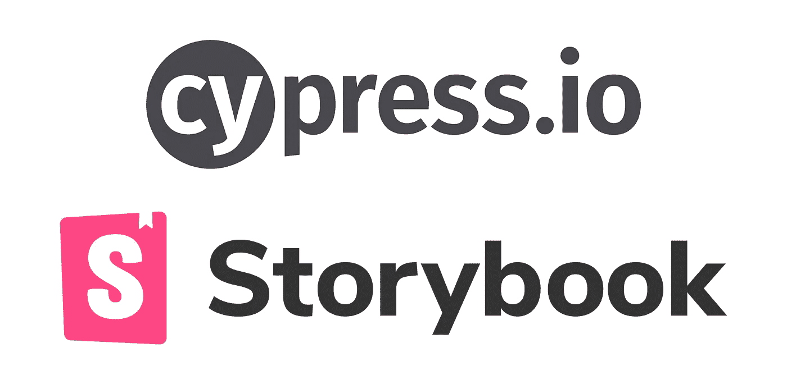
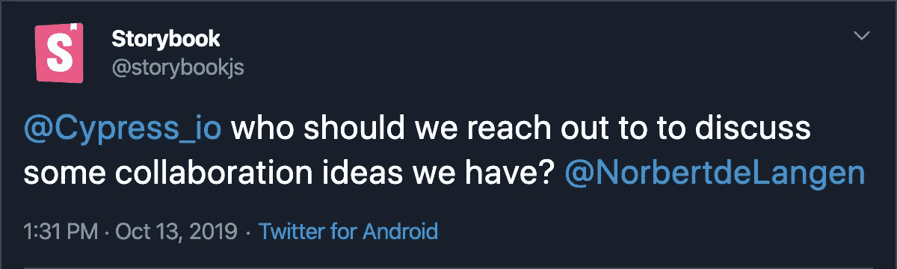
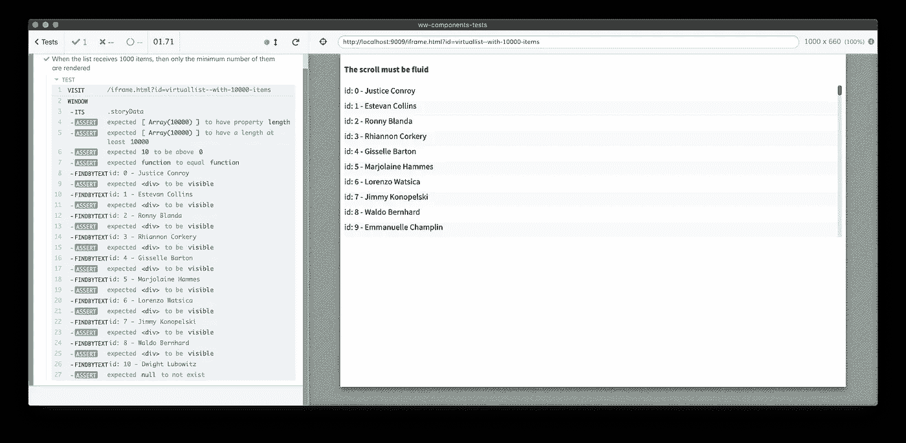
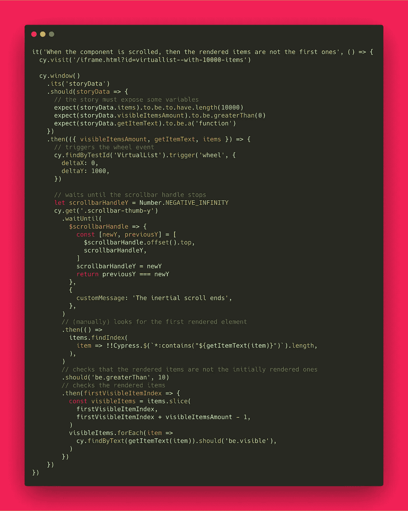
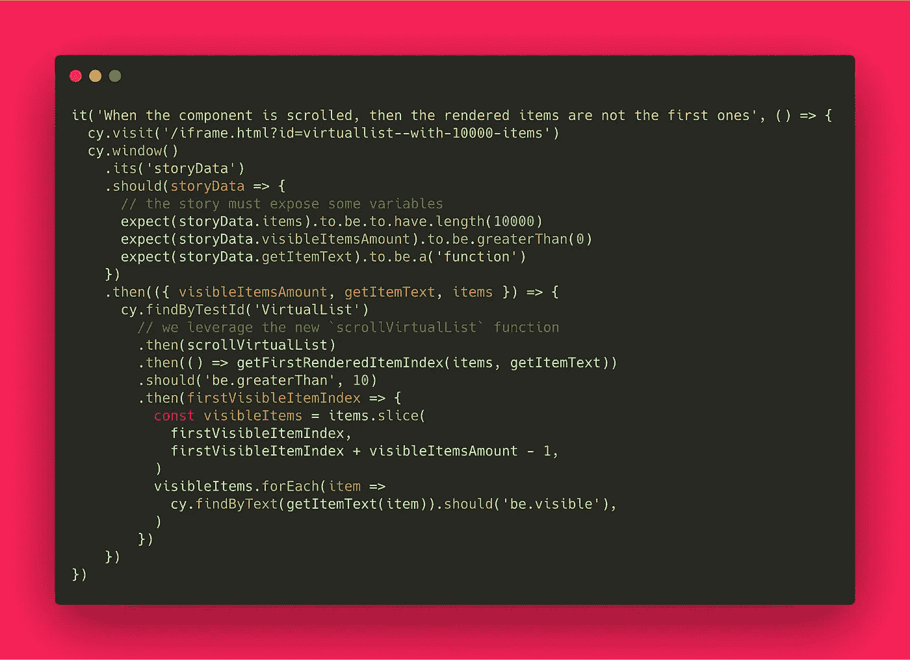
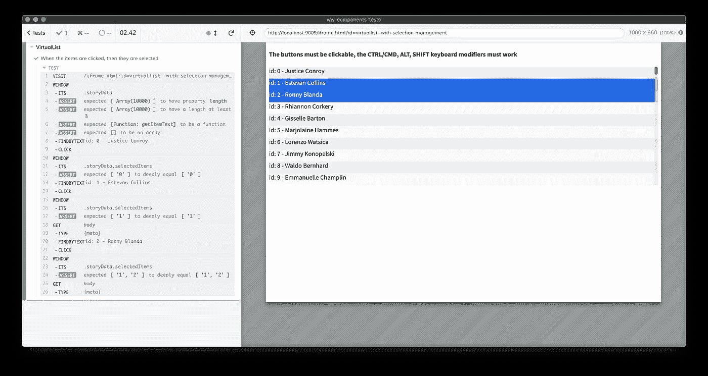
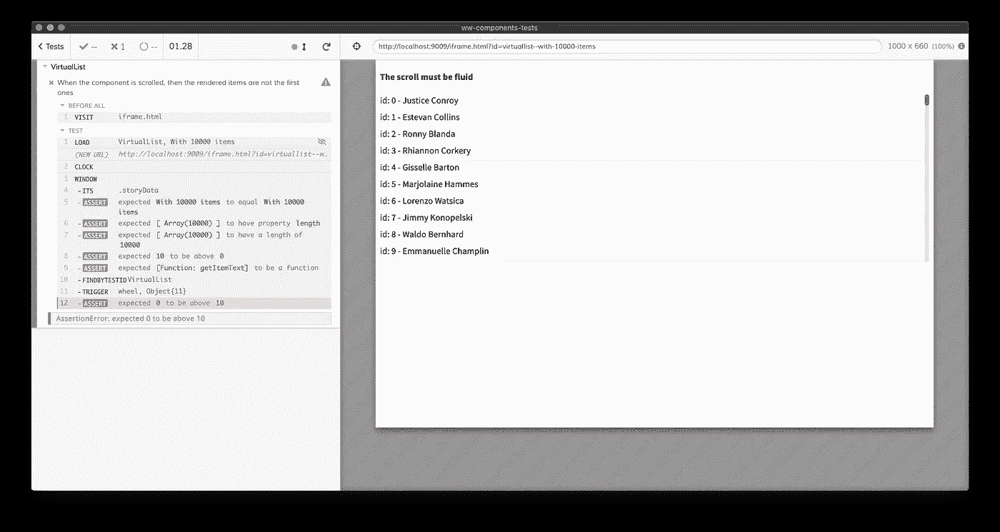
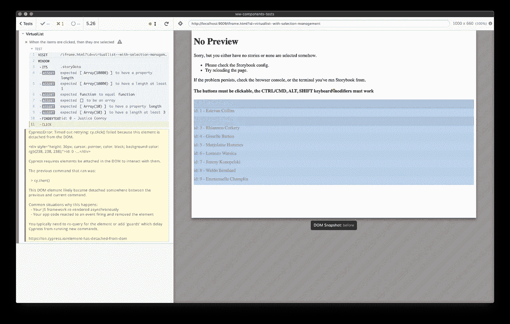

# 用 Cypress 和 Storybook 测试虚拟列表组件

> 原文：<https://itnext.io/testing-a-virtual-list-component-with-cypress-and-storybook-494dc2d1d26b?source=collection_archive---------2----------------------->

来自集成工具的挑战、集成的当前状态以及正确测试呈现组件的一些最佳实践。



我正在 GitHub 上做一个大的 [UI 测试最佳实践](https://github.com/NoriSte/ui-testing-best-practices?source=post_page---------------------------)项目，我分享这个帖子来传播它并有直接的反馈。

***更新*** *:在这个实验方法之后，看看我的“* [*单元测试用 Cypress 的 React 组件*](https://medium.com/@NoriSte/unit-testing-react-components-with-cypress-4d4cf8cd59a0) *”的文章，在 Cypress 4.5.0 版本中事情得到了简化和更有效的处理！*

***更新 2****:*[*柏树 7 出带全新组件测试*](https://docs.cypress.io/guides/component-testing/introduction#What-is-Component-Testing) *支持，看看吧！其他激动人心的消息正在路上感谢* [*故事书 6.2 版*](https://twitter.com/NoriSte/status/1378204109841571840) *！*

## TL；速度三角形定位法(dead reckoning)

*   杠杆[柏树故事书](https://github.com/NicholasBoll/cypress-storybook)允许柏树在故事之间快速切换
*   这些故事应该暴露一些全局变量，允许 Cypress 断言数据
*   尽可能加快测试速度，由于 Cypress 的时钟控制，示例中的惯性滚动不会被等待
*   想一想，如果您想要测试呈现的组件、故事代码，或者两者都要测试
*   工具将更加集成，组件测试是当前的热门话题

## 为什么要隔离测试元件？

组件是你的应用程序的构建模块，Storybook 允许你单独构建它们，**检查**它们是否正常工作，它们是否与图形布局一致，是否与团队的其他成员共享，等等。Storybook 主要执行两种组件检查:

*   视觉测试:使用 [Percy](https://percy.io/) 或 [Applitools](https://applitools.com/) 运行，这两个工具都可以很容易地与 Storybook 集成在一起，以自动化这种检查
*   功能测试:在组件故事中手工执行，为什么不将它们自动化呢？这篇文章谈到了这一点！

## 组件测试工具

当前的前端测试趋势有两个赢家: [**DOM 测试库**](https://testing-library.com) 和 [**柏树**](https://www.cypress.io/) 。它们是两种完全不同的工具，但在某些方面它们有所重叠。DOM 测试库明确地测试组件(通过像 [Jest](https://jestjs.io/) 这样的第三方测试运行器)是正确和快速的方式，这是非常好的。Cypress 以一种简单可靠的方式实现了浏览器的自动化。

为什么它们会重叠？因为从技术上来说，你可以通过 DOM 测试库测试整个应用程序，也可以用 Cypress 测试单个组件。

使用 **DOM 测试库**测试整个应用程序:

*   利:它正在燃烧**快**
*   缺点:它呈现 HTML，但是 HTML 不是由真正的浏览器呈现的，所以**CSS 部分不起作用**
*   缺点:阅读一个巨大的 HTML 而不是在浏览器中阅读结果很麻烦
*   缺点:第三方组件不能完全与 [jsdom](https://github.com/jsdom/jsdom) 环境兼容，或者在 dom 测试库渲染时不能按预期工作

使用**柏树**测试组件:

*   利:它自动化了一个真正的浏览器，组件在他们将要使用的相同环境中被测试
*   利:你可以用用户将要看到/消费组件的方式来测试组件
*   教授:你可以检查一下你的故事书是否也很好用。你的故事的代码可能被窃听，所以拥有一些工作组件并不能保证你有一本工作故事书。团队的其他成员可以依赖 Storybook 作为团队/公司的组件库。
*   缺点:它需要一个运行的主机/网站，允许你与组件本身进行交互(就像故事书一样)
*   缺点:测试数百个组件可能会很慢

请注意:对于 Cypress，有一个 [Cypress 测试库](https://testing-library.com/docs/cypress-testing-library/intro)插件，允许您利用相同的 *findByText* 、 *findByPlaceholderText、findByTestId* 等。DOM 测试库的 API。我喜欢它，我总是使用它，但他们在柏树里面工作，而不是在其他测试跑步者身上

## 时下热门话题

用 Cypress 和 Storybook 进行组件测试是当前的一个热门话题，这里有一些证明:

*   看看故事书里的这条推文



故事书和赛普拉斯会更融合吗？大概…

*   看看[艾萨克·曼](https://medium.com/u/111a108c5d58?source=post_page-----494dc2d1d26b--------------------------------)的文章《 [Nx 8.8:现在你可以用故事书和柏树](https://blog.nrwl.io/ui-testing-with-storybook-and-nx-4b86975224c)编写 UI 测试》
*   对于 Cypress，有一个 [cypress-react-unit-test](https://github.com/bahmutov/cypress-react-unit-test) 库，它允许你在没有运行网站的情况下测试组件。我在这里玩了一下但是，尽管有 [Gleb](https://github.com/bahmutov) 和 [Dmitry](https://github.com/dmtrKovalenko) 惊人的工作(❤️)，它还没有准备好成为你的生产测试的基础。但是请继续关注，事情可能会很快改变！看看[这个 Gleb 的推文](https://twitter.com/bahmutov/status/1240385030461034502)
*   利用自动化浏览器来测试故事书组件的想法在我脑海中已经存在很长时间了…但是第一个向我展示真实案例的是 [Davide Di Pumpo](https://github.com/MakhBeth) 和他的 TestCafè+Storybook automation👏
*   Dmitriy Tishin 利用 Storybook 就像一个“组件暴露者”从故事中分离组件测试，看看他的“ [Cypress + Storybook”。将测试场景、数据和组件呈现放在一个地方](/cypress-storybook-keeping-test-scenario-data-and-component-rendering-in-one-place-c57b23cc1640)文章

# 一个真实的例子:虚拟列表

最近，我开发了一个 VirtualList 组件，并使用它来检查 Storybook 和 Cypress 如何协同工作。VirtualList 是一个只呈现可见项目的列表，以保证最高的性能。看一看 [React 虚拟化](https://bvaughn.github.io/react-virtualized/#/components/List)来了解它是如何工作的。除了虚拟化，我的虚拟列表管理项目点击和项目多选。

除了许多单元测试之外，我想运行一些组件测试，但是如上所述，第三方库(比如我们使用的: [React Smooth Scrollbar](https://www.npmjs.com/package/react-smooth-scrollbar) )不能很好地与 [React 测试库](https://testing-library.com/docs/react-testing-library/intro)(DOM 测试库的 React 版本)一起工作，所以 Cypress 是唯一的选择。

# 测试挑战

使用 Cypress 测试 Storybook 中的组件，而不是运行标准的 E2E 测试，最大的挑战是什么？与使用 [React 测试库](https://testing-library.com/docs/react-testing-library/intro)(DOM 测试库的 React 版本)的标准组件测试相比，有什么挑战？

## 数据源控件

使用 Cypress，我们习惯于加载整个应用程序，通过静态 fixtures(在 [UI 集成测试](https://medium.com/@NoriSte/component-vs-ui-integration-vs-e2e-tests-f02b575339dc)的情况下)控制数据，或者读取/截取后端数据(在 [E2E 测试](https://medium.com/@NoriSte/component-vs-ui-integration-vs-e2e-tests-f02b575339dc)的情况下)，并使用这些数据来断言 UI 正常工作。所以我们可以控制，或者至少知道，UI 将要使用的数据。**不知道数据就意味着没有断言**。
但是在(无状态)组件故事中，数据是由表示故事的组件直接传递给组件，并呈现组件的。为了了解数据并对故事组件显示的内容做出正确的断言，**数据需要由故事公开，并由 Cypress** 读取。

请注意:如果 Cypress 测试在故事组件的同一个存储库中，您可以从故事文件中导入数据，但是下面显示的例子来自不在故事的同一个存储库中的测试。

## 隐藏内容

虚拟列表从 DOM 中删除不可见的组件。这对测试意味着什么？我们不能指望所有的元素都存在于 HTML 中。React 测试库和 Cypress 都不能完全理解虚拟列表是如何工作的，因为一旦你需要断言一个可见区域之外的项目的存在，你就不能利用通常的*cy . contains*/*findByText 等。*效用:因为物品根本不存在。

VirtualList 是一个受控组件，因此它通知父组件哪些是呈现的项目，哪些是选择的项目。在标准的[组件测试](https://medium.com/@NoriSte/component-vs-ui-integration-vs-e2e-tests-f02b575339dc)中，我们可以断言上下传递给 VirtualList 组件的道具，故事直接控制这些道具，但是，同样，Cypress 需要读取这些数据，所以故事必须公开它。

## 我们是在测试故事还是组件？

差别可能很微妙。因为 VirtualList 是一个受控组件，所以 story 组件控制它。故事组件内部的控制逻辑是要测试的东西的一部分？控制部件和被控制部件是可分离的吗？大概不会。

一个标准测试有两个参与者——测试运行者和受控组件——而使用带有 Storybook 的 Cypress 有三个参与者——测试运行者、故事和受控组件。因此，如果一个组件测试控制了组件，并且可以直接访问回调数据，Cypress 需要 story 的组件才能正常工作。

## 滚动和呈现项目控件

VirtualList 组件利用了一个惯性滚动条，并且由于 story 添加了数千个要呈现的项目来充分展示 VirtualList 的潜力，因此它只有一个很小的滚动条句柄。滚动虚拟列表可能会导致测试和下一个测试之间呈现的项目略有不同。所以我想当然地认为，一旦列表滚动，我们无法预先知道哪些条目将被呈现(例如从第 100 到第 110 或从第 101 到第 111)。

为什么？因为我讨厌基于脆弱假设的脆弱测试。测试不应该被设计成抵抗每一个可能的变化，但是它们必须足够健壮以经受住小的变化。对于 VirtualList 测试，这意味着一旦滚动，呈现的项目将直接从 HTML 项目中检索。我们稍后将深化它。

# 请说密码

我们要编写的第一个测试需要检查列表是否收到了 10000 个条目，是否只呈现了其中的一部分。这是虚拟列表的基本特性。

首先，RenderItem 组件，它只是交替使用颜色来直观地标识行

```
// every `item` is an { id: string, name: string}const getItemText = item => `id: ${item.id} - ${item.name}`const RenderItem = ({ item }) => {
  return (
    <div
      style={{
        height: '30px',
        backgroundColor: parseInt(item.id) % 2 ? '#FAFAFA' : '#EEE',
      }}
    >
      {getItemText(item)}
    </div>
  )
}
```

我们要研究的原始故事如下

```
// `getStoryItems` allows to create a high amount of items, it's used by every storyexport const With10000Items = () => {
  return (
    <>
      <h4>The scroll must be fluid</h4>
      <VirtualList
        items={getStoryItems({ amount: 10000 })}
        getItemHeights={() => 30}
        RenderItem={RenderItem}
        listHeight={300}
      />
    </>
  )
}
With10000Items.story = {
  name: 'With 10000 items',
}
```

我们需要改编这个故事，在全球范围内曝光:

*   `items`数组:Cypress 测试需要知道用来填充列表的数据
*   `getItemText`函数:因此 Cypress 测试避免了关心如何从一个项目中获得呈现的文本。Cypress 需要将项目转换为文本来从文本中检索渲染项目，避免使用`data-test`属性
*   可见项的数量:Cypress 测试需要断言哪些项被呈现，哪些项没有被呈现

下面是更新后的故事，它通过一个全局`storyData`变量来公开变量，这个变量将被 Cypress 测试收集和使用:

```
export const With10000Items = () => {
  const itemHeight = 30
  const listHeight = 300
  const items = React.useMemo(
    () => getStoryItems({ amount: 10000 }),
    [],
  )

  // exposing data for Cypress
  React.useEffect(() => {
    // global is `window`
    global.storyData = {
      items,
      visibleItemsAmount: Math.ceil(listHeight / itemHeight),
      getItemText,
    }
  }, [items])return (
    <>
      <h4>The scroll must be fluid</h4>
      <VirtualList
        items={items}
        getItemHeights={() => itemHeight}
        RenderItem={RenderItem}
        listHeight={listHeight}
      />
    </>
  )
}
With10000Items.story = {
  name: 'With 10000 items',
}
```

## 柏树试验

测试将会:

*   访问故事书页面
*   收集暴露的数据
*   检查渲染的项目

前两点的代码

```
it('When the component receives 10000 items, then only the minimum number of items are rendered', () => {
  cy.visit('/iframe.html?id=virtuallist--with-10000-items') cy.window()
    .its('storyData')
    .should(storyData => {
      // the story must expose some variables
      expect(storyData.items).to.be.to.have.length(10000)
      expect(storyData.visibleItemsAmount).to.be.greaterThan(0)
      expect(storyData.getItemText).to.be.a('function')
    })
    .then(() => {
      // the test code
    })
})
```

为什么对曝光的`storyData`断言？因为一个错误的`storyData`会让测试失败，如果一个测试失败了，它一定会直接把我们推向问题。如果组件渲染由于错误的`storyData`而失败，我们的测试根本就不应该运行。这可被视为**与数据相关的冒烟测试**。

现在，测试缺少的部分:检查哪些项目被渲染，哪些没有

```
it('When the component receives 10000 items, then only the minimum number of items are rendered', () => {
  cy.visit('/iframe.html?id=virtuallist--with-10000-items')cy.window()
    .its('storyData')
    .should(storyData => {
      // the story must expose some variables
      expect(storyData.items).to.be.to.have.length(10000)
      expect(storyData.visibleItemsAmount).to.be.greaterThan(0)
      expect(storyData.getItemText).to.be.a('function')
    })
    .then(({ visibleItemsAmount, getItemText, items }) => {
      // items visibility check
      const visibleItems = items.slice(0, visibleItemsAmount - 1)
      visibleItems.forEach(item => {
        cy.findByText(getItemText(item)).should('be.visible')
      }) // first not-rendered item check
      cy.findByText(getItemText(items[visibleItemsAmount]))
        .should('not.exist')
    })
})
```

*   我们使用暴露的`visibleItemsAmount`变量来检索呈现的项目

```
const visibleItems = items.slice(0, visibleItemsAmount - 1)
```

*   我们使用公开的`getItemText`函数从页面中检索每一项

```
cy.findByText(getItemText(item))
```

*   我们断言所有预期可见的项目

```
cy.findByText(getItemText(item)).should('be.visible')
```

*   我们断言页面中不存在下一项

```
cy.findByText(getItemText(items[visibleItemsAmount]))
  .should('not.exist')
```

请注意`cy.findByText` Cypress 命令来自… [Cypress 测试库](https://testing-library.com/docs/cypress-testing-library/intro)😊这是我最喜欢的从页面中检索元素的方法，因为它像用户一样:从文本内容中读取/检索元素。我用它来代替`cy.contains`，但它们做的是同样的事情。

这是结果:



第一个测试的结果:加载的故事和所有断言的结果。

这个测试足以检查虚拟列表只呈现最少数量的项目。

最初，我试图检查虚拟列表滚动时浏览器是否以 60 FPS 的速度运行。为什么？因为**UI 测试必须检查用户看到了什么，使用与用户相同的 UI**。从用户的角度来看，虚拟列表的唯一目标是它必须流畅地运行，不管列表中有多少项。但是可靠地测量 FPS 是困难的，因为测量会受到以下因素的影响:

*   你使用的 Cypress 命令:每个 Cypress 的动作都会降低浏览器的速度
*   机器(或 Docker 映像)可用于运行测试的资源数量

因为不可能有可靠的计数—一些初始值将被丢弃，等等。—我移动以检查渲染项目的数量，仅此而已。如果我能确定 10000 个条目中只有 10 个被渲染，我就能确定这个列表运行流畅。更一般的:记住**一个脆弱的测试比一个缺失的测试更糟糕**。

# 第二个测试:滚动

首先:VirtualList 组件利用了[平滑滚动条](https://idiotwu.github.io/smooth-scrollbar/)，平滑滚动条有自己的测试，所以我们将检查我们的 VirtualList 组件如何对滚动做出反应，但我们认为平滑滚动条是理所当然的。当使用第三方库时，你不需要测试库是否工作。库**应该有自己的测试**，如果没有，就换库！永远不要为第三方库编写测试。

滚动测试将:

*   触发滚动
*   等到滚动结束
*   检查渲染的项目

因此，触发滚动的测试代码如下

```
// triggers the wheel event
cy.findByTestId('VirtualList').trigger('wheel', {
  deltaX: 0,
  deltaY: 1000,
})
```

注意，VirtusList 组件应该呈现一个带有`data-test="VirtualList"`属性的 DOM 元素。其余的由 Cypress 管理，`trigger`是对 [jQuery 触发器 API](https://api.jquery.com/trigger/) 的直接映射(Cypress 利用 jQuery 尽可能缩短测试代码)。再说一次:柏树在当地相当于`cy.findByTestId('VirtualList')`的是`cy.get('[data-testid=VirtualList]')`。

对于“等到滚动结束”部分，我们将利用 [Cypress waitUntil](https://github.com/NoriSte/cypress-wait-until) 插件。为什么我们应该使用 waitUntil 插件而不是等待一段固定的时间在 [Await，do not make your E2E 测试睡眠](https://medium.com/@NoriSte/await-do-not-sleep-your-e2e-tests-df67e051b409)一文中有详细的解释。
定制等待的代码是

```
// waits until the scrollbar handle stops
let scrollbarHandleY = Number.NEGATIVE_INFINITY
cy.get('.scrollbar-thumb-y')
  .waitUntil(
    $scrollbarHandle => {
      const [newY, previousY] = [
        $scrollbarHandle.offset().top,
        scrollbarHandleY,
      ]
      scrollbarHandleY = newY
      return previousY === newY
    },
    {
      customMessage: 'The inertial scroll ends',
    },
  )
```

所以我们确信测试会等待适当的时间。

## 检查渲染的项目

这是什么意思？意思是:

*   查找第一个渲染项目
*   检查第一个呈现的项目不是第一个。虚拟列表开始呈现 0 到 10 个项目。一旦滚动，它必须呈现第 x 到第 x+10 项。我们不知道 X 的值，我们也不关心这个，否则，我们将把测试与呈现的项目联系起来。如果第一个渲染的项目是第 60 个或第 61 个并不重要。检查准确呈现的项目超出了这个通用滚动测试的范围。测试稳定性感谢我们。
*   一旦检索到第一个呈现的项目，我们检查接下来的十个项目是否都被呈现了

我们将仔细检查每一个步骤，测试的最终代码如下(请继续查看可读性更好的版本)

```
it('When the component is scrolled, then the rendered items are not the first ones', () => {
  cy.visit('/iframe.html?id=virtuallist--with-10000-items') cy.window()
    .its('storyData')
    .should(storyData => {
      // the story must expose some variables
      expect(storyData.items).to.be.to.have.length(10000)
      expect(storyData.visibleItemsAmount).to.be.greaterThan(0)
      expect(storyData.getItemText).to.be.a('function')
    })
    .then(({ visibleItemsAmount, getItemText, items }) => {
      // triggers the wheel event
      cy.findByTestId('VirtualList').trigger('wheel', {
        deltaX: 0,
        deltaY: 1000,
      }) // waits until the scrollbar handle stops
      let scrollbarHandleY = Number.NEGATIVE_INFINITY
      cy.get('.scrollbar-thumb-y')
        .waitUntil(
          $scrollbarHandle => {
            const [newY, previousY] = [
              $scrollbarHandle.offset().top,
              scrollbarHandleY,
            ]
            scrollbarHandleY = newY
            return previousY === newY
          },
          {
            customMessage: 'The inertial scroll ends',
          },
        )
        // (manually) looks for the first rendered element
        .then(() =>
          items.findIndex(
            item => !!Cypress.$(`*:contains("${getItemText(item)}")`).length,
          ),
        )
        // checks that the rendered items are not the initially rendered ones
        .should('be.greaterThan', 10)
        // checks the rendered items
        .then(firstVisibleItemIndex => {
          const visibleItems = items.slice(
            firstVisibleItemIndex,
            firstVisibleItemIndex + visibleItemsAmount - 1,
          )
          visibleItems.forEach(item =>
            cy.findByText(getItemText(item)).should('be.visible'),
          )
        })
    })
})
```



由于 Medium 不管理代码格式的方式和使用 GitHub Gists 是不实际的，这里有一个 [Carbon](https://carbon.now.sh/) 版本的相同代码。

逐步:检索第一个呈现项目的代码是

```
items.findIndex(
  item => !!Cypress.$(`*:contains("${getItemText(item)}")`).length,
)
```

为什么不利用`cy.findByText`命令来检索它呢？因为在 Cypress 中，每个`cy.get`命令(这是`cy.findByText`命令的核心)都有内置断言，[在官方文档中检查它们](https://docs.cypress.io/api/commands/get.html#Assertions)。实质上，如果页面上不存在该元素，`cy.get`会使测试失败。但是因为我们需要遍历未渲染的项目，直到找到第一个渲染的项目，所以我们应该手动进行。`Cypress.$`是 jQuery 的一个全局实例，一个 jQuery 版本的`cy.findByText("XXX")`是`Cypress.$(`*:contains("XXX")`)`并且，jQuery 版本的

```
cy.findByText("XXX").should("exist")
```

是

```
!!Cypress.$(`*:contains("XXX")`).length
```

唯一的区别是，如果元素不存在，它不会失败。如前所述:我习惯于利用`cy.getByText`，但原生`cy.contains`做同样的事情！

一旦找到第一个呈现项目的索引，我们只需要检查接下来的呈现项目。

```
.then(() =>
  items.findIndex(
    item => !!Cypress.$(`*:contains("${getItemText(item)}")`).length,
  )
)
// checks that the rendered items are not the initially rendered ones
.should('be.greaterThan', 10)
// checks the rendered items
.then(firstVisibleItemIndex => {
  const visibleItems = items.slice(
    firstVisibleItemIndex,
    firstVisibleItemIndex + visibleItemsAmount - 1,
  )
  visibleItems.forEach(item =>
    cy.findByText(getItemText(item)).should('be.visible'),
  )
})
```

这是测试的录音

请注意，我们不关心最后半可见的项目。测试的范围是检查呈现的项目不是第一个，并且至少呈现了 10 个项目，第 11 个项目不需要检查。

我们可以将测试的滚动部分转移到一个独立的工具中，类似于

```
const scrollVirtualList = ($list, deltaY = 1000) => {
  cy.wrap($list)
    .trigger('wheel', {
      deltaX: 0,
      deltaY,
    })
    .within(() => {
      // waits for the inertial scroll end
      let scrollbarY = Number.NEGATIVE_INFINITY
      getScrollbar().waitUntil(
        $scrollbar => {
          const newY = $scrollbar.offset().top
          const previousY = scrollbarY
          scrollbarY = newY
          return previousY === newY
        },
        {
          customMessage: 'The inertial scroll end',
        },
      )
    })
}
```

我们可以用同样的方法找到第一个渲染的项目

```
const getFirstRenderedItemIndex = (items, getItemText) => {
  return items.findIndex(
    item => !!Cypress.$(`*:contains("${getItemText(item)}")`).length,
  )
}
```

测试的可读性得益于这种分离，请看一下

```
it('When the component is scrolled, then the rendered items are not the first ones', () => {
  cy.visit('/iframe.html?id=virtuallist--with-10000-items')cy.window()
    .its('storyData')
    .should(storyData => {
      // the story must expose some variables
      expect(storyData.items).to.be.to.have.length(10000)
      expect(storyData.visibleItemsAmount).to.be.greaterThan(0)
      expect(storyData.getItemText).to.be.a('function')
    })
    .then(({ visibleItemsAmount, getItemText, items }) => {
      cy.findByTestId('VirtualList')
        // we leverage the new `scrollVirtualList` function
        .then(scrollVirtualList)
        .then(() => getFirstRenderedItemIndex(items, getItemText))
        .should('be.greaterThan', 10)
        .then(firstVisibleItemIndex => {
          const visibleItems = items.slice(
            firstVisibleItemIndex,
            firstVisibleItemIndex + visibleItemsAmount - 1,
          )
          visibleItems.forEach(item =>
            cy.findByText(getItemText(item)).should('be.visible'),
          )
        })
    })
})
```



# 第三项测试:选择

VirtualList 组件通过按键修饰符支持选择和**多项选择。我们只需要单击项目，单击带有按键修饰符的项目，并检查哪些是选中的项目。是什么让这些操作变得困难？**

*   首先:“选中”是什么意思？从用户的角度来看，一个选中的项目是一个“突出显示”的项目，但检查元素的样式是薄弱的。我们可以给组件添加一个`data-selected`属性…
*   …但是有一个结构问题:这些项目根本无法呈现！如果我们单击第一个项目(从第 1 个到第 10 个项目)，然后我们滚动大约 20 个项目(从第 21 个到第 30 个项目)，我们单击中间的项目(第 25 个项目)并按 SHIFT，选择的项目应该是从第 1 个到第 25 个，但是前 20 个没有被渲染，所以我们不能通过渲染的项目来检索选择的项目。同样，**我们将使用故事**所揭示的变量

这是故事的代码

```
export const WithSelectionManagement = () => {
  const items = getStoryItems({ amount: 10000 })const [selectedItems, setSelectedItems] = React.useState(
    [],
  )const handleSelect = React.useCallback(
    ({ newSelectedIds }) => setSelectedItems(newSelectedIds),
    [setSelectedItems],
  )

  // exposing data for Cypress
  React.useEffect(() => {
    global.storyData = {
      items,
      getItemText,
      selectedItems,
    }
  }, [items, selectedItems]) return (
    <>
      <h4>
        The buttons must be clickable, the CTRL/CMD, ALT, SHIFT                  
        keyboard modifiers must work
      </h4>
      <VirtualList
        items={items}
        selectedItemIds={selectedItems}
        getItemHeights={() => 30}
        RenderItem={createSelectableRenderItem({ height: 30 })}
        listHeight={300}
        onSelect={handleSelect}
      />
    </>
  )
}
```

因为 VirtualList 组件是受控的，所以它向上传递所选项的列表——`selectedItems`数组。父组件——story——公开 Cypress 的数组，以允许断言选定的项目。
请注意:带有点击管理的组件创建已被移至专用的高阶功能:`createSelectableRenderdItem`。

选择单个项目的测试如下

```
it('When the items are clicked, then they are selected', () => {
  cy.visit('/iframe.html?id=virtuallist--with-selection-management') cy.window()
    .its('storyData')
    .should(storyData => {
      // the story must expose some variables
      expect(storyData.items).to.be.to.have.length.of.at.least(3)
      expect(storyData.getItemText).to.be.a('function')
      expect(storyData.selectedItems).to.be.an('array')
    })
    .then(({ getItemText, items }) => {
      cy.findByText(getItemText(items[0]))
        .click()
        .window()
        .its('storyData.selectedItems')
        .should('eql', [items[0].id]) cy.findByText(getItemText(items[1]))
        .click()
        .window()
        .its('storyData.selectedItems')
        .should('eql', [items[1].id])
    })
})
```

所有的断言都在暴露的`selectedItems`数组本身上。我们不检查渲染的项目是否高亮显示(高亮显示项目是由故事创建的组件负责的)，而只检查 VirtualList 组件是否正确地管理项目点击。

`selectedItems`数组不是在开始时读取，而是在每次点击后读取，因为我们需要检查的总是更新的数组，而不是对初始数组的引用(`React.useState`返回`selectedItems`，所以每次选择更新后它都是新的)。

## 多选断言

下一步是检查 VirtualList 组件是否正确地管理了元键的使用。在按下 meta 键的同时单击另一个项目应该会产生两个选定的项目。

我们如何保持元键与柏树按下？这是公正的

```
cy.get('body')
  // keeping pressed the meta (CMD) key
  .type('{meta}', { release: false })// ...your test code...cy.get('body')
  // releasing the meta (CMD) key
  .type('{meta}', { release: true })
```

添加项 click 将导致

```
cy.get('body')
  // keeping pressed the meta (CMD) key
  .type('{meta}', { release: false })
  .findByText(getItemText(items[2]))
  .click()
  .window()
  .its('storyData.selectedItems')
  .should('eql', [items[1].id, items[2].id])
  .get('body')
  // releasing the meta (CMD) key
  .type('{meta}', { release: true }) cy.get('body')
      .type('{shift}', { release: false })
      .findByText(getItemText(firstRenderedItem))
      .click()
      .window()
      .its('storyData.selectedItems')
      .should('eql', expectedSelectedItemIds)
      .get('body')
      .type('{shift}', { release: true })
  })
```

这是结果的截图



测试的第一个结果:加载的故事和所有断言的结果。

## 滚动和选择

由于有了`scrollVirtualList`工具，滚动列表变得很容易，找到第一个呈现的项目是由`getFirstRenderedItemIndex`工具完成的，我们知道如何保持一个键被按下…因此，测试滚动和用 Shift 修饰符单击(这意味着从上一个被单击的元素和最后一个元素中选择所有内容)应该只是计算所有(预期)被选择的项目的问题。下一段代码只做这些，继续测试完整的代码

```
cy.findAllByTestId('VirtualList')
  // scrolls the list
  .then(scrollVirtualList)
  .then(() => {
    // identifies the first rendered item (unknown in advance)
    const firstRenderedItemIndex = getFirstRenderedItemIndex(
      items,
      getItemText,
    )
    const firstRenderedItem = items[firstRenderedItemIndex] // the tests is going to click on the first rendered item
    // keeping the SHIFT key pressed. All the items up to the first
    // rendered one should be selected
    const expectedSelectedItemIds = items
      .slice(0, firstRenderedItemIndex + 1)
      .map(item => item.id) cy.get('body')
      .type('{shift}', { release: false })
      .findByText(getItemText(firstRenderedItem))
      .click()
      .window()
      .its('storyData.selectedItems')
      .should('eql', expectedSelectedItemIds)
      .get('body')
      .type('{shift}', { release: true })
  })
```

测试的完整代码，检查每一个按键修饰符，很长，但是相当重复

```
it('When the items are clicked, then they are selected', () => {
  cy.visit('/iframe.html?id=virtuallist--with-selection-management') cy.window()
    .its('storyData')
    .should(storyData => {
      // the story must expose some variables
      expect(storyData.items).to.be.to.have.length.of.at.least(3)
      expect(storyData.getItemText).to.be.a('function')
      expect(storyData.selectedItems).to.be.an('array')
    })
    .then(({ getItemText, items }) => {
      // first item click
      cy.findByText(getItemText(items[0]))
        .click()
        .window()
        .its('storyData.selectedItems')
        .should('eql', [items[0].id]) // second item click
      cy.findByText(getItemText(items[1]))
        .click()
        .window()
        .its('storyData.selectedItems')
        .should('eql', [items[1].id]) // third item click with Meta modifier
      cy.get('body')
        .type('{meta}', { release: false })
        .findByText(getItemText(items[2]))
        .click()
        .window()
        .its('storyData.selectedItems')
        .should('eql', [items[1].id, items[2].id])
        .get('body')
        .type('{meta}', { release: true }) // first item click with Shift modifier
      cy.get('body')
        .type('{shift}', { release: false })
        .findByText(getItemText(items[0]))
        .click()
        .window()
        .its('storyData.selectedItems')
        .should('eql', [items[2].id, items[1].id, items[0].id])
        .get('body')
        .type('{shift}', { release: true }) // second item click with Alt modifier
      cy.get('body')
        .type('{alt}', { release: false })
        .findByText(getItemText(items[1]))
        .click()
        .window()
        .its('storyData.selectedItems')
        .should('eql', [items[2].id, items[0].id])
        .get('body')
        .type('{alt}', { release: true }) // scrolling
      cy.findAllByTestId('VirtualList')
        .then(scrollVirtualList)
        .then(() => {
          const firstRenderedItemIndex = getFirstRenderedItemIndex(
            items,
            getItemText,
          )
          const firstRenderedItem = items[firstRenderedItemIndex]
          const expectedSelectedItemIds = items
            .slice(0, firstRenderedItemIndex + 1)
            .map(item => item.id) // x-th item click with Shift modifier
          cy.get('body')
            .type('{shift}', { release: false })
            .findByText(getItemText(firstRenderedItem))
            .click()
            .window()
            .its('storyData.selectedItems')
            .should('eql', expectedSelectedItemIds)
            .get('body')
            .type('{shift}', { release: true })
        })
    })
})
```

测试结果如下

正如您所看到的，左边的命令日志没有清楚地说明发生了什么。我们可以通过添加一些`cy.log`调用来提高测试的口语水平，或者更好地利用 [Filip 的解决方案](https://medium.com/slido-dev-blog/cypress-tips-3-improve-your-error-screenshots-in-cypress-b3675968a190)来充分利用 Cypress 日志记录。

# 最佳化

测试越快越好。我最初的测试套件花了将近 16 秒才完全运行。下面是录音(请注意，这是第一个测试套件，测试速度为 60 FPS)

有两个主要的改进领域:

*   更快地在故事之间切换(而不是在测试之间重新加载页面)
*   加速滚动迫使浏览器时钟与柏树

## 更快地在故事之间切换

感谢 Nicholas Boll 和他的 [cypress-storybook](https://github.com/NicholasBoll/cypress-storybook) 插件，它利用 storybook APIs 加载想要的故事，而无需重新加载整个页面。

在写的时候，我们需要做的就是:

*   将`import 'cypress-storybook/react'`添加到故事书配置中
*   将`import 'cypress-storybook/cypress'`添加到 Cypress 的 support/index.js 文件
*   向测试文件添加一个`before`钩子

```
before(() => {
  // Visit the storybook iframe page once per file
  cy.visitStorybook()
})
```

*   通过`cy.loadStory('VirtualList', 'With 10000 items')`加载故事，而不是使用`cy.visit`
*   更新暴露的变量，在视频之后解释

这样做，页面不会在每次测试时都重新加载，整个套件节省了 3 秒钟，请看

为什么我们需要通过故事来更新变量？嗯，如果页面没有重新加载，我们就不能确定暴露的变量是我们想要的，特别是因为几乎每个故事都暴露了一个`items`变量，但是变量的内容是不同的。

我们如何区分故事暴露的变量？嗯，把故事的名字也曝光了！

```
React.useEffect(() => {
  global.storyData = {
    // the name of the story is exposed too
    storyName: 'With 10000 items',
    items,
    visibleItemsAmount: Math.ceil(listHeight / itemHeight),
    getItemText,
  }
}, [items])
```

这样，每个测试都可以检查等待的名字

```
it('When the component receives 10000 items, then only the minimum number of items are rendered', () => {
  const story = 'With 10000 items'
  cy.loadStory('VirtualList', story) cy.window()
    .its('storyData')
    .should(storyData => {

      // caring about the story name
      expect(storyData.storyName).to.eq(story) expect(storyData.items).to.be.to.have.length(10000)
      expect(storyData.visibleItemsAmount).to.be.greaterThan(0)
      expect(storyData.getItemText).to.be.a('function')
    })
    .then(({ visibleItemsAmount, getItemText, items }) => {
      // ... test code...
    })
})
```

利用 [Cypress 重试能力](https://docs.cypress.io/guides/core-concepts/retry-ability.html)等待直到所有断言通过。通过这种方式，我们可以确保公开的变量是正确的。

与最初的 16 秒相比，13 秒听起来不像是一个巨大的进步…但它是！因为如果我们测试一个没有惯性滚动的组件(例如一个表单)，增益不会从 16 "到 13 "，而可能从 9 "到 6 "秒！相信我，**永远不要低估测试速度** …

## 通过控制时钟来加速滚动

视频强调了大部分测试时间都花在了等待惯性滚动完成上。这没有错，但是一些测试跑步者允许你控制时间，赛普拉斯就是其中之一。当你需要测试`setTimeout`或`setInterval`相关的东西或像惯性滚动这样的动画时，把时间向前推是基本的。

[官方文档](https://docs.cypress.io/api/commands/clock.html)有很多例子，但基本用法足以满足我们的需求。我们需要调用`cy.clock()`，然后用`cy.tick(<milliseconds>)`计时。

第一个测试对新的时钟控件进行了评论

```
it('When the component is scrolled, then the rendered items are not the first ones', () => {
  const story = 'With 10000 items'
  cy.loadStory('VirtualList', story) // take control of the browser clock
  cy.clock() cy.window()
    .its('storyData')
    .should(storyData => {
      expect(storyData.storyName).to.eq(story)
      expect(storyData.items).to.be.to.have.length(10000)
      expect(storyData.visibleItemsAmount).to.be.greaterThan(0)
      expect(storyData.getItemText).to.be.a('function')
    })
    .then(({ visibleItemsAmount, getItemText, items }) => {
      // this test does not need the `scrollVirtualList` utility anymore
      cy.findByTestId('VirtualList')
        .trigger('wheel', {
          deltaX: 0,
          deltaY: 1000,
        }) // ticking the clock by one second.
        // It jumps to the inertial scroll end.
        .tick(1000) .then(() => getFirstRenderedItemIndex(items, getItemText))
        .should('be.greaterThan', 10)
        .then(firstVisibleItemIndex => {
          const visibleItems = items.slice(
            firstVisibleItemIndex,
            firstVisibleItemIndex + visibleItemsAmount - 1,
          )
          visibleItems.forEach(item =>
            cy.findByText(getItemText(item)).should('be.visible'),
          )
        })
    })
})
```

这就是结果

如你所见，我们在惯性卷轴的末端跳跃，没有等待它的完成。请注意:整个测试持续时间被屏幕记录篡改，没有记录的测试运行花费的时间更少。

记住，如果你使用`cy.clock`，使用`cy.tick`不是可选的！如果您不手动勾选时间，列表根本不会滚动，因为时钟被冻结了！看看如果你不计时会发生什么



列表停留在初始滚动级别，它没有滚动，因为我们没有打勾时钟。

`.should('be.greaterThan', 10)`断言不满足，因为列表根本不滚动。

应用于几乎所有测试的时钟控制将它们的持续时间减少了 9 秒。下一个视频的最终结果

最终结果:**从最初的 16 秒到 9 秒**，太棒了！测试越快，你就越能利用它们！

## “无预览”错误

如果您遇到此错误



重新推出 Cypress 应该够了。否则，重新启动故事书。这在几个小时内只发生过两次，所以我还没有深入了解它。

# 结论

测试就是了解最佳实践，了解测试方法，了解可用的工具，并决定如何混合它们来建立你自己的信心。使用像 Cypress 这样的浏览器自动化工具可以保证您的组件像您的消费者所期望的那样工作。

如果你的代码库中有数千个故事，由于工具本身的缓慢(与 [React 测试库](https://testing-library.com/docs/react-testing-library/intro)相比)，它可能不是最佳选择，但是对于中小型代码库，由于测试时间较少，Cypress 可以作为一个一体化的测试工具。

你创造性地测试过你的组件吗？有反馈吗？请留下评论😉

更一般地说:用浏览器自动化工具测试组件是一个热门话题，看看 Storybook 的这篇推文[和 Gleb 的这篇推文](https://twitter.com/storybookjs/status/1183344512787238912)。

## 相关文章

你可能会对我的其他文章感兴趣:

*   你想提高你的前端生产力吗？Cypress 不仅仅是一个测试工具！阅读[前端生产力提升:Cypress 作为您的主要开发浏览器](https://medium.com/@NoriSte/front-end-productivity-boost-cypress-as-your-main-development-browser-f08721123498)
*   避免用不必要的和不可预知的等待来减缓你的测试:[等待，不要让你的 E2E 测试休眠](https://medium.com/@NoriSte/await-do-not-sleep-your-e2e-tests-df67e051b409)
*   UI 测试分类:[组件 vs (UI)集成 vs E2E 测试](https://medium.com/@NoriSte/component-vs-ui-integration-vs-e2e-tests-f02b575339dc)

你好👋我是 Stefano Magni，我是一名充满激情的 **JavaScript 开发人员**，一名 **Cypress 大使、**和一名**讲师**。我是 WorkWave 的高级前端工程师。
我喜欢创造高质量的产品，测试和自动化一切，学习和分享我的知识，帮助他人，在会议上发言和面对新的挑战。
你可以在 [Twitter](https://twitter.com/NoriSte?source=post_page---------------------------) 、 [GitHub](https://github.com/NoriSte?source=post_page---------------------------) 、 [LinkedIn](https://www.linkedin.com/in/noriste/?source=post_page---------------------------) 上找到我。你可以找到我最近所有的文章/演讲等等。这里。