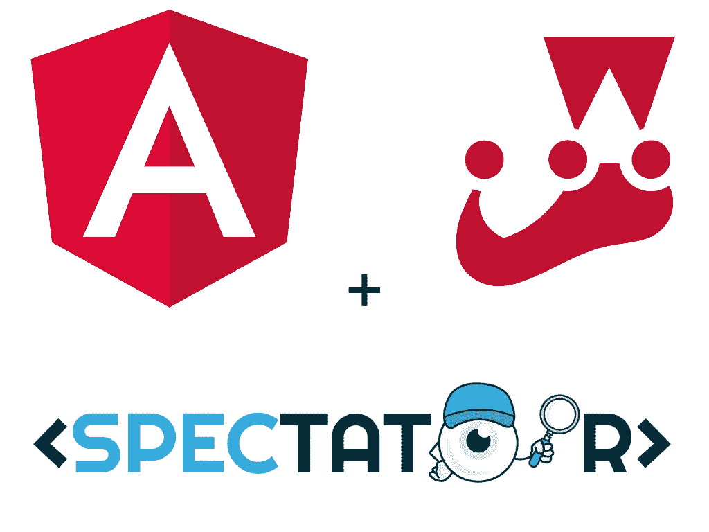

# 用 Jest 和旁观者测试角度应用

> 原文：<https://itnext.io/testing-angular-applications-with-jest-and-spectator-c05991579807?source=collection_archive---------0----------------------->

## 加速测试与 Jest 和观众的角度应用。



品牌:[棱角](https://angular.io)，[笑话](https://jestjs.io)，[看客](https://github.com/ngneat/spectator)

**2020 年 2 月 29 日**

更新了项目依赖项，未更改配置或代码。

*   角度 9.0.x
*   旁观者 5.1.x
*   Jest 预设角度 8.0.x

为什么[有角度](https://angular.io) (8.2.x)

*   这是一个建立良好的框架，用于构建有大量用户的单页面和移动应用程序。
*   它在一个框架中提供了构建应用程序所需的一切。
*   没有必要在用于构建应用程序的库之间进行选择。
*   它有一个内置的 IoC 容器来注入您的依赖项。
*   它有一个内置的测试框架(我们将用 Jest 替换它的一部分)。
*   有很多 [StackOverflow](https://stackoverflow.com/questions/tagged/angular) 的帖子可以帮助你度过开发过程中的难关。

为什么[开玩笑](https://jestjs.io) (24.9.x)

*   这是一个一体化的测试框架，“开箱即用”，而且确实如此！
*   支持组件的[快照测试](https://jestjs.io/docs/en/snapshot-testing)。
*   并行运行测试。
*   不需要浏览器(默认情况下 Jest 使用`jsdom`)。这对 CI 环境来说非常好。
*   具有内置的覆盖率报告。

为什么[看客](https://github.com/ngneat/spectator) (4.0.x)

*   减少设置角度测试套件所需的样板文件。
*   内置嘲讽。
*   支持 Jasmine 或 Jest 开箱即用。
*   有助于保持测试的整洁和集中。

## 设置

使用`@angular/cli`创建一个新的角度项目。询问时选择默认选项。

[Angular docs](https://angular.io/guide/setup-local#step-1-install-the-angular-cli) 建议您在全球范围内安装`@angular/cli`，但您并不必须这样做。您可以简单地使用`npx`运行一次`cli`来创建一个新项目，该项目将包含作为`devDependencies`的`cli`。

```
**$ npx -p @angular/cli ng new angular-jest-spectator**? Would you like to add Angular routing? **// answer: 'N'**
? Which stylesheet format would you like to use? // **answer: 'CSS'**
```

一旦项目被创建，进入`angular-jest-spectator`并运行`npm test -- -no-watch --browsers=ChromeHeadless`来查看存根测试是否通过。

```
**$ cd angular-jest-spectator****$ npm test -- --no-watch --browsers=ChromeHeadless**> angular-jest-spectator@0.0.0 test /angular-jest-spectator
> ng test --no-watch --browsers=ChromeHeadless30% building 16/16 modules 0 activeINFO [karma-server]: Karma v4.1.0 server started at [http://0.0.0.0:9876/](http://0.0.0.0:9876/)
INFO [launcher]: Launching browsers ChromeHeadless with concurrency unlimited
INFO [launcher]: Starting browser ChromeHeadless
INFO [HeadlessChrome 76.0.3809 (Mac OS X 10.14.6)]: Connected on socket mMeLgzT2Z6Kc7RVYAAAA with id 93795886HeadlessChrome 76.0.3809 (Mac OS X 10.14.6): Executed 3 of 3 SUCCESS (0.326 secs / 0.274 secs)TOTAL: 3 SUCCESS
```

## 用笑话代替茉莉和因果报应

从`package.json`文件的`devDependencies`部分删除以`jasmine`或`karma`开头或包含`jasmine`或【】的包。

删除`karma.config.js`和`src/test.ts`文件。

使用 npm 安装所需的`jest`包。这也将卸载并删除上面删除的`jasmine`和`karma`软件包:

```
**$ npm install --save-dev jest jest-preset-angular @types/jest**
```

从`angular.json`文件中删除`test`条目，并更新`package.json`中的`test`脚本以调用`jest`。

```
**// package.json** {
  ...
  "scripts": {
    ...
   ** "test": "jest",
    ...**
  },
  ...
}
```

用以下条目更新`tsconfig.spec.json`中的`compilerOptions`:

*   `types` —删除`"jasmine"`条目，添加`"jest"`，这样就剩下`types: ["node", "jest"]`。
*   `emitDecoratorMetadata: true` —当您需要为注入到其他服务或组件中的服务建立模拟而不必用`@Inject`标记它们时，添加这个将有助于测试。
*   `esModuleInterop: true` —添加此项以清除 jest 包模块导入的`jest`警告消息。
*   `files` —移除`src/test.ts`入口。

```
**// tsconfig.spec.json**{
  ...
  "compilerOptions": {
    "outDir": "./out-tsc/spec",
    **"types": [
      "jest",
      "node"
    ], 
    "emitDecoratorMetadata": true, 
    "esModuleInterop": true**
  },
 ** "files": [
    "src/polyfills.ts"
  ]**
  **...** 
}
```

在`src`文件夹的根目录下添加一个`setupJest.ts`文件，实现如下:

```
**// src/setupJest.ts**import 'jest-preset-angular';
```

在项目的根目录下添加一个`jest.config.js`文件，以覆盖`jest-preset-angular`包中的一些基本配置。

如果你现在尝试运行`npm test`，它会失败。这是因为`jest-preset-angular`包试图在`src`目录中寻找`tsconfig.spec.json`文件，而不是在生成过程中`angular/cli`放置它的项目根目录中。

对`jest.config.js`文件进行以下更改，以修复`tsconfig`路径问题。粗体的变化是重要的变化:

```
**// jest.config.js (located at the project root)**// base config from jest-present-angular
const jestPreset = require('jest-preset-angular/jest-preset');const { globals } = jestPreset;
const tsjest = globals['ts-jest'];// set the correct path to the spect ts-config file
// the default for the jest-preset-angular package
// points to an incorrect path:
// <rootDir/src/tsconfig.spec.jsconst tsjestOverrides = {
  ...tsjest,
  **tsConfig: '<rootDir>/tsconfig.spec.json'**
};const globalOverrides = {
  ...globals,
  'ts-jest': { ...tsjestOverrides }
};// make sure to add in the required preset and
// and setup file entries
module.exports = {
  ...jestPreset,
  globals: { ...globalOverrides },
  **preset: 'jest-preset-angular',
  setupFilesAfterEnv: ['<rootDir>/src/setupJest.ts']**
};
```

此时，运行`npm test`，应该使用 Jest 运行，并且所有测试应该仍然通过:

```
**$ npm test**> angular-jest-spectator@0.0.0 test /angular-jest-spectator
> jest**PASS ** src/app/**app.component.spec.ts**AppComponent
  ✓ should create the app (224ms)
  ✓ should have as title 'angular-jest-spectator' (135ms)
  ✓ should render title (151ms)**Test Suites: 1 passed**, 1 total
**Tests:       3 passed**, 3 total
**Snapshots:** 0 total**Time:**        3.796sRan all test suites.
```

您可以选择用`test`块更新`src/app/app.component.spec.ts`文件的`it`块。如果您选择将它们保留为`it`，它们在`jest`中的功能是相同的。

## 添加观众

在一个中型到大型的项目中，将会有许多测试，这些测试需要相同的样板设置来编译和运行组件、服务、指令等。正在测试中。通过使用 Spectator 从样板文件中提取噪音，我们可以节省大量时间。

从安装旁观者包开始:

```
**$ npm install --save-dev @ngneat/spectator**
```

接下来，用旁观者设置更新规格文件。确保导入观众包的`/jest`变体:

```
**// app.component.spec.ts****import { 
  createComponentFactory, 
  Spectator 
} from '@ngneat/spectator/jest';****// with Spectator:
describe('AppComponent', () => {
  const createComponent = createComponentFactory({
    component: AppComponent
  });** **let spectator: Spectator<AppComponent>;** **beforeEach(() => spectator = createComponent());** **it('should create the app', () => {
    const app = spectator.component;
    expect(app).toBeTruthy();
  });** **// more 'it' blocks
});**// before (without Spectator):
// ignore the lines below, they are for comparison onlydescribe('AppComponent', () => {
  beforeEach(async(() => {
    TestBed.configureTestingModule({
      declarations: [
        AppComponent
      ]
    }).compileComponents();
  })); it(‘should create the app’, () => {
    const fixture = TestBed.createComponent(AppComponent);
    const app = fixture.debugElement.componentInstance;
    expect(app).toBeTruthy();
  }); // more ‘it’ blocks
});
```

再次运行`npm test`以验证测试仍然通过！

```
**$ npm test**> angular-jest-spectator@0.0.0 test /angular-jest-spectator
> jest**PASS ** src/app/**app.component.spec.ts**AppComponent
  ✓ should create the app (224ms)
  ✓ should have as title 'angular-jest-spectator' (143ms)
  ✓ should render title (159ms)**Test Suites: 1 passed**, 1 total
**Tests:       3 passed**, 3 total**Snapshots:** 0 total**Time:**        2.259sRan all test suites.
```

## **常见用例**

使用`createComponentFactory(options: {})`功能创建被测组件:

*   `shallow: true` —当您只想呈现测试中的组件，而不想呈现其模板中的任何嵌套组件时。您可以将该选项设置为`true`，这样您就不必担心模仿模板中的嵌套组件。
*   `detectChanges: false` —默认设置为`true`，因此组件的生命周期挂钩(想想`ngOnInit`)将为每个`test/it`模块运行。如果您将此设置为`false`，您可以在您需要的每个`test/it`模块中用`spectator.detectChanges()`手动触发变化检测。这将允许您`mock/spy`在服务运行之前，在生命周期挂钩中调用这些服务。

在开发过程中，你可以运行`npm run test -- --watch`或者添加一个新的叫做`test:watch`的`npm`脚本，它将在观察模式下启动 Jest，只观察和运行针对已经改变的文件的测试。

将下面的`test:watch`脚本添加到您的`package.json`文件中，并使用`npm run test:watch`在终端中运行它。

```
**// package.json**{
  ...
  "scripts": {
    ...
    **"test:watch": "npm run test --watch",**
    ...
  },
  ...
}
```

## 警告

如果您选择使用依赖于`jasmine`和`protractor`的内置`e2e`测试设置，您将与`jest`及其类型发生冲突。

这就是你所需要的和 Jest 和 Spectator 一起运行。享受编写和测试 Angular 应用程序的乐趣！

来源:[https://github.com/vanister/angular-jest-spectator](https://github.com/vanister/angular-jest-spectator)。