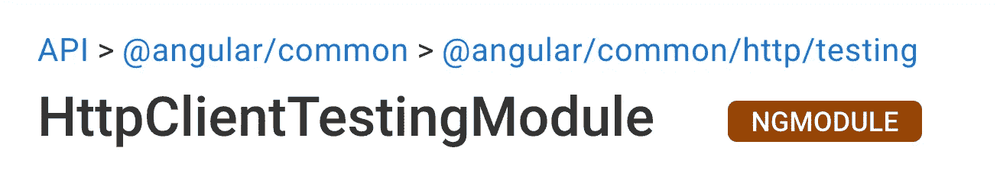

# 测试角度 HTTP 通信

> 原文：<https://itnext.io/testing-angular-http-communication-9a120a10da18?source=collection_archive---------3----------------------->

Angular 有很棒的内置工具来进行 web 请求。它还包含一个很棒的测试 HTTP 通信的模块: [HttpClientTestingModule。](https://angular.io/api/common/http/testing/HttpClientTestingModule)该模块包含完整的工具箱，以确保 web 通信按照开发人员的意图进行。让我们探索一下 [HttpClientTestingModule](https://angular.io/api/common/http/testing/HttpClientTestingModule) 并了解如何:

*   测试 HTTP 请求
*   模拟响应
*   处理错误
*   测试 HTTP 拦截器

# 测试 HTTP 请求

让我们制作一个简单的应用程序，显示由 GitHub 用户标记的存储库列表。它将包括一个用户名输入框，一个请求按钮和一个显示结果的表格。为了让事情看起来漂亮，让我们使用 bootstrap。

当用户点击“显示”按钮时，我们需要发出 web 请求。让我们设置一个测试套件，并创建一个测试来确保 web 请求发生。

Angular 配备了一个非常棒的 HTTP 测试工具箱。 [HttpClientTestingModule](https://angular.io/api/common/http/testing/HttpClientTestingModule) 是一个现成的容器，包含了我们进行 HTTP 测试所需的所有工具。它提供了[HttpTestingController](https://angular.io/api/common/http/testing/HttpTestingController)——一个管理 HTTP 请求的可注入服务。 [HttpTestingController](https://angular.io/api/common/http/testing/HttpTestingController) 公开了测试执行过程中发生的所有 HTTP 请求的信息。我们可以像其他可注入服务一样注入它的一个实例。

让我们来做设置代码。

现在是编写第一个测试的时候了。当用户点击按钮时，我们期待这个请求，检索所有由用户加星号的回复的端点是[https://api.github.com/users/:userName/starred.](https://api.github.com/users/:userName/starred.)。

[HttpTestingController](https://angular.io/api/common/http/testing/HttpTestingController) 包含两个期望方法: [expectOne](https://angular.io/api/common/http/testing/HttpClientTestingModule) 和 [expectNone](https://angular.io/api/common/http/testing/HttpClientTestingModule) 。两者都有几个带有不同参数的重载来识别特定的请求。方法的名字很好地描述了它们做什么——不需要或者只需要一个特定的请求。如果没有达到预期，就会抛出异常。Jasmine 需要一个“expect”语句。为了让测试通过，我们使用 expect()not . to throw()。

现在是 HTML 和请求代码。

# 模拟响应

我们有一个 HTTP 请求。我们需要在表格中显示这个请求的结果。首先，我们需要将响应保存到视图中可访问的属性。让我们在组件中创建该属性，并编写一个测试来检查响应是否保存到新创建的属性中。

Github 提供了很多关于回购的信息。我们将只使用几个字段。让我们创建一个简单的 typescript 接口，它只知道我们需要的属性。

使用 [HttpClientTestingModule](https://angular.io/api/common/http/testing/HttpClientTestingModule) 时，管理 HTTP 响应的所有责任都转移给了开发人员。除非在测试代码中显式发送响应，否则组件或服务不会运行对响应做出反应的代码。要发送响应，我们需要获取对 [TestRequest](https://angular.io/api/common/http/testing/TestRequest) 的引用，并调用提供响应参数的方法 [flush](https://angular.io/api/common/http/testing/TestRequest#flush) 。

对于我们的场景，我们只需要提供一个响应体。在其他场景中，响应可能包含标题、文件、特定的状态文本或状态代码等。 [flush](https://angular.io/api/common/http/testing/TestRequest#flush) 方法有一个到达签名，为开发人员提供了细化响应的能力。

现在让我们编写一个代码来通过测试。

测试通过，在我们创建简单的 HTML 标记后，我们能够看到一些用户界面。

# 错误处理

如果 GitHub 不知道用户，API 会返回一个 404 状态码。让我们来处理这种情况，并显示一个友好的错误消息。

为了发送错误而不是成功的响应，我们需要利用 [TestRequest](https://angular.io/api/common/http/testing/TestRequest) 的 [error](https://angular.io/api/common/http/testing/TestRequest#error) 方法。让我们做两个测试——一个检查当请求失败时错误消息是否显示，另一个检查当请求成功时错误消息是否隐藏。

[错误](https://angular.io/api/common/http/testing/TestRequest#error)方法也有一个 reach 签名来细化响应。对于我们的场景，我们不需要太多—我们只需要发送任何带有错误的响应。现在让我们编写代码使测试工作。

# HttpInterceptor

当每个请求发生时，HttpInterceptor 允许执行代码。它还可以修改 HTTP 请求本身。GitHub API 可以根据 Accept 头返回不同的响应。比方说，我们希望将所有对 GitHub API 的请求的 Accept 头设置为“application/vnd.github.v3+json”。最好的方法是利用 [HttpInterceptor](https://angular.io/api/common/http/HttpInterceptor) 。

为了让拦截器处理请求，我们需要将它添加到需要拦截器的模块的 providers 数组中。这意味着为了测试，我们需要在测试模块配置中提供它。让我们也马上注入 http 客户端。稍后我们将使用它来发出请求。

让我们首先编写测试。由于测试中所有的 HTTP 请求都需要 Accept 头，我们将创建一个简单的 URL 请求，从[https://api.github.com/](https://api.github.com/)开始，并检查它是否包含 Accept 头。另一个测试将检查对非 GitHub API URL 的请求是否不包含头。

我们通过动词获取请求，而不是使用 [expectOne](https://angular.io/api/common/http/testing/HttpClientTestingModule) 方法。这更方便，因为我们不关心网址。现在剩下的就是编写拦截器代码了。

# 摘要

在本文中，我们学习了如何测试 HTTP 请求，模拟 HTTP 响应和 HTTP 错误，测试 HTTP 拦截器。完全可以处理 Angular 应用程序中 HTTP 通信的测试。

探索本文中使用的[源代码](https://github.com/IAfanasov/AngularHttpTesting)或者玩玩 [stackblitz](https://stackblitz.com/github/IAfanasov/AngularHttpTesting) 。
***
*原载于*[*https://www . mobiquity . com/insights/testing-angular-http-communication*](https://www.mobiquity.com/insights/testing-angular-http-communication)