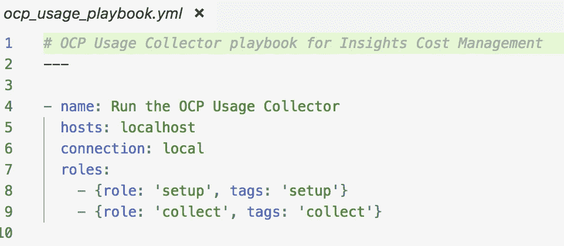
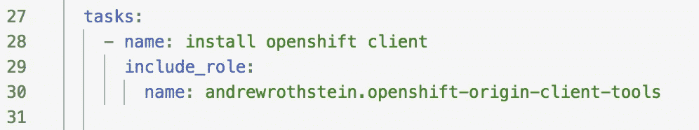
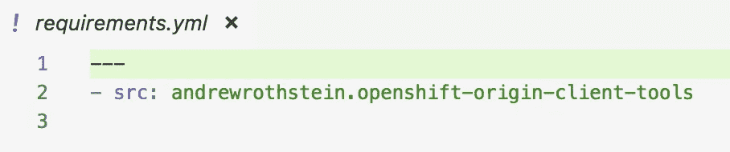
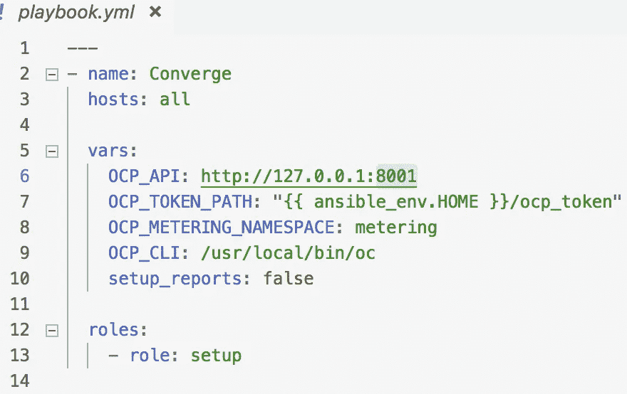

# 测试可承担的角色:一个实际应用

> 原文：<https://itnext.io/testing-ansible-roles-a-practical-application-2afc96e0d7d?source=collection_archive---------3----------------------->

克里斯里德在 [Unsplash](https://unsplash.com?utm_source=medium&utm_medium=referral) 上的照片

**Ansible** 是[配置管理、编排、持续交付等](https://www.ansible.com/use-cases)的强大工具。作为一名软件开发人员，在过去的两年里，我一直在利用 Ansible 作为核心机制，以可共享和人类可读的方式完成可重复的步骤。说得好听点，当一个同事指给我看 [**分子**](https://molecule.readthedocs.io/en/latest/) 时，我很困惑。

 [## 分子-分子 0.0.1.dev49 文档

### Molecule 旨在帮助开发和测试可能的角色。分子为测试提供支持…

分子. readthedocs.io](https://molecule.readthedocs.io/en/latest/) 

来自一个对照目标*测试*系统运行剧本的世界，看看会发生什么，然后接下来启动一个虚拟机、流浪者或 docker 系统，然后在我开发角色或剧本时不得不回滚错误；我发现这个工具非常有趣。 *Molecule* 不仅允许你测试你正在构建的角色，比如语法，还允许测试系统的可重复设置和拆卸。来自[opensource.com](https://opensource.com/article/18/12/testing-ansible-roles-molecule)的以下文章涵盖了*分子*的基础知识。稍微浏览一下 Molecule 的介绍性文章和文档，然后我们可以从我如何将它应用到一个实际用例开始，以及一些关于如何充分利用 *Molecule* 的提示/技巧。

# 用例

在我当前的项目中，我们从[**Kubernetes**](https://kubernetes.io/)([*open shift*](https://www.openshift.com/))中提取数据来确定运行一个集群的成本。我们利用 [**操作员计量**](https://github.com/operator-framework/operator-metering) ，它从 [**普罗米修斯**](https://prometheus.io/) 中提取度量来收集使用信息。我们构建了一个项目，[***Kore kuta***](https://github.com/project-koku/korekuta)，它利用 *Ansible* 来执行两个任务:

(1)设置运营商计量报告并存储配置数据

(2)从运营商计量 API 收集数据，并发送到云存储进行处理

Korekuta 的可翻译剧本

为了实现这一点，创建了两个角色( *setup* 和 *collec* t ),并在剧本中使用标记来触发每个角色。

# 分子设置

正如在介绍性文章中所述， *Molecule* 可以与从 Docker 到流浪者和 Virtualbox 等各种驱动程序一起工作。设置过程的美妙之处在于它使用了 *Ansible* ，这是您非常熟悉的东西，用来准备测试系统。当您为测试构建一个角色时，您可以添加一个 *prepare.yml* 作为测试系统设置的剧本。 *prepare.yml* 位于*<role>/Molecule/default/*目录中，由 *Molecule* 测试流程的 **Prepare** 步骤触发。

对于 *Korekuta* 设置角色 [**准备**](https://github.com/project-koku/korekuta/blob/master/roles/setup/molecule/default/prepare.yml) 步骤执行以下操作:

1.  使用 Ansible Galaxy 中的[现有角色安装 Openshift 客户端工具](https://galaxy.ansible.com/andrewrothstein/openshift-origin-client-tools)
2.  创建命令行工具的存在
3.  在一个已知的位置创建一个文件作为额外的变量输入
4.  创建一个简单的 web 服务器来响应预期的有效负载

*Molecule 的*与 [Ansible Galaxy 的](https://galaxy.ansible.com/home)整合，让你可以搭载其他人之前构建的所有伟大角色。不幸的是，我发现缺少关于此功能的文档，因此您可以在下面看到角色的用法示例:

执行来自 Ansible Galaxy 的角色

为了利用这个角色，您必须通过将 *requirements.yml* 添加到*<role>/molecule/default/*目录来指定您的角色对它的依赖。对于 *Korekuta* ，[要求. yml](https://github.com/project-koku/korekuta/blob/master/roles/setup/molecule/default/requirements.yml) 如下:

要求使用一个可回答的银河角色。

通过这些小步骤，您可以利用 *Ansible Galaxy* 充满活力的生态系统，轻松设置测试系统。

# 分子测试执行

*Molecule* 再次利用用户熟悉的领域，让角色的“测试者”成为剧本。上一节我提到了 *<角色>/分子/默认/* 目录，然而 ***默认*** 目录只是一个测试用例，所以概括其实际 *<角色>/分子/ <测试 _ 用例>/*；并且其中每个都有一个 *playbook.yml* 将在 **Converge** 步骤中执行。使用这种结构，您可以为您的角色设置各种各样的测试流，以及前面部分提到的专门设置。

Korekuta 的设置角色的 [playbook.yml](https://github.com/project-koku/korekuta/blob/master/roles/setup/molecule/default/playbook.yml) 相当简单，然而，它的“运行时”执行依赖于用户使用 *Ansible* 的*-e VARIABLE = VALUE】*机制向命令行提供额外的变量。出于测试目的，我们可以使用行动手册中的 ***变量*** 选项来提供这些输入值，然后使用多个测试用例来改变不同行动手册的输入，如示例所示。

正如介绍文章中提到的， *Molecule* 允许您测试测试用例的预期结果，并建立一个持续的集成流程。因为这些在文章和文档中已经足够清楚地涵盖了，为了完整起见，我将只在 *Korekuta* 中链接这些项目。

*   [使用 TestInfra 的默认测试用例](https://github.com/project-koku/korekuta/blob/master/roles/setup/molecule/default/tests/test_default.py)
*   [使用 Tox、Pipenv 和 Molecule 的 TravisCI】](https://github.com/project-koku/korekuta/blob/master/.travis.yml)

# 摘要

在本文中，我们已经介绍了如何使用*分子*和一些高级资源来测试*角色*。接下来，我们进入了一个利用*分子*的项目，讨论了测试设置和执行是如何工作的，包括使用 *Ansible Galaxy* 角色和用多个测试用例驱动额外变量流的技巧。希望与测试一个*责任*角色的实际应用相关的资源能为您提供价值。

自动化快乐！