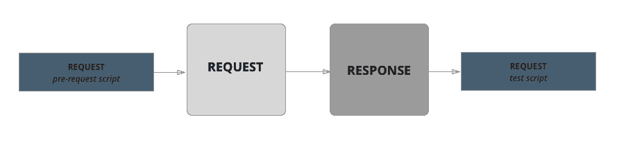
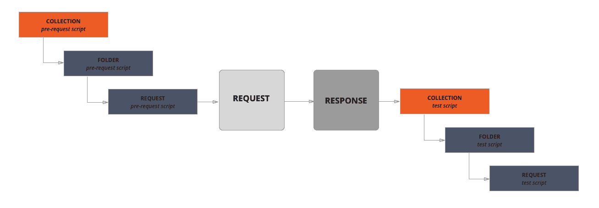

# 使用高级 REST 客户端测试 APIs 第一部分

> 原文：<https://itnext.io/testing-apis-using-advanced-rest-client-29edc785bfb1?source=collection_archive---------2----------------------->


在本文中，我想回顾一下 REST 客户端的种类。

在我的例子中，我将使用资源[https://jsonplaceholder.typicode.com/](https://jsonplaceholder.typicode.com/)

JSONPlaceholder 是一个免费的在线 REST API，只要你需要一些假数据，就可以使用它。
它非常适合教程、测试新库、分享代码示例。

**REST** 客户端是一个允许使用 REST API 与远程服务器通信的应用程序/库。

**REST(RESTful)** —是应用/站点组织以及通过 HTTP 协议与服务器交互的一般原则。REST 的特性是服务器不会记住用户在两次请求之间的状态——在每次请求中，都会传输标识用户的信息(例如，通过 Oauth-authorization 获得的令牌)和执行操作所需的所有参数。

REST API 是一组对标准方法的远程调用，这些方法以特定的格式返回数据。

1.**放心是最常用的**Java 库，用于 REST api 测试自动化。这个库使得用 Java 进行 REST 测试类似于 Groovy 方法。这是一个强大的库，允许你创建测试，可读性更强，易于维护。

```
@Test
**public void** getCorrectData() {
    given.get(**"https://jsonplaceholder.typicode.com/users/1"**)
            .then()
            .statusCode(200)
            .and()
            .assertThat()
            .body(**"name"**, equalTo(**"Leanne Graham"**))
            .body(**"username"**, equalTo(**"Bret"**))
            .body(**"email"**, equalTo(**"Sincere@april.biz"**));
}
```

**2。弹簧座模板。如果你经常在项目中使用 Java，并且知道什么是 Spring framework，你可能听说过这个库的存在。**

Spring 是一个强大的框架。REST Template 是一个很棒的库，您可以用它来创建 REST 客户端。

```
@Test
**public void** getCorrectData() {
    RestTemplate restTemplate = **new** RestTemplate();
    HttpHeaders httpHeaders = **new** HttpHeaders();
    httpHeaders.setContentType(MediaType.APPLICATION_JSON);
    httpHeaders.add(**"User-Agent"**, **"chrome"**);
    HttpEntity httpEntity = **new** HttpEntity(httpHeaders);
    ResponseEntity<String> responseEntity = restTemplate.exchange(**"https://jsonplaceholder.typicode.com/users/1"**,   GET, httpEntity, String.**class**);
    assertThat(responseEntity.getStatusCode(), equalTo(HttpStatus.OK));
}
```

**3。retrieval**是 Android 开发者中一个著名的网络库。一些开发人员甚至认为它是 web 开发/测试自动化的一种标准。如此受欢迎有很多原因:

3.1 这个库完美支持 REST api。

3.2 易于测试和配置。

3.3 在它的帮助下，通过网络进行请求非常简单。

关键的库特性之一——执行同步和异步调用的能力。

```
@Test
**public interface** getCorrectData {
    @GET(**"https://jsonplaceholder.typicode.com/users"**)
    **public** Call<Post> getPostWithID(@Path(**"id"**) **int** id);
}
```

**4。Postman —** 不是框架也不是库，是 Chrome 浏览器的简单插件。这是一个简单方便的客户端，可以直接从浏览器发出请求。

**Postman** 的主要目的是创建 API 请求的集合。任何测试人员都可以通过打开集合很容易地理解服务的工作。

在上层操作邮差的收集和在底层操作请求的主要概念。所有请求都以一个集合开始，并最终使用查询来描述您的 API。

**集合**是新 API 的起点。您可以将集合视为项目文件的一部分。

**文件夹**用于将查询组合成一个**集合**中的一个组。

**请求是**系列**的**主要组成部分。**请求**是在**构造器**中创建的**。查询设计器是您应该使用的主要空间。**

Postman 能够使用所有标准的 HTTP 方法执行请求。测试人员可以很容易地更改或添加必要的标题、cookies 和请求体。

**下图显示了 Postman 中查询执行的顺序:**

“请求前脚本”用于在请求前执行必要的操作。例如，您可以对另一个系统进行查询，并在主查询中使用其执行结果。“测试脚本”用于编写:

*   测试。
*   检查结果。
*   将测试结果保存到变量中。



**以下是脚本文件夹和集合的查询顺序:**

Postman 允许您在文件夹和收藏级别创建脚本。它们也被称为“请求前脚本”和“测试脚本”。它们将在文件夹或整个集合中的每个请求之前和之后执行。



我将在下一个[部分](https://medium.com/@antony.s.smirnov/testing-apis-using-advanced-rest-client-part-ii-4ff1b1d37960)中详细解释。