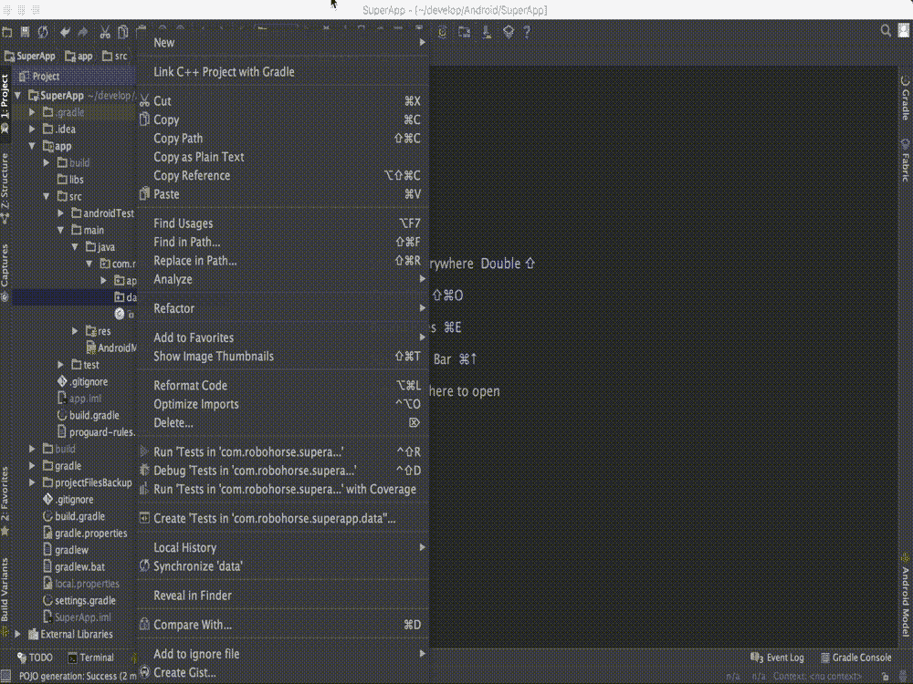

# 使用高级 REST 客户端测试 APIs 第二部分

> 原文：<https://itnext.io/testing-apis-using-advanced-rest-client-part-ii-4ff1b1d37960?source=collection_archive---------1----------------------->

在我的第一部分中，我写了关于 rest 客户端的测试。在本文中，我们将深入探讨 REST API 测试。如何使用放心创建自动化脚本？


**请放心**是一个很棒的 Java 库，完全涵盖了自动化工程师需要的一切。放心编写自动化脚本非常舒服。

放心可以有两种连接方式:Maven 或者 Gradle。

Maven:

```
<dependency>
      <groupId>io.rest-assured</groupId>
      <artifactId>rest-assured</artifactId>
      <version>4.0.0</version>
      <scope>test</scope>
</dependency>
```

格拉德:

```
testCompile 'io.rest-assured:rest-assured:4.0.0'
```

最简单的放心工作的例子如下:

```
**public class** CheckData {
    @Test
    **public void** getUserData() {
        given.get(**"https://jsonplaceholder.typicode.com/posts"**)
                .then()
                .statusCode(200)
                .and()
                .assertThat()
                .body(**"userId"**, equalTo(1))
                .body(**"Id"**, equalTo(5))
                .body(**"title"**, equalTo(**"nesciunt quas odio"**));
    }
}
```

这是一个“标准”方法实现的例子。

就我个人而言，我更喜欢将来自服务器的 JSON 响应转换成 Java 对象的正确方法。

然而，这种方法有一个缺点:您需要将 JSON 结构描述为 Java POJO 形式。

在我看来，这是一项相当耗时的任务，尤其是当您需要处理大量响应时。

例如，底部的服务器响应应该是这样的:

{
【id】:1、
【姓名】:【符晓薇·格拉汉姆】、
【用户名】:【布雷特】、
【电子邮件】:[真诚@april.biz](mailto:Sincere@april.biz) ”、
【地址】:{
【街道】:【库拉斯之光】、
【组曲】:“Apt。556 "、
"city": "Gwenborough "、
" zip code ":" 92998–3874 "、
" geo ":{
" lat ":"-37.3159 "、
" LNG ":" 81.1496 "
}
}、
" phone ":" 1–770–736–8031 x 56442 "

你需要花一些时间用 Java 来描述这个结构。使用 **RoboPojoGenerator** 插件，你可以走一条更好的路，形成想要的类。必须在 IDE 设置中添加它。



操作原理相当简单:复制 JSON 数据，粘贴到文本字段，选择库，点击生成按钮。生成的类将立即显示在项目中。

这种方法有一个主要缺点——您需要做大量的手工工作来复制 JSON 数据。这个过程可以而且应该自动化。你可以找到非常有用的插件让 Gradle 和 Maven 来做这件事。

Maven 插件的连接示例:

```
<plugin>
    <groupId>org.jsonschema2pojo</groupId>
    <artifactId>jsonschema2pojo-maven-plugin</artifactId>
    <version>1.0.1</version>
    <configuration>
       <sourceDirectory>${basedir}/src/main/resources/schema</sourceDirectory>
        <targetPackage>com.example.types</targetPackage>
    </configuration>
    <executions>
        <execution>
            <goals>
                <goal>generate</goal>
            </goals>
        </execution>
    </executions>
</plugin>
```

对于格雷尔:

```
// Use the java plugin 
apply plugin: 'java' 
// In Android Projects use 
apply plugin: 'com.android.application'

apply plugin: 'jsonschema2pojo'

buildscript {
  repositories {
    mavenCentral()
  }

  dependencies {
    // this plugin
    classpath 'org.jsonschema2pojo:jsonschema2pojo-gradle-plugin:${js2p.version}'
    // add additional dependencies here if you wish to reference instead of generate them (see example directory)
  }
}

repositories {
  mavenCentral()
}

dependencies {
  // Required if generating JSR-303 annotations
  compile 'javax.validation:validation-api:1.1.0.CR2'
  // Required if generating Jackson 2 annotations
  compile 'com.fasterxml.jackson.core:jackson-databind:2.9.7'
  // Required if generating JodaTime data types
  compile 'joda-time:joda-time:2.2'
}

// Each configuration is set to the default value
jsonSchema2Pojo {

  // Location of the JSON Schema file(s). This may refer to a single file or a directory of files.
  source = files("${sourceSets.main.output.resourcesDir}/json")

  // Target directory for generated Java source files. The plugin will add this directory to the
  // java source set so the compiler will find and compile the newly generated source files.
  targetDirectory = file("${project.buildDir}/generated-sources/js2p")

  // Package name used for generated Java classes (for types where a fully qualified name has not
  // been supplied in the schema using the 'javaType' property).
  targetPackage = ''

  // The type of input documents that will be read. Supported values:
  //  - jsonschema (schema documents, containing formal rules that describe the structure of JSON data)
  //  - json (documents that represent an example of the kind of JSON data that the generated Java types
  //          will be mapped to)
  //  - yamlschema (JSON schema documents, represented as YAML)
  //  - yaml (documents that represent an example of the kind of YAML (or JSON) data that the generated Java types
  //          will be mapped to)
  sourceType = 'json'
```

在 *src/java/resources/json 文件夹*中，添加您需要的 json 文件，并在控制台中运行该命令:

**。/grad Lew generatejsonschema 2 POJO**

在 build/generated-sources 文件夹中，生成的类将显示所有必要的属性。现在您可以安全地将类转移到包中，并在您的测试中使用它们:

```
@Test
**public void** getCorrectData() {
    Post = when()
            .get(**"https://jsonplaceholder.typicode.com/posts/1"**)
            .then().extract().body().as(Post.**class**);
}
```

结果，您得到了一个完全成熟的 Java 对象，其中充满了可以执行任何操作的数据。

一旦你学会了“如何获取数据”,你就必须检查存储这些对象的数据。为此，你可以使用一个很棒的库，Hamcrest Matchers，来编写检查断言。

**例如，如果您的 HTTP 服务器在**【https://jsonplaceholder.typicode.com/users/1】返回以下 JSON:

{
"id": 1、
"姓名": "符晓薇·格拉汉姆"、
"用户名":"布雷特"、
"电子邮件":"[真诚@april.biz](mailto:Sincere@april.biz) "
}

在基于 JSON 的响应上，让我们创建一个简单的 Java 类:

```
**public class** User {
    String **id**;
    String **name**;
    String **username**;
    String **email**;
}
```

通过使用 Hamcrest，您可以编写 assert check:

```
@Test
**public void** testUserInformation() {
    User user = when()
            .get(**"https://jsonplaceholder.typicode.com/users/1"**)
            .then()
            .extract()
            .response()
            .as(User.**class**);
    assertThat(user.**id**, equalTo(**"1"**));
    assertThat(user.**name**, equalTo(**"Leanne Graham"**));
    assertThat(user.**username**, equalTo(**"Bret"**));
    assertThat(user.**email**, equalTo(**"Sincere@april.biz"**));
}
```

Hamcrest 最大的优势就是可以让你写自定义支票。

Yandex 团队在 AnnotationProcessor 的帮助下为 Pojo 创建了项目自动生成 Java Hamcrest 匹配器。你可以在 [**Github**](https://github.com/yandex-qatools/hamcrest-pojo-matcher-generator) 上找到这个工具

下面是简单的工作原理:(为了让它工作)在 Java 类中，你必须在测试方法之前写@GenerateMatcher 注释。

例如，在使用@GenerateMatcher testUserInfo 方法生成检查后，检查结果将如下所示:

```
@Test
**public void** testUserInfo() {
    User user = when().get(**"https://jsonplaceholder.typicode.com/users/1"**)
            .then()
            .extract()
            .response()
            .as(User.**class**);
    assertThat(user, hasId(**"1"**));
    assertThat(user, hasName(**"Leanne Graham"**));
    assertThat(user, hasUserName(**"Bret"**));
    assertThat(user, hasEmail(**"Sincere@april.biz"**));
}
```

如果您需要为一个对象编写一两个测试，这种方法对您来说是最佳的。然而，您将再次花费大量时间进行手动编辑。完成所有这些之后，您需要手动指定每个注释。这是一个非常劳动密集型的过程。

为了避免手工操作，你可以从 Hamcrest 转换到 Assertj 库。

注意，Assertj 库的语法与 Hamcrest 使用的语法完全不同。所以，如果你决定使用 Assertj，你将需要重写大量的代码。

该库还允许您为 Java 类生成检查。它为 Gradle 和 Maven 提供了集成，这非常有用。

此库的连接示例:

Maven:

```
<dependency>
  <groupId>org.assertj</groupId>
  <artifactId>assertj-core</artifactId>
  <version>3.11.1</version>
  <scope>test</scope>
</dependency>
```

格拉德:

```
testCompile("org.assertj:assertj-core:3.11.1")
```

使用 Assertj，您可以简单地为任何类生成断言检查——只需指定包的路径，无需添加额外的注释。

让我们看看 Assertj 库是如何改变 testUserInformaion 方法的:

```
@Test
**public void** testUserInformation() {
    User user = when().get(**"https://jsonplaceholder.typicode.com/users/1 "**)
            .then()
            .extract()
            .response()
            .as(User.**class**);
    UserAssert.assertThat(user)
            .hasId(**"1"**)
            .hasName(**"Leanne Graham"**)
            .hasUserName(**"Bret"**)
            .hasEmail(**"Sincere@april.biz"**);
}
```

**优点**

1.  在代码编写过程中，我们 80%的代码是通过库自动生成的。
2.  如果域模型已经改变，有人删除了一个字段或者改变了数据类型，您可以很容易地重新生成方法。为此，只需在终端中运行命令。该库将自动更新代码。

**缺点**

1.  这是一种灰箱测试方法。用户必须知道两种方法，黑盒和白盒测试方法。
2.  这种方法需要所谓的编码技能。换句话说，你必须能够编写代码。当然，自动代码生成可以让你简化这个过程，但是要编写正确的调用，必须把所有的东西联系起来。
3.  有必要花一些时间阅读将 Assertj 库集成到项目中的文档。

我想向你稍微描述一下我对 REST 放心库的缺点的观点。我非常积极地使用这个库，我下面写的一切都是基于我的实践经验。正式文档告诉我们，放心的自动化脚本很容易以 BDD 风格编写:

```
**public class** CheckData {
    @Test
    **public void** getUserData() {
        given.get(**"https://jsonplaceholder.typicode.com/posts"**)
                .then().statusCode(200)
                .and()
                .assertThat()
                .body(**"userId"**, equalTo(1))
                .body(**"Id"**, equalTo(5))
                .body(**"title"**, equalTo(**"nesciunt quas odio"**));
    }
}
```

第一个问题是，随着自动测试数量的增加，问题开始出现。在您的自动化项目中，您需要考虑的主要事情是正确的架构和项目的分层。

如果您没有正确地构建架构，并按照官方教程提供的方式编写自动化脚本，您无疑会遇到代码复制和日志记录的问题。

第二个问题是工作慢。因为它是一个由 Java/Groovy 代码组成的包装器，所以比它的竞争对手慢得多。对于自动化脚本，这可能不是很关键，但这里有一个 JSON 方案的检查，它内置在放心，我建议不要这样做:它将工作非常慢。

如果您决定在项目中使用放心，请仔细考虑您希望如何查看您的测试、报告，以及您希望花费多少时间来支持这些测试。

第三个问题是缺乏明智的例子和令人放心的良好做法。

我将在下一部分详细解释改造。