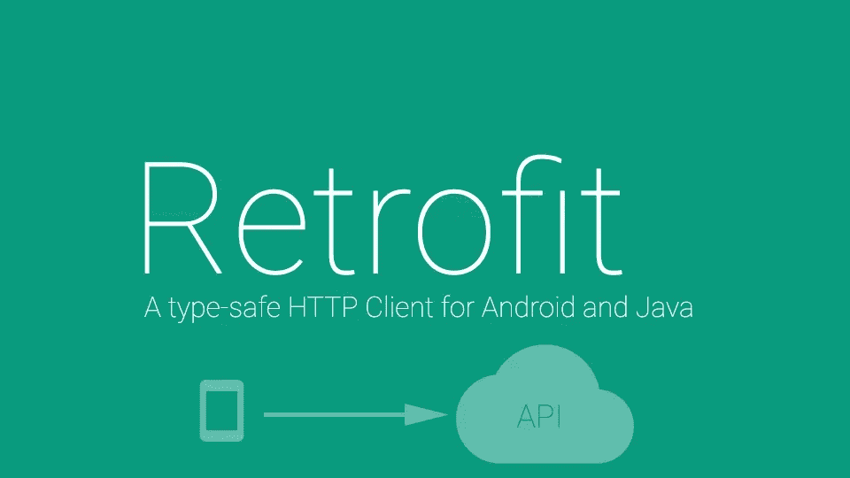

# 使用高级 REST 客户端测试 API。第三部分

> 原文：<https://itnext.io/testing-apis-using-advanced-rest-client-part-iii-173906d7abea?source=collection_archive---------2----------------------->



**翻新**是一个类型安全的 Java HTTP 客户端。它是在客户机-服务器应用程序中使用 API 不可或缺的工具。我个人在工作中很少使用这个库。主要是因为大多数情况下这个库都是在 Android 开发环境中使用的。

该库提供了一种使用接口的改进方法。你不写代码本身，你写一个描述，即宣布他将能够。

```
**public interface** UserService {
    @FormUrlEncoded
    @Post(**"/users"**)
    @Header(**"ContentType: application/json"**)
    Response<User> createUser(@Field(**"id"**) String id,
                              @Field(**"name"**) String name,
                              @Field(**"username"**) String username,
                              @Field(**"email"**) String email);
}
```

在上面的例子中，我们创建了用户服务，并为这个服务指定了一个方法。此方法创建一个用户。请求的 url 被传递给 post 注释。我们还传递我们需要的关于头部的信息。由于参数指定我们将有电子邮件和密码。从这个例子中可以看出，这是一个非常简单的声明性描述，允许我们几乎不使用代码就可以发出 HTTP 请求。

要使用翻新，您将需要以下三个类:

*   用作 JSON 模型的模型类
*   定义可能的 HTTP 操作的接口
*   阶级改造。构建器—使用构建器接口和 API 为 HTTP 操作定义 url 端点定义的实例

改造可以两种方式连接:Gradle 或 Maven。

**Gradle**
连接到构建文件。Gradle 在应用程序模块的 dependencies 部分插入一行:

```
implementation 'com.squareup.retrofit2:retrofit:2.6.0'
```

**Maven**

如果使用 Maven，依赖片段会是这样的:

```
<dependency>
  <groupId>com.squareup.retrofit2</groupId>
  <artifactId>retrofit</artifactId>
  <version>2.6.0</version>
</dependency>
```

每个接口方法都是可能的 API 调用之一。它必须有 HTTP 注释(GET、POST 等。)来指定请求类型和相对 URL。返回值以预期的结果类型完成 Call 对象中的响应。

例如，为了表明需要一个 **GET** 请求，我们需要在方法之前编写一个 **GET** 注释:

```
**public interface** UserService{
    @GET(**"/users"**)
    Call<List<User>> getUsers();
}
```

您可以使用占位符块和查询参数来自定义 URL。使用{}将替换块添加到相对 URL。对方法参数使用@Path 注释，该参数的值被绑定到特定的替换块。

如果您想发送一个带有参数的请求，那么在 Retrofit()中有一个@Query 注释:

```
**public interface** UserService {
    @GET(**"/posts"**)
    **public** Call<List<Post>> getPostOfUser(@Query(**"Id"**) **int** id);
}
```

为了形成该方法的查询体，我们对传递的参数使用@Body 注释。

```
**public interface** UserService{
    @POST(**"/users/new"**)
    Call<User> createUser(@Body User user);
}
```

改造可以自动转换 Java 对象到 JSON 和回来。她还知道如何使用 XML、协议缓冲区等

```
**public interface** UserService{
    @PUT(**"/users"**)
    Response<User> getUser(@Body User user);
}
```

以下示例显示了翻新如何与集管一起工作:

```
**public interface** UserService {
    @Headers({
 **"ContentType:application/json"**,**"User-Agent: Retrofit-Sample-App"** })
    @GET(**"/service/me"**) Response getMe();
}
```

目标地址放在请求类型的括号中。但是一个描述并不以注释结束，这些注释必须被描述。并将抽象描述为接口(interface)中的规则。下面描述基于 GET 和 DELETE 请求的示例。

```
**public interface** UserService {
    @FormUrlEncoded
    @POST(**"/users"**)
    Response createUser(@Field(**"id"**) String id,
                        @Field(**"name"**) String name,
                        @Field(**"username"**) String username,
                        @Field(**"email"**) String email);

    @GET(**"/users/{id}"**)
    Response getUser(@Path(**"id"**) String id);

    @DELETE(**"/service/users/{id}"**)
    Response deleteUser(@Path(**"id"**) String id);
}
```

这个界面描述了我们工作中需要的所有功能:创建、读取和删除用户。

接下来，我们应用“魔术”改造。创建**改型**，指定我们将使用 Gson(以便在 Java 中修改 JSON 对象并返回)，指定基本 url，并创建我们接口的实例。在返回我们接口的实例后，我们将能够完全使用我们的 Java API。

```
**public static** UserService createUserService() {

    Gson gson = **new** GsonBuilder()
            .setDateFormat(**"yyyy-MM-dd'T'HH:mm:ssZ"**)
            .create();

    Retrofit retrofit = **new** Retrofit().Builder()
            .baseUrl(**"https://api.company.com/"**)
            .addConverterFactory(GsonConverterFactory.create(gson))
            .build();

    **return** retrofit.create(UserService.**class**);
}
```

在自动化脚本中，您可以如下使用**改型**库:

```
**public class** SimpleTest {
    **private** UserService **userService** = createUserService();
    **private** User **user**;

    @Before
    **public void** createUser() {
        **user** = **userService**.createUser(randomEmail(), randomPassword());
    }

    @Test
    **public void** testUserPage() {…}

    @After
    **public void** deleteUser() {
        **userService**.deleteUser(**user**.getId());
    }
}
```

在这个例子中，我们创建了一个用户服务。在测试运行之前，通过调用 createUser 方法创建一个用户。测试运行后，用户被删除。

**改进**允许你以两种方式查询和检索数据——同步和异步。

对于同步(阻塞)接收，我们对 Call 类型的对象使用 execute()方法。

```
Response **response** = App.getApi().getData(**"users"**, 50).execute();
```

该执行返回一个类型为 Response 的对象，从中可以通过 body()方法获得一个经过解析的响应。

对于异步接收，必须替换 execute() enqueue()，其中的参数传递给回调函数。

```
App.getApi().getData(**"bash"**, 50).enqueue(**new** Callback<List<PostModel>>() {
     @Override
     **public void** onResponse(Call<List<PostModel>> call, Response<List<PostModel>> response) {
         *//check response.body() on null* }
     @Override
     **public void** onFailure(Call<List<PostModel>> call, Throwable t) {
         *//Error* }
 });
```

改装实际上有很多可能性，但是有一个小缺点。很遗憾，此库不允许传输文件列表。

好了，这就是我在这篇文章中想说的。我自己的一些想法:因为有大量的库，我的项目使用 Spring 和与之相关的所有东西，但是如果我现在必须写一个客户端，我会选择 Groovy，因为所有的东西都简单、容易和快速。