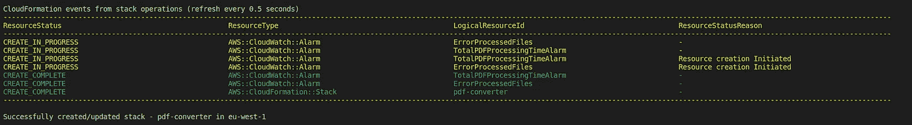
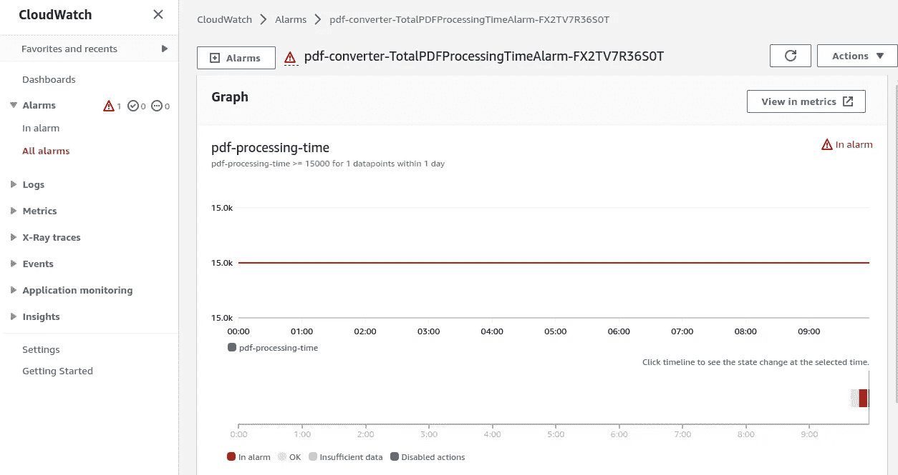

# 测试 AWS Cloudwatch 警报

> 原文：<https://itnext.io/testing-aws-cloudwatch-alarms-75caebcf6da8?source=collection_archive---------2----------------------->

**TL；如何测试你的闹钟是否正常工作！**


没有测试，没有派对！

# 动机

AWS CloudWatch 是一个云服务，用于存储和索引任何类型的日志。您可以添加维度、属性等

借助 AWS CloudWatch Insight，我们可以在日志上定义指标、发送嵌入式指标…并创建警报！

如今，为你的服务安装闹钟是必须的。

定义指标和警报的规范语言可能有点复杂。

这里的要点是，当您有了度量和/或警报的正确语法时，接下来的问题是:我如何测试它？

让我们看看！

# AWS CLI 救援

如果你习惯使用 AWS，你可能已经安装了`aws` CLI 工具。

在`cloudwatch`部分，我们找到了管理指标和警报的整个生命周期的命令和选项。

如果您还没有安装，可以使用以下 shell 命令进行安装

*麦克 OS X*

```
$ brew install awscli
```

*GNU/Linux*

```
$ curl "[https://awscli.amazonaws.com/awscli-exe-linux-x86_64.zip](https://awscli.amazonaws.com/awscli-exe-linux-x86_64.zip)" -o "awscliv2.zip"
$ unzip awscliv2.zip
$ sudo ./aws/install
```

# 这个例子

我们使用一个非常常见的场景:一个 lambda 函数。

使用 AWS SAM 格式非常简单。

我们的函数是 pdf2png。它接收一个 PDF 文件，将其渲染为图像，并在 S3 保存为 PNG 图像。

在本例中，我们定义了两个指标:

*   PDF 文件无效时出错。
*   每个文件的处理时间

根据这些指标，我们定义了以下警报

*   大于阈值的错误 pdf 的数量
*   平均处理时间大于阈值

# 在 SAM 中定义警报

您可能知道，无服务器应用程序模型(又名 SAM)是另一个管理 AWS 无服务器资源的 AWS 工具。

如果你在过去的某一天创建了一个 lambda 函数，你很可能会用到它。

lambda 代码本身不在讨论范围内。我们关注警报。

## 代码

我们使用 SAM 构建和部署我们的代码。

这是我们为它准备的`template.yaml`。

正如您在上面的代码中看到的，我们定义了两个警报。

第一个是关于有错误的已处理 PDF 文件的数量。当在过去的一个小时(3600 秒)内有 5 个或更多的 PDF 文件处理出错时，将触发此警报。

第二个非常相似，但是在这种情况下，我们希望每个文件的平均处理时间低于 15s(但是我们的单位是毫秒)。

为了应用，我们调用以下命令

```
$ sam build
$ sam deploy --guided
```

`guided`选项仅在第一次部署时需要。它指定了诸如云形成堆栈名称、回滚策略等内容。

如果一切顺利，结局一定和下面这个差不多。



警报已创建！

## 获取警报状态

任何 CloudWatch 警报在创建后都具有“不足数据”状态。使用 cloudwatch 命令`describe-alarms`我们可以看到它的状态和其他细节。

```
$ aws cloudwatch describe-alarms --region eu-west-1 --alarm-names pdf-converter-files-error{
    "MetricAlarms": [
        {
            "ComparisonOperator": "GreaterThanOrEqualToThreshold",
            "StateReason": "Unchecked: Initial alarm creation",
            "InsufficientDataActions": [],
            "AlarmName": "pdf-converter-files-error",
            "StateValue": "INSUFFICIENT_DATA",
            "ActionsEnabled": true,
            "AlarmDescription": "Number of errors in processed PDF files pass the threshold in one hour",
            "Dimensions": [],
            "AlarmActions": [],
            "Threshold": 5.0,
            "TreatMissingData": "missing",
            "OKActions": [],
            "EvaluationPeriods": 1,
            "Namespace": "pdf-converter",
            "Statistic": "Sum",
            "Period": 3600,
            "AlarmConfigurationUpdatedTimestamp": "2022-10-06T09:29:58.012Z",
            "MetricName": "error-pdf-file",
            "AlarmArn": "arn:aws:cloudwatch:eu-west-1:520766964441:alarm:pdf-converter-files-error",
            "StateUpdatedTimestamp": "2022-10-06T09:29:58.012Z"
        }
    ]
}
```

# 如何输入假指标

CloudWatch 选项中有一个命令允许我们输入指标数据。我们用它来输入“假”数据，看看警报是否改变了状态。

这个子命令是`put-metric-data`。

必需的参数有:`namespace`、`metric-name`、`value`，在很多情况下还有`unit.`

为了测试关于 PDF 文件平均处理时间的警报，我们在不同的调用中输入以下数据:

```
$ aws cloudwatch put-metric-data --namespace pdf-converter --metric-name pdf-processing-time --value 1200  --unit Milliseconds
$ aws cloudwatch put-metric-data --namespace pdf-converter --metric-name pdf-processing-time --value 4300  --unit Milliseconds
$ aws cloudwatch put-metric-data --namespace pdf-converter --metric-name pdf-processing-time --value 2300  --unit Milliseconds
$ aws cloudwatch put-metric-data --namespace pdf-converter --metric-name pdf-processing-time --value 6300  --unit Milliseconds
```

如果我们现在检查警报状态，

```
$ aws cloudwatch describe-alarms{
            "AlarmName": "pdf-converter-TotalPDFProcessingTimeAlarm-FX2TV7R36S0T",
            "AlarmArn": "arn:aws:cloudwatch:eu-west-1:520766964441:alarm:pdf-converter-TotalPDFProcessingTimeAlarm-FX2TV7R36S0T",
            "AlarmDescription": "Average processing time exceeds threshold",
            "AlarmConfigurationUpdatedTimestamp": "2022-10-09T09:36:56.511Z",
            "ActionsEnabled": true,
            "OKActions": [],
            "AlarmActions": [],
            "InsufficientDataActions": [],
            **"StateValue": "OK"**,
            "StateReason": "Threshold Crossed: 1 datapoint [1200.0 (08/10/22 09:39:00)] was not greater than or equal to the threshold (15000.0).",
            "StateReasonData": "{\"version\":\"1.0\",\"queryDate\":\"2022-10-09T09:39:13.827+0000\",\"startDate\":\"2022-10-08T09:39:00.000+0000\",\"unit\":\"Milliseconds\",\"statistic\":\"Average\",\"period\":86400,\"recentDatapoints\":[1200.0],\"threshold\":15000.0,\"evaluatedDatapoints\":[{\"timestamp\":\"2022-10-08T09:39:00.000+0000\",\"sampleCount\":1.0,\"value\":1200.0}]}",
            "StateUpdatedTimestamp": "2022-10-09T09:39:13.829Z",
            "MetricName": "pdf-processing-time",
            "Namespace": "pdf-converter",
            "Statistic": "Average",
            "Dimensions": [],
            "Period": 86400,
            "Unit": "Milliseconds",
            "EvaluationPeriods": 1,
            "Threshold": 15000.0,
            "ComparisonOperator": "GreaterThanOrEqualToThreshold"
}
```

一切正常…我们去触发它吧。

```
$ aws cloudwatch put-metric-data --namespace pdf-converter --metric-name pdf-processing-time --value 61300  --unit Milliseconds
$ aws cloudwatch put-metric-data --namespace pdf-converter --metric-name pdf-processing-time --value 161300  --unit Milliseconds
$ aws cloudwatch put-metric-data --namespace pdf-converter --metric-name pdf-processing-time --value 13300  --unit Milliseconds
```

通常情况下，警报需要几分钟的时间来重新评估。但是我们可以手动强制评估设置警报状态为“数据不足”。

```
$ aws cloudwatch set-alarm-state --alarm-name processing-time-exceeds-alarm --state-value "INSUFFICIENT_DATA" --state-reason "manual testing"
```

…答对了！

```
$ aws cloudwatch describe-alarms{
    "MetricAlarms": [
        {
            "AlarmName": "pdf-converter-TotalPDFProcessingTimeAlarm-FX2TV7R36S0T",
            "AlarmArn": "arn:aws:cloudwatch:eu-west-1:520766964441:alarm:pdf-converter-TotalPDFProcessingTimeAlarm-FX2TV7R36S0T",
            "AlarmDescription": "Average processing time exceeds threshold",
            "AlarmConfigurationUpdatedTimestamp": "2022-10-09T09:36:56.511Z",
            "ActionsEnabled": true,
            "OKActions": [],
            "AlarmActions": [],
            "InsufficientDataActions": [],
            **"StateValue": "ALARM"**,
            "StateReason": "Threshold Crossed: 1 datapoint [**35714.2857142857**2 (08/10/22 09:47:00)] was greater than or equal to the threshold (15000.0).",
            "StateReasonData": "{\"version\":\"1.0\",\"queryDate\":\"2022-10-09T09:47:13.813+0000\",\"startDate\":\"2022-10-08T09:47:00.000+0000\",\"unit\":\"Milliseconds\",\"statistic\":\"Average\",\"period\":86400,\"recentDatapoints\":[35714.28571428572],\"threshold\":15000.0,\"evaluatedDatapoints\":[{\"timestamp\":\"2022-10-08T09:47:00.000+0000\",\"sampleCount\":7.0,\"value\":35714.28571428572}]}",
            "StateUpdatedTimestamp": "2022-10-09T09:47:13.815Z",
            "MetricName": "pdf-processing-time",
            "Namespace": "pdf-converter",
            "Statistic": "Average",
            "Dimensions": [],
            "Period": 86400,
            "Unit": "Milliseconds",
            "EvaluationPeriods": 1,
            "Threshold": 15000.0,
            "ComparisonOperator": "GreaterThanOrEqualToThreshold"
        }
    ],
    "CompositeAlarms": []
}
```

如果我们进入 AWS Cloudwatch 控制台，我们也可以看到警报通知。



向洞里开火！

# 结论

如今，为所有事情开发测试是一种最佳实践。据我所知，还没有解决方案来测试这种基础设施的东西。如果你知道什么，请与我分享。

同时，多亏了 CLI，我们可以执行一些基本的测试。