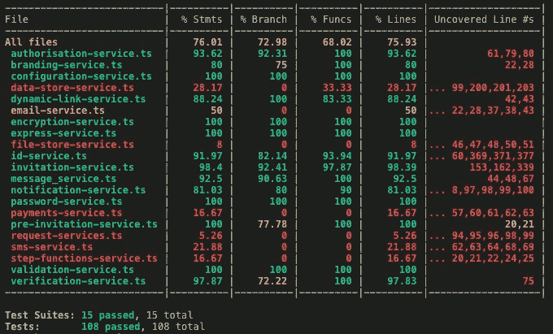
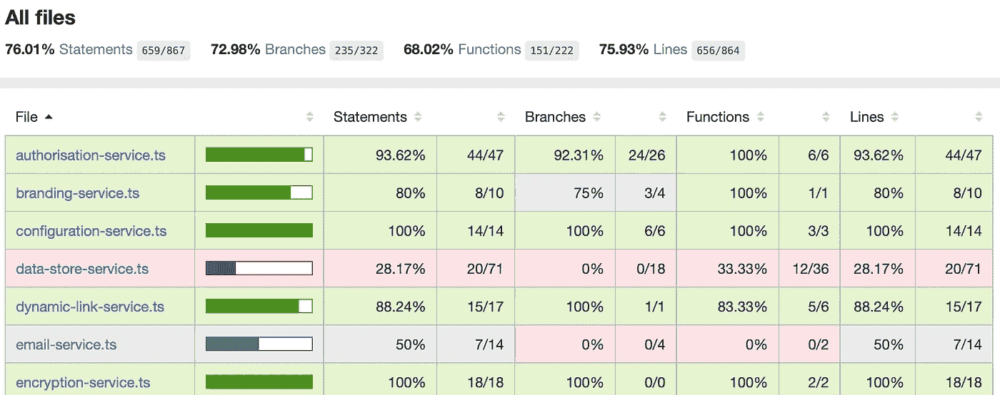
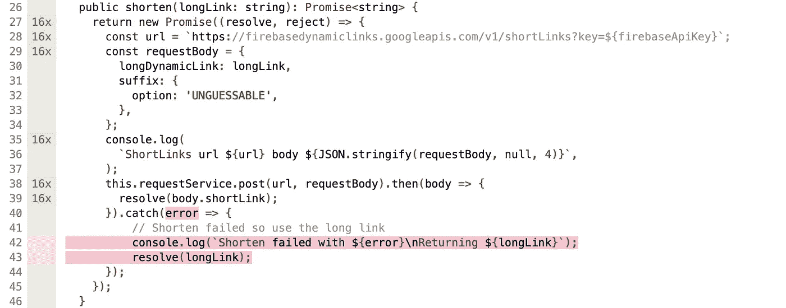
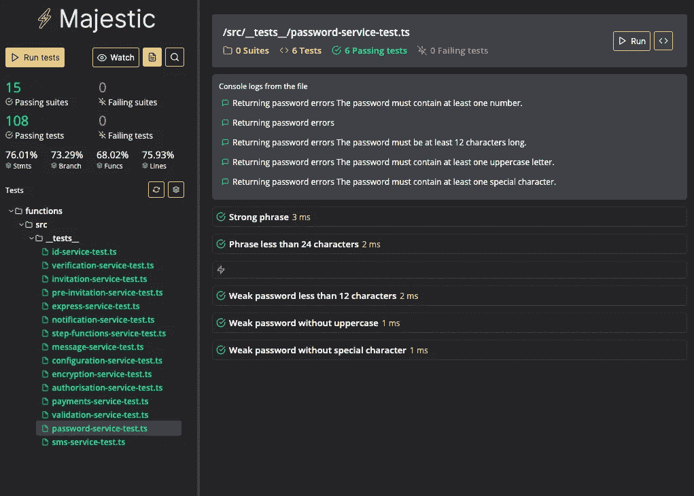
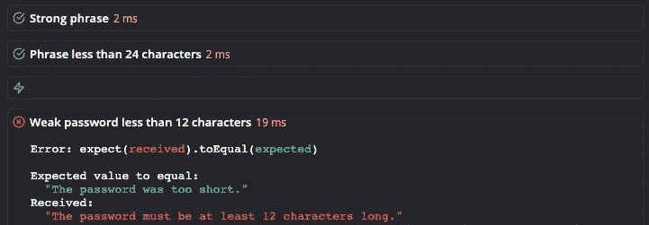

# 用 Jest 测试云函数

> 原文：<https://itnext.io/testing-cloud-functions-with-jest-7626fe1ac7e2?source=collection_archive---------0----------------------->

今天我们将使用 Jest 测试框架深入测试云函数，比如 AWS Lambda 和 Google Cloud 函数。Jest 在使用 React 的客户端开发人员中很流行，但不太为人所知的是 Jest 也是测试 node.js 无服务器函数的一个非常好的框架。


## 为什么开玩笑？

> " Jest 是一个令人愉快的 JavaScript 测试框架，专注于简单性."

[](https://jestjs.io) [## 笑话🃏愉快的 JavaScript 测试

### 🃏令人愉快的 JavaScript 测试

🃏令人愉快的 JavaScript 测试 jetjs . io](https://jestjs.io) 

我认为这是一个令人愉快的测试框架。正如我们将看到的，它使用简单，但也相当强大。代码覆盖率报告非常出色，而且有一些非常好的配套工具，比如 Jest 的 zero config GUI[Majestic](https://github.com/Raathigesh/majestic)。

## 建立

按照我在[以前的帖子](https://medium.com/@keith.coughtrey)中描述的方法，我将介绍使用 typescript 开发和使用无服务器框架部署。

从安装依赖项开始:

```
npm install --save-dev jest
```

当我们使用 typescript 时:

```
npm install --save-dev ts-jest
npm install --save-dev @types/jest
```

最后，需要通过运行以下命令来创建一些初始配置:

```
npx ts-jest config:init
```

然后在`package.json`中设置一个脚本，这样您就可以使用命令`npm run test`来运行您的测试，传入任何需要的环境变量:

```
"scripts": {
    ...
    "test": "BASE_URL=[https://example.com](https://example.com) jest --bail --coverage --coverageDirectory=output/coverage/jest"
  },
```

在这里，我们传入 BASE_URL 环境变量，运行带有代码覆盖报告的`jest`,并将其设置为在第一次测试失败时退出。

## 测试结构和匹配器

按照惯例，您首先创建一个名为`__tests__`的文件夹来放置您的测试。

一个简单的测试如下所示:

```
test('two plus two is four', () => {
  expect(2 + 2).toBe(4);
});
```

这里我使用了`toBe`匹配器。其他有用的匹配器有:

*   `toBeUndefined`仅匹配`undefined`
*   `toBeDefined`与`toBeUndefined`相反
*   `toBeTruthy`匹配任何被`if`语句视为真的东西
*   `toBeFalsy`匹配任何被`if`语句视为假的内容

还有所有常见的东西，比如检查大于、小于、接近等，加上`contains`用于检查是否在数组中找到某个值。完整列表可在[这里](https://jestjs.io/docs/en/expect)找到。

对于异步测试(假设是`node 8`或更高版本),你可以简单地添加`async`和`await`关键字

```
test('an asynchronous function', **async** () => { const result = **await** [function that returns a promise]
  expect(result).toBeTruthy();
});
```

## 代码覆盖率

如上所述，代码覆盖率是一流的。在测试运行结束时，您会看到这样一个覆盖率总结:



代码覆盖率摘要

HTML 摘要页面(使用 Majestic 显示或在上面的`scripts`部分配置的`output/coverage/jest`中找到)如下开始:



代码覆盖率报告

现在，如果我点击`dynamic-link-service.ts`来查看为什么 17 个代码分支中的 2 个没有被测试，下面是它为`shorten`函数显示的内容:



函数源代码的覆盖率

如您所见，我的测试已经运行该函数 16 次，但是没有一次测试了错误处理代码路径。

## 使用 vscode 进行调试等

如果你开发的是 Visual Studio 代码， [Jest 扩展](https://github.com/jest-community/vscode-jest)允许你设置断点来调试你的测试，这有时会很有帮助。

安装扩展，然后在 vscode debug 视图中，选择一个 **dd 配置**并选择`Jest: Default jest configuration`。如果您的功能代码在`functions`文件夹中，修改`program`和`cdw`路径如下:

```
"configurations": [
        {
          "type": "node",
          "name": "all tests",
          "request": "launch",
          "program": "${workspaceFolder}/functions/node_modules/jest/bin/jest",
          "args": [
            "--runInBand"
          ],
          "cwd": "${workspaceFolder}/functions",
          "console": "integratedTerminal",
          "internalConsoleOptions": "neverOpen"
        }
      ]
    }
```

现在，您应该能够运行新的配置并在断点处停止。该扩展还提供了其他好处，如在修改测试时实时重新运行测试，如下图所示:


Jest 扩展在运行中

## 宏伟的

[](https://github.com/Raathigesh/majestic) [## Raathigesh/majestic

### Majestic 是 Jest ✅运行所有测试或单个文件的 GUI⏱切换观察模式📸更新快照❌检查测试…

github.com](https://github.com/Raathigesh/majestic) 

这就是你如何安装和运行`Majestic`

```
npm install majestic -g # install majestic globallymajestic # execute majestic
```

运行 majestic 运行用于演示上述覆盖率的项目，打开显示此页面的`localhost:4000`:



雄伟的主页

在这里，我按下了*手表*右边的按钮，使其收集代码覆盖率。显示了统计数据，您可以从这里深入查看报告。您还可以看到测试的任何控制台输出。请注意，在撰写本文时，它在 Chrome 中运行得最好。Safari 打乱了控制台部分。

在这里，我使用了一个错误来显示断言失败是如何显示的:



断言失败

如果您的测试需要配置环境变量，您可以向`package.json`添加一个`majestic`部分，以便向`Majestic`提供 env 值，例如:

```
"majestic": {
    "args": "--debug",
    "env": {
      "BASE_URL": "[https://example.com](https://example.com)",
    }
  },
```

## 部署前测试

只有当所有测试都通过时，才允许部署，这是一个好的实践。您可以通过像这样设置`package.json`脚本来实现:

```
"scripts": {
    "build": "tsc",
    "deploy": "npm run build && npm run test && serverless deploy",
    "test": "BASE_URL=[https://example.com](https://example.com) jest --bail --coverage --coverageDirectory=output/coverage/jest"
  },
```

现在，如果您使用`npm run deploy`进行部署，您的测试将会运行，如果有测试失败，部署将不会继续。

我希望我已经向你展示了足够多的东西来吸引你投入到你自己的项目中去尝试`Jest`。在我的下一篇文章中，我将介绍模仿和刺探，包括一种以保持状态并可用于集成测试的方式模仿云数据库的实用方法。