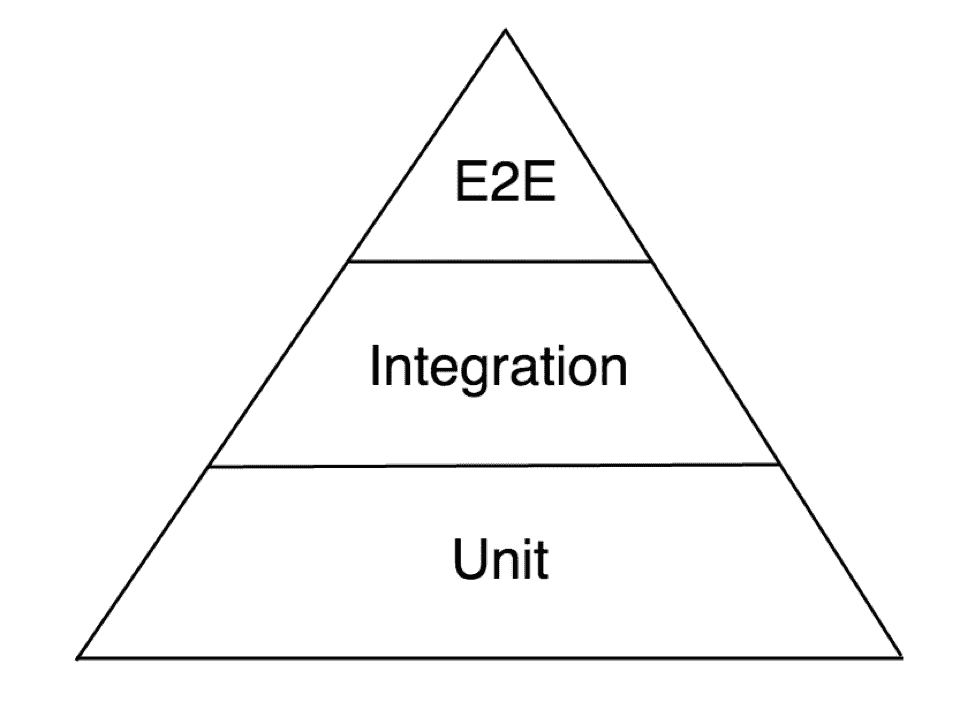

# 用 Jest 和 React 测试库测试组件

> 原文：<https://itnext.io/testing-components-with-jest-and-react-testing-library-d36f5262cde2?source=collection_archive---------0----------------------->

## 从不同的角度思考测试覆盖率


本杰明·沃罗斯在 [Unsplash](https://unsplash.com?utm_source=medium&utm_medium=referral) 上的照片

我们的前端团队最近在一个大规模 SAAS 产品中引入了 React。到实现结束时，我们有大约 15 个活动组件，包括可重用的组件，如按钮和微调器，以及包含应用程序大部分逻辑的较大组件。

为了允许更快的开发，我们选择在没有任何单元或集成测试的情况下实现所有的组件。我们编写的所有组件都在替换现有的功能，这意味着它们都有端到端的 UI 测试覆盖。我们确信这些 UI 测试已经足够了，直到我们回去写更深入的报道。

## 决定开玩笑

选择笑话很简单。我们对一些 React 测试技术进行了快速比较，发现 Jest 最能满足我们的需求。它得到了脸书团队的官方支持，一些关键功能，如模拟、并行测试运行和快照，似乎可以帮助我们解决过去遇到的问题。一旦我们开始实施，安装和配置就非常简单，文档也非常丰富。我们的团队讨论说，我们需要其他实用程序和库来帮助我们专门测试 React 组件。我们简单地看了一下酶的使用，但是因为 React 测试库的文档和原理看起来很有前途，所以我们没有进一步探索酶。

## 反应测试库

React 测试库(react-testing-library)可能是整个过程中最重要的发现。React Testing Library 是一个与 Jest 配合得很好的库，它真正挑战了你，让你认真思考你到底在测试什么。过去，我们的团队努力寻找测试覆盖过多和不够之间的界限。React 测试库背后的原理如下:

> [你的测试越像你的软件被使用的方式，它们就越能给你信心。](https://twitter.com/kentcdodds/status/977018512689455106)

你可能认为这是显而易见的，但是我们以前编写的许多 Javascript 测试测试的是函数的*实现，而不是*结果*(这在传统的 HTML、CSS 和 Javascript 文件分离的项目中可能不那么重要，但是在 React 项目中却至关重要)。React 测试库也促使你编写更多的集成测试和更少的单元测试。这很重要，因为 React 应用程序可以由许多组件组成。测试单个组件很重要，但测试*所有这些组件如何协同工作*可能更重要。你的用户不关心你的应用程序是如何构建的，也不关心你使用的是什么技术。他们关心的是他们能与你的应用程序交互，并且它能无缝地工作。*



传统测试金字塔

## 快照测试

快照测试是 Jest 的一个有趣特性，它允许您测试 Javascript 对象。它与 React 组件配合得很好，因为当您呈现一个组件时，您可以查看 DOM 输出并在运行时创建一个“快照”。当我开始调查他们的时候，社区里有很多不同的意见。这些测试更有用的方面是，它们很好地防止了回归。不利的一面是，有时您无法判断正在测试什么，并且您可能会陷入盲目更新快照测试的坏习惯。我们有几个组件有快照测试，但一般来说，我不推荐它们超过特定的断言。如果您的组件不经常更新，不复杂，并且很容易看到您正在测试的内容，那么快照测试可能有效。

## 履行

团队开始编写测试，并发现我们对应该测试什么进行了长时间的讨论。当我们不能就一个解决方案达成一致时，我们总是回来，*“这有助于测试我们的用户如何使用这个应用吗？”。考虑到这一点，集成风格测试比单元风格测试更有价值(在大多数情况下)就变得更加清楚了。在整个过程中，我们能够为何时编写不同的测试定义一个更具体的答案。可重用的实用程序仍然有单元测试覆盖，但是存在于组件内部的实用程序将被集成测试覆盖。*

下面是一个组件测试的例子，它使用多个区域项来呈现一个区域。它从 json 文件中读取数据，遍历每个条目，然后将其呈现给 DOM。有几个助手方法来构造 href 和过滤区域，但是我们只测试组件中呈现的内容。

```
import React from 'react'
import { render, fireEvent } from 'react-testing-library'
import Component from './Container'describe('<Component /> spec', () => {it('renders the component', () => {
  const container = render(<Component />)
  expect(container.firstChild).toMatchSnapshot()
 })it('assert there are 6 regions', () => {
  expect(document.querySelectorAll('.map-region').length).toBe(6)
 })it('assert there are 12 region items', () => {
  expect(document.querySelectorAll('.region-item').length).toBe(12)
 })it('assert connect button renders the correct label', () => {
  expect(document.querySelector('.connect-btn').innerHTML).toBe("Connect")
 })it('assert the first item link to be /somelink', () => {
  const allAgent = document.querySelector('.region-item:first-child a')
  expect(allAgent.getAttribute('href')).toBe('/somelink?id=123&name=link')
 })});
```

总的来说，我真的很喜欢使用 Jest 和 React 测试库。起初它看起来像一个简单的库，但它非常有价值，因为它测试了与 React 组件的完全集成。

## 关键要点

测试 React 组件时，请记住:

*   我提议编写的测试有助于防止回归吗？
*   这些测试测试用户将如何与这个特性交互吗？
*   如果你发现很难测试你的 React 组件，它们可能应该重写。

测试驱动开发似乎一直是一个很好的实践，也许有了 Jest 和 React 测试库，这可能更容易实现。

[](https://jestjs.io/) [## 笑话🃏愉快的 JavaScript 测试

### 🃏令人愉快的 JavaScript 测试

🃏令人愉快的 JavaScript 测试 jetjs . io](https://jestjs.io/) [](https://github.com/kentcdodds/react-testing-library) [## kentcdodds/react 测试库

### 🐐简单完整的 React DOM 测试工具鼓励良好的测试实践。…

github.com](https://github.com/kentcdodds/react-testing-library)