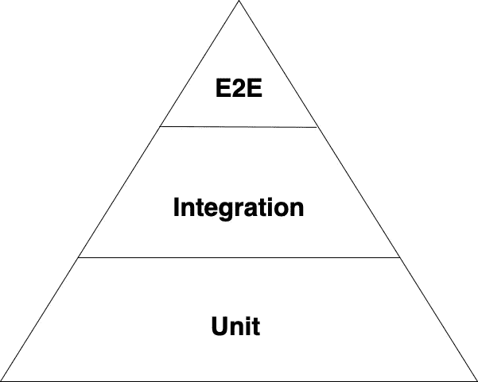
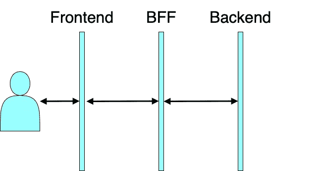
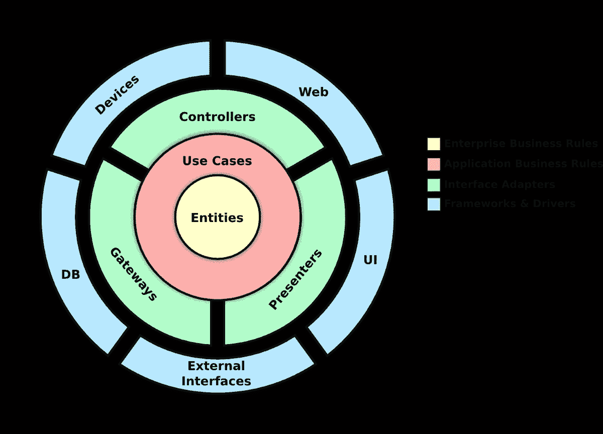
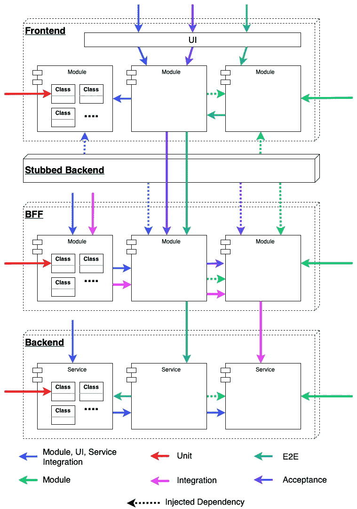
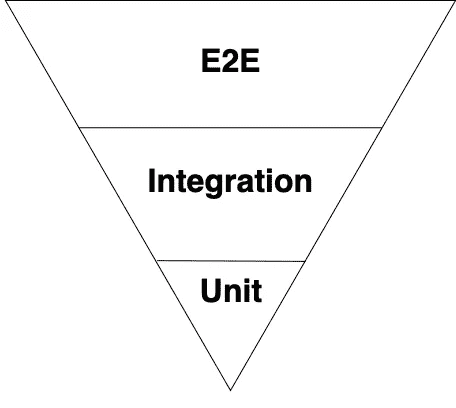

# 测试前端应用——内容、地点、方式？

> 原文：<https://itnext.io/testing-frontend-apps-what-where-how-1c2ab228f8f2?source=collection_archive---------1----------------------->

Pixabay 提供

# 有争议的话题

我不确定我是否记得软件开发中有任何其他话题像软件测试一样如此有争议，会产生如此多不同的观点。一切似乎都是有争议的，没有简单的规则，没有简单的配方，没有二元决策，没有黑&白的可能性…

天啊，对于我们大多数人来说，这一定很难，因为在这个时代，我们被一个接一个的技术、一种接一种的语言、一个接一个的框架、一个接一个地宣告着无可争议的真理……😅😅

然而，这一点也不奇怪，因为测试遵循一些验收标准，一些测试在不同的级别测试代码，因此它们反映了我们解决方案的每个组成部分:

*   体系结构
*   密码
*   外部依赖性
*   开发流程
*   CI/CD
*   …

难怪意见会如此之多，方法会更多...

这篇短文将为你提供一个可持续测试方法的例子，在以下几个方面达到平衡:

*   产出质量
*   效率
*   可维护性
*   投入的努力

> 我**不会谈论任何具体的工具或测试框架。我也不会详细介绍每一个原则、方法和技术，我假设这些都是你已经知道的。我更倾向于关注应该在哪里测试什么，测试的范围和预期的结果。**

# “昂贵的单元测试”的宣传及其后果

这种宣传已经有一段时间了，它特别关注单元测试套件维护的潜在高成本。

> 有一种观点得到了广泛的支持，即良好的旧测试三角的维护成本太高，因为即使是代码中的一个小变化也会破坏其中的至少一个…

测试三角形

有人建议，大多数功能应该作为更大的单元——模块——的行为进行测试，从而成功地实现两个目标:

*   良好的功能测试覆盖率
*   测试的相对稳定性

虽然这听起来几乎是一个完美的方法，但一个想法可能有一些缺陷:

*   发现 bug 可能需要更长的时间
*   虽然更改没有破坏测试，但是代码可能没有以最好的方式编写，你永远不会知道…
*   代码将更少结构化，更少遵循坚实的原则，因此更难改变，维护和变化
*   定义要测试的模块的大小可能是一个难题
*   事情可能会很快失去控制，特别是过度使用 E2E 测试，这可能会使上面的金字塔颠倒过来...

> 测试的关键技能不是决定如何测试，而是决定应该测试什么和在哪里测试。

让我在接下来的几个部分向你展示什么是可行的和可持续的方法。

# 各个击破

> 解决任何大问题的基本原则是把它分成几个小问题，重复这个过程，直到解决方案变得至少简单，如果不是微不足道的。

当然可以。这听起来像是最后的单元测试，至少当我们谈论单元大小的时候…错了。我说的不是单元测试，而是问题的架构分层。我们将关注应用程序的 3 个基本层，并认识到它们之间关注点的分离。

我说的是一个执行良好的前端测试策略和方法，它考虑了以下前提和假设:

1.  你不测试后端服务。您假设他们正在测试并在合同范围内交付功能性和非功能性特性。你在需要的时候嘲笑他们。
2.  所有没有在后端服务中实现的业务逻辑都在 BFF 中实现。
3.  前端只包含表示逻辑，没有编排，没有集成

哦，只是提醒一下，我们将在这里留下一个清晰的架构图，这样我们可以进一步联系到下面的一些术语:

干净的建筑

下图显示了 3 个不同架构层上 6 种不同类型的推荐测试的测试路径。

仅在**同一层上测试**:

*   单元测试
*   模块测试
*   模块集成测试
*   UI 集成测试
*   后端服务集成测试

**跨越 2 层**:

*   集成测试
*   验收测试

**穿越满栈**:

*   端到端(E2E)测试

# 前端

在这里，您可以测试以下内容:

## UI 组件

如果您使用任何种类的专有和复杂的 UI 组件和控件，这些组件和控件会在很多地方使用，那么您应该单独测试它们。

***目标:测试可重用组件的通用功能和行为，如果这些组件被破坏，如果被大量重用，可能会对整个应用程序造成严重破坏。***

## UI 集成

This 是前端测试最重要的部分。你应该用 UI 自动化工具测试用户的所有场景和旅程。这绝不是整合或 E2E 测试！

> 表示层中的代码不应该包含任何应用程序逻辑、任何编排、任何情况，在这些情况下，为了实现一个简单的场景，需要对多个架构层上的多个 API 进行多次调用。如果你在你的表示层看到这个，那么你应该把它移到 BFF，它应该在的地方。

**在某些情况下，具有明确接受标准的正确编写的史诗和故事最有可能直接反映到测试场景中，但它们在任何情况下都会使创建变得非常容易。**

> 这里需要理解的最重要的一点是，我们的前端代码不应该以任何活动的 API 为目标！所有的调用都应该被存根化，这样就可以独立地测试前端代码，如果出现问题，可以很容易地定位问题，将问题分离到 UI 和表示层，将问题从域和应用程序逻辑中分离出来。UI 集成测试的目标是由前端开发人员创建的代码。

***目标:确保所有场景都用 UI 和表示逻辑正确实现，从依赖关系中分离出来，将问题不仅局限于某个架构层，还局限于某个任务团队和技术专家。***

## 接受

这些测试告诉我们我们的客户是否工作，因此它对于回归测试非常有用和合适。它应遵循以下原则:

*   目标是除后端服务之外的所有代码
*   每个测试都应该实现测试用例的验收标准，这个测试用例最多反映很少几个故事中的一个。这是证明故事有多好的好方法
*   永远不要把目标指向活动的后端服务和 API，而是指向存根后端

***目标:测试所有的应用程序代码，证明所有的用户场景都以最快和最自动化的方式运行。非常适合不同环境下的日常回归测试。***

## 代码单位

正如您已经习惯的那样，您可以在最小的单元级别上测试您的代码。当然，问题是，考虑到我们一直在谈论的，你应该走多远？让我们以后再谈这个。

# BFF

## 模块及其行为

因为 BFF 包含应用程序逻辑，所以测试代码的模块是有意义的，但是独立于潜在的后端服务。每个模块都需要根据预期的行为进行测试，也就是说，像其他模块一样，依赖关系应该被模拟，或者在这种情况下更好地实现为存根。

您还可以针对某些场景测试多个模块，在这种情况下，不要一直使用存根。然而…

我 **会一直推荐** [**从上到下，从外到内，伦敦风格的方法**](/outside-in-or-inside-out-london-or-chicago-school-part-1-greenfield-projects-d324390a0dbd) **并且在我向下走到底部的时候替换掉存根模块。**

***目标:非常类似于前端的 UI 集成，不同之处在于这里测试的是应用程序逻辑。***

## 代码单位

如前所述，我将在后面处理这个话题。

## 综合

***那一个对 BFF 至关重要！它测试了正确工作最重要的集成:域和应用程序之间的集成！***

通过这一层的测试确认了您的应用程序工作正常，并且可以与多个客户端和 ui 一起工作。

# 单元测试？我应该走多远？

一个没完没了的问题，不是吗？问题是，这里没有明确的答案。我甚至不确定是否有答案…

声称单元测试会变得非常昂贵肯定是有道理的。但是这里的问题也可以从另一个角度来问:

*   与没有全部安装或在出现错误时没有安装在所有正确的位置相比，成本有多高？
*   如果只有一个模块测试失败，并且下面没有任何东西可以捕捉到它们或者更直接地指出它们，那么修复一个 bug 要花多少时间？
*   即使单元测试很容易出问题，也很难修复吗？测试越小越容易修复？
*   为了防止隐藏的 bug，尽可能低的不通过测试不好吗？
*   遵循干净代码原则，单元测试难道不会改进吗？

你只需要自己打个电话，根据你的经验和愿意或不愿意冒更多的风险来决定。一般来说，我会找到以下可能的选项:

1.  将您的代码覆盖率设置得很高，超过 85%甚至 90%，测试所有可测试的东西，消除开发人员之间在他们应该走多远方面的任何模糊，或者…
2.  只测试工人类、代码的功能部分、通用的、可重用的类，并希望在测试模块及其行为时发现其他类中的逻辑错误，或者…
3.  不要写单元测试。

# E2E

我在第一章提到了一个争议。如果我把它和误用一起评价，E2E 测试绝对会在我的软件测试失败清单上占据首位！

从“无论如何，我们应该用 E2E 来覆盖这个”到“我们在 E2E 上测试”的过程可能短得惊人！如果你把你的测试金字塔倒过来，

这可能是你的问题列表:

*   一个失败的测试可能意味着调试不仅仅是在一个完整的代码库上，如果下面的其他类型的测试覆盖面不够的话，也可能是在所有的层和团队上。没有孤立的问题
*   在 E2E 测试次数过多的情况下，CI 流程会变得非常非常长。
*   不能在每次合并时执行
*   在本地运行测试实际上是不可能的
*   测试可能非常古怪，不可靠，由于异步依赖可能回到后端服务网络的某个地方，在没有明确原因的情况下失败多次，这意味着:远离我们的责任
*   意外失败的测试会浪费大量的开发资源…

总而言之:主要用 E2E 测试可能是一个非常糟糕的主意。

但是目的是什么呢？

> 2E 测试是一个自动化用户吸烟测试的好方法。它们最适合在生产前环境中实现有限数量的快乐路径场景，这使得应用程序有用，并以其最低要求工作，至少高于将其拉回生产的阈值，即使其他几个错误仍然存在。简而言之:app 没坏。

# 摘要

有些人会说这篇文章中建议的方法太不具体，没有给出足够直截了当的问题答案和困境决策。我认为这本来就不是本意。这仅仅是一个观点，我认为它足够平衡和合理，可以作为你可以执行的每一个可能的测试策略的起点。

然而，如果我想让你同意我的任何观点，那么这肯定应该是以下几点:

> 不同的测试本身并不互相排斥。如果测试遵循不同的目标，它们可以在同一行代码上重叠多次。