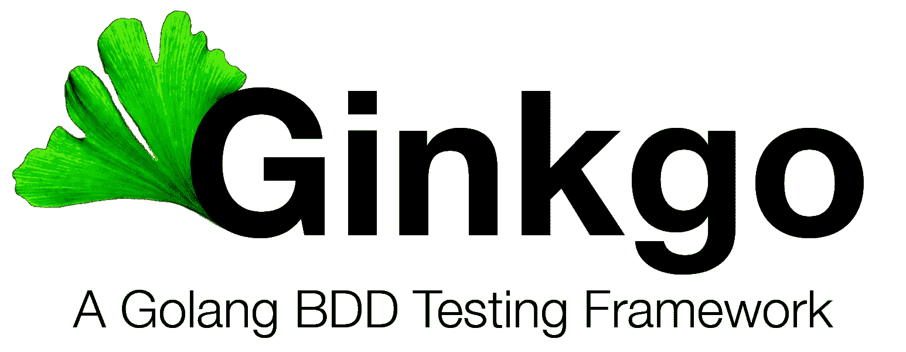
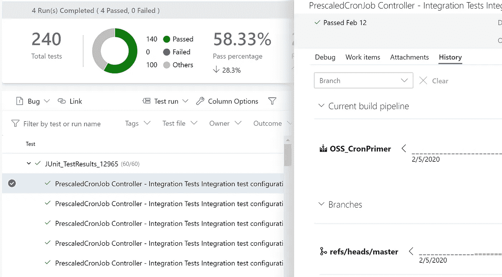

# 用 Ginkgo、Gomega 和操作符运行时测试 Kubernetes 操作符

> 原文：<https://itnext.io/testing-kubernetes-operators-with-ginkgo-gomega-and-the-operator-runtime-6ad4c2492379?source=collection_archive---------1----------------------->



我最近写了我们将 [Kubenetes 运营商投入生产](/taking-a-kubernetes-operator-to-production-bc59708db420)的经历——当然，其中很大一部分是测试。这篇文章将更深入地探讨这个测试故事。

> 我将从头到尾引用我们预先指定的 CronJob 操作符——在这里找到:[https://github.com/microsoft/k8s-cronjob-prescaler](https://github.com/microsoft/k8s-cronjob-prescaler)。

# 入门指南

有一些非常好的文章和银杏文档可以帮助你启动和运行。我建议你先阅读以下两个指南。

*   [https://medium . com/boldly-going/unit-testing-in-go-with-ginkgo-part-1-ce 6 ff 06 EB 17 f](https://medium.com/boldly-going/unit-testing-in-go-with-ginkgo-part-1-ce6ff06eb17f)
*   [https://onsi . github . io/ginkgo/#开始编写您的第一个测试](https://onsi.github.io/ginkgo/#getting-started-writing-your-first-test)

我们将重点用银杏测试操作员。

# 编写您的测试

因为我们的测试基本上是将对象发送给我们在 Kubernetes 中的操作者，并检查我们返回的内容是否正确，所以我们需要一个 Kubernetes 管理器&客户端。在我们的`BeforeSuite`方法中:

```
k8sManager, err = ctrl.NewManager(cfg, ctrl.Options{
  Scheme:             scheme.Scheme,
  MetricsBindAddress: metricsAddr,
})k8sManager.Start(ctrl.SetupSignalHandler())k8sClient = **k8sManager.GetClient()**
```

现在让我们创建一个资源，并在 k8s 发射它。下面的代码显示了一个 Describe / Context / It 块，我们在这里向 Kubernetes 发送*some*对象。这可能是一个 pod、一个部署或您自己的一个 CRD:

```
var _ = Describe("PrescaledCronJob Controller", func() {
  Context("Cronjob Autogeneration", func() {
    It("Should create cronjob correctly", func() {
      toCreate := generatePSCSpec()
      Expect(**k8sClient.Create**(ctx, &toCreate)).Should(Succeed())...
```

现在让我们把物体拿回来，看看它看起来像什么。为此，我们将使用来自 [Gomega](https://onsi.github.io/gomega/) matcher 库的`Eventually()`块——这是一个方便的助手函数，它将不断尝试做一些事情，直到 matcher 成功或超时:

```
**Eventually**(func() bool {
  err := k8sClient.Get(ctx, types.NamespacedName{Name:toCreate.Name, Namespace: namespace}, fetched)
  return err == nil
}, timeout, interval).Should(BeTrue())
```

现在，我们将检查它看起来应该是什么样子:

```
**Expect**(fetchedAutogenCron.Name).To(Equal(autogenName))
// ... many more Expects...
```

## 表格驱动测试

我们想用不同的参数测试许多相似的场景。这是一个使用 Ginkgo 的表驱动测试的好机会。这些与许多其他数据驱动的测试框架不同，因为传递给测试的每一行数据都会在运行时自动生成一个新的测试。

导入表扩展:

```
. "github.com/onsi/ginkgo/extensions/table"
```

创建一个`DescribeTable`块，包括每次运行的函数，以及要传递给它的数据行:

```
**DescribeTable**(“Integration test configurations”,
  func(testCase testCase) { // your test logic here...
    Expect(result).To(Equal(testCase.shouldPass))
    Expect(err != nil).To(Equal(testCase.shouldError))
},// add a line per test case here…**Entry**(“LONG TEST: 1 minute, 1 warmup”, testCase{minsApart: 1, warmUpMins: 1, shouldPass: true, shouldError: false}),**Entry**(“LONG TEST: 3 minutes, 1 warmup”, testCase{minsApart: 3, warmUpMins: 2, shouldPass: true, shouldError: false}),**Entry**(“LONG TEST: 4 minutes, 1 warmup”, testCase{minsApart: 4, warmUpMins: 2, shouldPass: true, shouldError: false}),
```

您可能注意到了，我们创建了一个基本的`testCase`结构来传递，而不是传递大量的单个参数。

# 测试环境

对于要测试的环境，您有两个主要的选择——要么使用真实的集群，要么使用本地 API 端点。如果您的操作员不与 K8s 的其他部分交互或者不依赖于 K8s 的其他部分，那么就使用内置的 API 端点。对于我们的例子，我们需要检查默认的`CronJob`操作符是否已经接收并创建了一个自动生成的`CronJob`对象，所以我们需要使用一个真正的集群。

幸运的是有了`envtest`包(“sigs . k8s . io/controller-runtime/pkg/env test”)，真的很简单:


suite_test.go 中的 testEnv

还可以在运行每个测试之前对测试环境进行定制:


CRDDirectoryPaths 允许您在测试时应用 yaml

这是配置您的测试环境并确保在您运行您的测试之前所需的资源已经存在的好方法——然而，根据我们的经验，在其他地方应用 yaml 更简单(例如 makefile ),因为我们可以决定*何时*或*如果*我们想要应用它。

## 对照实物测试

[种类](https://kind.sigs.k8s.io/)对于集成测试至关重要，因为您可以在本地运行完整的集群——甚至在构建管道中。因为`testEnv`现在正在使用一个‘真正的’集群——它只会对`kubectl`指向的任何东西发出命令。对我们来说，这很好。

在 makefile 中:

```
**deploy-kind**: kind-start kind-load-img deploy-cluster manifests install-crds kustomize-deployment
```

上面的 make 命令将启动 Kind，然后部署我们所有的定制和操作符。

为了运行测试，我们将运行:

```
**kind-tests**: ginkgo --skip="LONG TEST:" --nodes 6 --race --randomizeAllSpecs --cover --trace --progress --coverprofile ../controllers.coverprofile ./controllers-kubectl delete prescaledcronjobs --all -n psc-system
```

上面的 make 命令做了几件事:

*   跳过任何被描述为“长测试:*”的测试。这是一种选择在本地运行哪些测试的相当低 fi 的方式，相对于可能更长时间运行的集成测试。
*   并行测试 6 个围棋程序(`--nodes 6`)。这是加速整个测试执行的好方法。
*   运行覆盖率工具
*   试图删除我们在测试中获得的资源。makefile 中的`-`字符表示“如果这一行抛出一个错误，就继续执行”。

# 针对真实集群进行测试

这种方法最大的好处之一是，现在可以对一个“真正的”集群运行测试。我们的是蓝色的。你所需要做的就是设置你的`kubectx`指向你真正的集群而不是种类，部署你的定制，并再次运行测试。

```
**deploy-cluster**: manifests install-crds kustomize-deployment$> make deploy-cluster
$> make kind-tests
```

有了这种测试的重用，就很容易明白您可能希望在构建中对 Kind 运行测试，或者在发布过程中对您的真实集群运行集成测试套件。

# 输出测试结果

由于许多构建代理(我们使用 Azure Devops)不“理解”go 测试结果，有一个方便的扩展可以让 Ginkgo 以 JUnit 格式输出测试结果，这是许多构建代理能够理解的。它是测试的入口点:

```
**junitReporter** := reporters.NewJUnitReporter(fmt.Sprintf("../TEST-ginkgo-junit_%d.xml", config.GinkgoConfig.ParallelNode))RunSpecsWithDefaultAndCustomReporters(t, "Controller Suite", []Reporter{envtest.NewlineReporter{}, **junitReporter**})
```

这将在测试中为每个“节点”(go 例程)创建一个 xml 文件。但是构建代理应该将它们全部挑选出来以报告结果:



ADO 中的测试结果