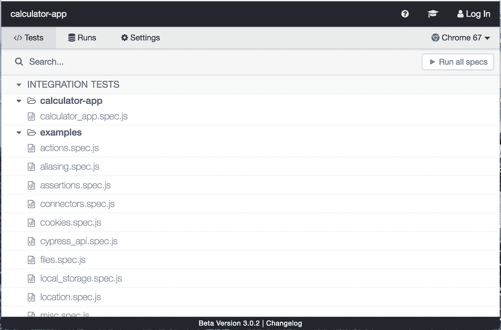
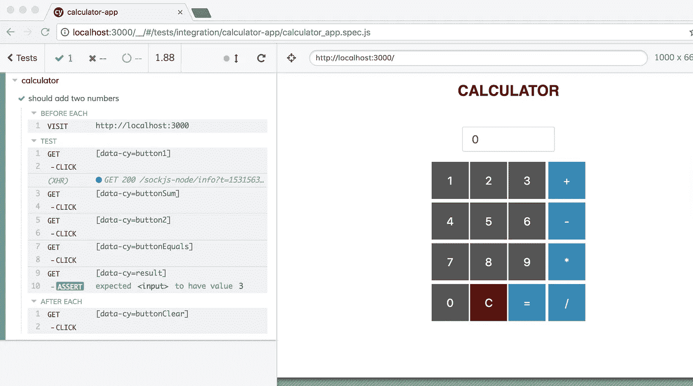

# 用 Cypress 测试 React 应用程序

> 原文：<https://itnext.io/testing-react-application-with-cypress-fce9e159fec?source=collection_archive---------1----------------------->

Cypress 是一个让你快速简单地编写和运行集成测试的工具。想了解更多关于赛普拉斯的信息，可以访问赛普拉斯的[网站](https://www.cypress.io/)或者 [github repo](https://github.com/cypress-io/cypress) 。

我将在我的简单计算器应用程序上演示一个简单的测试。您可以从这个库的[中克隆示例应用程序。](https://github.com/ahmetkapusuz/calculator-app)

首先，导航到应用程序文件夹，用下面的命令添加 cypress 作为开发依赖项。

```
yarn add --dev cypress
```

您可以看到 cypress 被添加到您的 package.json 文件中，如下所示:

```
"devDependencies": {
  "cypress": "^3.0.2"
}
```

要启动 cypress，您应该在应用程序根文件夹中运行下面的命令。

```
yarn run cypress open
```

这将打开 cypress 窗口，并将示例测试文件夹添加到您的项目中。



现在我们可以开始编写集成测试了。

在 cypress->integration 文件夹下新建一个文件夹，命名为 calculator-app。并创建一个名为 calculator_app.spec.js 的新文件，这是我们将要编写测试的文件。

如果打开 Calculator.js 文件并查看 render 函数，可以看到我为每个元素添加了一个额外的属性 data-cy。这是为了方便查找元素而添加的，不会影响对类或 dom 结构的更改。这被 Cypress 团队定义为最佳实践，你可以从本教程[中看到其他最佳实践。](https://docs.cypress.io/guides/references/best-practices.html)

让我们添加我们的第一个测试，这个计算器应该能够添加两个数字。为了测试这一点，我们将下面的代码块添加到 calculator_app.spec.js 文件中。

```
describe('calculator', **function** () {
    beforeEach(**function** () {
       cy.visit('http://localhost:3000');
    });

    it('should add two numbers', **function** () {
        cy.get('[data-cy=button1]').click();
        cy.get('[data-cy=buttonSum]').click();
        cy.get('[data-cy=button2]').click();
        cy.get('[data-cy=buttonEquals]').click();
        cy.get('[data-cy=result]').should('have.value', '3')
    });

    afterEach(**function** () {
        cy.get('[data-cy=buttonClear]').click();
    });
});
```

这段代码只是访问我们的应用程序运行的 http://localhost:3000 页面，然后单击一些按钮，然后检查结果值是否正确。并且在每次测试后点击清除按钮来清除输入字段上的最后一个值。

要运行这个测试，首先您应该启动应用程序。因此，导航到应用程序文件夹并运行下面的命令:

```
yarn start
```

然后，导航到应用程序文件夹并运行下面的命令来开始您的测试；

```
yarn run cypress open
```

这将打开 cypress 窗口，然后您可以单击 calculator_app.spec.js 来运行您的测试。您应该会看到下面类似的窗口，显示您的测试已经成功运行并完成。



类似地，您可以为其他操作编写测试。

您可以用来自这个[库](https://github.com/ahmetkapusuz/calculator-app-cypress)的测试来克隆整个应用程序。