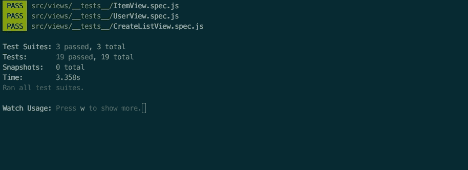

# 测试真实世界 VueJs 应用

> 原文：<https://itnext.io/testing-real-world-vuejs-apps-d3e44118f8ce?source=collection_archive---------0----------------------->

演示如何对 vue-hacken news-2.0 进行单元测试(使用 Jest 和 vue-test-utils)

如今，像 [React](https://reactjs.org/) 或 [VueJs](https://vuejs.org/) 这样的现代库和像 [Jest](https://jestjs.io/) 或 [Cypress.io](https://www.cypress.io/) 这样的测试工具允许我们以几年前不可能的方式测试我们的网络应用。然而，我们通常在网上找到的例子都太简单了，对于没有强大测试背景的前端开发人员来说，测试一个相对复杂的应用**可能具有挑战性。**

在这篇[令人难以置信的帖子](https://medium.com/js-dojo/end-to-end-testing-a-vuejs-hackernews-clone-23b9415fd5c5)中，[Gleb Bahmutov](https://medium.com/u/38e920770219?source=post_page-----d3e44118f8ce--------------------------------)(Cypress 的开发人员之一)展示了用端到端测试覆盖一个最流行的 VueJS 示例( [VueJs HackerNews 克隆](https://github.com/vuejs/vue-hackernews-2.0))是多么容易，他提出了这个问题:

> 对这个应用进行单元测试的整个过程会充满痛苦和不幸吗？

我❤️了 Cypress.io，并在我的项目中使用它来覆盖我的**关键快乐路径**和**端到端测试**，然而，我相信**单元测试**对于 Real World 前端应用程序也是必不可少的，因为它们帮助我们更好地理解和设计我们的应用程序，具有更快的**反馈循环**。



快速反馈循环对于无所畏惧地编码和重构至关重要

我想展示单元测试一个不平凡的 VueJs 应用程序并不是一件容易的事情，但是它给我们带来了很多好处，也很有趣😉

# TL；速度三角形定位法(dead reckoning)

在这篇文章中，你将看到如何单元测试由[尤雨溪](https://medium.com/u/4f198f5f1f12?source=post_page-----d3e44118f8ce--------------------------------)制作的 Vue.js [HackerNews](https://github.com/vuejs/vue-hackernews-2.0) 克隆，它使用 vue-router & vuex、 [nuxt](https://nuxtjs.org/) 服务器端渲染和 firebase 后端。

这些是我们将在本帖中涉及的主要话题:

*   测试页面组件
*   使用假数据存根后端 API
*   存根 Vue 路由器
*   测试与 Vuex 动作的交互
*   模拟 nuxt asyncData 挂钩

你可以在这里找到测试[的分叉回购。](https://github.com/agualis/vue-hackernews-2.0)

# 了解组件的输入和输出

如果我们把一个组件想象成一个有一些输入和一些输出的黑盒函数，我们可以**试着从外部测试它而不访问它的内部**，但是，哪一个是组件的*输入*？

*   道具:我们可以传递参数作为道具
*   **路线**:我们可以传递路线参数
*   **DOM** :我们可以通过点击链接、填充输入或滚动页面来与 UI 交互
*   **VUEX 存储**:作为单点真值，组件可以访问该存储以获得它的一些*输入*

哪个是组件的*输出*？

*   **DOM:** 组件可以重新呈现它的 UI，产生新的输出。
*   **VUEX 存储**:组件可以调度带有突变的动作，这些动作将修改存储的状态(可见*输出*)。
*   **Route** :组件可以与路由器交互，生成一条新的路由，由新的页面组件呈现。

理想情况下，我总是试图通过修改先前的*输入*并断言*输出的变化来测试我的组件。这样，我们的测试将更加独立于它的实现，因此，不那么脆弱。然而，在这篇文章中我们会看到，为了测试某些特性，我们无法避免访问被测组件的实现。*

# 设置

我假设你已经知道如何安装和设置 [jest](https://jestjs.io/docs/en/configuration.html) 和 [vue-test-utils](https://vue-test-utils.vuejs.org/) 。

我把这一行加到了 [package.json](https://github.com/agualis/vue-hackernews-2.0/blob/master/package.json) :

```
"test": "jest -c **jest.config.js**"
```

，这样我就可以用 **npm test** 运行测试(你可以在 [jest.config.js](https://github.com/agualis/vue-hackernews-2.0/blob/master/jest.config.js) 中检查 jest 设置)。

# 制造假数据

HackerNews 克隆定义了[一个 API](https://github.com/vuejs/vue-hackernews-2.0/blob/master/src/api/index.js) ，它从 firebase 数据库获取数据，但是**我们不打算在组件的单元测试中测试这个 API 的内部。** **取而代之，我们要存根那个 API** 。

## 我们如何得到存根的假数据？

我只是执行了应用程序并保存了真实的响应，将它们存储为一个 [JSON 文件](https://github.com/agualis/vue-hackernews-2.0/blob/master/test/fake-news.json)。这样我就可以创建这个[假数据文件](https://github.com/agualis/vue-hackernews-2.0/blob/master/test/fake-data.js)，导出我们将在测试中使用的常量，比如:

*   60 条黑客新闻列表
*   所有新闻的身份列表
*   赝品
*   假冒用户

# 清除后端 API

一旦我们有了合适的假数据，我们需要知道如何在测试中创建和使用 API **存根来替换真实的实现**。

真正的 [api](https://github.com/vuejs/vue-hackernews-2.0/blob/master/src/api/index.js) 使用 firebase 客户端/服务器和底层缓存，但我们对组件单元测试范围内的那些细节不感兴趣。我们需要做的就是理解 api 的公共契约，然后**创建一个假的 API 来履行契约**。

例如，真正的 api 有一个 *fetchItem* 函数，它接收一个 id 并查询数据库/缓存，**返回一个带有项目的承诺。**我们可以简单地用我们的假实现替换那个复杂的函数，该实现返回一个带有假用户的承诺:

```
export function **fetchItem** (id) {
  return Promise.resolve(fakeItemList[id])
}
```

## 在我们的测试中注入假的 api

一旦我们[伪造了每一个 API 方法，](https://github.com/agualis/vue-hackernews-2.0/blob/master/src/api/__mocks__/fake-api.js)我们需要决定如何在测试中用伪造的方法替换真实的实现。

我们可以尝试改变现有应用的设计，以便能够显式地注入依赖关系，但我们希望保留原始的生产代码，因此我们需要使用一些*黑魔法*来替换我们测试中的整个 API 模块。

一个常见的方法是使用 [Jest manual mock](https://jestjs.io/docs/en/manual-mocks) s，但是为了简化解释，我将例外地使用一个*更肮脏的伎俩*😅：

```
//jest.config.js..."moduleNameMapper": {
  "^@/(.*)$": "<rootDir>/src/$1",
 **'../api': '<rootDir>/src/api/__mocks__/fake-api.js'** },...
```

在前面的设置中，每个单元测试都将使用 [**fake-api.js**](https://github.com/agualis/vue-hackernews-2.0/blob/master/src/api/__mocks__/fake-api.js) 作为默认 api，而不是使用生产🧙‍✨

# 我从哪里开始测试我的应用程序？

作为一名 TDD 实践者，我更喜欢在实现之前编写我的测试，但是在这种情况下，我们想要测试一个[现有的“遗留代码”](https://github.com/vuejs/vue-hackernews-2.0)，所以第一步是理解它的主要部分。Vue HackerNews clone 有 3 个主页:

*   **ListView** :有 5 个列表路径(top、new、show、ask、job)具有完全相同的结构
*   **项目视图**:点击列表中的一个项目，打开该页面
*   当你点击一个作者链接时，这个页面被打开

前面的每一个页面都是一个**根组件，当我们访问它的路径**时，它会呈现页面。我称它们为**页面组件**，但是你也可以称它们为根、容器或视图组件。


显示头条新闻的 ListView 页面组件示例

我总是喜欢从上层(*页面组件*)测试我的应用程序的行为，并且我总是尽量避免嘲笑子组件。好处是:

*   您的测试的意图将更容易理解
*   当内部结构/实现改变时，你不需要改变你的测试，但是你的行为没有改变
*   它将引导你更好地理解你的内在组件之间的关系以及它们与外部世界的相互作用

让我们测试我们的第一个页面组件来理解我的意思。

# 我们的第一个测试

我们将从一个非常简单的页面组件开始，[**user view . vue**](https://github.com/vuejs/vue-hackernews-2.0/blob/master/src/views/UserView.vue)**，**就是通过这个途径打开的:

```
{ path: '/user/**:id**', component: **UserView** }
```

该组件通过路由器参数接收用户的:id，并使用从 Vuex 存储中获取用户的计算属性对其进行呈现:

```
computed: {
  **user** () {
    return this.$store.state.**users**[this.$route.params.**id**]
  }
},
```

这是一个呈现用户视图的示例:


呈现的 UserView.vue 页面示例

## 识别用户视图组件的输入和输出

正如我们所见，识别输入和输出对于理解我们想要测试的组件的“契约”是非常重要的。

UserView.vue 组件的输入？

*   **道具**:该组件没有道具
*   **路由**:我们将**用户 id** 作为路由参数传递
*   DOM : UserView 是一个简单的组件，我们不会在测试中与 DOM 交互。
*   **VUEX store** :组件需要一个来自***store . state . users****的用户。*

UserView.vue 组件的输出？

*   **DOM:** 显然，我们的组件会渲染它的 UI。
*   **VUEX store** :组件加载时调度 FETCH_USER 动作。
*   **路线**:我们的组件不生成新路线。

## 设置 Vuex 商店:

我们需要一个干净的 Vuex 商店实例来测试我们的组件。我们可以用一个新的 Vuex 对象创建[一个 localVue 实例](https://vue-test-utils.vuejs.org/api/options.html#localvue)，但是我们的项目已经使用了 [createStore()](https://github.com/vuejs/vue-hackernews-2.0/blob/master/src/store/index.js) 函数来初始化存储，我们将简单地从每个测试中调用它来拥有一个新的干净的存储。

## 嘲讽路线:

我们的 *UserView.vue* 组件需要一个带有 *:id* 参数的路由。这就是为什么我们创建了一个构建器函数来从一个 id 创建一个假路径:

```
const **userRoute** = (id) => ({
 path: '/user',
 params: { id }
})
```

我们将使用 [vue-test-utils mock](https://vue-test-utils.vuejs.org/guides/using-with-vue-router.html) s 将该路径传递给被测组件:

```
// route will contain a route created with **userRoute()** builder
constwrapper = mount(UserView, { store, router,
  mocks: {
    **$route: route**
  }
})
```

## 我们的第一个断言

我们终于拥有了编写第一个用户视图测试所需的一切:

在这里，我们**测试了我们的组件呈现包含 h1 标题的** HTML，标题中有我们的假用户✅的 id

## 测试 Nuxt 异步负载

在我们之前的测试中，我们用一个假用户初始化了我们的 *store.state.users* ，但是在现实世界中，这个用户将通过执行异步请求从 API 中获取，因此，如果我们希望它尽可能真实，我们需要改进我们的测试。

该项目使用 [Nuxt](https://nuxtjs.org/guide/) 进行服务器端渲染，并使用一种特殊的钩子方法，称为[**【async data()**](https://nuxtjs.org/api/)**:**

```
**asyncData** ({ store, route: { params: { id }}}) {
  returnstore.dispatch('FETCH_USER', { id })
},
```

我们如何测试它？

理想情况下，**我们总是试图避免访问组件的内部，以避免将我们的测试耦合到实现上**，但是，在这种情况下，这是我们唯一的选择，所以我们将使用 [vm 属性](https://vue-test-utils.vuejs.org/api/wrapper/#properties)来调用我们的 asyncData 方法，并执行我们的测试的改进版本💪

我们还需要等待 Vue 异步重新呈现 DOM，因此我们将使用一个**resolve promes**函数来帮助我们。如果你对细节感兴趣，可以看看这篇[精彩的文章](https://kentor.me/posts/testing-promise-all-side-effects-with-async-await/)。

```
wrapper.vm.$options.**asyncData**({ store, route })
awaitresolvePromises()
```

最后，我们有了新的异步测试🚀：

## 测试过滤器

既然我们已经编写了第一个测试，我们还需要更多。例如，检查组件是否呈现自用户创建以来的天数、小时数或分钟数。该应用程序使用一个*时间前* [Vue 过滤器](https://vuejs.org/v2/guide/filters.html)来实现:

```
{{ user.created | **timeAgo** }} ago
```

所有的 Vue 过滤器都在 [app.js](https://github.com/vuejs/vue-hackernews-2.0/blob/master/src/app.js) 中注册，代码如下:

```
Object.keys(filters).forEach(key => {
  **Vue.filter**(key, filters[key])
})
```

我们如何测试这些全局注册的过滤器？

我们在测试中没有调用 app.js，但是， **jest 允许我们创建一个设置文件**(查看我们的 [jest-setup.js](https://github.com/agualis/vue-hackernews-2.0/blob/master/src/jest-setup.js) )，在这里我们可以初始化全局的东西，比如过滤器，这样我们就能够在我们的测试范围内使用它们。

我们的过滤器测试将如下所示:

其中，知道我们的假用户是在 9 月 7 日创建的，我们将使用 **Jest 来删除 Date.now 并使测试独立于实时**:

```
Date.now = **jest.fn**(() => nineOfSeptember)
```

## 测试调度的操作

我们将 Vuex 动作确定为组件的可能输出(或副作用)之一，有时我们会隐式测试它们。

例如，当我们在用户视图测试中调用 **asyncData** hook 时，我们在那里执行这段代码:

```
asyncData ({ store, route: { params: { id }}}) {
  return **store.dispatch**('FETCH_USER', { id })
},
```

因此，我们正在隐式测试 FETCH_USER 操作是否被正确调度。

我们还需要显式地测试它吗？这要视情况而定，但是随着我们的应用程序的增长，我们将倾向于依赖于更多外部服务的更复杂的操作，接收更难理解的更复杂的有效负载，所以**我发现一个好主意来测试我们的组件与 Vuex store 的交互**，或者甚至在我们的组件的单元测试范围内取消 dispatch 方法，并在另一种集成测试中测试操作的实现。

下面是一个例子，说明检查我们的 *UserView.vue* 分派一个动作(**使用 jest.spyOn 来验证交互**)是多么容易:

# 测试更多组件

按照前面的提示，我们准备测试页面组件的其余部分。例如，这里有对 ItemView.vue 组件的测试:

或者我们甚至可以测试更复杂的东西。例如，当某个项目被实时添加到列表中时会发生什么:

这里是回购协议，你可以在这里查看演示测试的所有细节。

# 未来的步骤

我们已经在[测试金字塔](https://martinfowler.com/articles/practical-test-pyramid.html)中看到了一些最重要的测试示例，但我不会在此结束。

## 内部组件

正如我们看到的，我喜欢从上层测试我的应用程序，我试图覆盖最相关的情况，我需要检查我的功能。但是我并不试图从外部覆盖所有可能的情况，因此，测试内部组件也很重要，因为您可以很容易地测试所有的边缘情况。例如，getters、filters 或 presentational 组件很容易用真正简单的隔离测试来测试。

## 复杂的 DOM 交互

随着我们真正的应用程序的增长，我们会发现更多的挑战，我们需要改进我们目前的测试。例如，HackerNews 应用程序是一个只读应用程序，用户不能在其中创建内容，但在更大的应用程序中，通常会有复杂的表单，用户可以与 DOM 交互，以许多复杂的方式生成状态更改和副作用。在那种情况下，**我总是使用** [**页面对象模式**](https://martinfowler.com/bliki/PageObject.html) **来减少我们的单元测试与 html/css 实现的耦合。**

## 测试后端 API 的实现

在这篇文章中，我们看到了如何模拟后端 API，忘记了它在组件的单元测试中的实现，但是，我也会对该实现进行单元测试(主要是缓存)，例如，通过使用 firebase 存根(我们可以手动存根，或者使用类似于 [firebase-mock](https://github.com/soumak77/firebase-mock) 的工具)。

我还会添加一些[契约测试](https://martinfowler.com/bliki/ContractTest.html)来测试与真实 firebase 实例的集成是否有效。

# 结论

对真正的 VueJs 应用进行单元测试可能具有挑战性，因为我们需要了解良好的设计和测试实践，我们需要控制我们的工具(jest、vue-test-utils……)，我们还需要发挥创造力来克服某些障碍。

拥有像 Cypress 这样的工具来进行端到端测试是一件幸事，但我认为我们永远不能忘记单元测试，因为它们对于改进我们的应用程序设计、我们的库/框架知识以及编码的乐趣是必不可少的。单元测试万岁！

我目前在[sender](https://www.sennder.com/)工作，我们正在寻找一名有才华的 VueJs 开发人员！(远程可能！)如果你有兴趣，就发邮件到 konstantin.schubert@sennder.com 的 [或者查看我们的职位描述](mailto:konstantin.Schubert@sennder.com)[。](https://sennder.heavenhr.com/jobs/_IhTF1F63_D5JV7aBlW4XZg_/apply?language=en)