# 让我们将 Symfony 项目迁移到 Kubernetes！第 3 部分:测试应用程序。

> 原文：<https://itnext.io/testing-symfony-application-d02317d4018a?source=collection_archive---------1----------------------->

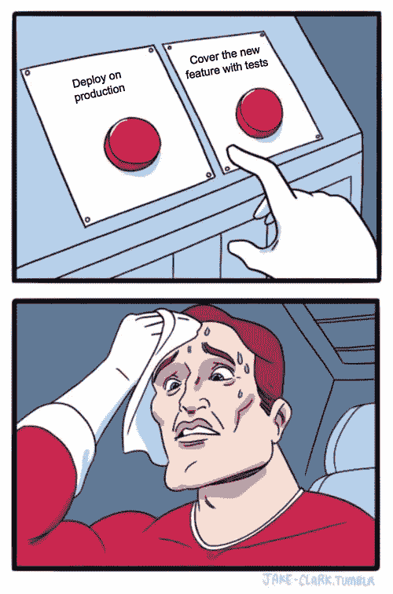

# 关于这个系列

在这个系列中，我们将讨论现有 Symfony 项目到 Kubernetes (K8s)的迁移。无论您当前在何处以及如何发布您的应用程序:裸机、VM 或容器编排平台，通过遵循本指南，您将能够将其部署到 K8s 集群。
这些* how to *文章的目标读者是那些已经了解 Kubernetes、Docker 和持续集成(CI)的一些基础知识、想要学习新技巧或只想完成工作的人。
本系列的每一部分都致力于一个特定的主题:[构建 Docker 环境](/containerizing-symfony-application-a2a5a3bd5edc)，在不同级别测试应用程序，[用 Helm 将应用程序部署到 Kubernetes】，](/publishing-symfony-application-with-helm-ecb525b34289)[构建 CI 管道](https://medium.com/@babenko.i.a/building-continuous-delivery-pipeline-2cc05e213935)。

# 关于第 3 部分

测试是持续集成的关键部分。没有测试，我们就不能确定，我们向客户交付了一个稳定且正常工作的产品。

今天，我们有许多不同的工具、框架和方法，它们都服务于同一个目标——制造高质量的产品。在本文中，我们将采用其中的一些来测试我们的虚拟应用程序。我们将使用 PHPUnit 框架进行单元和集成测试，使用 Postman / Newman 进行端到端测试。

# 关于虚拟项目

我为这个系列准备了一个简单的 Symfony 4 应用程序。它需要 PHP-FPM，Nginx 和 MySQL 来运行。更多详情，请参考[第 1 部分](/containerizing-symfony-application-a2a5a3bd5edc)。

# 关于使用案例

为了使我们的应用程序更具交互性，我在**产品**控制器中添加了一个新方法:

我将省略表单类定义和模板代码，而是强调测试中必须考虑的关键点:

*   产品名称的长度必须为 4-255 个字符。
*   产品价格必须高于 0。
*   产品创建表单看起来像:

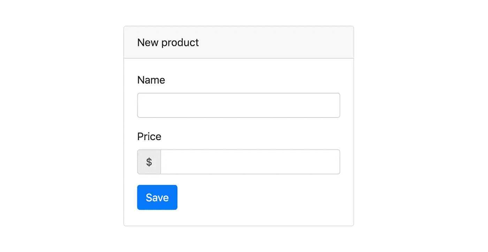

我们将在测试中关注这个特定的动作，以展示不同层次上可能的测试场景:单元、集成、端到端。

# 支持

在我们开始用测试覆盖应用程序之前，我想给你一个支持特征的概述，这可能在单元和集成测试中有所帮助。

## 内核性状

**内核**特征在每个测试用例类之前启动 Symfony 内核，之后关闭它:

你可能想知道为什么不从框架提供的 **KernelTestCase** 中扩展一个测试用例？问题在于被 Symfony 滥用的 **bootKernel** 方法。例如，每次有人在 **WebTestCase** 中创建一个客户端，内核就会重新启动，这将导致所有依赖关系、连接等的重新初始化。这使得不可能使用数据库事务，而我们在**数据库**特征中需要数据库事务。

## 数据库特征

**数据库**特征在每次测试之前启动一个新的事务，并在测试完成时回滚它:

将每个测试封装在一个事务中可以防止数据库被不需要的数据污染。

## HTTP 客户端特征

**HttpClient** 特征简化了客户端的创建:

## 路由器特征

**路由器**特性简化了 URL 生成:

## CSRF 令牌管理器特征

当您需要创建跨站点请求伪造令牌时, **CsrfTokenManager** 特征非常方便，当这种类型的安全性被启用时，它在您的 Symfony 项目中的每种形式中都被使用:

# 试验

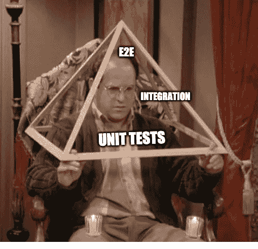

## 单位

> 单元测试是应用程序中最小的可测试部分，比如函数、类、过程、接口。单元测试是一种测试单个源代码单元以确定它们是否适合使用的方法。

负责产品添加功能的虚拟应用程序的最小可测试部分是什么？是 **ProductController::add** 方法！即使我们没有发出真正的 HTTP 请求，也没有数据库连接，我们仍然可以检查方法是否有预期的行为。

为了确保产品保存在数据库中，我们只需要测试是否调用了 **EntityManager::persist** 方法。当我们在请求中提供有效的表单值时，我们期望调用 **persist** 方法，否则它不能被触发:

在上面的测试用例中，我们定义了两个数据集:一个包含有效表单值的列表，另一个包含无效值。然后我们描述了每个可能输入的 **EntityManager** 模拟行为，以验证我们在每种情况下都正确地处理了产品。

一般来说，将单元测试从集成测试中分离出来是一个好主意。这就是为什么我们在**单元**名称空间中创建测试，并在 **phpunit.xml.dist** 中声明专用测试套件:

这个设置允许我们独立运行单元和集成测试。让我们利用 PHP-FPM 图像(我们在本系列的第一部分中创建的)来开始测试:

执行上面的命令后，您应该在终端中看到以下输出:

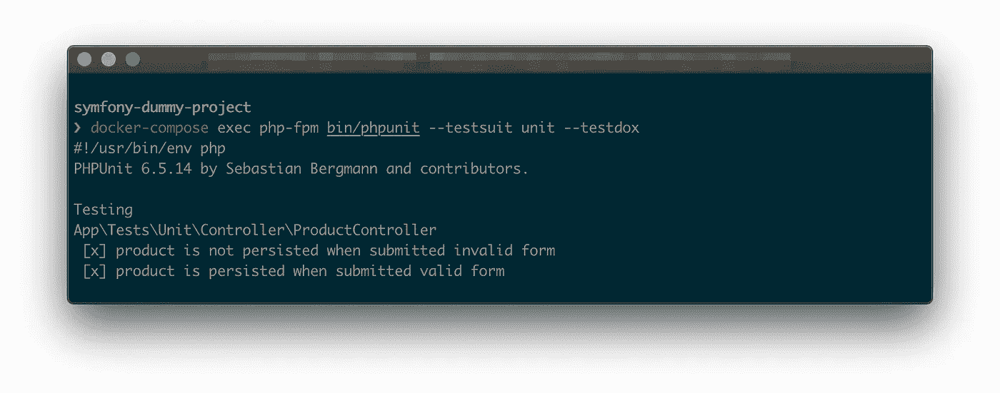

## 综合

> 集成测试确定独立开发的软件单元在相互连接时是否正常工作。

在上一节中，我们成功测试了 **ProductController::add** 方法。我们知道，如果提交有效的数据，该产品将被保存。但是我们确定数据库配置正确并且**产品**实体注释匹配相应的表定义吗？

为了避免生产环境中令人不快的意外，我们可以测试数据库集成。如果我们向**/产品/添加**端点发送一个有效负载，一个新产品应该会出现在**产品**表中。让我们在 **tests/Integration** 文件夹中创建一个新的测试用例，以涵盖上述场景:

我们利用 **HttpClient** 特性来模拟一个真实的 HTTP 查询，然后我们从数据库中获取一个与 POST 请求中相同名称的产品，并检查它是否具有给定的价格。最后，我们确保控制器会将我们重定向到新创建的产品页面。

运行集成测试类似于运行单元测试:

输出也非常相似:

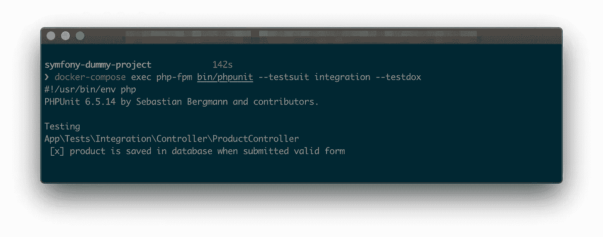

## 首尾相连

> 端到端测试是一种用于测试应用程序的流程是否从头到尾都按照设计执行的方法。

在上一节中，我们模拟了一个 HTTP 查询，但是如果我们想要进行一个真正的查询呢？如果我们想检查用户是否真的能看到表单错误，并在请求成功后被浏览器重定向到新的产品页面，该怎么办？

在 Postman 和他的 CLI 兄弟 Newman 的帮助下，我们可以很容易地实现端到端的测试，这将涵盖所讨论的案例。让我们打开 Postman，用**产品/添加**文件夹创建一个新的 **Symfony 虚拟项目**集合，并设置环境:

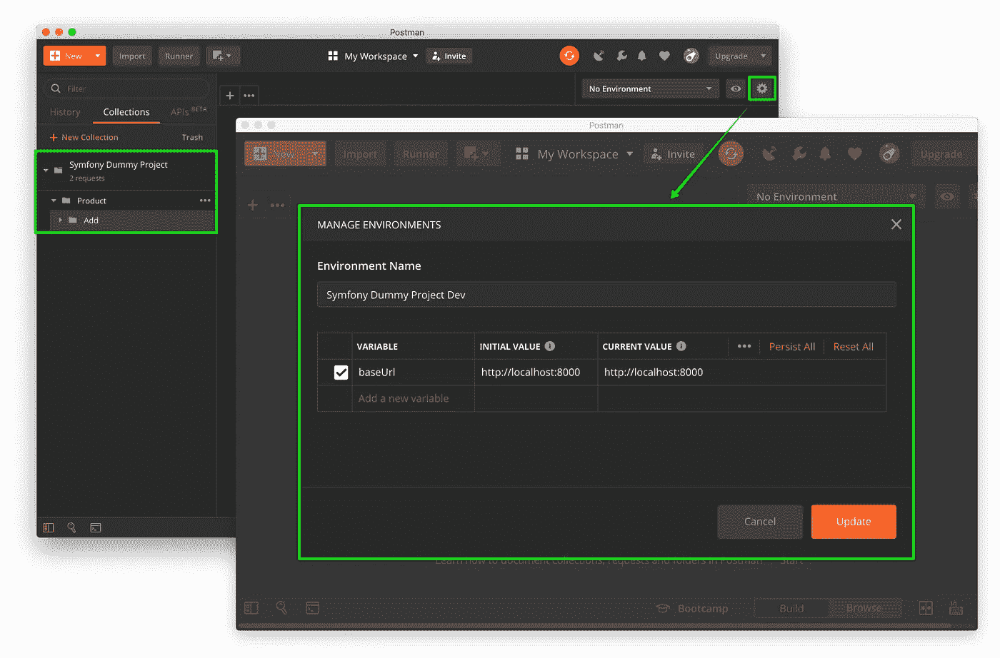

当我们在项目中使用 CSRF 保护时，我们需要在请求体中提供正确的令牌。为了识别令牌，我们可以在 **Add** 文件夹 **:** 的**预请求脚本**选项卡中添加一个 GET 查询

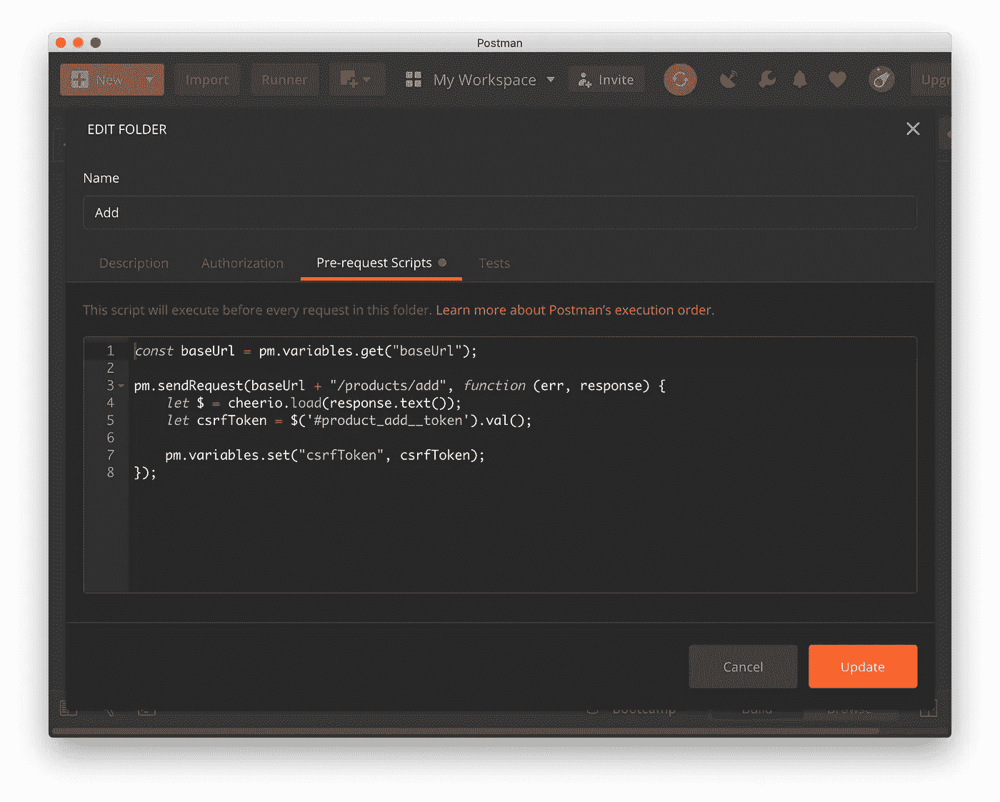

我们使用 [Cheerio](https://github.com/cheeriojs/cheerio) 遍历接收到的 HTML，找到令牌并将其保存在一个变量中以备后用。

是时候添加我们的第一个带有无效表单数据的请求了:

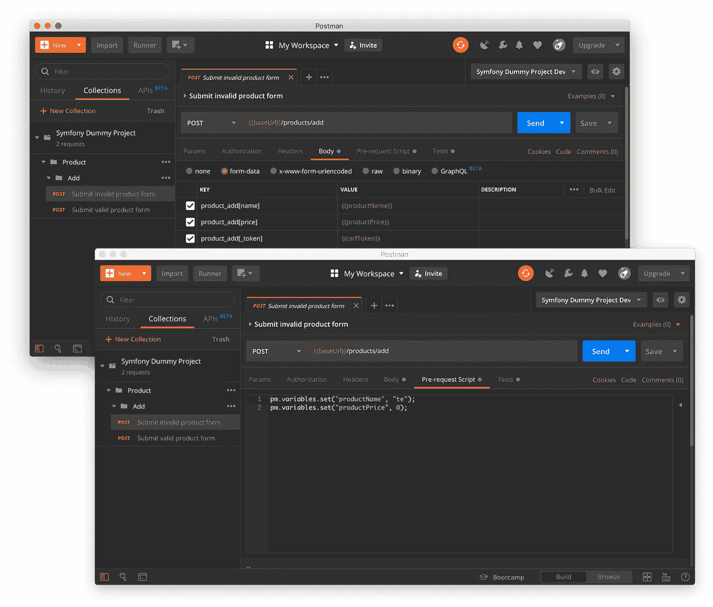

为了测试我们实际显示的错误，我们可以在**测试**选项卡中添加一些基本检查:

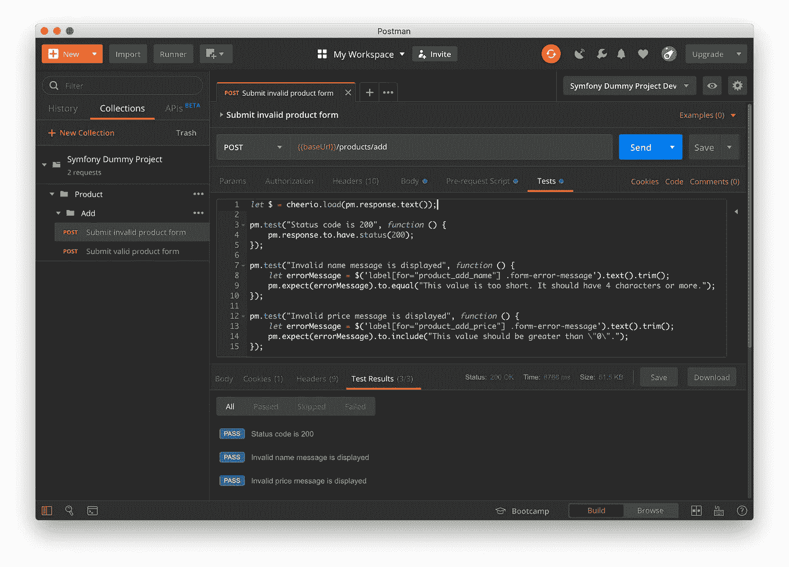

现在让我们用正确的数据添加另一个请求:

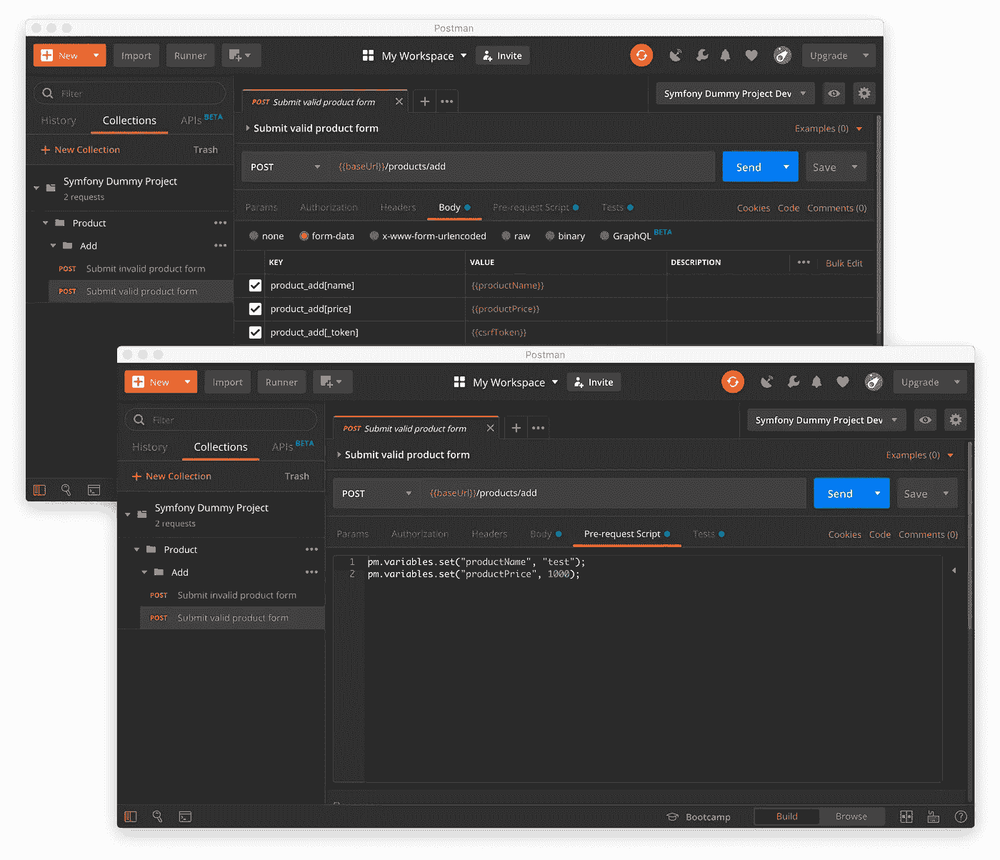

在这种情况下，我们必须重定向到新产品页面。我们可以测试所提供的名称和价格是否显示在页面上:

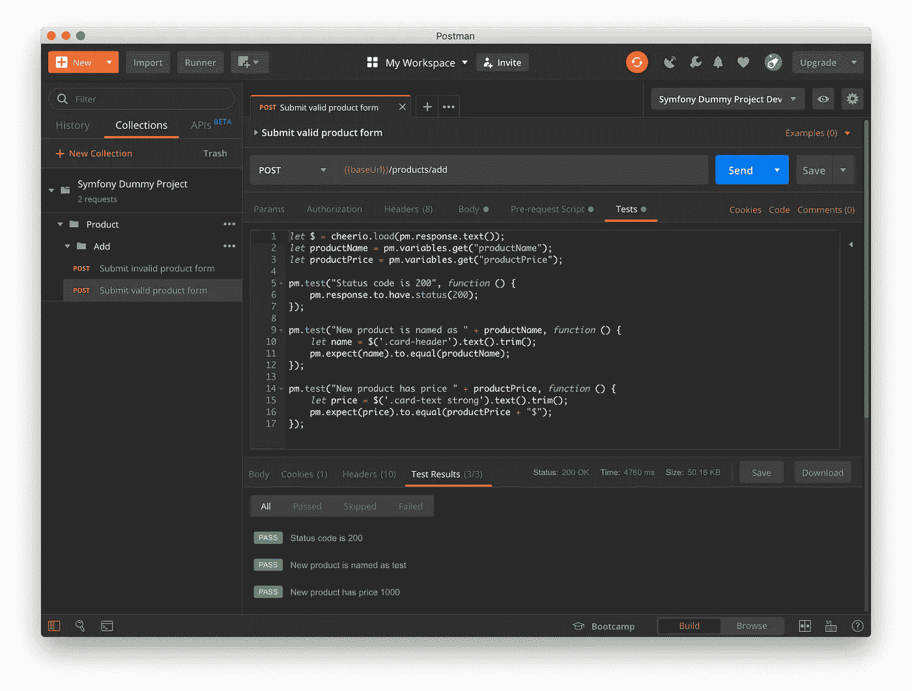

为了触发测试，我们可以通过按下**发送**按钮一个接一个地发送请求，或者使用邮递员**信使**。另一种选择是使用名为 Newman 的 CLI 工具。这是测试集合的首选方式，因为它可以很容易地集成到 CI 管道中。

在开始测试之前，让我们将集合和环境导出到项目中的 **tests/EndToEnd** 文件夹:

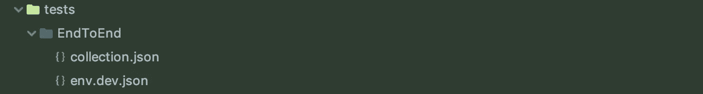

我们已经准备好使用 Newman docker 图像运行查询:

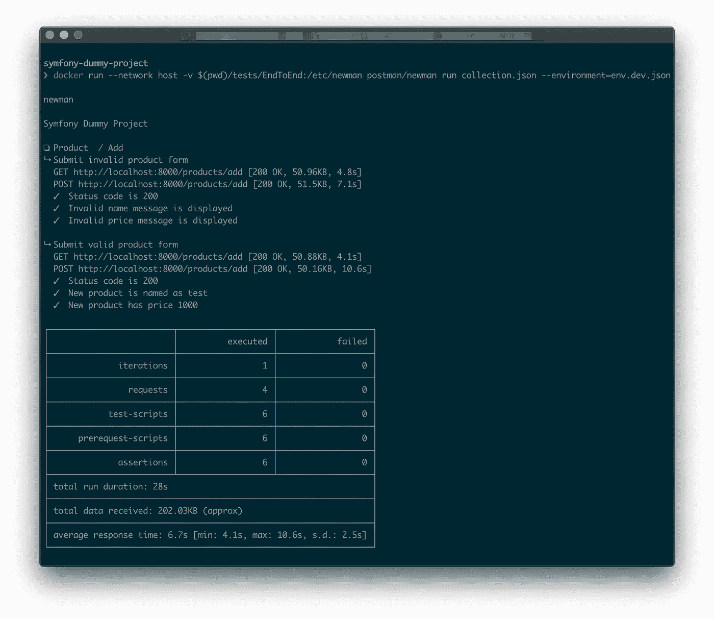

# 最后的想法

即使你的项目被任何可能的测试类型很好的覆盖，尽可能的与 QA 工程师合作。他们可能会帮助你想出一些你从未想过的场景，并确保你现有的测试用例中没有任何缺陷。

# 下一步是什么？

在之前的文章中，我们学习了如何使用 Helm 将应用[容器化](/containerizing-symfony-application-a2a5a3bd5edc)并[部署到 Kubernetes 集群。今天我们讨论了软件测试主题。](/publishing-symfony-application-with-helm-ecb525b34289)

是时候应用我们的经验了，在本系列的最后一部分通过构建 CI 渠道来自动化所有阶段。

感谢您的阅读，下次再见！