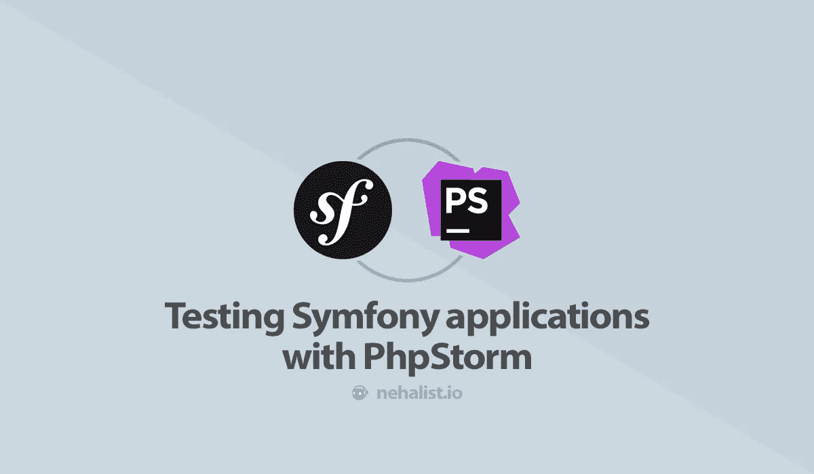
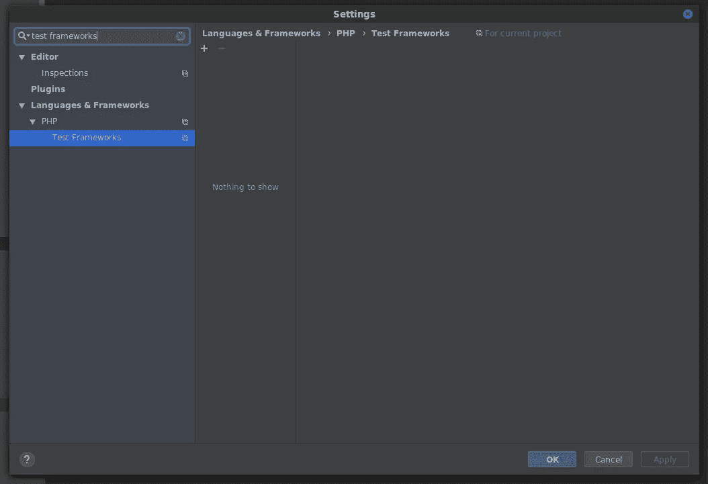
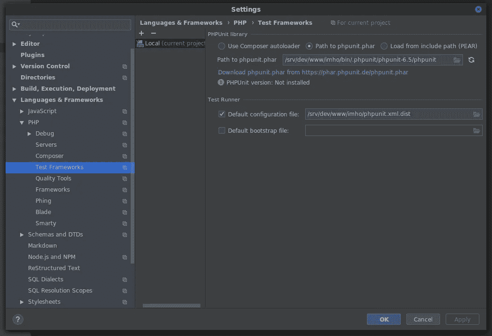
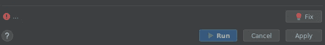
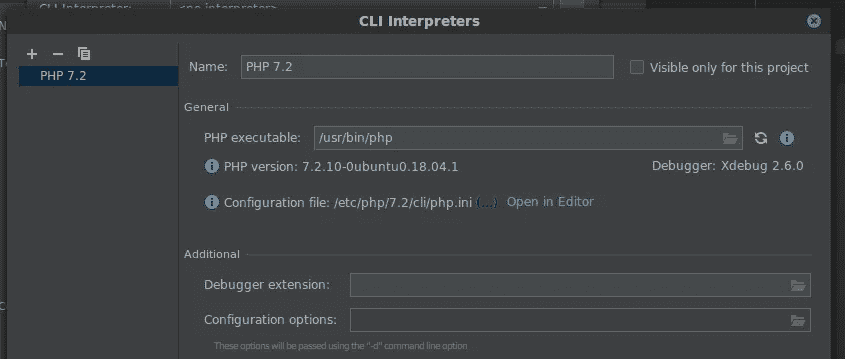
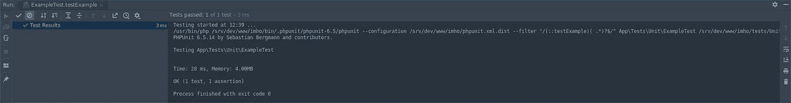
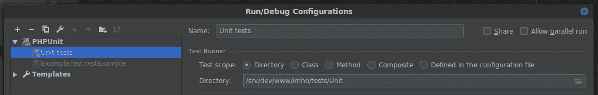
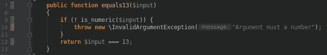
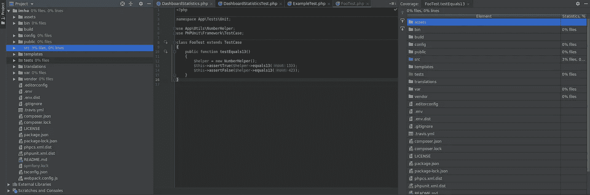

# 用 PhpStorm 测试 Symfony 应用程序

> 原文：<https://itnext.io/testing-symfony-applications-with-phpstorm-7dccd30dfbba?source=collection_archive---------6----------------------->



我一直是一个重度 IDE 用户——但是对于一些事情，比如运行测试，我仍然更喜欢终端。最近，我尝试了测试的内部可能性，并对它们相当满意。由于 Symfony 附带了一种定制的测试体验，下面介绍如何设置您的 IDE 来测试您的 Symfony 应用程序——以及在您的 IDE 中测试的其他特性。

# IDE 配置

遵循当前的[测试](https://symfony.com/doc/current/testing.html)文档后，必须在您的终端上手动运行`./bin/phpunit`一次。Symfony 将在你的`bin`目录中安装它自己的 [PHPUnit](https://phpunit.de/) 实例，它将为我们的 ide 提供可执行的`phpunit`文件。

运行这个命令后，您会在您的`bin`目录中看到一个`.phpunit`目录。

为了能够通过您的 IDE 运行您的测试，打开您的设置窗口并导航到`Languages & Frameworks > PHP > Test Frameworks`。



点击右侧的`+`图标，选择`PHPUnit Local`。指定`Path to phpunit.phar`并在`.phpunit`目录中选择`phpunit`文件。此外，将您的`Default configuration file`设置为 Symfony 目录中的`phpunit.xml`。



**注意:**如果您使用定制的配置文件，请记住将您的配置文件更改为`phpunit.xml`而不是`phpunit.xml.dist`。

打开一个测试，点击`Run test`图标并选择`Run '<your test name>'`。将弹出一个窗口，您可以在其中编辑您的配置(我们稍后将讨论这个主题)；而且，如果您还没有为您的项目设置解释器，您会看到一个感叹号，带有一条非常奇怪的消息:



点击`Fix`按钮将打开一个窗口，您可以在其中设置 CLI 解释器。如果你的下拉列表中没有解释器，点击下拉列表旁边的图标，添加你的 PHP 解释器路径。这看起来应该有点像这样:



**注意:**建议安装类似`xdebug`的调试器。如果你用的是 Ubuntu，只需用`sudo apt install php-xdebug`安装即可。

现在选择您的解释器路径，感叹号应该会消失——这意味着您已经准备好运行您的测试了。

点击`Run`应该会在你的 IDE 中打开一个额外的视图，显示你的测试结果。



# 使用

能够在您的 IDE 中运行测试是一回事，理解和利用它是另一回事。让我们更深入地看看我们的可能性:

# 配置

您可以为每个单独的测试、整个测试类或者任何您想要的东西添加配置。例如，您可以创建一个执行所有单元测试但不执行功能测试的配置——单击 IDE 顶部配置下拉列表中的`Edit configurations`项，为指向单元测试目录的单元测试创建一个新配置。



现在选择`Unit tests`配置将运行所有的单元测试——除此之外别无其他。

# 代码覆盖率

**重要提示**:切记这需要`xdebug`扩展！

如果您努力追求更高的代码覆盖率，PhpStorm 提供了很好的工具，让您的生活更轻松。假设以下代码:

```
public function equals13($input)
{
    if (! is_numeric($input)) {  
        throw new \InvalidArgumentException("Argument must a number");  
    }  
    return $input === 13; 
}
```

对此的测试非常简单:

```
public function testEquals13()
{
    $helper = new NumberHelper();
    $this->assertTrue($helper->equals13(13));
    $this->assertFalse($helper->equals13(42));
}
```

一个伟大方法的伟大测试，然而我们遗漏了一些东西:我们遗漏了测试非数字值的路径。

如果使用`Run '<your test> with Coverage`运行测试，PhpStorm 将会生成测试的可视化表示。在你的`equals13`方法的情况下，它看起来像这样:



这使得您很容易检测到未测试的代码。此外，PhpStorm 现在将显示一个覆盖报告*和*显示你的项目结构中的代码覆盖。

如果你对自己的低覆盖率感到羞愧，并想再次隐藏这些统计数据，只需点击`Tools > Hide coverage`让它们消失。



# 自动测试

另一个有用的特性是自动测试，它本质上只是在你的代码被修改后执行你的测试(你不需要做任何事情)。要启用此功能，只需点击`Run`窗口中的`Toggle auto test`按钮。要调整代码更改和测试执行之间的延迟，您可以更改自动测试延迟的值(点击`Run`窗口中的齿轮图标)。

# 为什么没有终端？

自从我认识到测试的重要性并开始写测试，我就在终端中执行它们。在这段时间里，我发现我唯一需要*有时*改变的参数是生成一个覆盖导出(用`--coverage-clover`)并且只执行一个测试而不是所有的测试(用`--filter`)。这样做的一个很大的缺点是，我总是不得不重新加载我的覆盖率文件，以防我想在我的 IDE 中看到更新的代码覆盖率，这真的很烦人。

这两个选项在我的 IDE 中都有涉及——而且我可以做得更多，而不必存储大量的终端命令。点击“播放”图标可能不会让你看起来像一个黑客，就像输入复杂的终端命令一样——但它更容易、更快。

如果有任何关于测试的特性你认为应该添加到这篇文章中(或者你认为使用 IDE 代替终端进行测试有什么缺点),请在评论中告诉我。

*如果你喜欢这篇文章，请留下你的👏，关注我上* [*推特*](https://twitter.com/nehalist) *并订阅* [*我的快讯*](https://nehalist.io/newsletter/) *。最初发表于*[*nehalist . io*](https://nehalist.io/testing-symfony-applications-in-phpstorm/)*。*