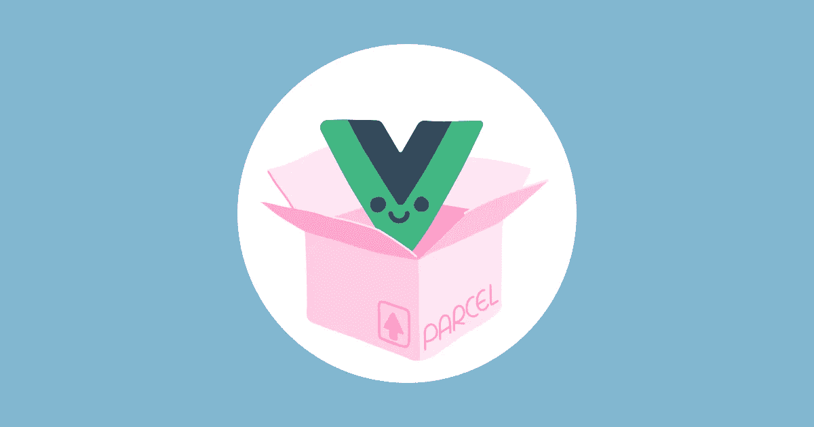

# 使用 vue 测试包裹捆扎机

> 原文：<https://itnext.io/testing-the-parcel-bundler-with-vue-7aa371e5664a?source=collection_archive---------3----------------------->



在这个图书馆需要一个构建步骤的时代(即使你可以不用它来使用它们，来吧，这样做更好)，我想谈谈[package bundler](https://parceljs.org/)。

基线是:**超快，零配置 web 应用捆绑器**。

这是怎么回事？

# 捆绑销售的历史

我觉得在谈论 Parcel 要解决的问题之前，知道我们从哪里来是很重要的。

这是我个人对如何实现这一目标的看法🤓

1.  一开始，捆绑并不是一件事:只要在 HTML 中引用 javascript/CSS 文件就可以了(从某种意义上说，那是美好的旧时光(但该死的，我讨厌 IE6))。
2.  然后我们开始关注文件大小，我们[用非 JS 工具](https://en.wikipedia.org/wiki/Minification_(programming))缩小它们(例如 [Google Clojure 编译器](https://developers.google.com/closure/compiler/)
3.  然后我们开始使用 [CSS 预处理器](https://drupalize.me/videos/what-css-preprocessor?p=1175)，它通过非 JS 工具(例如 [Ruby-Sass](https://sass-lang.com/ruby-sass) )添加了许多便利的东西(主要是变量、选择器嵌套& import)
4.  然后 [node.js](https://nodejs.org/en/) 来了，我们使用它的无限能量⚡️来处理依赖关系&工具
5.  然后 [Browserify](http://browserify.org/) 来了，我们开始以这种方式捆绑我们的 Javascript:
    更好的依赖性管理和将我们的 JS 代码分割成多个文件的可能性
6.  然后像 [Grunt](https://gruntjs.com/) 或 [Gulp](https://gulpjs.com/) 这样的构建工具让我们一起协调所有的构建步骤。
    好几次都是这样……
7.  然后[反应过来](https://reactjs.org/)出现了。即使它只是比以前的框架更进了一步(像主干框架或组件框架)，完整的组件方式让人们想要捆绑东西，不是基于语言，而是基于组件
8.  于是 [webpack](https://webpack.js.org/) 出现了。
    完成了一项惊人的工作，同时也克服了有时很棘手的[配置](https://webpack.js.org/configuration/#options)(团队正在努力解决这个问题💪)
9.  然后出现了针对每个框架的 [CLI](https://en.wikipedia.org/wiki/Command-line_interface) 来简化 webpack 的使用。
    工具配置工具使用其他工具。
10.  而最近**包裹**出现了一个**没有配置的承诺**

这并不是说我们不再喜欢简单的东西(没有人喜欢构建步骤)，而是我们的需求*与*浏览器本身能做的并不匹配:

*   直到最近才有 Javascript 模块
*   直到最近才出现 CSS 变量
*   等等。
*   还有一些永远不会登陆浏览器的东西，比如:
    –[JSX](https://reactjs.org/docs/introducing-jsx.html)
    –[打字稿](https://www.typescriptlang.org/)

我们仍然需要支持传统的浏览器。

我很确定使用一个*在任何情况下都能工作*的东西仍然是每个开发人员的梦想(在[JavaScript](https://hackernoon.com/how-it-feels-to-learn-javascript-in-2016-d3a717dd577f)[fatigue](https://medium.com/@ericclemmons/javascript-fatigue-48d4011b6fc4)帖子中经常出现*)。*

*另一方面，网络社区正在推动本地工具的发展。*

*毕竟:*

*   *[document . query selector all](https://developer.mozilla.org/en-US/docs/Web/API/Document/querySelectorAll)只是 [jQuery](https://jquery.com/) 的思想原生实现*
*   *[JS 箭头功能](https://developer.mozilla.org/en-US/docs/Web/JavaScript/Reference/Functions/Arrow_functions)灵感来自 Coffeescript 的[功能](https://coffeescript.org/#functions)*
*   *JS 模块和 CSS 自定义属性⏪。*

*也许 [Web 组件](https://developer.mozilla.org/en-US/docs/Web/Web_Components)将成为 React/Angular/Vue 的原生解决方案的等价物(即使我认为它们会坚持下去，因为它们可以提供许多其他好处)*

# *为什么捆绑 vue*

*如果我们看一下 [vue 的单个文件组件](https://vuejs.org/v2/guide/single-file-components.html#ad)，我们可以看到:*

*   ***模板**可以是 [HTML](https://developer.mozilla.org/en-US/docs/Web/HTML) 或 [Pug 模板](https://pugjs.org/api/getting-started.html)*
*   ***样式**可以是 [CSS](https://developer.mozilla.org/en-US/docs/Web/CSS) 、 [PostCSS](https://postcss.org/) 、 [less](http://lesscss.org/) 、 [SASS/SCSS](https://sass-lang.com/) 或[手写笔](http://stylus-lang.com/)是否支持[样式范围](https://vue-loader.vuejs.org/en/features/scoped-css.html)*
*   ***脚本**可以是 [Javascript](https://developer.mozilla.org/en-US/docs/Web/javascript) (支持最新添加的语言有[巴别塔](http://babeljs.io/))或[类型脚本](https://www.typescriptlang.org/)*

*所以它是测试 package 捆绑任何东西的能力的一个很好的候选😎*

# *包裹*

*关于包裹没什么可学的。
他们说**简单**简单就是简单:看看[小选项](https://parceljs.org/cli.html#options)有多少！*

*主要是(从官方文件中复制和剪裁):*

```
*const options = {
 outDir: "./dist", 
 outFile: "index.html", 
 publicUrl: "./", 
 target: "browser" 
};*
```

*就是这样。*

*我希望你不害怕空虚🌑。*

# *主要用途*

*只需指定一个入口文件(HTML、JS 或 CSS ),它就会抓取所有的依赖项并捆绑它们。
就这样。*

*你可能需要安装其他的 [NPM 软件包](https://www.npmjs.com/)，我发现这个软件包试图[为你安装其中的一些](https://parceljs.org/hmr.html#automagically-installed-dependencies)。这真是个好主意！*

*另外，能够在开发中运行[热模块替换](https://parceljs.org/hmr.html)服务器是开始编写 web 应用程序的快捷方式。*

# *转换配置*

*Parcel 会将一些配置传递给它在内部使用的工具:*

*   *[。巴别塔的 babelrc](https://parceljs.org/transforms.html#babel)*
*   *[。post html 的 post tmlrc](https://parceljs.org/transforms.html#posthtml)*
*   *等等。*

*这有时会导致一些奇怪的问题*

*还要注意的是，目前(2018 年 8 月)[package 依赖于 Babel 6](https://github.com/parcel-bundler/parcel/issues/868) 而不是 [Babel 7](https://www.npmjs.com/package/@babel/core/v/7.0.0-beta.55) (仍在测试中，但工作正常)*

*这是*【引擎盖下】*解决方案(包括 CLI)中常见的一个小问题，在阅读`package.json`(或者一些 github 问题)之前，你永远不知道发生了什么。*

# *代码分割*

*像每个捆扎机一样，包裹[支撑着它](https://parceljs.org/code_splitting.html)。他们依靠 JS 语言的未来补充[来做到这一点。](https://github.com/tc39/proposal-dynamic-import)*

*因为是在第三阶段，所以语法在将来不会改变，现在使用它是安全的，不用考虑重构，因为规范在以后会改变👌*

# *简单被打破的地方*

*我能够在瞬间设置一个开发 Vue 应用程序。Vue 支持的每样东西似乎都能无缝地工作。*

*因此，这是一个真正的时间节省和 Vue 生态系统的一个很好的切入点。*

*但是**承诺的*【简单性】*作为一些弊端:***

*   *当你遇到问题时，很可能你需要等待一个新的版本*
*   *例如，我在生产模式下构建和缩小`.vue`文件时遇到了一些问题…*

***从 html 文件构建时:***

*   *包裹不能简单地忽略资产:一个`manifest.webmanifest`文件将被转换成`manifest.b01ff217.js` …*
*   *[不支持 PWA](https://github.com/parcel-bundler/parcel/issues/301)，由于每个资源都被解析，所以不能包含[工具箱](https://developers.google.com/web/tools/workbox/)生成的 PWA 文件(同上)*

*我下定决心:*

*   *为开发编写一个简单的`html`文件(这是我的切入点)*
*   *编写另一个生产文件`html`并将我的入口点转移到我的 JS 文件，这样它就不会解析我的 HTML 代码*

# *我没有测试的东西*

*将 node.js 应用程序与其捆绑在一起。如果您在客户机和服务器之间共享大量代码，并且希望您的服务器代码尽可能快地运行，这将非常有用。*

*它有一个[目标](https://parceljs.org/cli.html#target)参数。但是我不确定我能不能用它做变量或者模块替换。*

*当我构建我的[通用网络应用](https://hiswe.github.io/2018/08-universal-application/)(坏主意，不要在家里做，使用 [next.js](https://nextjs.org/) 或 [nuxt](https://nuxtjs.org/) )时，我不得不真正改进我的构建配置。我不知道只使用包裹是否可行。*

# *结论*

***包裹很有前途**很年轻。
❤️团队正在做一项了不起的工作，他们正朝着好的方向推进捆绑销售:简单而有效🎉。*

*对于大型项目，我不会建议这样做。我认为，就目前而言，框架的 CLI 更可靠。*

*但是在将来，如果我能够在我的所有项目中使用相同的简单捆绑工具，我会努力的！(我是个懒虫🐮不得不阅读另一个 CLI 文档不是我的专长)。*

*我真的希望他们能继续努力开发这样一个雄心勃勃的开源项目。*

**原载于*[*hiswe . github . io*](https://hiswe.github.io/2018/11-parcel-with-vue/)*。**