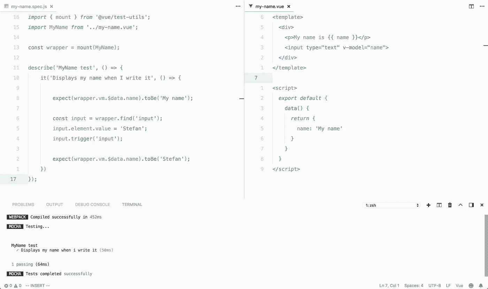
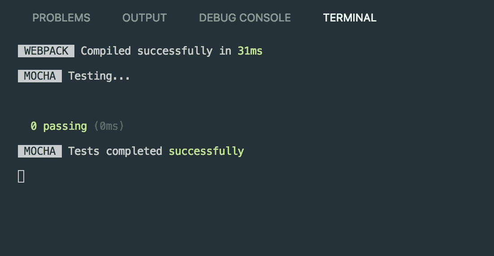
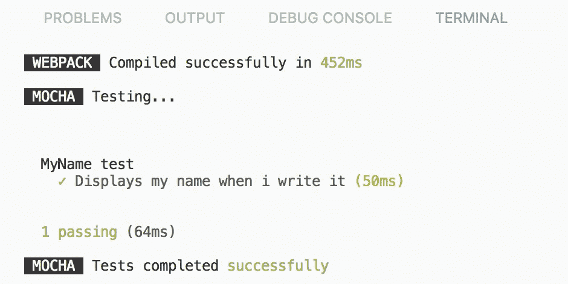

# 用 Mocha 和 Webpack 测试 Vue 组件

> 原文：<https://itnext.io/testing-vue-components-with-mocha-and-webpack-594a9f7e28b9?source=collection_archive---------2----------------------->



我写下了开始使用 Vue.js + TDD 的所有必要步骤。最少说话，只是代码！🤓

# 基本设置

我们将从在终端中运行以下命令开始:

```
$ mkdir vue-tdd && cd $_
$ npm init -y
```

这将创建一个名为 **vue-tdd** 的新目录，并在其中搭建一个基本的`package.json`文件。

接下来，我们需要安装 Vue 并配置 Webpack，以便它可以编译`.vue`文件。

```
$ npm install vue --save
$ npm install webpack webpack-cli --save-dev
```

现在我们需要创建一些文件来使用:

```
$ touch index.html app.js webpack.config.js
```

我们的项目现在看起来像这样:

```
./index.html
./app.js
./package.json
./package-lock.json
./webpack.config.js
./node_modules/
```

让我们添加一些基本的样板代码到我们的文件中，让事情开始运行！

我们还没有一个`bundle.js`文件，但是这个基本的`webpack.config.js`文件会为我们编译一个:

运行`node_modules/.bin/webpack`，让 Webpack 发挥它的魔力！或者更好的是，将下面的脚本添加到`package.json`

```
"scripts": {
  "watch": "webpack -w -d"
}
```

从现在开始，我们只需运行`npm run watch`，保存后 Webpack 会自动编译`app.js`。

# 编译 Vue 组件

好了，让我们创建一个简单的 Vue 组件，让您在输入字段中键入您的姓名，然后打印出来:

将组件添加到`index.html`并导入到`app.js`

为了编译 Vue 组件，需要修改`webpack.config.js`文件。这可以使用 Vue Loader 来完成，它是 Webpack 的一个加载器。

```
$ npm install vue-loader --save-dev
```

# 安装 Vue 测试工具

随着 Webpack 的配置和 Vue 组件的工作，终于到了一些 TDD 的时候了！我一直在遵循这个关于[如何使用 Mocha 和 Vue 测试工具的指南](https://vue-test-utils.vuejs.org/guides/#testing-single-file-components-with-mocha-webpack)。

第一步当然是多运行几次`npm install`:

```
$ npm install --save-dev @vue/test-utils mocha mocha-webpack
$ npm install --save-dev jsdom jsdom-global
$ npm install --save-dev expect
```

然后我们应该将一个`test`脚本添加到我们的`package.json`文件中:

```
"scripts": {
  "test": "mocha-webpack -w --webpack-config webpack.config.js --require test/setup.js test/**/*.spec.js",
  "watch": "webpack -w -d"
}
```

在这个脚本中，您可能会注意到它期望找到一个包含一个`setup.js`文件和`something-something.spec.js`文件的`test/`目录。
`*.spec.js`文件，正如你可能猜到的，是包含我们的测试的文件。但是`setup.js`文件呢？
这其实很简单，只需要包含这两行:

## 什么都没发生？

当我自己尝试这个的时候，我遇到了一个问题。好像当我跑的时候什么都没发生。控制台中的输出只显示了类似这样的内容:

> **web pack:**31 毫秒内编译成功

在向我的朋友谷歌咨询了一下之后，我在 GitHub 上发现了下面这个帖子:

[](https://github.com/zinserjan/mocha-webpack/issues/209) [## Mocha-webpack 似乎无法与 webpack 4 问题#209 zinserjan/mocha-webpack 一起使用

### 问题使用最新的 webpack 4 运行 mocha-webpack 似乎会失败。不显示测试输出。我创建了一个…

github.com](https://github.com/zinserjan/mocha-webpack/issues/209) 

原来 Mocha-Webpack 包还不支持 Webpack 4。(OMG 这个 JS 生态圈！😅)
但众所周知，一切都可以用`npm install`解决！

```
$ npm install mocha-webpack@next
```

因此，如果我们现在再次运行`npm run test`，您应该会看到类似这样的内容:



# 创建一个测试

最后，是时候真正开始编写测试了。让我们为`my-name`组件创建一个测试。如果你不记得了，这是它的样子:

我希望测试能证实这三件事是有效的:

1.  默认情况下，名称值应该是我的名字。
2.  我可以在输入框中写下我的名字
3.  名称值应该已经更改为我写的任何名称

测试看起来是这样的:

当我们再次运行`npm run test`时，我们应该会看到测试通过。



就是这样！经过一堆`npm install`和配置，我们的测试环境终于启动并运行了！