# 在 TypeScript 中用 jest 进行测试

> 原文：<https://itnext.io/testing-with-jest-in-typescript-cc1cd0095421?source=collection_archive---------0----------------------->

## 这是一个关于如何为你的项目设置测试和编写第一个测试用例的简单介绍。

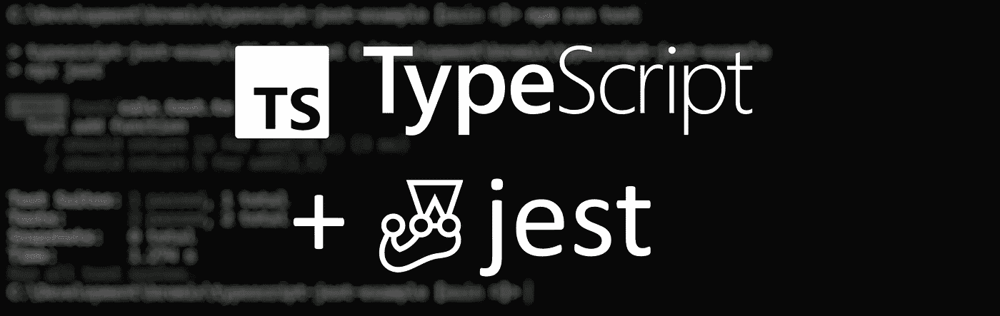

在本文中，我将一步一步地解释在 TypeScript 中创建一个项目并使用 [jest](https://jestjs.io/) 建立一个测试环境的过程。
本例要求具备 [Node.js](https://nodejs.org/) 、 [npm](https://www.npmjs.com/) 和 [Visual Studio 代码](https://code.visualstudio.com/)的基础知识。

# 创建新项目

首先，我们需要一个能够编写测试用例的项目。为此，我们为我们的项目创建一个目录，并在其中进行更改。

```
mkdir typescript-jest-example
cd typescript-jest-example
```

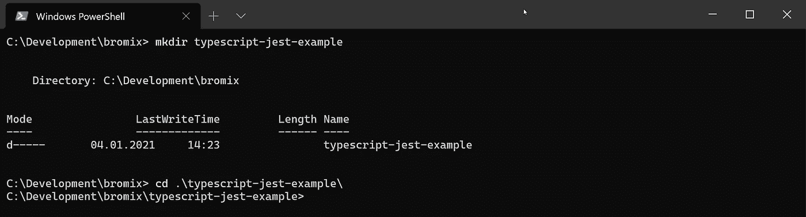

接下来，我们将创建`package.json`，它将描述我们的项目，并在以后帮助编译它。在工具`npm`的帮助下，我们将通过键入以下命令来创建文件:

```
npm init -y
```

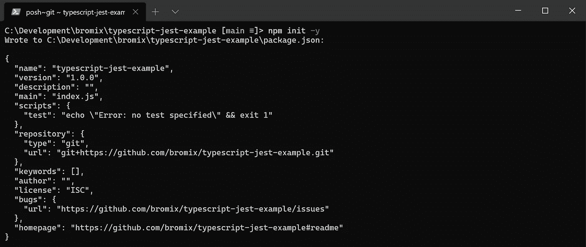

## 安装开发依赖项

接下来，我们使用以下命令安装 TypeScript 作为开发依赖项:

```
npm i -D typescript
```

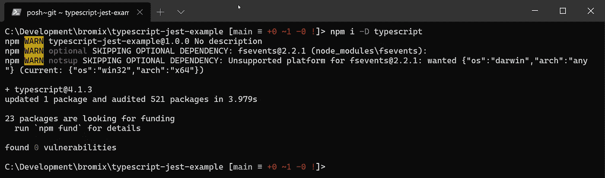

## 配置 TypeScript 编译器

要从项目本地使用 TypeScript 编译器，我们可以使用工具`npx`，它与 Node.js 一起安装在`npm`旁边。

TypeScript 编译器可以帮助我们用下面的命令从模板创建一个`tsconfig.json`:

```
npx tsc --init
```

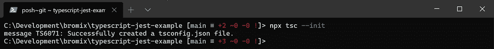

接下来，我们打开 Visual Studio 代码并调整编译器的设置。因此我们打开项目根目录下的文件`tsconfig.json`。

首先我们定义项目的 **include** ，这样编译器就知道我们要编译哪些文件。我们还应该定义**排除**。这是基本 tsconfig 设置的推荐方式(参见:[什么是 tsconfig.json](https://www.staging-typescript.org/docs/handbook/tsconfig-json.html#examples) )。

接下来我们设置 **outDir** ，这样编译器就知道在哪里写我们编译的 JavaScript 文件。除此之外，我们应该定义根目录。 **rootDir** 与源文件无关，更多的是与 **outDir** 的文件夹结构有关。基于 **rootDir，**编译器将反映**包含**的文件夹结构(在本例中 *src* 文件夹将被省略)。

有关 ts.config 的更多详细信息，请参见[ts config 参考简介](https://www.staging-typescript.org/tsconfig)。

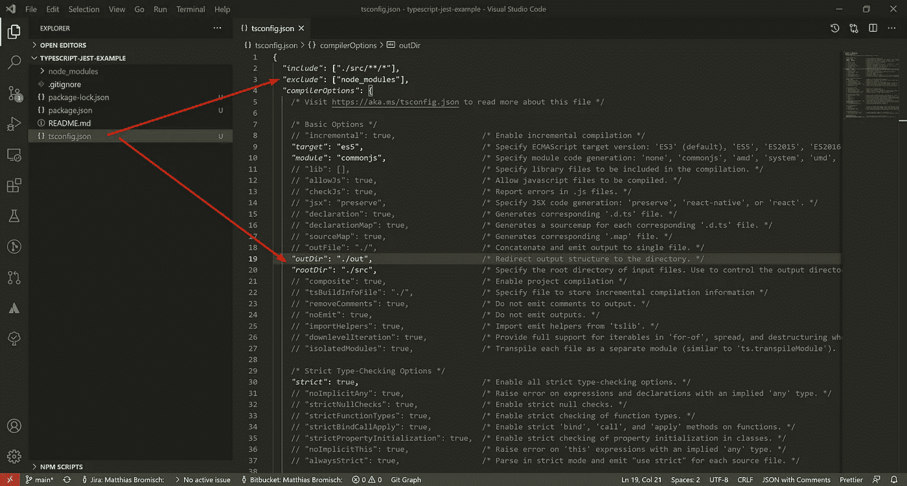

## 添加构建命令

我们仍然需要在我们的`package.json` *，*中使用一个命令，以便`npm`知道如何构建项目。

因此我们将下面的命令添加到`package.json`T20 中。

```
...
"scripts": {
    "build": "tsc"
...
```

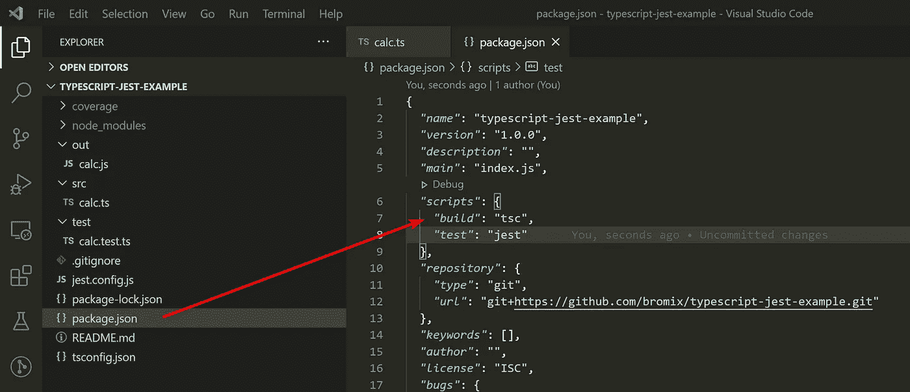

# 添加一些功能

现在，在`src`文件夹中创建一个名为`calc.ts`的文件，并编写一个名为 *add* 的简单函数。这个函数非常简单，它只会将两个数值相加并返回结果。

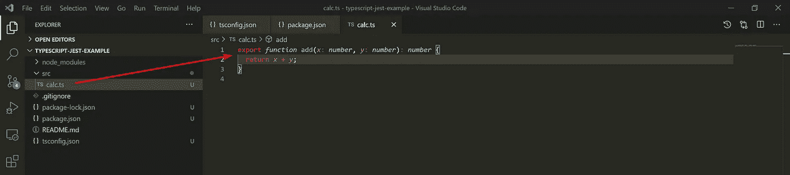

写一个函数将两个数相加

# 构建项目

要构建项目，我们可以简单地执行以下命令，该命令执行 TypeScript 编译器:

```
npm run build
```

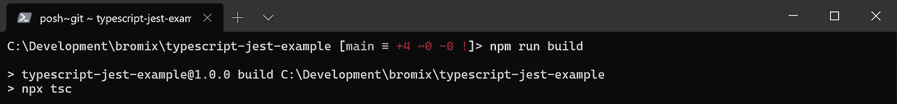

## 现在怎么办？

我们现在已经将我们的 TypeScript 文件编译成 JavaScript(参见`out`文件夹)，但是我们不能执行任何事情或者测试函数的正确性。当编写某种应该在另一个项目中提供附加功能的库时，尤其如此。为此，一个或多个测试用例非常有助于检查库功能的正确性。

# 配置 Jest

`ts-jest`是一个用于`jest`的 TypeScript 预处理器，它允许你使用`jest`来测试用 TypeScript 编写的项目。

但是首先我们需要为此安装一些额外的依赖项。我们需要 jest、ts-jest 和 jest 的类型，因为 jest 是用 JavaScript 编写的。为此，我们输入以下命令:

```
npm i -D jest ts-jest [@types/jes](http://twitter.com/types/jest)t
```

接下来，我们需要告诉`jest`我们想要使用`ts-jest`作为预处理器。为此，我们让`ts-jest`用以下命令创建一个配置文件:

```
npx ts-jest config:init
```

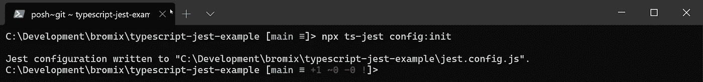

这将创建一个名为`jest.config.js` 的文件，并设置 jest 使用预处理程序`js-test`。

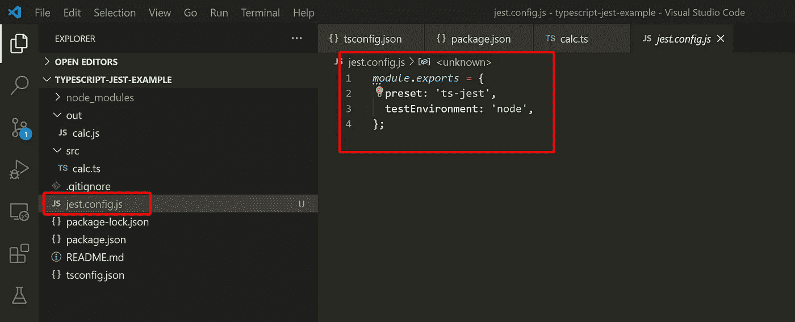

jest 配置

更多关于`ts-jest`的信息可以在 [ts-jest](https://kulshekhar.github.io/ts-jest/docs/installation/) 的官方网站上找到。

## 添加测试命令

为了从控制台或者直接在 Visual Studio 代码中运行测试，我们在我们的`package.json` *中添加了另一个命令。*

```
...
"scripts": {
    ...
    "test": "jest"
  },
...
```

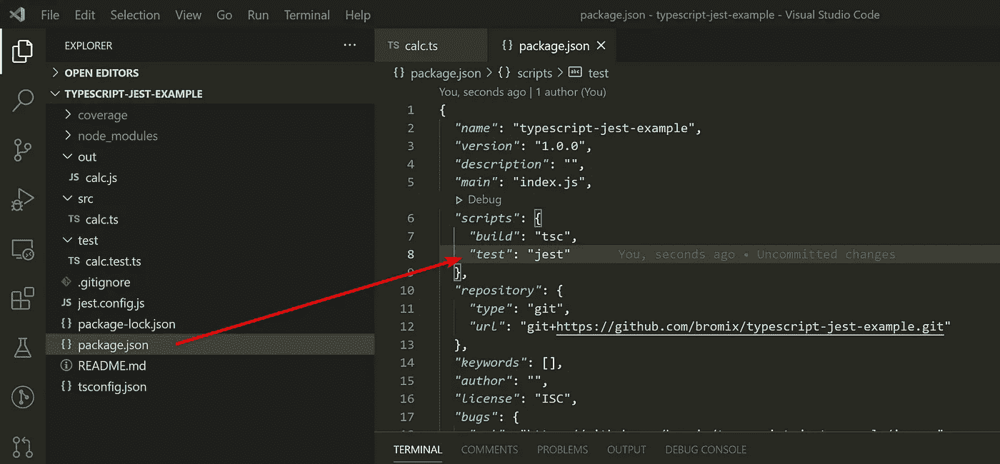

## 为 add 函数编写一个测试用例

现在，我们只需要编写一个测试用例，来检查当使用我们的函数将两个数字相加时，是否返回了某个结果。

```
import { add } from "../src/calc";describe("test add function", () => {
  it("should return 15 for add(10,5)", () => {
    expect(add(10, 5)).toBe(15);
  });it("should return 5 for add(2,3)", () => {
    expect(add(2, 3)).toBe(5);
  });
});
```

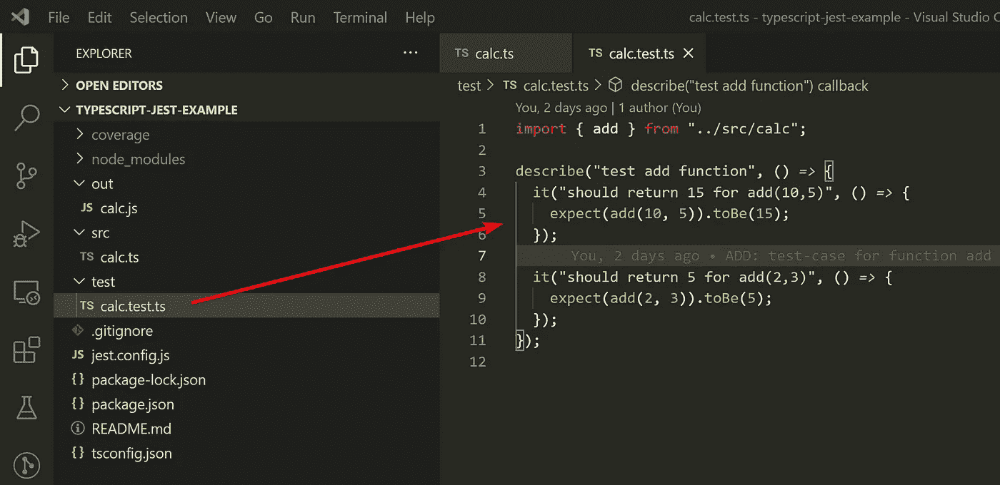

之后，我们只需执行以下命令:

```
npm test
```

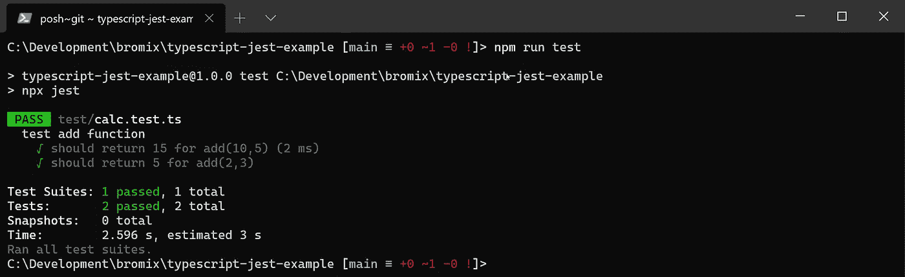

在我们的例子中，`jest`将找到所有带有模式`*.test.ts`的测试文件，执行它们并将结果输出到控制台。在我们的案例中，所有的测试用例都已经通过。

为了验证我们的测试用例被正确实现，我们可以在*添加*功能的实现中故意引入一个 bug。
为此，我们将 add 函数中的“+”替换为“-”，并再次运行测试。


用“-”替换“+”

更改后，我们只需再次执行以下命令:

```
npm test
```

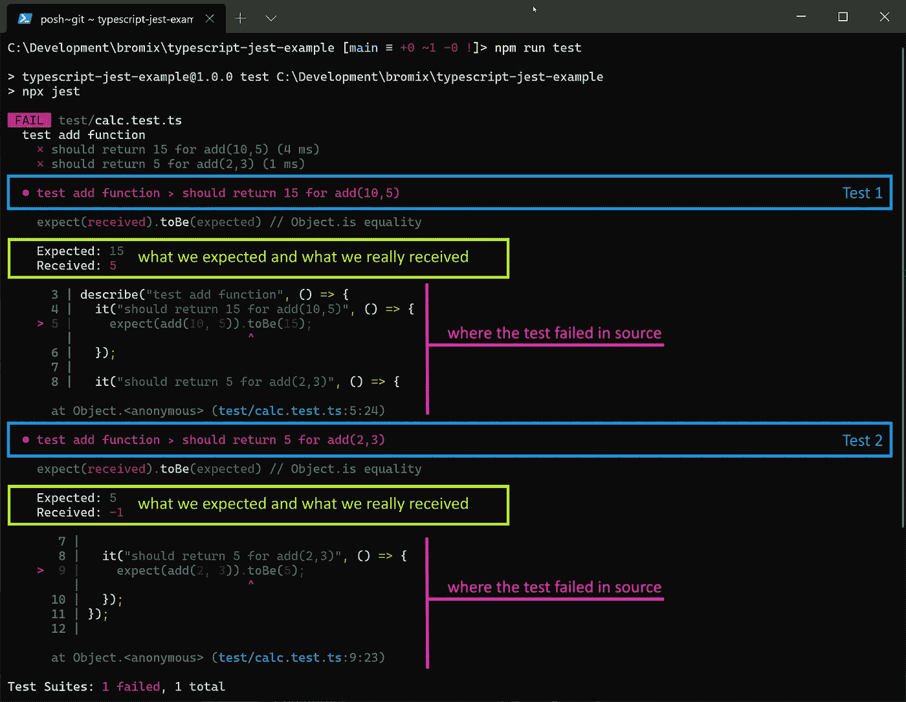

失败测试的示例

在控制台中，我们可以获得测试失败的详细信息。我们可以在第一部分(蓝框)看到哪个测试失败了。
在下面的部分(黄色方框)中，我们可以看到我们期望的测试结果和实际返回的结果。其余部分(用紫红色标记)指出测试失败的确切位置。
有了这些信息，我们现在可以进行一个失败的测试，调试它，检查实现的函数 *add* 到底出了什么问题，并尝试纠正错误。

# 结论

这是一个关于如何使用`jest`为 TypeScript 建立一个测试环境的非常简单的介绍。
在后续文章中，我将更详细地介绍如何构建测试用例，Visual Studo 代码有哪些测试工具，以及如何调试错误。

我希望你喜欢这篇文章，如果你有任何问题或建议，请联系我。

完整的例子可以在 GitHub 上找到:[https://github.com/bromix/typescript-jest-example](https://github.com/bromix/typescript-jest-example)