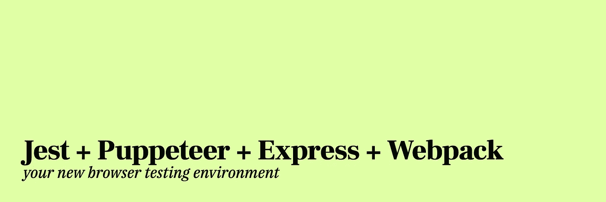

# 使用 Jest、Puppeteer、Express 和 Webpack 在浏览器中测试您的 JavaScript

> 原文：<https://itnext.io/testing-your-javascript-in-a-browser-with-jest-puppeteer-express-and-webpack-c998a37ef887?source=collection_archive---------2----------------------->



**更新(2019/04/17):** *重新格式化测试服务器代码，以涵盖更多一般情况。还包括关于设置 jest-puppeter . config . js 的信息*

在最近的几个项目中，我发现自己不得不测试只能在浏览器中运行的代码。有很多方法可以做到这一点，但我找到了大多数关于[Jest-puppet er](https://github.com/smooth-code/jest-puppeteer)的文档，它基于 [Jest](https://facebook.github.io/jest/en) ，脸书的 JavaScript 测试框架，和[puppet er](https://github.com/GoogleChrome/puppeteer)，官方的 headless Google Chrome API。本文将演示如何开始使用 jest-puppet er，以及如何通过 [Webpack](https://webpack.js.org/) 轻松使用它。

[你可以在 GitHub](https://github.com/czycha/example-jest-puppeteer-webpack) 上看到完整的示例源代码。

# 示例项目

经过几个月的思考和研究，您已经提出了热门的新 Node.js 库: *foo* 。 *foo* 是一个创新的新函数，调用时返回字符串 *bar* 。惊人！

下面是 *foo:* 的起始目录结构

```
foo/
| index.js
| package.json
```

[**index.js**](https://github.com/czycha/example-jest-puppeteer-webpack/blob/master/index.js)

```
function foo() {
 return 'bar';
}module.exports = foo;
```

# 步骤 1:安装

在 Node.js 项目中，您需要安装如下模块:

```
yarn add -D express jest jest-cli jest-puppeteer puppeteer webpack webpack-dev-middleware
```

或者，

```
npm i -D express jest jest-cli jest-puppeteer puppeteer webpack webpack-dev-middleware
```

## 每个模块的功能

*   jest 和 jest-cli: 这是我们要用来测试程序逻辑的东西。
*   这将允许我们像一个用户一样与网页互动。它还可以注入脚本运行到网页中，这可以根据我们正在制作的程序类型派上用场。
*   小丑和木偶师的结合。为测试浏览器代码添加了自动安装和拆卸 Puppeteer 和可选的本地服务器。
*   [**Express**](https://expressjs.com/)**:**Express 将是我们作为本地测试服务器所使用的。
*   **webpack 和**[**web pack-dev-middleware**](https://github.com/webpack/webpack-dev-middleware)**:**我们可以使用这些模块自动为我们的测试服务器网页提供浏览器编译的 JavaScript。

# 步骤 2: Webpack 设置

接下来，如果您还没有为您的项目安装 Webpack，那么您应该这样做。这里不需要发生什么特别的事情——只需根据您的需要进行配置。

[**web pack . config . js**](https://github.com/czycha/example-jest-puppeteer-webpack/blob/master/webpack.config.js)

```
module.exports = {
  entry: './index.js',
  output: {
    filename: 'index.min.js',
    library: 'foo'
  },
  mode: 'production'
}
```

# 步骤 3:服务器设置

接下来，您需要设置您的测试服务器。首先，在项目中创建一个名为`test`的目录。在这个文件夹中，创建一个名为`server.js`的 JavaScript 文件。

让我们一步一步地构建这个文件([你可以在 GitHub](https://github.com/czycha/example-jest-puppeteer-webpack/blob/master/test/server.js) 上看到完整的文件)。

```
const express = require('express')
const webpack = require('webpack')
const middleware = require('webpack-dev-middleware')
```

我们需要 Express 作为我们的 web 服务器、Webpack 和 webpack-dev-middleware，用于将我们编译的脚本注入页面。

```
const compiler = webpack(require('../webpack.config.js'))
```

这里，我们基于 *webpack.config.js* 文件初始化一个 Webpack 编译器。如果需要，我们也可以省去中间人，只在这里定义设置。这将允许我们对测试环境进行单独的设置。

```
// Turns input into an array if not one already
function normalizeArray (arr) {
  return Array.isArray(arr) ? arr : [arr]
}// Gets all the Javascript paths that Webpack has compiled, across chunks
function getAllJsPaths (webpackJson) {
  const { assetsByChunkName } = webpackJson
  return Object.values(assetsByChunkName).reduce((paths, assets) => {
    for (let asset of normalizeArray(assets)) {
      if (asset != null && asset.endsWith('.js')) {
        paths.push(asset)
      }
    }
    return paths
  }, [])
}// Optionally, just get the Javascript paths from specific chunks
function getJsPathsFromChunks (webpackJson, chunkNames) {
  const { assetsByChunkName } = webpackJson
  chunkNames = normalizeArray(chunkNames)
  return chunkNames.reduce((paths, name) => {
    if (assetsByChunkName[name] != null) {
      for (let asset of normalizeArray(assetsByChunkName[name])) {
        if (asset != null && asset.endsWith('.js')) {
          paths.push(asset)
        }
      }
    }
    return paths
  }, [])
}
```

在这一节中，我将定义一些有用的函数来处理 webpack-dev-middleware 的输出。`getAllJsPaths`将返回由中间件生成的所有 JavaScript 文件的路径数组。`getJsPathsFromChunks`将只返回属于第二个参数中定义的块的 JavaScripts 路径。请随意选择一个或根据自己的标准进行调整！

```
let port = 4444
const index = Math.max(process.argv.indexOf('--port'), process.argv.indexOf('-p'))
if (index !== -1) {
  port = +process.argv[index + 1] || port
}const app = express()
  .use(middleware(compiler, { serverSideRender: true }))
  .use((req, res) => {
    const webpackJson = res.locals.webpackStats.toJson()
    const paths = getAllJsPaths(webpackJson)
    res.send(
      `<!DOCTYPE html>
      <html>
        <head>
          <title>Test</title>
        </head>
        <body>
          <div id="root"></div>
          ${paths.map((path) => `<script src="${path}"></script>`).join('')}
        </body>
      </html>`
    )
  })
  .listen(port, () => {
    console.log(`Server started at [http://localhost:${port}/`](http://localhost:${port}/`))
  })
```

这里发生了一些事情。在第一位，我们确定端口号，以防它通过`--port`或`-p`传入。默认情况下，端口为`4444`。

此外，我们定义了 Express 服务器，并将 webpack-dev-middleware 附加到它上面。然后我们使用`getAllJsPaths`函数处理它的输出，用 JavaScript 生成我们的测试网页。最后，服务器被告知监听之前定义的端口号。

请随意调整 HTML 以适应您项目的需要。你甚至可以使用模板引擎，如 [Pug](https://pugjs.org/) 来生成你的 HTML。对于更全面的测试，您可以使用 [routing](https://expressjs.com/en/guide/routing.html) 为不同的测试创建不同的页面。

现在，您应该进入您的 [*package.json*](https://github.com/czycha/example-jest-puppeteer-webpack/blob/master/package.json) 文件并添加一个脚本来启动您的服务器，如下所示:

```
{
  ...
  "scripts": {
    "serve": "node test/server.js"
  },
  ...
}
```

这可以通过`yarn serve`(或`npm run serve`)来运行。然后你可以在`[http://localhost:4444](http://localhost:4444)`访问该页面。

# 步骤 4:笑话设置

快到了！现在我们需要把 jest 和 Jest 木偶师分清楚。

要么通过你的 *package.json* 要么通过 *jest.config.js* ，[配置 Jest](https://facebook.github.io/jest/docs/en/configuration.html) 。

[**package.json 示例**](https://github.com/czycha/example-jest-puppeteer-webpack/blob/master/package.json)

```
{
  ...
  "jest": {
    "preset": "jest-puppeteer",
    "globals": {
      "PATH": "[http://localhost:4444](http://localhost:4444)"
    },
    "testMatch": [
      "**/test/**/*.test.js"
    ]
  },
  ...
}
```

**jest.config.js 示例**

```
module.exports = {
  preset: "jest-puppeteer",
  globals: {
    PATH: "[http://localhost:4444](http://localhost:4444)"
  },
  testMatch: [
    "**/test/**/*.test.js"
  ]
}
```

您的具体配置可能需要与此不同，但至少应该将`"jest-puppeteer"`设置为`preset`。在这里，我还添加了服务器地址作为一个全局变量，并更改了测试匹配模式，这样它就不会匹配 *test/server.js* 。

您还需要通过定义一个[*jest-puppeter . config . js*](https://github.com/czycha/example-jest-puppeteer-express-webpack/blob/master/jest-puppeteer.config.js)文件([官方文档](https://github.com/smooth-code/jest-puppeteer#jest-puppeteerconfigjs))来配置 jest-puppeter:

```
module.exports = {
  server: {
    command: 'npm run serve',
    port: 4444
  }
}
```

您还应该在您的 *package.json* 中添加 Jest 作为脚本:

```
{
  ...
  "scripts": {
    "serve": "node test/server.js",
    **"test": "jest"**
  },
  ...
}
```

# 步骤 5:创建您的测试

你猜怎么着！我们差不多完成了。现在您只需要编写您的测试！参考 [Jest](https://facebook.github.io/jest/docs/en/getting-started.html) 、[木偶师](https://github.com/GoogleChrome/puppeteer/blob/master/docs/api.md)和[Jest-木偶师](https://github.com/smooth-code/jest-puppeteer#api)文档来构建您的测试用例。下面是我们惊人的 *foo* 模块的测试用例示例。

[**test/foo . test . js**](https://github.com/czycha/example-jest-puppeteer-webpack/blob/master/test/foo.test.js)

```
describe('foo', () => {
  beforeEach(async () => {
    await page.goto(PATH, { waitUntil: 'load' })
  })
  test('should return bar', async () => {
    const foo = await page.evaluate(() => {
      console.log('foo');
      return foo();
    })
    expect(foo).toBe('bar')
  })
})
```

这个测试用例从导航到`localhost:4444`(我们的`PATH`)开始，一直等到加载时间。这将在每次测试前导航，以便重新初始化页面。将`beforeEach`与`beforeAll`交换将使测试框架只导航一次，所有后续测试都在同一个页面实例上运行。

这个实例中的单个测试用例在页面的上下文中异步运行一个脚本，以发挥 *foo 的魔力。然后，它使用 Jest 的匹配器框架来确保结果是预期的。*

# 步骤 6:运行您的测试

你所需要做的就是在命令行中运行`yarn test`(或者`npm test`)！

# 进一步阅读

这只是一个起点。我建议仔细阅读所使用的各种模块，这样你就可以定制它们来适应你的项目。

此外，如果你想用一个真正的模块在实践中看到这一点，请查看 [Alchemize](https://github.com/czycha/alchemize) 的源代码。正是从这个项目中，我获得了示例存储库和这个分步文档。

# 可供选择的事物

我能找到的唯一一个 100%覆盖上述过程的值得注意的替代方法是 [**Karmatic**](https://github.com/developit/karmatic) 。Karmatic 是一个零配置测试框架，将 Karma、Webpack、Jasmine、&puppet er 封装在一个模块中。

你也可以替换掉其中的一些关键模块(Jest、Puppeteer、Express、Webpack 等。)只要你保持概念和过程不变。

请随意在评论中分享你正在使用的任何你觉得非常有效的替代方案！