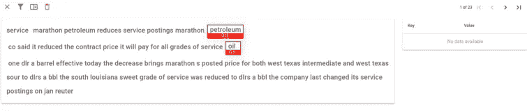
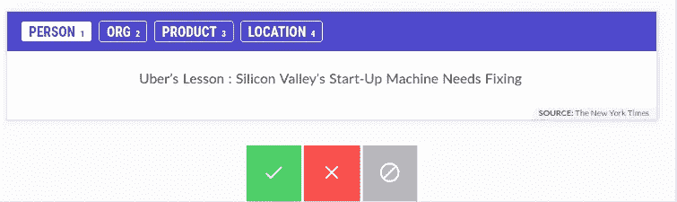

# 自然语言处理的文本注释工具

> 原文：<https://itnext.io/text-annotation-tools-for-nlp-c254f8ee52f7?source=collection_archive---------0----------------------->


泽维尔·冯·埃拉赫在 [Unsplash](https://unsplash.com?utm_source=medium&utm_medium=referral) 上的照片

# 介绍

本文的目标是给出一个快速的**概述**工具，您可以使用这些工具在自然语言处理( [**NLP**](https://en.wikipedia.org/wiki/Natural_language_processing) **)** 字段中执行**文本注释**(数据标注)。

这篇文章是我以前的[文章](/introduction-to-natural-language-processing-nlp-tools-for-python-cf39af3cfc64)的摘录，在那里我给出了什么是 **NLP** 的概述，如果你不熟悉 NLP，我建议你先看看这篇[文章](/introduction-to-natural-language-processing-nlp-tools-for-python-cf39af3cfc64)。

# 什么是 NLP？

简单地说，NLP 是 [**机器学习**](https://en.wikipedia.org/wiki/Machine_learning) 的一个领域，专注于从 [**自然语言**](https://en.wikipedia.org/wiki/Natural_language) 中提取洞察。你的目标是让计算机理解我们自己的语言。

自然语言处理的一些实际例子有语音识别、翻译、情感分析、主题建模、词汇分析、实体提取等等。

使用所有这些工具和算法，你可以从自然语言中提取结构化数据，这些数据可以被计算机处理。此外， **NLP** 任务的输出通常是机器学习算法，该算法将使用这些原始数据来进行**预测**。


通过**将许多算法结合在一起**，您可以提取有用的数据，这些数据可用于广泛的场景，例如:

*   欺诈检测
*   [风险情报](https://aylien.com/solutions/risk-intelligence)
*   电子邮件分类
*   [情绪分析](https://pythonspot.com/python-sentiment-analysis/)

**对于文本分类或**[**【NER】**](https://en.wikipedia.org/wiki/Named-entity_recognition)**等监督算法，您将需要对您的文本数据进行标注。你将需要一些工具来帮助你完成这项任务。*让我们回顾一下这些工具……***

# 多卡诺

[**Doccano**](https://doccano.herokuapp.com/) 是一个基于 web、**开源的**注释工具。Doccano 使您能够让它自托管，这提供了更多的控制以及根据您的需要修改代码的能力。它支持不同的团队，并且非常容易使用。你可以试一试**演示** [**这里**](https://doccano.herokuapp.com/demo/named-entity-recognition/) 。

查看我之前的 [**文章**](/nlp-named-entity-recognition-ner-with-spacy-and-python-dabaf843cab2) 了解更多关于 Doccano 的细节。你可以按照 [**Doccano**](https://doccano.github.io/doccano/tutorial/) 的说明来安装这个开源工具。



用 Doccano 标记数据

**Doccano** 很棒如果你不是程序员，任何人都可以快速上手，协作加速标注过程。**如果具有业务领域知识的人不是程序员，并且业务领域的复杂性很高，我推荐使用 Doccano**。在这种情况下，您可以使用 **Doccano** 到**手动**由具有业务知识的团队成员并行标记数据。

**优点:**

*   使用方便
*   支持团队
*   易于安装
*   开放源码

**缺点:**

*   完全手动注释

# 奇迹ˌ奇事

[**神童**](https://prodi.gy/) 由 [**SpaCy**](https://spacy.io/) 背后同一个团队打造。它是一个现代的注释工具，用于为机器学习模型创建训练和评估数据。**它不仅仅是一个注释工具**，它与 [**SpaCy**](https://spacy.io/) 集成在一起，也可以用来训练模型。它的目标是拥有 Python 编程知识的数据科学家。

[**神童**](https://prodi.gy/) 由 [**主动学习**](https://en.wikipedia.org/wiki/Active_learning_(machine_learning)) 提供动力，也就是说它提供了**半自动**。您可以从标记几个样本开始，主动学习模型将尝试为您学习和标记其余的数据集，因此您只能指出样本是否正确。此外，它会根据信息增益建议最佳样本，因此您不会在不会改进模型预测的样本上浪费时间。可以在这里 **查看一个现场 **demo** [**。**](https://prodi.gy/demo)**

使用 Prodigy，您可以在快速和**迭代过程中标记和训练模型**消除大量手工工作。它合并了标记和训练过程，因此专家可以用有用和有意义的方式标记数据，而不是外包标记过程，浪费大量时间来标记不必要的文本样本。这样你可以很快尝试新想法。

Prodigy 可以用来标记命名实体为 **NER** ，文本为分类，甚至图像，视频和声音！。它附带了许多“ [**配方**](https://prodi.gy/docs/recipes) ”，这些配方是执行特定任务的工作流程，请查看此 [**流程图**](https://prodi.gy/prodigy_flowchart_ner-36f76cffd9cb4ef653a21ee78659d366.pdf) 来检查它们。

**简单来说过程如下:**

*   首先，您需要获得您的示例文本数据 JSONL，其中每行包含一个条目，这是一个[示例](https://raw.githubusercontent.com/explosion/prodigy-recipes/master/example-datasets/news_headlines.jsonl)。
*   下一步是开始手动注释，例如对于 NER，您将在命令行中运行:

```
prodigy ner.manual ner_news_headlines blank:en ./news_headlines.jsonl --label PERSON,ORG,PRODUCT,LOCATION
```

*   这将启动`ner.manual` Prodigy recipe 以便您可以开始贴标，这将打开一个 web 服务器，其 Web UI 位于:[*http://localhost:8080*](http://localhost:8080/)
*   现在，您可以开始添加注释了:



*   在注释了一些示例后，您可以训练模型:

```
prodigy train ner ner_news_headlines en_vectors_web_lg
```

*   第一个参数定义了要训练的组件:在本例中是`ner`。您还需要传入数据集的名称、要从中训练的注释以及要开始的基本模型。在这个例子中，最后一个参数是使用一个大的`[en_vectors_web_lg](https://spacy.io/models/en#en_vectors_web_lg)` [模型](https://spacy.io/models/en#en_vectors_web_lg)作为基础模型。向量将在训练中用作特征，这可以大大提高准确性。如果你还没有安装矢量包，你可以通过`spacy download en_vectors_web_lg`下载
*   根据结果指标，如**准确性或** [**f 值**](https://en.wikipedia.org/wiki/F-score) ，您可以决定接下来的步骤。Prodigy 有许多[方法](https://prodi.gy/prodigy_flowchart_ner-36f76cffd9cb4ef653a21ee78659d366.pdf)来帮助你，一些可以用来检测标记更多的数据是否会改善你的模型，另一些会尝试为你标记，所以你只需要接受或拒绝，其他的会从你的数据集中检测最有意义的例子，等等。查看这张[图表](https://prodi.gy/prodigy_flowchart_ner-36f76cffd9cb4ef653a21ee78659d366.pdf)了解更多细节。

如你所见，Prodigy**非常强大**并且**与 SpaCy** 有很大的兼容性。这两个工具允许你为你的组织实现完整的端到端 NLP 解决方案。注意 **Prodigy 不是开源的**，你需要获得一个许可，这样你就可以下载并在你的环境中安装它。

我向**数据科学家团队**推荐 **Prodigy** ，他们也有商业知识，可以自己给数据贴标签。它对于需要快速迭代的**小团队**特别有效。

**优点:**

*   自动化:它真的可以加速 NLP 过程。
*   许多功能
*   可以训练模特

**缺点:**

*   学习曲线
*   不开源。

# 其他工具

*   [**TagTog**](https://www.tagtog.net/)**:**基于 web 的文本注释工具，无需安装。它提供云产品。支持团队的组注释。它还具有机器学习能力:从以前的注释中学习，并自动生成类似的注释。
*   [**乳臭未干**](https://brat.nlplab.org/) **:开源**免费注释工具。

# 结论

我们可以这样总结 NLP:**它结合了一套工具和技术来将复杂的自然语言转换成机器可读的数据。**为了对有监督的机器学习模型做到这一点，我们需要为**训练集**提供带标签的数据。我们使用**注释工具**来做到这一点。对于拥有复杂业务模型的大型组织来说，如果他们有资源来执行手工测试， [**Doccano**](https://doccano.herokuapp.com/) 可能是一个不错的选择。对于规模较小的数据科学家团队来说， [**Prodigy**](https://prodi.gy/) 将是他们最好的选择。

如果你喜欢这篇文章，记得鼓掌，并关注我的更多更新！

**更新**:我目前在坦桑尼亚帮助当地的一所学校，我创建了一个 [**GoFundMe 活动**](https://www.gofundme.com/f/help-the-mango-school-children-in-tanzania) 来帮助孩子们，通过这个[链接](https://www.gofundme.com/f/help-the-mango-school-children-in-tanzania)来捐款，每一点帮助！

[**订阅**](https://javier-ramos.medium.com/subscribe) 获得**通知**当我发表一篇文章和 [**加入 Medium.com**](https://javier-ramos.medium.com/membership)访问数百万或文章！