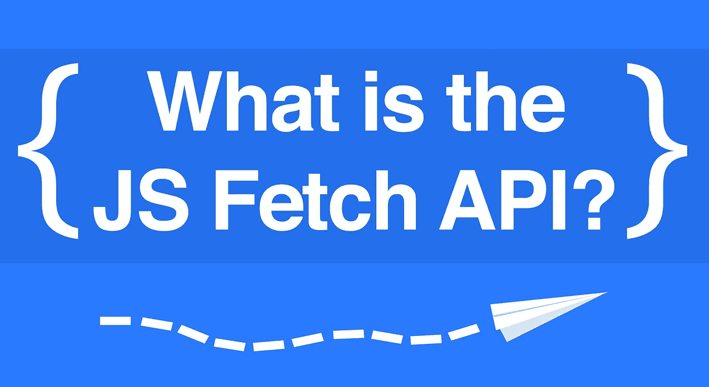

# 这些数据看起来很吸引人:理解 JS Fetch API

> 原文：<https://itnext.io/that-data-looks-so-fetching-on-you-understanding-the-js-fetch-api-880eae0c8d25?source=collection_archive---------1----------------------->



这不是 JS 处理来自服务器的数据的唯一方式，但可能是最普遍的方式。很久以前，主要方法曾经是 [XMLHttpRequest](https://www.w3schools.com/xml/ajax_xmlhttprequest_create.asp) ，然而这种方法已经过时了。你可以安装一些模块来发出请求(比如 [Axios](https://www.npmjs.com/package/axios) )，但是 fetch 已经可以在所有浏览器中使用了。任何开发人员都应该花些时间熟悉这个内置的 API。

`*fetch()*` *用途承诺，所以读* [*这个*](https://medium.com/@mikecronin92/promises-promises-understanding-the-basics-of-js-promise-objects-dd5c656f2db4) *如果不知道那些是什么*

# 大局

我在这里稍微解释了一下，但是 [javascript.info](https://javascript.info/promise-chaining#bigger-example-fetch) 很好地分解了`fetch()`的基础:

> 1.`fetch()`向 url 发出网络请求并返回承诺。
> 
> 2.当远程服务器用头响应时，这个承诺用一个响应对象来解决。
> 
> 3.为了读取响应体，我们必须在其上调用一个响应方法，如`text()`或`json()`，它将返回另一个承诺，其解析值是响应的 ***体*** 。

```
**fetch**('[*https://jsonplaceholder.typicode.com/users/1*](https://jsonplaceholder.typicode.com/users/1)')
  .then((**response**) => **response**.json())
  .then((**myJson**) => {
    **console**.log(*'Here is the json!'*, **myJson**);
  });
```

关于更详细的技术分析，我鼓励你查看那个链接。此外，谷歌[写了一篇很棒的文章](https://developers.google.com/web/updates/2015/03/introduction-to-fetch)，不出所料，它们比《小小的我》更深入。

# 故障

`fetch()`创建一个用[响应对象](https://developer.mozilla.org/en-US/docs/Web/API/Response)解析的承诺。现在，那个响应对象确实有一个主体，但是它是一个叫做[可读流对象](https://developer.mozilla.org/en-US/docs/Web/API/ReadableStream)的东西。我们的数据就在那里，但是获取它的唯一方式是通过一个[响应方法](https://developer.mozilla.org/en-US/docs/Web/API/Response#Methods)返回我们的数据作为*另一个*解决的承诺值。所以我们还需要一个`then()`来实际使用我们的数据。下面是发生的事情的基本伪代码版本:

```
**fetch**('https://some-url.com')
  .then((**theResponseObject**) => {
    return **theResponseObject**.methodToGetToData()
  })
  .then((**myUsableData**) => {
   *// manipulate/show/log our data* 
  })
  .catch((**error**) => {
 *   // error handling here*
  });
```

如果这些步骤中的任何一个被拒绝，你就可以`catch()`它。

# 使用示例

现在让我们来看一个例子。为此，我们将使用精彩的 [JSONplaceholder](https://jsonplaceholder.typicode.com/) 站点，它给出了遵循 REST 约定的虚拟 JSON 文件。*完善*进行测试和教程。下面，让我们在页面上放置一个“用户”:

```
fetch('*https://jsonplaceholder.typicode.com/users/1*')
  .then((**response**) => {
    **console**.log(`*status:* ${**response**.status}`);
    **console**.dir(**response**.body);
    return **response**.json() *// the important line* 
  })
  .then((myJson) => {
    **document**.write(
      `*User:* ${**myJson**.name} *<br/>*
      *Email:* ${**myJson**.email} *<br />*
      *Website:* ${**myJson**.website}`
    );
    return **myJson;**
  })
  .then(**console**.log)
```

我们的`fetch()`用一个响应对象进行解析，这个对象被引入到我们的第一个`then()`方法中。我记录了一些基本的属性，但是我也鼓励你自己去探索。我们的第一个`then()`返回`response.json()`，这是一个包含我们数据的解析承诺。在这种情况下，它是 JSON，但是如果它只是文本，我们可以使用`text()`响应方法。

在我们的第二个`then()`中，我们实际上开始操纵我们的数据。我只是在本教程中使用了`document.write()`，但是现在你已经可以访问数据了，你可以把它放到你的页面中。第二个`then()`只是返回我们的数据，以强调链接可以一直进行下去。最后，将我们的用户 JSON 登录到控制台。

因此，对于您想要显示或操作其数据的每个`fetch()`，您将需要至少两个*`then()`方法:第一个返回检索您的数据的响应方法，第二个`then()`实际处理数据。*

# *获取不仅仅是为了得到*

*如果我们的应用程序只能*读取*数据，那么它们就很难是动态的，所以`fetch()`可以接受第二个参数，一个[请求](https://developer.mozilla.org/en-US/docs/Web/API/Request#Examples)。您只需向`fetch()`传递一个对象，该对象指定您想要发出的请求的类型，以及消息头、消息体和您需要的任何内容。谷歌的好心人在他们关于 fetch 的[文章中创建了这个示例代码:](https://developers.google.com/web/updates/2015/03/introduction-to-fetch#post_request)*

```
*const **options =** {
  method: '*POST*',
  headers: {
    '*Content-type'*: 'application/json; charset=UTF-8'
  },
  body: '*foo=bar&lorem=ipsum*',
} **fetch**('https://*example.com*', options)
  .then((**response)** => **response**.json())
  .then((**data**) => {
    **console**.log('*Request succeeded with JSON response*', **data**);
  })
  .catch((**error**) => {
    console.log('*Request failed*', **error**);
  });*
```

*但是，要从您的页面发送数据，您需要设置您的服务器来正确处理传入的信息。这超出了本教程的范围。但是在大多数 web 框架中，接受 JSON 数据非常容易。*

# *在您自己的站点上使用 fetch()*

*`fetch()`可以去任何网址，包括你自己的服务器。要访问你的站点自己的文件，只需给出一个相对路径名而不是 URL。如果`fetch()`没有看到“http”，它会假设你是从你的根目录。这适用于生产或本地主机服务器。下面是一个简单的`fetch()`的例子，从本地测试服务器上的根文件夹中检索一些 JSON 数据:*

```
*fetch('/test.json')
  .then((**r**) => **r**.json())
  .then(console.log)// { example: 'data' }*
```

# *去拿回来*

*这就是`fetch()`的基本要素。我非常鼓励阅读 [MDN](https://developer.mozilla.org/en-US/docs/Web/API/Response#Methods) docs、 [Google](https://developers.google.com/web/updates/2015/03/introduction-to-fetch) 和 [javascript.info](https://javascript.info/promise-chaining#bigger-example-fetch) 文章。还有一种更好的方式来使用带有 Async/Await 的 [fetch，一旦你熟悉了这种语法，我鼓励你去看看。但是最好的学习方法是去做，所以走出去，建立一个吸引人的新网站。](/a-beginners-guide-to-async-await-in-javascript-97750bd09ffa)*

*大家编码快乐，*

*麦克风*