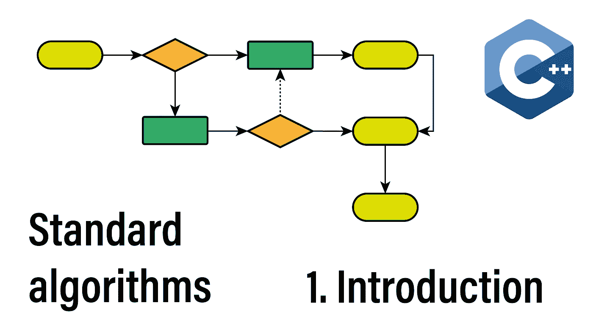
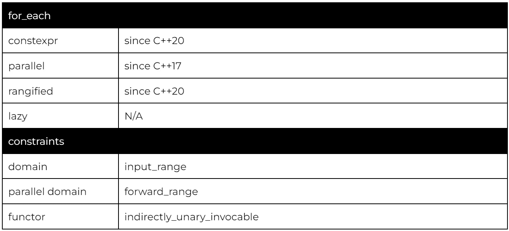
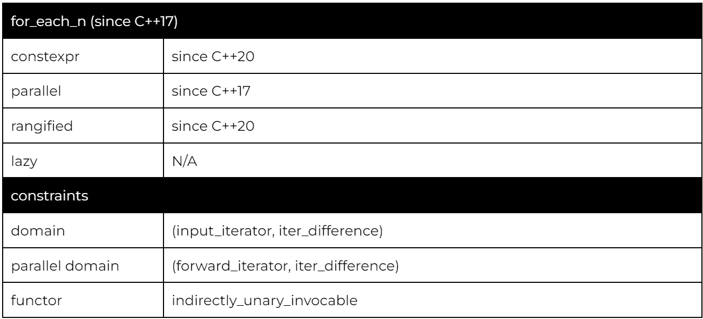
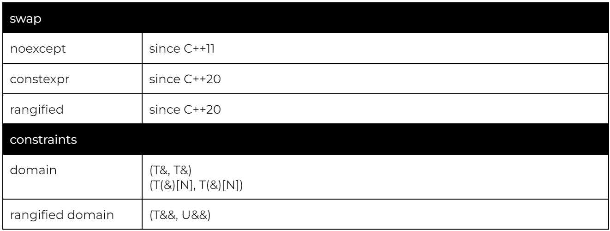
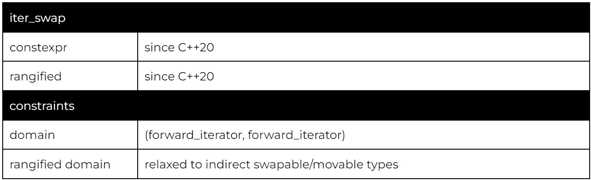
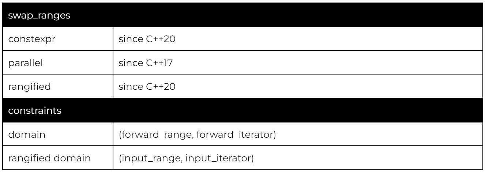

# 114 种标准 C++算法。介绍

> 原文：<https://itnext.io/the-114-standard-c-algorithms-introduction-2a75a2df4300?source=collection_archive---------0----------------------->

欢迎来到关于 C++标准算法的新系列。标准算法提供了安全和优化的构建模块，可以取代数量惊人的用户代码。

今天我们将看一下算法的基础，解释迭代器的概念，谈一谈 C++23 的历史和未来，最后看一下`for_each`和`swap`算法。

## 该系列:

*   介绍
*   [排序和划分算法](/sorting-partitioning-the-114-c-algorithms-series-6503ad41cede)
*   [对排序或分区范围进行操作的算法](/divide-conquer-and-sets-the-114-c-algorithms-series-d0085a38046e)
*   [转换算法](/transformations-the-114-c-algorithms-series-deacdbd4c373)
*   [左折叠和其他缩小](/left-folds-and-other-reductions-the-114-c-algorithms-series-6195724d324)
*   [生成器、副本和移动](/generators-copies-and-moves-the-114-c-algorithms-series-1d0774472877)
*   [堆和堆](/heap-and-heap-the-114-c-algorithms-series-1d4215ae9f0d)
*   [搜索和最小值-最大值](https://medium.com/@simontoth/8a6ed951ad40)
*   结论(即将发布)

# 标准算法

你可以批评 C++标准库缺乏功能。然而，当涉及到数据和数字处理时，C++标准库提供了一个通用的算法工具包。因此，如果你是一名 C++开发人员，你应该知道有哪些可用的工具。

## 迭代器:互操作层

位于 C++数据结构和算法之间的核心是迭代器。迭代器抽象出特定数据结构如何被遍历的细节，同时捕捉数据结构强加的行为限制。

例如，一个数组(如`std::vector`)允许随机访问，这意味着我们可以在恒定的时间内从一个元素移动到另一个元素。另一方面，链表(如`std::list`)只允许我们在常数时间内移动到下一个和上一个元素，移动 n 的距离需要 n 次运算(线性复杂度)。

C++识别以下迭代器类别:

*   **输入迭代器:**前进，读取，一次通过
*   **向前迭代器:**前进，读取
*   **双向迭代器:**向前迭代器+向后移动
*   **随机访问迭代器:**双向迭代器+前进&后退任意整数，计算两个迭代器之间的距离
*   **连续迭代器:**随机访问+元素的存储是连续的
*   **输出迭代器:**前进，写入，一次通过

这种分类允许算法指定它们需要的迭代器的类型，要么显式地(使用 C++20 概念)，要么隐式地使用特定类型迭代器支持的操作。

比如`std::sort`需要随机访问迭代器，因为它需要高效地计算两个迭代器的距离。因此下面的代码不会被编译(std::list 提供了双向迭代器):

## 范围

虽然 C++20 形式化了范围的概念，但范围的概念从一开始就存在于 C++中。每个容器都应该提供对两个迭代器的访问，`begin`和`end`。这里的语义是`[begin,end)`，即`begin`是第一个元素的迭代器，`end`是最后一个元素之后的迭代器。

可以使用相同类别的迭代器对范围进行分类。在本系列中，我们将在迭代器上使用范围命名法(例如，输入范围、前向范围、双向范围等。).

## 一点历史

从前面的章节中，您可能已经怀疑 C++20 代表了算法历史上的一个重要里程碑。随着范围和惰性视图的引入，情况确实如此。然而，除此之外，一些 C++标准引入了影响标准算法的重大变化。

*   C++11 引入了 lambdas
*   C++17 引入了并行算法
*   C++20 引入了范围和惰性视图
*   C++23 有望引入对用户实现的视图和潜在的图形算法的支持

# for_each，for_each_n

理论到此为止。先说具体算法，先从最简单的`for_each`和`for_each_n`说起。

由于 C++11 引入了范围循环，for_each 变成了一个不太相关的算法。然而，仍然有一些情况下 for_each 提供了很多功能。

并行版本可能是 C++中最简单的并行工具。如果您只需要对每个元素单独运行一个开销很大的操作，那么并行 for_each 是一个完美的解决方案:

注意，如果操作不是完全隔离的，您将需要 lambda 内部的额外同步。

如果您只需要投影一个元素，然后将结果分派给另一个函数，那么 range 版本可以提供更简洁的代码。这里，我们使用 for_each 和一个范围循环来表示相同的代码:

在 range 版本中(第 10 行)，第一个参数是范围，第二个参数是我们要为每个元素调用的函数，第三个是投影。在这种情况下，我们使用一个成员指针。如果你想深入了解细节，我有一篇关于 [C++20 范围](/c-20-ranges-complete-guide-4d26e3511db0)的独立文章。

而 for_each 作用于整个范围，interval [begin，end，for_each_n 作用于范围[first，first+n]。重要的是，因为算法甚至不能访问源范围的结束迭代器，所以它不进行越界检查，确保[first，first+n)范围有效是调用者的责任。

为了演示，让我们看一段评估锦标赛资格赛的代码。我们希望邀请顶级玩家参加主锦标赛，然后在线发布最终得分，并按 100 个条目进行分页:

发送邀请可以并行进行(第 18 行)，但是一定要避免越界(第 19 行 std::min)。对于分页，我们进入 PAGE_SCORE_SIZE 的块，并且对于每个块，调用 for_each_n(第 26 行)。

# 交换，交换范围，迭代交换

我们今天要讨论的第二组算法是交换组。

然而，我们首先需要讨论由参数相关查找引起的一点复杂性。当数据结构交换起来很便宜时，这并不罕见，所以我们希望为它们定制交换。

我们可以在 std 名称空间中专门化 std::swap，但这意味着这种专门化将不会与依赖于参数的查找相匹配(它将位于与其参数不同的名称空间中)。这意味着对 swap 的非限定调用不会找到正确的实现。

专门化 swap 的正确方法是在与数据结构相同的名称空间中提供一个(friend)函数:

而调用 swap 的正确方法是在非限定调用之前拉入 std::swap:

幸运的是，c++ 20 rangized 版本的 swap 消除了这种复杂性。这是一个终极解决方案，它将:

*   将调用匹配类型的用户提供的或标准的交换
*   如果不存在并且参数是范围，将执行 swap_range
*   如果参数不是范围，则默认为移动交换
    `V v(std::move(t)); t = std::move(u); u = std::move(v);`

最后说说另外两个变种，iter_swap 和 swap_ranges。

Iter 交换也可以称为间接交换，交换迭代器或其他间接类型背后的底层值。它主要有助于实现自定义算法，因为这些算法是在迭代器上操作的。

下面是一个使用 iter_swap 实现分区算法的示例(第 12 行):

交换范围是两个非重叠范围的分段交换(可能来自同一个容器)。begin 迭代器指定第二个范围，调用者负责确保目标范围有足够的容量。

这里我们用数组的最后三个元素交换数组的前三个元素。元素的顺序是颠倒的，因为我们使用 rbegin(反向迭代的 begin iterator)。

# 感谢您的阅读

不要忘记关注，这样你就不会错过本系列的其他文章。下一个将是关于排序和划分算法。

我也在 YouTube 上发布视频。你有问题吗？在[推特](https://twitter.com/SimonToth83)或 [LinkedIn](https://www.linkedin.com/in/simontoth) 上联系我。