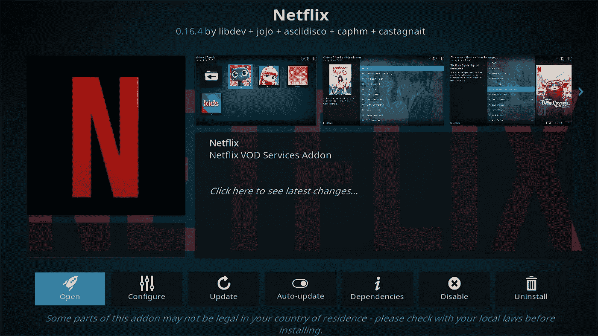
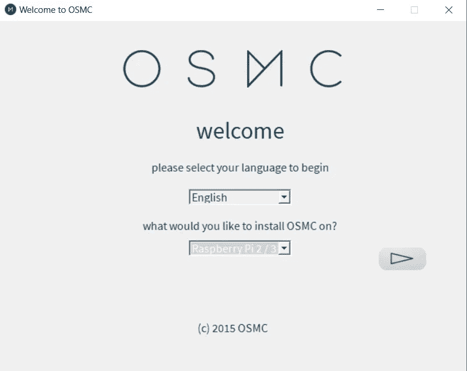
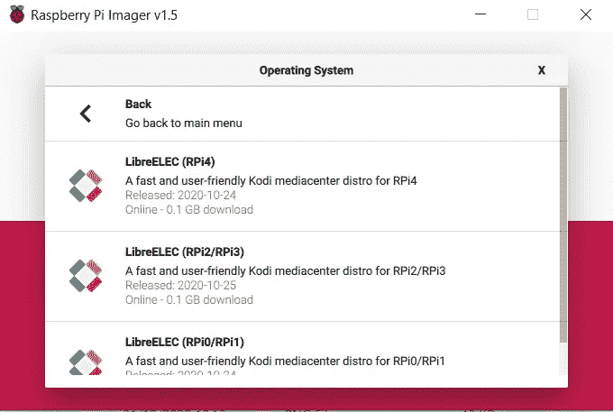
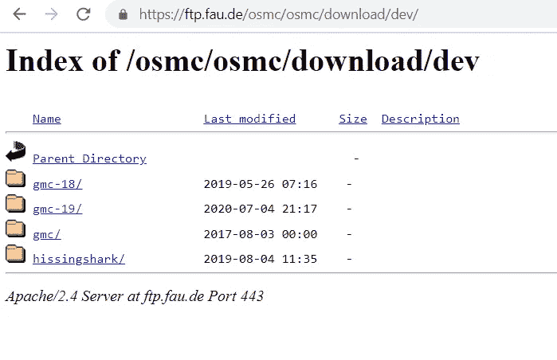
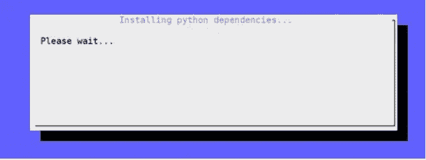
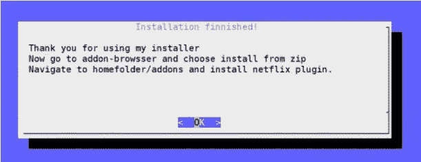
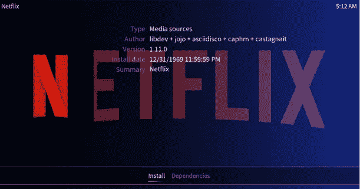
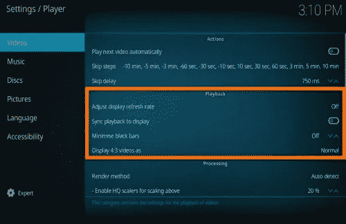
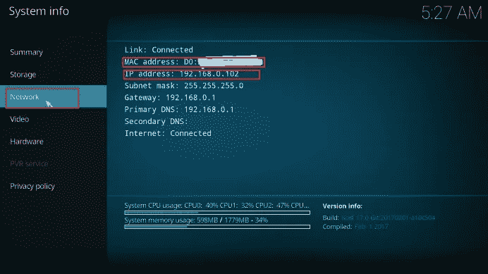
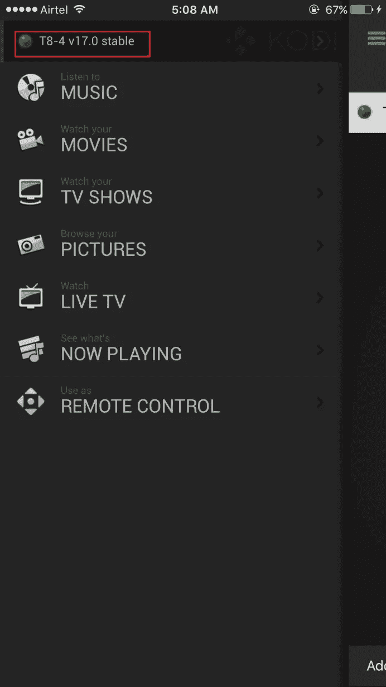

# 2021 年(以后)在 Raspberry Pi +智能手机上安装网飞作为遥控器的指南

> 原文：<https://itnext.io/the-2021-onward-guide-to-install-netflix-on-raspberry-pi-smartphone-as-the-remote-control-2e7662ccc80?source=collection_archive---------0----------------------->

最近，我一直试图寻找在树莓 Pi 中安装网飞应用程序的指南，但收效甚微，主要是因为过时的软件版本或其他现有教程中过期的文件签名。因此，我想编写这个综合指南，不仅包括在你的 Raspberry Pi 上安装网飞的步骤，还包括当某些错误发生时如何调试它。所以这个指南可以作为将来的参考。

我可能不会涵盖所有的先决条件，但如果你需要任何帮助，请在下面的评论中留言。

这是我将要介绍的目录，它们都是独立的，你可以直接跳到任何小节。

*   硬件列表
*   Raspberry Pi 支持的最高分辨率
*   在您的 Pi 上安装开源媒体中心/ LibreElec
*   更新 kodi 并在您的 Pi 上安装依赖项
*   安装网飞插件，以及如何使用它
*   优化视频播放设置
*   将 IPhone / Android 设置为您的遥控器

# 硬件列表

*   一台电脑
*   另一台显示器/电视(可能是播放网飞的显示器)
*   树莓 Pi 第三代/第四代
*   至少 16 gb 的 SD 卡
*   SD 读卡器
*   Usb 键盘(可能不需要鼠标)

# Raspberry Pi 支持的最高分辨率

因此..在纸上，树莓 Pi 4 可以渲染 4k，树莓 Pi 3B+可以渲染 1080p。但问题是，网飞视频需要软件解码，一些树莓 pi 根本不能处理 1080p。如果你追求更高的分辨率，视频会滞后，音频大部分时间会不同步。因此，如果您计划将 Pi 移植到您的大电视屏幕上，请务必查看下表，看看您的 Pi 是否能够提供您需要的分辨率。

请注意，截至 2021 年 1 月 1 日，没有任何 Pi 可以渲染平滑的 4K。

支持最高分辨率(我的意思是 100%平滑无延迟视频)

# 在您的 Pi 上安装开源媒体中心(OSMC) / LibreElec

要安装网飞，首先我们需要向我们的 Pi 添加一个媒体中心。

**【树莓派 3】**
我们将安装 OSMC。只需将 sd 卡插入电脑，访问 [OSMC 下载页面](https://osmc.tv/download/)，下载最新的 OSMC 客户端。用户界面会引导你完成设置，刷新你的 SD 卡并在上面安装 OSMC。

OSMC 安装用户界面

**【对于树莓 Pi 4】** 我们会安装 LibreElec。只需插入您的 sd 卡，访问 [Raspberry Pi 官方软件页面](https://www.raspberrypi.org/software/)并下载 Raspberry Pi 成像仪。按照 UI 安装 LibreElec。

# 升级 kodi 并在您的 Pi 上安装依赖项

将操作系统刷新到 SD 卡后。现在是时候将 SD 卡插入你的 Pi 并连接到另一台显示器上了，确保你也插入了 usb 键盘，因为我们有一些命令行要输入。

首先，我们需要访问 Pi 上的终端。接下来，我将把本指南分为 OSMC 和 LibreElec，分别对应于安装在 Pi 3 和 Pi 4 上的媒体中心。

**【第一步:OSMC】** 导航至电源图标，选择退出/退出。当 OSMC 屏幕出现在您的屏幕上时，按键盘上的`ESC`。这将调出终端。用用户名`osmc`和密码`osmc`登录。

**【第一步:对于 libre elec】**
在 Kodi 上，选择插件- >我的插件- >程序插件- >系统工具- >运行。([此处视觉引导](https://www.youtube.com/watch?v=7ZuDpNc12RI))

**【第二步:仅适用于 OSMC】** 现在使用您的电脑在[https://ftp.fau.de/osmc/osmc/download/dev/](https://ftp.fau.de/osmc/osmc/download/dev/)查看最新的 gmc 版本。

从这个 Apache 服务器上，您可能会看到一个 gmc 列表。截至撰写本文时，该列表显示最新的 gmc 版本为“gmc-19”。

支持的 gmc 列表

因此，假设 *gmc-19* 是网站中显示的具有最新修改日期的文件夹，请回到您 Pi 的终端

通过键入`sudo nano /etc/apt/sources.list` 打开源文件，现在滚动到文件的底部并添加这一行:
`deb [http://download.osmc.tv/dev/gmc-19](http://download.osmc.tv/dev/gme-19) gmc-19 main`

> 如果你以后读到这里，看到上面的网站上有一个版本名 gmc-20，你可以简单的把 gmc-19 替换成 gmc-20。

按 Ctrl-X，然后键入“Y”enter 保存并退出文件。

现在我们将为 gmc 添加证书。有效的证书将确保您下载的软件/ gmc 可以安全安装，并且默认情况下是必需的。

但是证书会过期，取决于你读这篇文章的时间，你可能需要检查最新的有效证书。要做到这一点，请回到 https://ftp.fau.de/osmc/osmc/download/dev/。假设你使用的是 gmc-19，点击`gmc-19`文件夹，然后转到`public`子文件夹。你可能会看到 1 个或更多的`pubkey`文件，选择最新的一个并简单地记住它的名字。截至撰写本文时，列表显示最新的 pubkey 为`pubkey-2020.asc`。

请回到您的 Pi 终端

这一次键入`wget -qO – [http://download.osmc.tv/dev/gmc-19/public/pubkey-2020.asc](http://download.osmc.tv/dev/gmc-19/pubkey-2020.asc) | sudo apt-key add -`

然后逐行键入以下命令来运行更新。

`sudo apt-get update
sudo apt-get dist-upgrade -y
sudo apt-get install rbp2-mediacenter-osmc -y`

**【第三步:适用于 OSMC 和 libre elec】**

最后，我们需要安装 pip 和 pycryptodomex。在终端中，请逐行键入以下命令。

`sudo apt-get install python-pip python-crypto build-essential -y
sudo apt-get install python-crypto-dbg python-crypto-doc python-pip-whl -y
pip install pycryptodomex`

# 安装网飞加载项

在最后一步的更新过程之后。呆在终端中，一行一行地输入下面的命令，准备下载网飞。

`wget [https://raw.githubusercontent.com/zjoasan/netflix-install-script/master/netflix_prep_install.sh](https://raw.githubusercontent.com/zjoasan/netflix-install-script/master/netflix_prep_install.sh)
chmod +x netflix_prep_install.sh`

`./netflix_prep_install.sh`

最后一行将运行。sh 文件并启动安装客户端

单击“确定”后，系统将重新启动。

重启后，我们需要在 Kodi 上安装网飞:

*   回到 Kodi 界面，进入主菜单
*   **点击设置>插件浏览器**
*   **选择“从 zip 文件安装”** 第一次会得到安全警告，更改设置允许未知来源。
*   选取“个人文件夹”
*   然后转到“插件”文件夹
*   **选择里面唯一的文件(网飞-回购 zip)**
*   这将添加 CastagnaIT 存储库
*   现在你可以进入**“从存储库安装”并选择这个存储库**
*   点击“视频插件”并安装网飞和所有的附件。
*   安装完成后，按两次 ESC 键返回主菜单

# 优化视频播放设置

我认为 kodi 上有一些设置可以改变，以使视频播放更加流畅。

默认情况下，Kodi 以 60fps 运行，但大多数网飞视频是 24fps，因此最好将显示与视频的帧速率同步。

设置/界面>播放器设置>视频>同步播放至显示器>打开

[https://kodi.wiki/view/Settings/Player/Videos](https://kodi.wiki/view/Settings/Player/Videos)

# 那么，我如何打开网飞？

网飞现已安装在您的系统上，要使用它，请按照下列步骤操作:

*   在 Kodi 主菜单中，**转到视频>视频附件**
*   选择网飞项目
*   输入您的网飞帐户电子邮件和密码登录
*   利润！

> 提示:在选择网飞插件之前，您可以按“C”查看选项列表，其中包括将网飞添加到收藏夹，这将应用程序添加到首页。

# 将 IPhone / Android 设置为您的遥控器

现在你应该使用键盘作为控制 Kodi 的主要输入。但是你可能想用你的智能手机作为遥控器。幸运的是，有很多开源项目也支持这一点。

首先，让我们将 Kodi 设置为通过 http 接受远程控制，并设置用户名和密码来进行安全控制。

*   在主页面上，点击**设置**图标
*   转到其下的**服务**选项，将设置级别设置为高级/专家。
*   导航到**控制**选项，然后允许通过 HTTP 进行远程控制，也允许从另一个系统上的应用程序进行远程控制。
*   设置用户名和密码。
*   **【仅适用于 IOS】**如步骤 1 所示，返回 Kodi 上的设置菜单，并导航至**系统信息**
*   **【仅适用于 IOS】**导航至**系统信息**并在网络下记录 IP 地址和 MAC 地址。你需要在 iPhone / iPad 上设置应用程序。

接下来，从相应的应用商店下载最后一个应用。

IOS: [官方 Kodi Remote](https://apps.apple.com/us/app/official-kodi-remote/id520480364)
Android:[官方 Kodi Remote](https://play.google.com/store/apps/details?id=org.xbmc.kore&hl=en&gl=US)

**【安卓】**
安卓设置相当简单。只要确保你的手机和树莓派/ Kodi 在同一个 WIFI 网络下，然后打开应用程序。按照指示操作，同一个 wifi 网络下的 Kodi 就会出现匹配并自动连接。

**【IOS 版】** 打开 app，点击添加主机。

现在输入我们从 Kodi 17 保存的详细信息，包括 IP 地址、Mac 地址、用户名以及密码，按保存。

然后你应该会在信号图标上看到一个绿灯，你应该可以相应地把它当作遥控器使用。

# 尾注

我希望这可以作为一次性指南涵盖一切。因此，我会尽我最大的努力保持这个职位不时更新。谢谢您们。

## 参考

> 如何在树莓皮上观看网飞，约翰·迈克尔
> 如何在 kodi 上观看网飞，RaspberryTips
> 如何使用官方 Kodi 遥控器