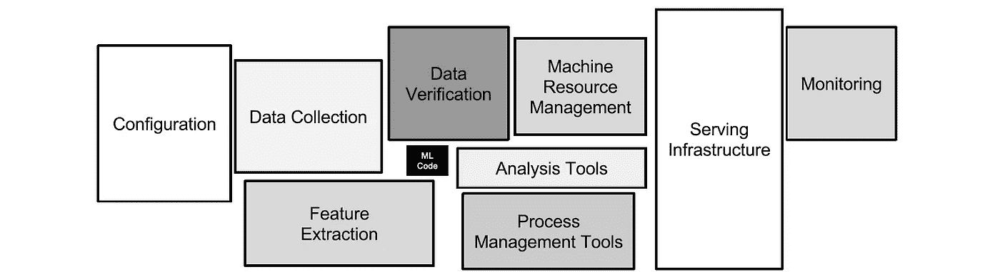

# 我在数据科学项目中想要的 5 样东西

> 原文：<https://itnext.io/the-5-things-i-want-in-my-data-science-projects-79dd3840bd24?source=collection_archive---------7----------------------->

## 我们如何相信你得到更快乐的人和更好的数据产品

不久前，我的同事 Dimitris Stafylarakis 和我在乌得勒支的大数据博览会上做了一个题为“更好的数据产品和更快乐的人:我们的哲学”的演讲。

我们是荷航数字转型部门数据科学团队的一员(Dimitris 是 LINKIT 的顾问，我是 Sogeti 的顾问)，这几乎是我一生中第一次能够以我认为数据科学工作应该完成的方式来组织我们的工作(好吧，注意事项适用，但你明白这一点)。

我也相信这种方法会让参与的每个人都更开心，并最终创造出更好的产品(当然，这两件事也有内在的联系)。

所以在这篇文章中，我会写下这一点；我们团队关于如何组织数据科学工作的理念。我将详细讨论 5 个方面，但在以后的博客文章中，我可能会扩展单个方面。我将假设我们谈论的是某种使用机器学习的面向用户的应用程序。

因为这个帖子看起来挺长的，我就在这里调侃一下 5:用户研究；数据驱动的决策制定；版本控制；基础设施；团队。嗯，当我这样说的时候，听起来有点明显，这让我更加担心我没有经常看到这样做。

如果你喜欢少看一些文字，我们的幻灯片可以在[这里](https://www.slideshare.net/webwinkelvakdag/better-data-products-happier-people-our-philosophy-big-data-expo-2019)找到。

系好安全带。乔恩·弗洛布兰特在 [Unsplash](https://unsplash.com?utm_source=medium&utm_medium=referral) 上的照片

**用户研究&以人为中心的机器学习**

这里的主要目标是找出你实际上应该创造什么。如果不是数据科学家的人要使用你的应用程序，你应该仔细了解他们实际上想要什么。这就是所谓的“用户研究”和许多其他名称(你可能会看到[以人为中心的机器学习](https://medium.com/google-design/human-centered-machine-learning-a770d10562cd)是它的一个专门化)。用户研究包括一种正式的方法来找出用户(将要使用你的应用程序的人)做什么以及他们为什么这样做。将人的需求作为开发的输入确保你的 ML 应用程序将解决真实的问题，而不是想象的问题。使用正式的方法，我的意思是你不能只是问一个利益相关者或者某个地方的经理你的应用应该做什么。你也不能直接去找潜在用户，问他们“我要为你做一个很酷的应用，你会用吗？”。必须尽可能客观地对待它，注意不要影响你将要得到的任何回应。用户研究帮助人们理解问题所在，而不是简单的假设。它包括与受问题影响的人交谈并花时间与他们在一起，例如观察用户的日常工作，以及用精心设计的问题进行采访。另一个很好的工具是所谓的[设计冲刺](https://www.gv.com/sprint/)，在这里你把一个有代表性的用户样本(和利益相关者)聚集在一起一整周，本质上设计和测试一个原型模拟应用，而不需要实际做任何编码。

最后，当你做了所有这些，只要涉众准备好接受结果，它就会带来更好的产品，即使结果是需要一个与最初想象不同的解决方案。但所有这一切都是一个迭代的过程，当然，你不会只进行一次用户研究。随着项目的发展，用户洞察和数据洞察之间会不断地来回转换。所有这些用户研究对于数据密集型应用程序尤为重要。在这些应用程序中，显示的数据几乎总是被派生和解释的，这意味着你的用户也要解释它，但不一定是以同样的方式！在迭代中做用户研究对解决所有这些问题非常重要。

我强烈建议找一个专业的服务设计师来做这件事。这完全是它自己的专长。我的团队有幸拥有一位优秀的服务设计师，我从他身上学到了很多，但这仍然是一个如此专业化的领域，没有他我是不会离开家的。

我提到过你应该阅读凯西的《数据驱动》吗？再想想“岗位？你应该。插图作者:[保罗 J.](https://twitter.com/pivotservices/status/1062234390493884416?s=19)

**数据驱动的决策**

“数据驱动”当然是一个巨大的时髦词，因此它可能意味着许多不同的事情(包括“没有”)。但是在这里我想讲一个非常具体的有着相当严格定义的东西。我先说一个愚蠢的例子(我受凯西·科济尔科夫的影响很大[)。数据驱动决策(简称 DDDM)意味着当我在商店里看到我喜欢的东西时，我会*而不是*看价格标签。我做的第一件事是决定我准备支付的最高价格。只有在做出这个决定后，我才会看价格标签。在这一点上，选择是自动的。当我在商店的时候，我实际上不会亲自这样做(虽然我可能应该这样做)。但是在我们的工作中，这实际上是我们如何决定如何运行我们的项目。](https://hackernoon.com/data-inspired-5c78db3999b2)

让我们回到荷航数字化转型的大部分项目是如何运行的。这可能对你们很多人来说非常熟悉；这是一个创新漏斗，由构思、基础、概念验证和 MVP 组成。如果你已经这样做了，你可以跳到下一段。对于那些还在读书的人；数字化转型产生了许多“帮助我们的员工做他们最擅长的事情”(我们的实际任务)的想法。我们将从这些中研究出一批，我们称之为“基础”，包括计算出可行性、生存力和可取性。其中一些将被认为值得进入概念验证的下一阶段。最后，一些 PoC 将被进一步开发成最低限度可行的产品。

你如何决定一个想法或项目是否进入下一阶段？我们的团队通过数据驱动的决策来做到这一点！在我们开始任何阶段的任何工作之前，我们首先决定我们将在阶段结束时检查的决策边界。通常，确定决策界限意味着我们要弄清楚在这个阶段我们要回答哪些问题，或者要度量哪些指标。然后，我们告诉决策者这是事实，并要求他们设定可行/不可行的界限。当然，这也可以是在任意数量的不同后续场景之间的选择，而不是去/不去的决定。也许决策者想改变我们要回答的问题或我们要衡量的指标，但这很好！这意味着在工作开始之前，您将对范围有一个非常明确的讨论。确定决策界限后，我们开始工作(当然要让涉众充分了解)，到达阶段的末尾，报告问题的结果和定义的度量标准，然后您*自动*获得进行/不进行(或其他场景)的决策。

DDDM 的主要目标是做出更好的决策，或者至少更明智，更少偏见。一般来说，人们很不擅长做决定，其中一个原因是确认偏差。我们倾向于只看到或考虑那些在潜意识(希望如此)层面上证实我们已有观点的数据或观察结果。练习 DDDM 可以防止在昂贵的分析或项目上浪费金钱和时间，如果决策是基于直觉的话！

对我来说，对我们的团队来说，有比这更重要的事情。它是范围和利益相关者管理的清晰性。最简单地说，由于设定的决策界限，我们总是知道我们的团队和我们的工作将被评判，在这方面不会有不确定性。这种机制也迫使涉众在涉及范围扩展、路线图、评审时采取更可靠的行为，他们更难改变主意！

**版本万能！**

这是发自内心的。我在学术界和商界都做过很多项目，包括为数据、建模和评估管道编写代码(当然也包括执行代码)。在所有这些项目中，有一个不变的因素:麻烦(和徒劳！)试图记录你一直在做什么，为什么没有成功，以及“几个月前我是如何得到这个结果的？”。

在任何涉及数据、数据处理、建模和评估的项目中，您的结果取决于:原始数据、处理代码、建模代码、评估代码、所有这些代码的参数、数据中的随机性、随机种子等。等。因此，跟踪*所有这些*非常重要，原因如下:

*   再现性
*   了解您的模型
*   调试您的代码
*   诊断您的结果
*   效率

在开发过程中，你会运行你的管道很多次，它们也可能会占用相当多的时间。因此，您希望尽可能地重用中间结果。或者您可能想这么做，但是现在更改代码以重用一些旧的东西太费力了，所以您只是重新运行了整个管道，但是结果突然变了！什么？怎么会？你不知道，因为你已经覆盖了旧文件，因为你不认为会有什么不同。你能把你的东西拼凑起来找出发生了什么吗？那需要多长时间？

所以，版本*所有*你的东西，永远不要运行自定义命令(或肮脏的黑客)没有办法恢复和再现它。

有许多框架可供您使用。就我个人而言，目前我们使用 [MLFlow](https://mlflow.org/) 来记录所有的参数和结果。此外，gin-config 创建配置文件(因为我有很多参数),这些文件又被保存到 MLFlow 中，因此重新运行旧的运行几乎没有什么困难。请注意，MLFlow 还跟踪运行开始时的提交和入口点，因此您还可以恢复执行运行时使用的代码和命令(当然，如果您使用的是 Git，但如果您没有使用，您在做什么呢？).只要记住在进行一次严肃的(非代码开发)运行之前提交任何更改。

对于数据版本控制，我们在玩厚皮动物。这对于原始数据的版本控制非常有用。第二种重要的数据版本控制更像缓存；您希望重用中间结果以节省时间(和/或存储空间)。对于第二种类型，我们还没有实现任何东西。我们可以自己用一些 MLFlow 或 MLFlow 之类的东西把它拼凑起来，但真正有用的是一个框架，它可以自动检测 DAG 的哪些部分已经更改了代码或更改了参数，并只重新运行它的必要的下游部分。在这方面，气流、Luigi 或 d6t-pipe 可能是我们未来关注的候选产品。

来自斯卡利等人的一篇论文:“只有一小部分真实世界的 ML 系统由 ML 代码组成，如中间的小黑框所示。所需的周边基础设施庞大而复杂。”这让你的生活更加艰难。

**基础设施和架构**

数据科学工作流通常用“加载数据、特征提取和工程、培训、评估、服务”流程的一些变体来说明，偶尔用一个返回箭头来指示迭代。也有很多关于数据探索、数据理解、业务理解和模型训练之间的相互作用的图表。所有这些都很有用，描述了数据科学工作的基本部分。但是作为构建实际日常工作流的蓝图，更不用说向非数据科学工程师或架构师解释它，或者设置工具和基础设施来支持它，它们是相当无用的。

数据科学家的工作是非常反复的。一个生产化的模型是一个复杂的野兽，有许多活动的部分。理想情况下，这两件事都应该得到基础设施的支持，一方面，基础设施可以自动化(或隐藏或删除)重复或复杂但可概括的工作，另一方面，也可以让数据工程师和科学家创建他们觉得需要创建的东西，而不是将他们束缚起来。

支持该工作流的基础设施(以及我们谈到的版本控制)目前正在以多种形式进行大量开发。我不认为目前有一个公认的行业标准(不，尽管我使用 Jupyter 笔记本电脑，但它不能算作基础设施——除非你对它们进行所有的网飞测试)。但是有很多开源工具(通常基于 Kubernetes)已经在让我们的生活变得更容易方面做了很多工作。

**团队**

最后，在提到的所有方面中，对我个人来说最重要的是团队。我已经花了足够多的时间独自做项目，虽然我承认从中学到了很多，但最终它只是吸走了我的快乐和动力。根据我与许多现任和前任同事的交谈，许多(数据)科学家都有同感。这可能也是我离开学术界的主要原因。

对许多人来说，成为团队的一员是享受工作的必要条件。在这篇文章的其余部分，我将暗示这适用于每个人，但这当然不完全正确。因此，团队会因为各种原因让工作变得更愉快；有更多的社交互动，你可以交流有趣的想法，你可以快速重复想法，很容易寻求快速帮助或快速提示，你可以更快地完成一个项目，分享在无聊部分的痛苦和时间，但分享有趣的部分，等等。

你不能把一些人扔在一个房间里，然后称之为团队。同样重要的是拥有正确的技能组合。我之前在这篇文章中提到的所有方面都需要非常特殊的技能。一方面是技术技能；数学和统计部分、机器学习、数据工程、基础设施和软件架构。另一方面，我们有从业务和用户到数据科学的转化技能，以及创建数据驱动的面向用户的应用程序所涉及的所有其他非技术专业知识，如利益相关者管理和 Scrum/Agile。即使不考虑所需的深度，这也是相当宽的范围！

一个典型的团队，我会说，应该至少由 7 个人组成:4 个技术人员(假设 2 个数据科学家和 2 个数据工程师)，一个产品负责人，一个用户体验专家和一个 scrum 大师。但这当然不是蓝图。最重要的是你得到了具有所需技能的人，不同的技能如何对应不同的人并不重要。例如，项目中的高级数据科学家可能会与产品负责人一起分担任务，对待办事项进行优先级排序，并将其转化为业务。如果产品负责人确实擅长利益相关者管理(而这位高级数据科学家不擅长)，但没有数据科学背景，这可能是一个好主意。重要的是，人与人之间的技能会有重叠，这意味着团队中总会有其他人，你可以就你的主题与他们展开辩论。根据我的经验，这对数据科学家来说尤其重要。这就是为什么我说至少有 2 名数据科学家和 2 名数据工程师。如果你喜欢流行词，你可以在前面的句子中插入“T 型”，只要你不把它解释为“每个人都必须做一点事情”。

也许不是所有的人都需要全职在团队中，也许你需要根据你的项目增加或减少一些技能。多几个技术人员也很好(甚至可以鼓励)，比如说，在团队内部出现太多开销和混乱之前，总共 9 个人。

让团队完成工作还有很多更实际的业务相关优势。我仍然看到在我周围经常发生的事情是，数据科学家被放在他们自己的项目上，或者可能与另一个数据科学家一起。当然，他们可能会很好地交付一些惊人的工作，也许你已经发现了一个集所有技能于一身的独角兽。但找到独角兽或获得真正令人印象深刻的结果(同时具备高质量和高效率)的概率真的非常小。如果你的马厩里碰巧有一只独角兽，你会变得非常依赖一个个体，同时这个个体很可能一直收到更好的报价，不会逗留很长时间。对于高效的*和*高质量的工作，所需技能的数量如此之大，以至于大多数人(甚至可能包括独角兽)肯定不擅长至少其中的一些技能。

更明确地说，拥有一个完整的项目团队具有以下所有优势:

*   对变更(团队或项目)更加可靠和灵活
*   在保留知识和专业技能方面更经得起未来考验
*   更加物有所值(我可以自信地说，一个 8 人团队连续做 4 个项目(或者部分重叠)会比 4 个 2 人团队分别做 4 个项目更有效)
*   每个人都更快乐，因为他们可以专注于他们最擅长的事情

**闭幕词**

这就是，当我着手一个数据科学项目时，这是我想要的 5 样东西。很明显，我受到了其他人在这些问题上的想法和文章的影响和启发，我对此表示感谢，因为这些事情对我对一个项目的满意度有着巨大的影响，不管它的技术内容如何。你强烈反对吗？我很有兴趣听听！