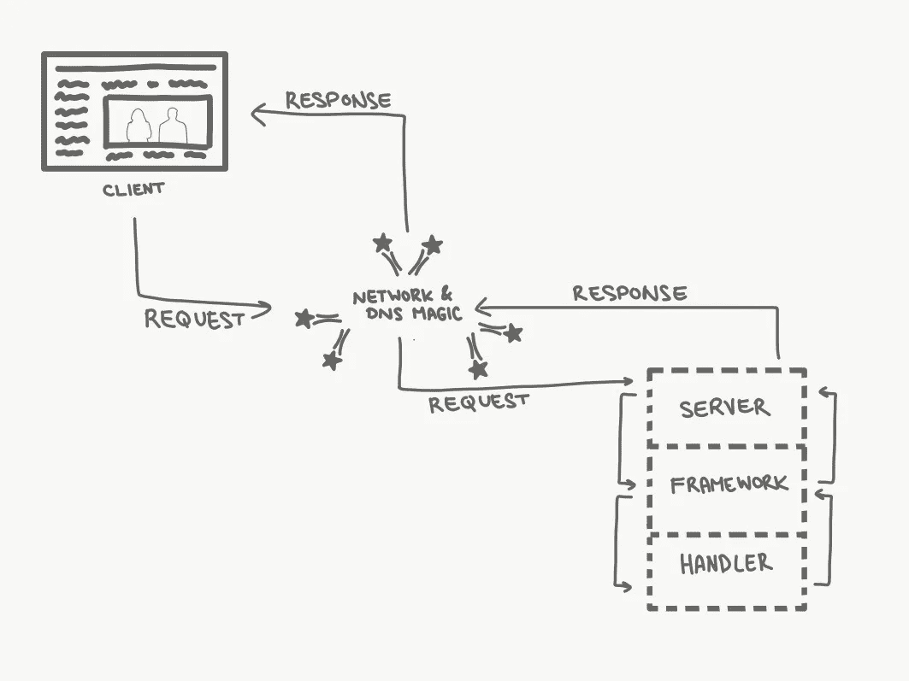

# Web 应用程序的绝对初学者指南

> 原文：<https://itnext.io/the-absolute-beginners-guide-to-web-applications-9590308b37ae?source=collection_archive---------1----------------------->

Clem Onojeghuo 在 [Unsplash](https://unsplash.com/s/photos/internet?utm_source=unsplash&utm_medium=referral&utm_content=creditCopyText) 拍摄的照片

当我接到一个我认识的初级开发人员的电话时，我正远离我的电脑。她在上传 web 应用程序到 Azure 时遇到了问题，问我是否可以帮忙。我从未使用过 Azure，但我认为 Visual Studio 有一个类似“发布到 Azure”的按钮。然而，她无法从 Azure 教程中理解困难所在(除了她没有使用 Visual Studio 这一事实，所以我认为按钮是完全不相关的)，她说:“我知道后端必须放在服务器上，但前端文件放在哪里？”

"你知道网络服务器是如何工作的吗？"，我问。“我想没有”，她回答。

如果你觉得这很愚蠢，这篇文章不适合你。我允许你去读别的东西。这篇文章是写给我的，大约 10 年前，我建立了我的第一个个人网站。

我想我从事 web 开发已经有几年了，但是我们有 DevOps(在它被称为 devo PS 之前),所以部署过程对我来说是一个谜。托管公司的教程是出了名的看不懂，我也是类似的情况。我不知道我在做什么，T4。

根据我的经验，许多开发人员，甚至一些积极编写 web 应用程序的开发人员，并不了解 web 应用程序在最基础的层面上是如何工作的。人们在互联网上找到的大多数教程在解释如何使用他们特定的 web 开发框架时都假设这些知识已经存在，这使得对于一个完全的初学者来说很难理解。在这篇文章中，我希望能弥补一些差距。

# 没有“互联网”

> 任何足够先进的技术都和魔法没什么区别。—亚瑟·C·克拉克

你们中的一些人可能听说过“没有云，这只是别人的电脑”，这是互联网的普遍情况。互联网只是一大堆连接在一起的电脑。

简单来说，每台连接到互联网的计算机都有一个地址，称为 IP(互联网协议)地址。通过通信协议 magic 和一些中央服务提供商，请求可以被发送到使用*它们的* IP 地址的其他计算机，而响应被发送回*你的* IP 地址。

照片由[克里斯多佛罗拉](https://unsplash.com/@krisroller?utm_source=unsplash&utm_medium=referral&utm_content=creditCopyText)在 [Unsplash](https://unsplash.com/s/photos/magic?utm_source=unsplash&utm_medium=referral&utm_content=creditCopyText) 拍摄

你的 IP 地址看起来有点像`168.31.1.1`。这可不容易记住。比方说，如果你正在建立一个关于如何建立网站的网站，并且你希望人们能够记住如何到达那里——你可能想要一个容易记住的地址，而不是一串数字。这是你在网络浏览器地址栏中看到的漂亮名字，例如:`www.absolutebeginnersguidetowebapplications.com`，不过我可能会推荐一个更短的名字。

既然您已经购买并注册了一个漂亮的域名，并将其映射到您的 IP 地址，那么有一种称为 DNS(域名服务)服务器的特殊服务器，它知道如何将流量从这个漂亮的域名路由到您的 IP 地址。由于全球有许多这样的服务器，你的域名传播到互联网可能需要一些时间，但通常这个过程会在 24 小时左右完成。

延伸阅读: [IP 地址](https://en.wikipedia.org/wiki/IP_address)， [DNS](https://en.wikipedia.org/wiki/Domain_Name_System) ， [Julia Evans 在 Twitter 上](https://twitter.com/b0rk)，[一个不吓人的计算机网络入门](https://medium.com/@Cupofcode/a-non-scary-introduction-to-computer-networking-cup-of-networks-part-1-9f76583dc8ca)。

# 我能帮你什么吗？

照片由[亚历山大·奈特](https://unsplash.com/@agkdesign?utm_source=unsplash&utm_medium=referral&utm_content=creditCopyText)在 [Unsplash](https://unsplash.com/s/photos/customer-service-robot?utm_source=unsplash&utm_medium=referral&utm_content=creditCopyText) 上拍摄

一旦我们建立了域名，我们需要让其他电脑能够从我们的电脑上请求*东西*，比如网页、电子邮件和其他文件。如果你设置了你的电脑来响应这样的请求，恭喜你！你有一个*服务器*。为了让你的计算机像服务器一样工作，你安装了一个服务器应用程序，它知道如何神奇地路由来自*客户机*的请求，让它们得到正确的*响应。*

因为我关注的是 web 应用程序，所以我将讨论 HTTP 服务器——服务于 web 页面的类型，尽管这些原则也适用于其他类型的服务器。

客户端是计算机上的一个应用程序，它向网络服务器发送一个请求。最明显的客户端类型是 web 浏览器，但是其他应用程序通常使用 HTTP 调用从后台服务器获取信息。这样一个 r*request*使用一个 u *rl* 发送，它包含了我们想要什么以及我们想从哪里得到它的信息。

## 示例:

`*http://www.my-site.com/page?id=123456&cat=789*`

此 *url* 分为以下几个部分:

*   `*http://*`是我们正在使用的协议。用于 web 请求的 HTTP。
*   `*www.my-site.com*`是服务器的地址。还记得我们映射到 IP 地址的奇特域名吗？这就是了。
*   `*/page*`是我想在那个服务器上访问的资源，也就是 route。
*   `*?id=123456&cat=789*`一切都结束了吗？被称为*的参数*。这些是由 *&* 分隔的键=值对，允许我们发送服务器可以使用的附加信息。

延伸阅读: [Web 服务器](https://en.wikipedia.org/wiki/Web_server)， [HTTP](https://en.wikipedia.org/wiki/Hypertext_Transfer_Protocol) ， [URL](https://en.wikipedia.org/wiki/URL) 。

# 服务器就像生日蛋糕

安妮·斯普拉特在 [Unsplash](https://unsplash.com/s/photos/layer-cake?utm_source=unsplash&utm_medium=referral&utm_content=creditCopyText) 上拍摄的照片

一旦请求到达服务器，它就被路由到某种处理器，知道如何处理请求并返回正确的结果。

默认的处理程序是针对静态资源的。静态资源是按原样发送给请求它的客户机的文件，没有任何进一步的处理。没有个人或动态信息，只有一个存储在服务器上的文件。

只使用静态文件是非常有限的，因为你向进入你的站点的每个人显示完全相同的内容。想象一下，社交媒体是一个静态的内容网站，每个人都看到同样的东西，什么都不会改变？看着油漆变干会更有趣。

这就是为什么我们在互联网上看到的大多数内容都是用运行在服务器上的代码动态构建的。这使我们能够根据自己的逻辑显示不同的内容。这可能是简单的用你的注册名问候你，或者在付费墙后面隐藏内容，也可能是复杂的社交媒体网站上完全个性化的体验。

让我们用生日蛋糕来比喻:

*   服务器的第一层是物理服务器——有网络连接的计算机)。它接收请求。
*   下一层是 web 服务器应用程序——一个知道如何解析请求并将其发送给处理程序的软件。
*   最后一层是处理程序——特定于请求的软件，它知道创建和返回哪些内容。

最后两层是大多数开发人员参与的地方——他们安装一个 web 服务器应用程序，决定他们将使用哪个框架，并为每条路线实现处理程序。

处理程序只是一种方法，它获取参数并运行代码，以客户端可以使用的形式向客户端返回响应。请注意，即使在动态内容中，静态文件也有重要的作用。我们将在下一节中对此进行更多的讨论。

延伸阅读:[ASP.NET](https://dotnet.microsoft.com/apps/aspnet)、 [Spring](https://spring.io/) 、 [Node.js](https://nodejs.org/en/) 、 [Pylons](https://pylonsproject.org/) 以及更多任何编程语言的 web 框架。

# 让我在那上回复你

由 [Pavan Trikutam](https://unsplash.com/@ptrikutam?utm_source=unsplash&utm_medium=referral&utm_content=creditCopyText) 在 [Unsplash](https://unsplash.com/s/photos/customer-service?utm_source=unsplash&utm_medium=referral&utm_content=creditCopyText) 上拍摄的照片

我之前提到过，处理程序返回客户端可以使用的响应。但是客户端可以使用什么响应呢？又是怎么做到的？在这一节中，我将在一个非常抽象的层次上解释浏览器能做什么，以及我们需要提供什么来让它们做到这一点。

## 超文本标记语言

这是任何网页的入口点。浏览器知道如何解析和显示 HTML(超文本标记语言)。HTML 代表了网页的结构，并告诉浏览器*显示什么*——标题、内容、表格等等。许多处理程序返回 HTML 内容。

## 半铸钢ˌ钢性铸铁(Cast Semi-Steel)

CSS(层叠样式表)告诉浏览器*如何*显示 HTML 内容。这就是网页漂亮(或丑陋……)的原因。它决定了使用哪种字体，字体大小，背景颜色，页面布局等等。

## Java Script 语言

浏览器还可以运行 J *avaScript* *代码*使 HTML 在浏览器内部动态变化(甚至无需联系服务器获取更多信息)。

JavaScript 也可以用来进行后台 AJAX(异步 JavaScript 和 XML)调用。这允许客户端发出请求并从服务器接收响应，而无需导航到另一个页面。大多数现代网页都经常这样做*，因为这样会让用户体验更流畅。*

## JSON

JSON (JavaScript Object Notation)是否应该有自己的头是有争议的，因为它“仅仅”是序列化对象的一种方式，但既然它是当今 web 如此重要的一部分，我认为它应该获得荣誉。

JSON 是一种键值文本符号，表示一个序列化的对象。通常，处理程序不会返回 HTML，而是返回对象，然后由浏览器中的 JavaScript 解析并处理成 HTML，可以动态地添加到页面中。

## 静态资源

CSS 和 JavaScript 都可以内嵌编写，直接嵌入到 HTML 内容中。然而，由于它们往往又长又复杂，而且大多数网站在不同的页面上重复使用它们，所以将它们放在单独的文件中是很有用的。这些文件在 HTML 中被声明为元素，浏览器“知道”它必须从服务器下载它们。

在 HTML 中声明并由浏览器自动下载的其他静态资源可以是特殊字体、图像和其他嵌入媒体(例如，视频或 gif)。

所有这些文件都存储在服务器(或不同的服务器……)上的某个地方，并使用静态资源处理程序进行检索，通常没有任何自定义代码，只有 web 服务器提供的默认处理程序。

> HTML、CSS、JavaScript 都被认为是“前端”,因为即使它们*来自服务器*,它们也是由客户端解析和执行的。服务器上发生的一切——处理程序中执行的代码、对数据库的访问等。被认为是“后端”。

延伸阅读: [HTML](https://en.wikipedia.org/wiki/HTML) ， [CSS](https://en.wikipedia.org/wiki/Cascading_Style_Sheets) ， [Javascript](https://en.wikipedia.org/wiki/JavaScript) ， [AJAX](https://en.wikipedia.org/wiki/Ajax_(programming)) ， [JSON](https://en.wikipedia.org/wiki/JSON) 。

我希望这让您对 web 应用程序如何工作有了一个高层次的了解。我*确实*建议你探索我添加的一些链接，以便进一步阅读，但是这篇文章应该足以给你一个理解特定 web 框架教程的起点，如果你不知道客户端文件是如何到达客户端的，这可能会非常混乱。

现在去构建你自己的 web 应用程序吧。你完全明白了！