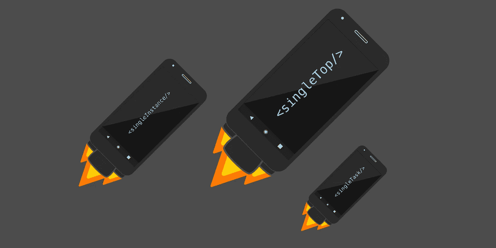
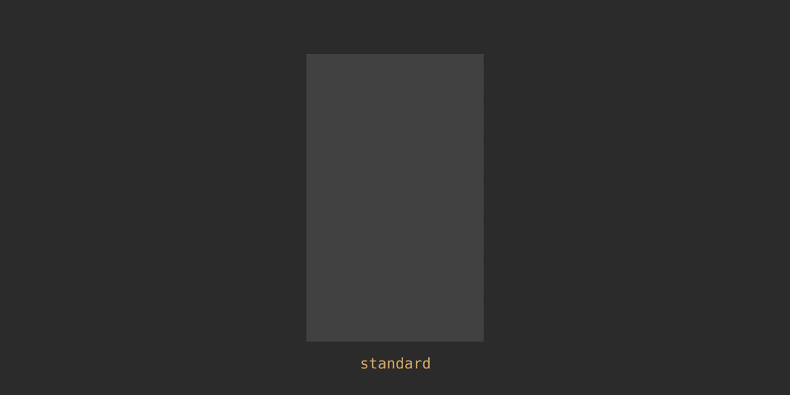
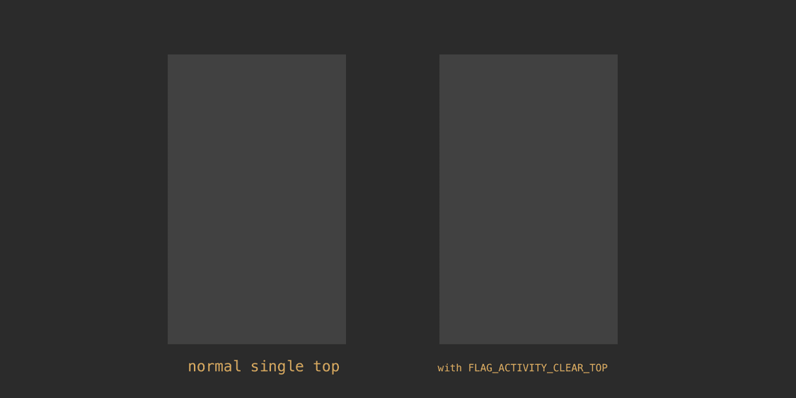
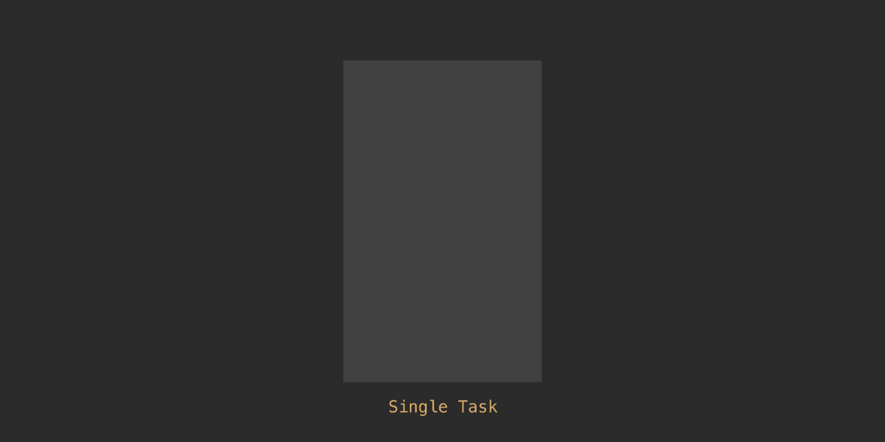
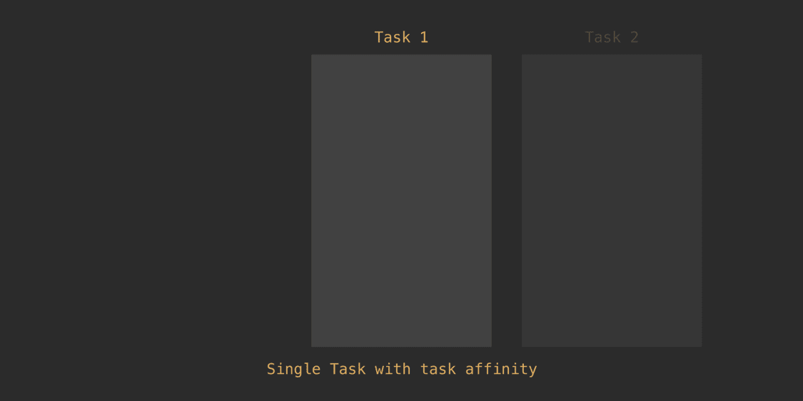
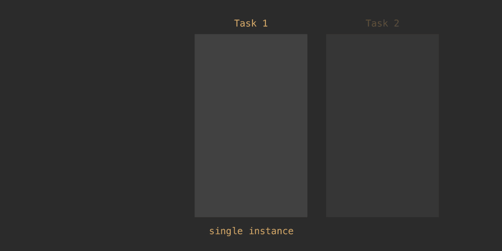

# Android 启动模式动画备忘单

> 原文：<https://itnext.io/the-android-launchmode-animated-cheatsheet-6657e5dd9b0f?source=collection_archive---------2----------------------->



在 API 11 之前，我们使用活动在屏幕上显示每个新页面。现在有了片段和 API 28 中的导航工具，完全有可能只用一个活动来制作一个非常复杂的应用程序。然而，活动仍然是将你的应用分成阶段和过程的好方法。也许你想把所有的营销分成一个活动，并在自己的活动中有实际的应用程序。也许你想为某个功能保留一部分，比如聊天服务。了解活动启动模式有助于您以对用户有意义的方式更好地划分这些过程。坐在办公室里，我总是记不住启动模式，所以我想我会写一篇关于它的博客，制作一些 gif 动画来说明这些概念，然后与大家分享。尽情享受吧！

在讨论启动模式之前，让我们首先了解任务的角色。一个任务包含一组活动，这些活动排列在一个称为 backstack 的堆栈中。任务中启动的第一个活动是根活动。在根活动上按 back 按钮不仅会终止活动，还会终止任务，甚至可能终止应用程序。

现在让我们深入了解一些启动模式！

假设您有一个任务，其根活动称为活动 A，然后启动一个名为 B 的新活动，B 被推到堆栈的顶部。现在，假设您从我们刚刚创建的 B 启动了另一个活动 B，您现在将有两个活动 B 的实例堆叠在一起。如果用户按下 back 按钮，他们将返回到活动 b 的另一个实例，这可能会让用户感到非常困惑。活动在彼此之上的堆叠和创建，不管是什么，都称为**标准**启动模式。如果清单中的活动 XML 中没有定义启动模式，则该活动将使用标准启动模式。



既然我们看到了标准模式是如何让用户不舒服，我们现在可以理解**单顶**发射模式。这种启动模式阻止相同活动的不同实例堆叠在一起。假设活动 B 是单顶。我们可以像这样在清单中定义启动模式:

```
///AndroidManifest.xml
<application
    ...>
    <activity android:name=".Activity_A">
        <intent-filter>
            <action android:name="android.intent.action.MAIN" />
            <category android:name="android.intent.category.LAUNCHER" />
        </intent-filter>
    </activity> <activity android:name=".Activity_B" android:launchMode="singleTop"/> <activity android:name=".Activity_C"/>
    <activity android:name=".Activity_D"/>
</application>
```

因此，现在如果您从活动 B 启动活动 B，而不是创建 B 的新实例并将其堆叠在旧的 B 之上，则意图被传递到 B 的当前实例中。在一个任务中拥有同一活动的两个实例的唯一方法是从 B 启动不同的活动，然后从该活动创建 B。单顶启动模式的主要概念是，不能将同一活动的两个实例堆叠在一起。

如果在使用单顶启动模式时，您不希望一个任务中有两个相同的单顶活动实例，则可以在您的意图中传递 FLAG_ACTIVITY_CLEAR_TOP 常量。为了说明这一点，我们假设您的活动堆栈是 ABC (B 仍然是单顶)。如果你用 FLAG_ACTIVITY_CLEAR_TOP 从 C 启动 B，你的栈将一直弹出到 B，并且意图将被传递到 B 的那个实例。

```
// code example for passing the constant flag in your intentIntent intent = new Intent(this, Activity_B.class);
intent.addFlags(Intent.*FLAG_ACTIVITY_CLEAR_TOP*);
startActivity(intent);
```



下一个发射模式叫做**单任务**。在这种启动模式下，我们声明在应用程序的所有任务中，一个活动只能属于一个任务。因此，类似于 FLAG_ACTIVITY_CLEAR_TOP 行为，如果您的堆栈是 ABC，并且您从 C 启动 B(单个任务),我们会一直弹出到 B，并将意图传递给该实例。

```
<activity android:name=".Activity_B" android:launchMode="singleTask"/>
```



但是如果我们希望 B 在它自己的任务中呢？这就是任务相似性发挥作用的地方。任务关联性允许您定义活动属于哪个任务。默认情况下，活动与其根活动具有相同的任务关联性。有了任务关联，我们现在可以将活动分成不同的任务。

```
<activity android:name=".Activity_A"
    android:taskAffinity="com.affinity.of.a">
    <intent-filter>
        <action android:name="android.intent.action.MAIN" />
        <category android:name="android.intent.category.LAUNCHER" />
    </intent-filter>
</activity><activity android:name=".Activity_B" 
    android:launchMode="singleTask"
    android:taskAffinity="com.affinity.of.b"
    />
```

这里，活动 A 和活动 B 具有不同的任务关联性。当在任务 1 中创建 A 时，C 从 A 启动。默认情况下，每个活动与其根具有相同的亲缘关系，因此我们仍然在任务 1 中。现在 B 从 c 启动。B 具有不同的任务关联性，因此它现在是 Task 2 的根，Task 2 然后移动到前台。如果我们从 B 启动活动 C 的一个新实例，C 属于 Task 2，因为它是根活动(在本例中是 B)的 task affinity。但是如果我们现在在任务 2 中尝试从 C 启动 A 呢？因为 A 的关联是任务 1，所以我们从任务 2 转移到任务 1，一路弹出回到活动 A，最后将意图传递给 A。



了解单个任务有助于我们更好地理解最终的发射模式；**单实例**。像单个任务一样，具有单个实例的活动可以是所有任务中唯一的活动。两者的区别在于，具有单个实例的活动也可以是任务中唯一的活动。

```
<activity android:name=".Activity_B"
    android:launchMode="singleInstance"
    android:taskAffinity="com.affinity.of.b"
    />
```

在本例中，活动 B 的启动模式为单实例。Task 1 中的 Activity A 启动 Activity B。这使得 Activity B 在一个新的 Task 中启动，然后被放在前台。然后，活动 B 启动活动 C。由于单个实例可以是任务中的唯一活动，因此，在任务 1 中，C 在活动 A 之上启动，然后任务 1 进入前台。

任务相似性在单个实例中也起作用。如果活动 B 没有任务关联性，则用户不能导航回任务 1。如果 B 具有任务相似性，用户将能够在任务 1 和任务 2 之间来回切换。



了解启动模式有助于我为用户提供更好的 UI/UX 体验，甚至帮助我解决一些令人头疼的问题，所以我希望这些信息也能帮助你！

我想为 Anil Deshpande 的 CodeTutor youtube 页面大声欢呼，它帮助我更好地理解了这个概念。这是关于这个主题的七个视频中的第一个:[*【https://www.youtube.com/watch?v=m8sf0UkJkxo】*](https://www.youtube.com/watch?v=m8sf0UkJkxo)