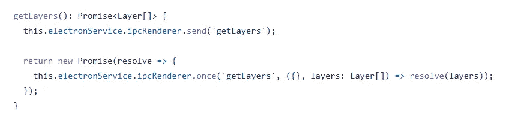
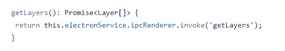

# 与您的 Javascript 框架保持同步的艺术

> 原文：<https://itnext.io/the-art-of-staying-up-to-date-with-your-javascript-framework-5b0113d6d82?source=collection_archive---------4----------------------->

照片由[马尔科·布拉泽维奇](https://www.pexels.com/@kerber?utm_content=attributionCopyText&utm_medium=referral&utm_source=pexels)从[佩克斯](https://www.pexels.com/photo/assorted-color-artwork-equipment-set-1053687/?utm_content=attributionCopyText&utm_medium=referral&utm_source=pexels)拍摄

# 介绍

今天，流行的 Javascript 框架(Angular，React，Vue)在发布新版本时会应用语义版本化，该版本修复了重要的错误或添加了新的令人敬畏的功能。添加新功能不仅为开发人员提供了新的功能，还使他们能够跟上新出现的 web 标准和技术。

# 为什么不升级

对于自由职业者或初创公司来说，更新 Javascript 框架可能是一件简单的事情，但在企业软件开发领域却不是这样。公司通常很难跟上最新的更新。升级到新版本是一个痛苦的过程，原因如下:

1.  该项目的代码库很大，并且包含较新版本不支持的框架功能。一个这样的例子是在一个 **AngularJS** 到 **Angula** r 的项目迁移中，其中像`$rootScope`这样的服务很难更新。
2.  一个项目的开发跨越了许多团队，可能跨越了不同的国家，他们之间的协调是一个复杂的过程。
3.  在产品计划中，新功能具有更高的优先级。利益相关者或产品所有者更关心为他们的客户提供附加值。
4.  基于合同的产品，在一定的生命周期内得到支持，然后被放弃。

# 为什么升级

从最终用户的角度来看，更新到新版本的好处可能不会立即显现出来。它最终将使开发人员能够构建出色的功能并改善用户体验。为了更好地理解这一点，让我描述一下在 [Plexscape](https://plexearth.com/) 开发**地图浏览器**的过程中，升级是如何帮助我们的。

## 地图浏览器

地图浏览器是一个基于[electronijs](https://www.electronjs.org/)的 Angular 应用程序，支持 **Plex。我们的旗舰产品 Earth** ，可以连接全球不同的地图提供商并创建定制地图。 **ElectronJS** 是一个 Javascript 框架，构建在 Node.js 和 Chrome v8 引擎之上，帮助开发人员利用 Javascript、HTML 和 CSS 构建跨平台的桌面应用。

## 与电子交流

电子应用程序由两个进程组成:用于创建和显示 web 页面的主进程和运行 web 页面的呈现器进程。可以使用适当的模块访问每个进程。主进程由`ipcMain`模块管理，渲染器由`ipcRenderer`模块管理。

## 使用回调

在 Electron 6 中，当我们想从渲染器进程与主进程通信时，我们使用了`ipcRenderer`模块的两种方法。向主进程发送消息的`send`方法和侦听主进程对我们的消息的回复的`once`或`on`方法。考虑我们在地图浏览器中使用的获取地图图层列表的以下方法:

在电子 6 中与主进程通信

首先，我们使用`send`方法向主进程发送一条消息，使用一个惟一的通道名`getLayers`。然后，我们使用`once`方法监听接受两个参数的消息回复:

1.  通道的名称必须与我们用来发送消息的名称相匹配。
2.  收到回复时将调用的回调函数。

最后，我们将`once`方法包装在一个`Promise`函数中，这样我们就可以稍后在组件上使用承诺来调用该方法。

## 利用承诺

Electron 7 在`ipcRenderer`模块中引入了`invoke`方法，用于与主进程异步通信。它可以用一个方法发送消息并监听回复，这样就消除了许多样板文件，如下面的代码片段所示:

与电子 7 中的主进程通信

很酷，对吧？除了 LOC 的减少和可读性的提高，我们还去掉了`Promise`包装函数，因为新方法自己返回一个承诺。使用`invoke`方法的另一个优点是，它优于使用`remote`模块。

> `*remote*`模块用于直接从渲染器访问主进程，这带来了安全问题。你可以在[https://medium . com/@ norna gon/electronics-remote-module-consided-habital-70d 69500 f31](https://medium.com/@nornagon/electrons-remote-module-considered-harmful-70d69500f31)中了解更多潜在危险

# 结论

我们描述的用例只是一个小例子。在真实的场景中，比如地图浏览器，可能有更多的方法。升级到 Javascript 框架的新版本，甚至是库，将会提高源代码的可读性、可维护性和安全性。

试着将版本升级融入到你的日常开发工作中，并花时间为此做好计划。不要一有新版本发布就急着升级，要等下一个或者下一个主版本之后再升级。