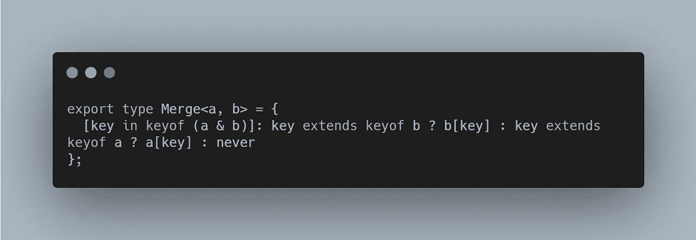
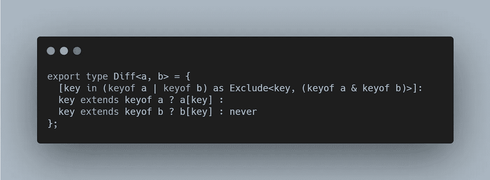
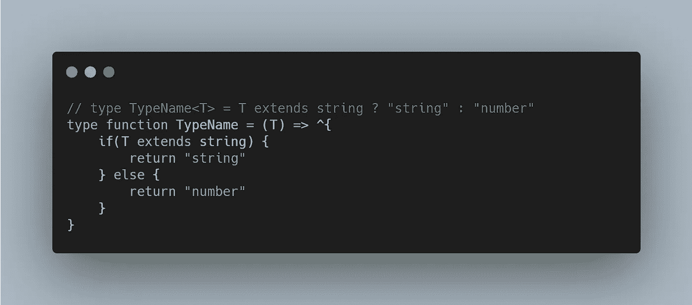
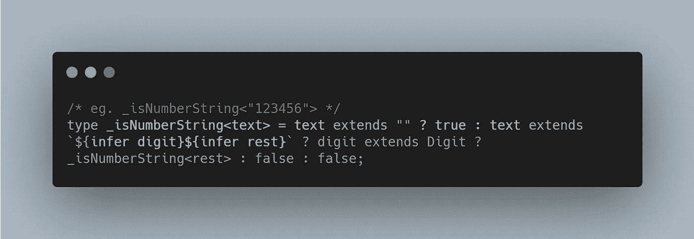
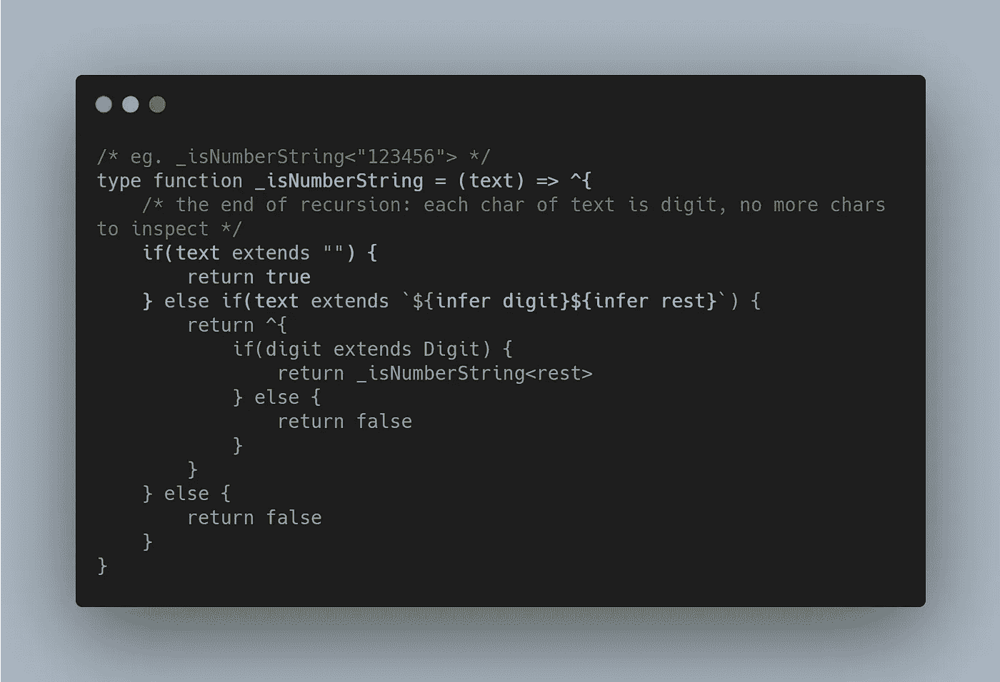
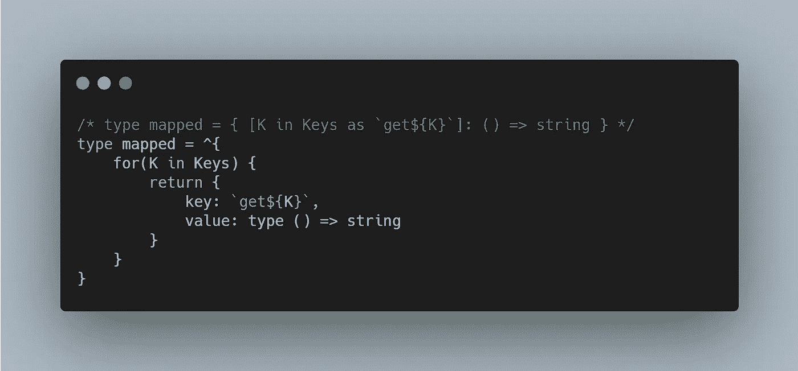
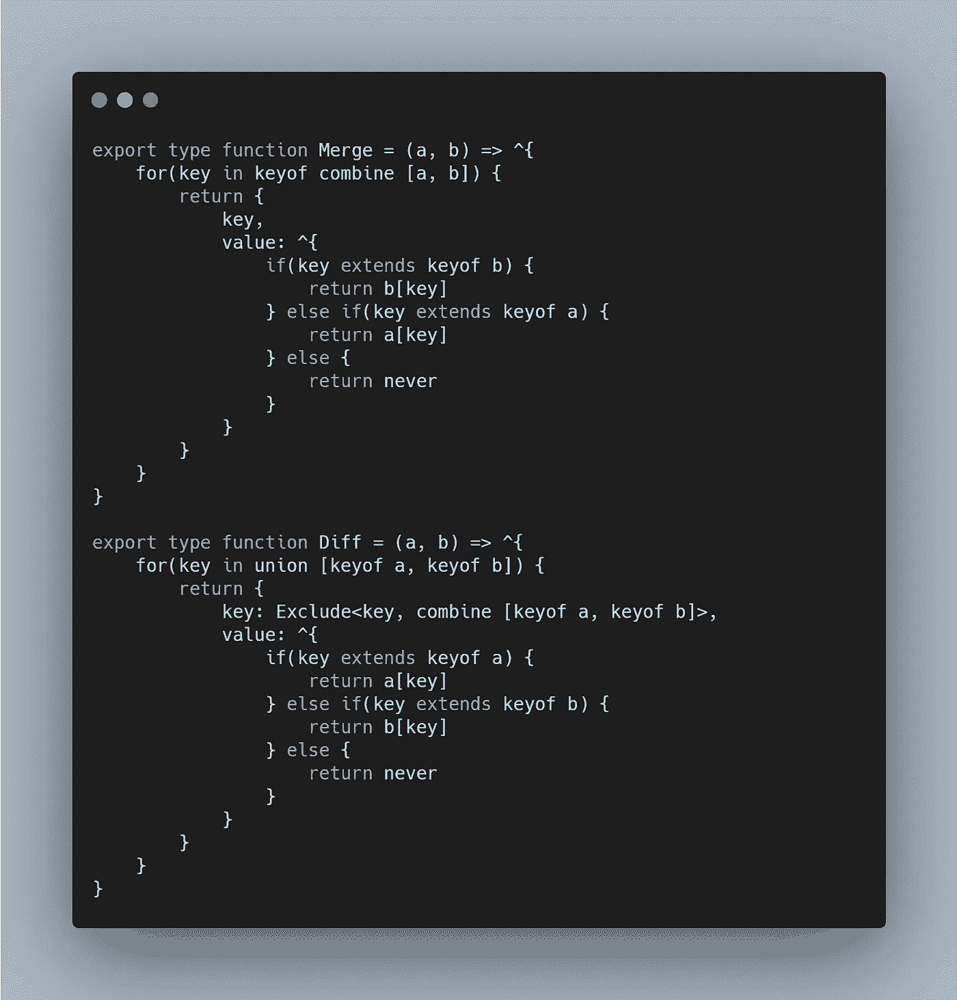
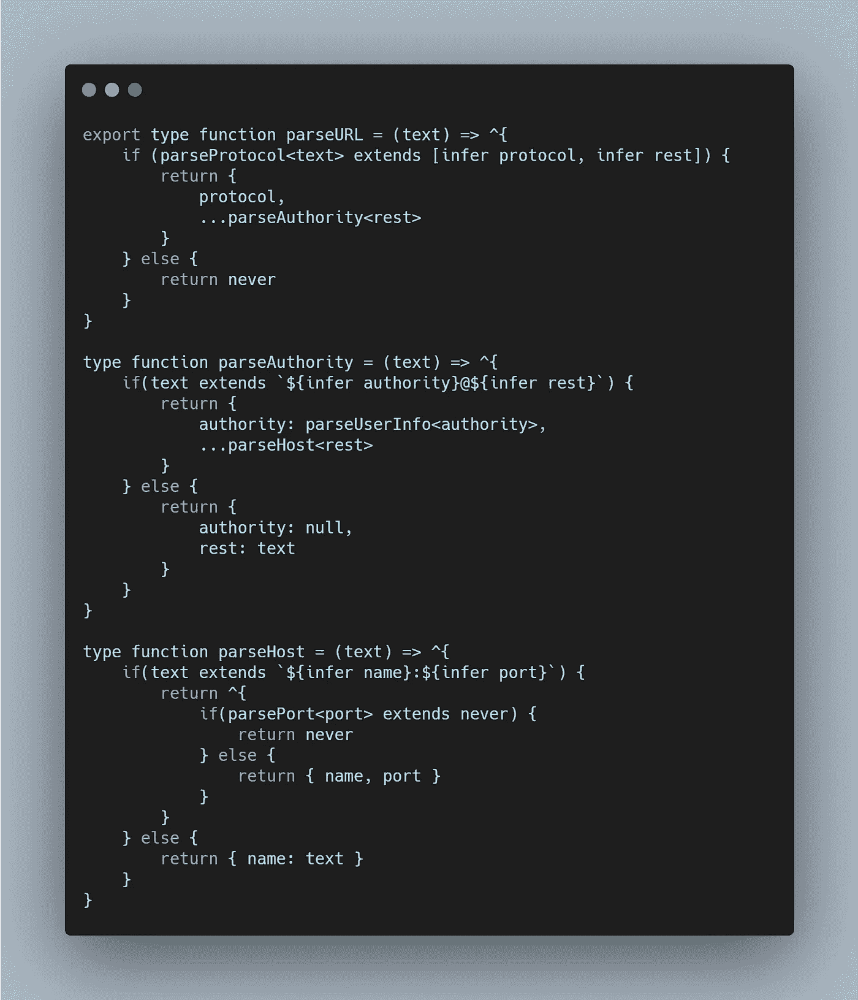
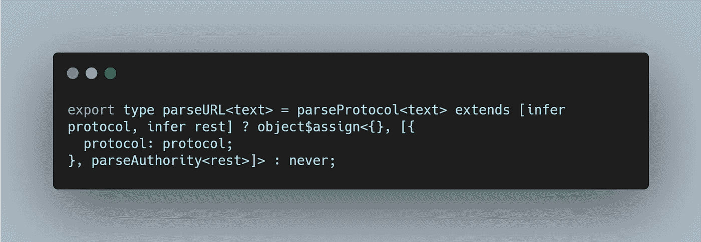
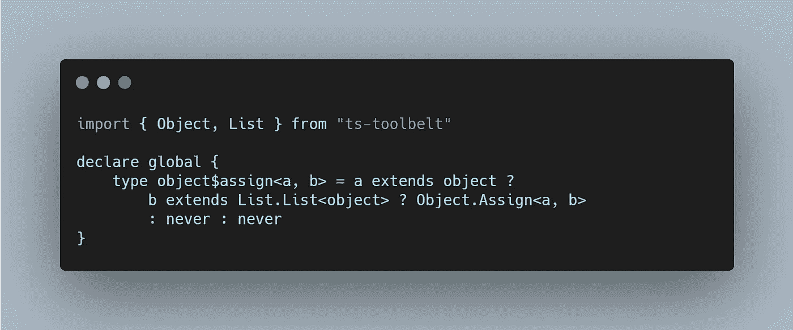

# 类型编程的艺术

> 原文：<https://itnext.io/the-art-of-type-programming-cfd933bdfff7?source=collection_archive---------2----------------------->

> 把复杂的事情变简单，把简单的事情变琐碎。

typescript 中的类型会很快失控，比如要合并两个对象( [599-medium-merge](https://github.com/type-challenges/type-challenges/blob/master/questions/599-medium-merge/README.md) )，解决方法可以是:

或者查找两个对象的差异([645-中等差异](https://github.com/type-challenges/type-challenges/blob/master/questions/645-medium-diff/README.md)):

# 类型编程 vs 类型体操

是的，我们可以实现 Merge，Diff，然后忘记它们，只要它能工作，我们就不会再担心这些了。因此，在创建类型的过程中，使用了一些技巧，像嵌套的三元表达式(条件类型)这样的复杂代码被故意忽略了。

太好了，它能工作了！

我们在日常编程中不做的，是我们在类型编程中一直在做的，或者更准确地说，是类型体操。

在本文中，我想建议我们将类型编程视为真正的编程。

[在下面的例子中使用了 TypeType](https://github.com/mistlog/typetype) ，这是一种为 typescript 类型生成而设计的编程语言。

# 类型语句->类型表达式

在 typetype 中，我们不使用三元表达式作为条件类型，而是使用传统的 if & else。

“类型函数”用于声明类型的函数，type in 和 type out，在 typescript 中称为“泛型”，但在本质上，它是类型的函数，我们将明确这一点。

“^{…}”称为块表达式，在这个块中，语句将被翻译成 typescript 中的类型表达式。在本例中，“if 语句”将被翻译为“条件类型”。

你可以在操场上看到它的动作:[https://mistlog.github.io/typetype-playground/](https://mistlog.github.io/typetype-playground/)。

为了实现“isNumberString ”,我们现在有了另一个选择:

映射类型表示为“for in 语句”:

那么，Merge 和 Diff 的解可以是:

# 没有诡计

我们不使用技巧来合并对象，而是使用直观的[对象扩展](https://github.com/mistlog/typetype#object-spread)语法。例如，在 [url-parser-2](https://github.com/mistlog/typetype-examples/blob/main/examples/url-parser-2/url-parser-2.type) 中:

对象扩展被转换为对象$assign:

然后，我们对其进行填充，使其在全球范围内可用:

# 最后

当我们把类型编程当作普通编程时，它并没有什么特别之处。上面可以看到，只是“if else”或者嵌套“if else”和“for in”。

*   回购:[https://github.com/mistlog/typetype](https://github.com/mistlog/typetype)
*   (40+例):【https://github.com/mistlog/typetype-examples】T2