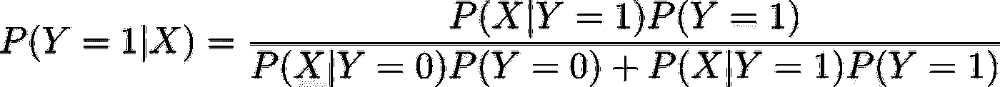
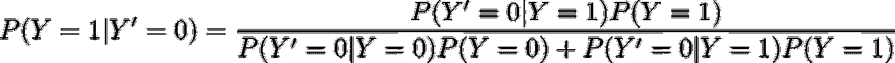
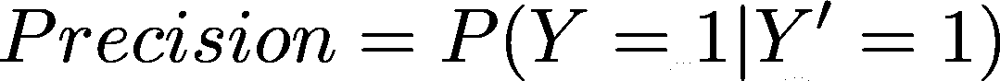
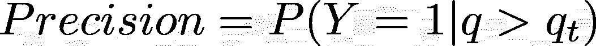
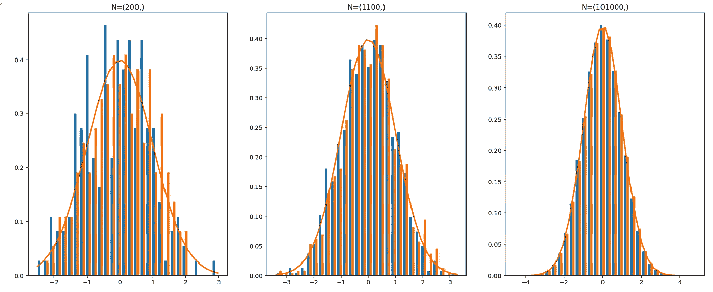
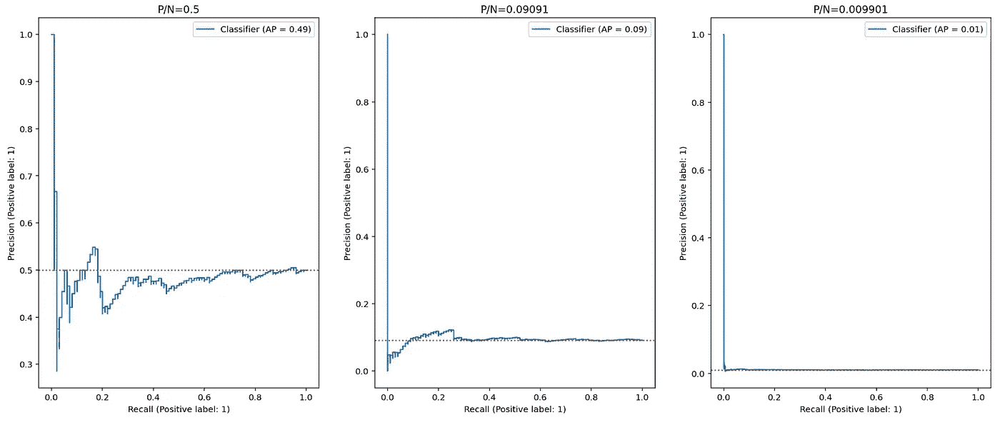

# 精确召回曲线的基线:贝叶斯方法

> 原文：<https://itnext.io/the-baseline-for-precision-recall-curve-a-bayesian-approach-1611c690607?source=collection_archive---------2----------------------->

与受试者工作特征(ROC)曲线不同，精确召回没有 0.5 的通用基线。但是为什么会这样呢？让我们后退一步，看看这种情况下的基线是什么。

给定我们要分类的数据，基线有助于与随机分类器进行比较。这很重要，因为如果不知道基线，我们就无法真正判断一个分类器。想象一个精确回忆(AUPR)曲线下面积为 0.3 的分类器。有多大用处？如果基数是 0.003，我们有一个杰出的分类器；但是，如果基线是 0.25，我们并没有提高基线太多。

资料来源:giphy.com

# 从贝叶斯定理的角度看

让我们计算一下精确召回曲线的基线，但在此之前，让我们回过头来看看贝耶定理。

根据贝叶定理，条件概率如下:

其中 X 代表我们的数据，Y 是样本的真实类别。本质上，Baye 定理将我们的先验信息更新为 P(Y)，给定新数据 X，返回后验概率密度 P(Y|X)。

分母可以用 X 所有可能结果的总和来代替。这也称为归一化因子，用于将结果保持在[0，1]之间。

对于二元分类器，我们可以使用预测类的两个结果进行总结。

对于第 1 类，我们有以下内容:

类似地，对于 0 类:

# 将分类器性能量化为贝叶斯定理

在上一节中，我们推导了二元分类器的贝叶斯定理的基本形式。现在我们需要注入我们的分类器预测，而不是 x。这里，让我们将 Y '作为分类器预测引入定理。因此，下面定义了当真实类别是一个给定的预测类别 0 时的后验概率。

分类器通常为每个类别输出一个分数，然后我们应用一个阈值来得到预测的类别。考虑到这一点，我们可以将我们的后验概率定义为 P(Y=1|q>qt)。

定义了分类器预测后，我们对真阳性率(回忆)、真阴性率(特异性)、假阳性率(假警报率)和假阴性率(遗漏率)有以下定义。

# 计算随机分类器的精确召回基线

最后，配备了我们需要的所有工具，我们可以计算出精确召回曲线的基线。让我们从检查精确度开始，精确度也被称为阳性预测值。

让我们也假设我们的分类器分配均匀随机的问题给我们数据中的每个样本。然后，我们使用`qt`作为阈值来确定预测类别。

我们已经知道，如果两个变量在统计上是独立的，那么它们事件的交集概率将等于它们概率的乘积。

因此，我们有:

或者在我们的分类器中:

这个先验概率是从我们的数据中抽取一个正面例子的概率，称为患病率。**患病率是我们数据的一个属性，等于阳性样本总数与样本总数的比率**。换句话说，随机分类器的 PR 曲线的 y 轴随着 P/N 的值是恒定的。这成为 PR 曲线的主要缺点之一，因为不具有与类别分布无关的通用基线。Flach 等人在他们的论文“Precision-Recall-Gain Curves:PR Analysis Done Right”中弥补了这一特性，其中他们引入了 PR 曲线的一种新的推导方法，将“总是正分类器”作为基线。

# Python 实验

资料来源:giphy.com

现在让我们通过使用一些 Python 代码来试验一下。

首先，我从创建一个随机分类器开始，该分类器将来自正态或高斯分布的概率分配给每个数据点，而不管其值如何。

如你所见，`n_component`是我们的分类器将要预测的类的数量，在二进制分类器的情况下是 2。

我准备了三个实验，以下为正值和负值的个数。

我使用 0 作为平均值，1 作为分布参数的方差。

现在，让我们看看我们的随机分类器的概率密度图。

实验中使用的三种随机分类器的密度图

正如所料，人口越多，曲线越像钟形曲线。

最后，我们可以为我们的分类器绘制精确-召回曲线。

三种随机分类器的精度-召回曲线

红线表示作为 PR 曲线基线的 P/N 比。随机分类器快速收敛到阳性样本与样本总数的比率(P/N)。

在 [GitHub](https://github.com/realsarm/deepLearningRecipes) 上可以找到这个模拟的代码和一些实际操作的例子。

我会多写 CS 的文章；因此，如果你觉得有趣和有帮助，请跟随我的媒介。另外，请随时通过 [LinkedIn](https://www.linkedin.com/in/ali--moezzi/) 直接联系我。