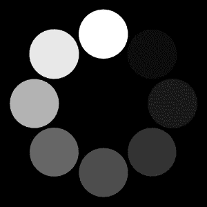
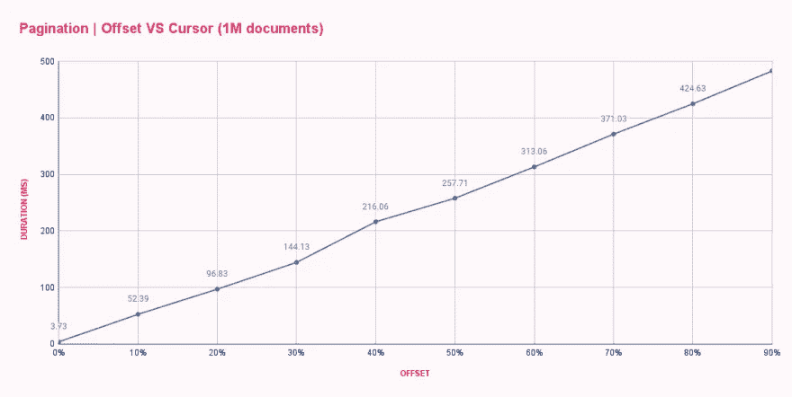
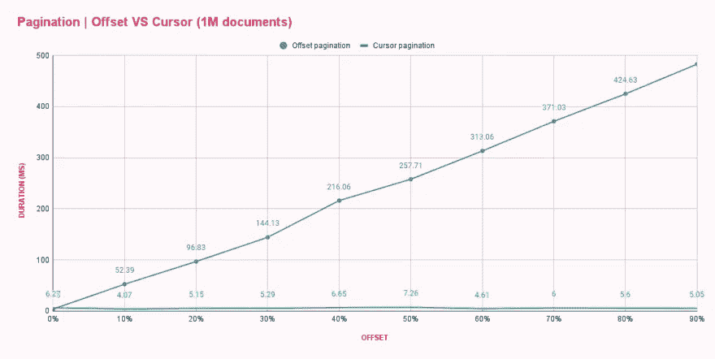

# 最好的数据库分页技术是…

> 原文：<https://itnext.io/the-best-database-pagination-technique-is-530abf2aab51?source=collection_archive---------0----------------------->


# 👋介绍

数据库是每个应用程序的基石之一。在这里，您可以存储应用程序需要记住、稍后计算或在线显示给其他用户的所有内容。这一切都很有趣，直到数据库增长，应用程序开始滞后，因为您试图一次获取并呈现 1，000 个帖子。你是个聪明的工程师，对吧？你可以用一个`Show more`按钮快速修补。几周后，你会看到一个新的`Timeout error`！您发现堆栈溢出，但很快意识到`Ctrl`和`V`由于过度使用已经停止工作🤦没有更多的选择，您实际上开始调试，并意识到每次用户打开您的应用程序时，数据库都会返回超过 50，000 个帖子！我们现在要干嘛？


为了防止这些可怕的场景，我们应该从一开始就意识到风险，因为一个准备充分的开发人员永远不会冒险。本文将帮助您使用**偏移和光标分页**来解决与数据库相关的性能问题。

> 一盎司的预防抵得上一磅的治疗 —本杰明·富兰克林

# 📚什么是分页？

分页是在查询任何包含数百条记录以上的数据集时使用的一种策略。多亏了分页，我们可以将大型数据集分割成块(或页),然后逐渐获取并显示给用户，从而减少数据库的负载。分页还解决了客户端和服务器端的许多性能问题！如果没有分页，您必须加载整个聊天历史，以便阅读发送给您的最新消息。

如今，分页几乎已经成为一种必须，因为每个应用程序都很可能处理大量的数据。这些数据可以是用户生成的内容、管理员或编辑添加的内容，也可以是自动生成的审核和日志。一旦您的列表增长到超过几千个条目，您的数据库将花费很长时间来处理每个请求，并且您的前端的速度和可访问性将受到影响。至于你的用户，他们的体验会是这样的。



现在我们知道了什么是分页，那么我们实际上如何使用它呢？为什么有必要？

# 🔍分页的类型

有两种广泛使用的分页策略— **偏移**和**光标**。在深入挖掘和了解关于它们的一切之前，我们先来看看一些使用它们的网站。

首先，让我们访问 GitHub 的[观星页面](https://github.com/appwrite/appwrite/stargazers)并注意标签是如何显示`5,000+`而不是一个绝对数字？此外，他们使用`Previous`和`Next`按钮，而不是标准页码。


现在，让我们切换到[亚马逊的产品列表](https://www.amazon.com/s?k=microwave)并注意结果的确切数量`364`，以及你可以通过`1 2 3 ... 20`点击的所有页码的标准分页。


很明显，两个科技巨头无法就哪个解决方案更好达成一致！为什么？嗯，我们需要用一个开发者讨厌的答案，`Because it depends`。让我们研究这两种方法，以了解它们的优点、局限性和性能影响。

# 偏移分页

大多数网站使用偏移分页是因为它的简单性和对用户来说的直观性。为了实现偏移分页，我们通常需要两条信息:

*   `limit` -从数据库中提取的行数
*   `offset` -要跳过的行数。偏移就像一个页码，但它周围有一些数学(`offset = (page-1) * limit`)

为了获得数据的第一页，我们将 limit 设置为 10(因为我们希望页面上有 10 个项目)，offset 设置为 0(因为我们希望从第 0 个项目开始计算 10 个项目)。结果，我们将得到十行。

为了获得第二页，我们将限制保持在 10(这不会改变，因为我们希望每页包含 10 行)，并将 offset 设置为 10(返回从第 10 行开始的结果)。我们继续这种方法，从而允许最终用户通过结果分页，并看到他们的所有内容。

在 SQL 世界中，这样的查询应该写成`SELECT * FROM posts OFFSET 10 LIMIT 10`。

有些实现偏移分页的网站还会显示最后一页的页码。他们是怎么做到的？除了每页的结果，它们还倾向于返回一个`sum`属性，告诉您总共有多少行。使用`limit`、`sum`和一些数学知识，你可以使用`lastPage = ceil(sum / limit)`计算最后一页的页码

虽然这个特性对用户来说很方便，但是开发人员很难扩展这种类型的分页。查看`sum`属性，我们已经可以看到，将数据库中的所有行计数到准确的数目需要相当长的时间。**除此之外，数据库中的** `**offset**` **是以循环遍历行的方式实现的，以了解应该跳过多少行。这意味着我们的偏移量越高，我们的数据库查询将花费越长的时间。**

偏移分页的另一个缺点是，它不能很好地处理实时数据或经常变化的数据。Offset 表示我们希望跳过多少行，但不考虑行删除或新行创建。这种偏移会导致显示重复数据或某些数据丢失。

# 光标分页

游标是偏移量的继承者，因为它们解决了偏移量分页所具有的所有问题—性能、丢失数据和数据重复，因为它不像偏移量分页那样依赖于行的相对顺序。相反，它依赖于由数据库创建和管理的索引。要实现游标分页，我们需要以下信息:

*   `limit` -和以前一样，我们希望在一页上显示的行数
*   `cursor` -列表中参考元素的 ID。如果您正在查询**上一个**页面，这可以是**第一项**，如果您正在查询**下一个**页面，这可以是**最后一项**。
*   `cursorDirection` -如果用户点击了`Next`或`Previous` ( `after`或`before`)

在请求第一页的时候，我们不需要提供任何东西，只需要限制`10`，说我们想要得到多少行。结果，我们得到了十行。

为了得到下一页，我们使用最后一行的 ID 作为`cursor`，并将`cursorDirection`设置为`after`。

类似地，如果我们想转到上一页，我们使用第一行的 ID 作为`cursor`，并将方向设置为`before`。

相比之下，在 SQL 世界中，我们可以将查询写成`SELECT * FROM posts WHERE id > 10 LIMIT 10 ORDER BY id DESC`。

**使用游标而不是偏移量的查询性能更高，因为** `**WHERE**` **查询有助于跳过不需要的行，而** `**OFFSET**` **需要迭代这些行，从而导致全表扫描。如果你在你的 id 上设置了正确的索引，使用`WHERE`跳过行可以变得更快。默认情况下，索引是在主键的情况下创建的。**

不仅如此，您不再需要担心行被插入或删除。如果您使用的偏移量为 10，那么您会期望在当前页面之前正好出现 10 行。如果不满足这个条件，您的查询将返回不一致的结果，导致数据重复，甚至丢失行。如果删除了当前页面前面的任何行或添加了新行，就会发生这种情况。游标分页通过使用您获取的最后一行的索引来解决这个问题，当您请求更多时，它确切地知道从哪里开始查找。

不全是阳光和彩虹。如果您需要自己在后端实现游标分页，这确实是一个复杂的问题。为了实现游标分页，您将需要查询中的`WHERE`和`ORDER BY`子句。此外，您还需要`WHERE`子句来根据您需要的条件进行筛选。这可能很快变得非常复杂，最终可能会得到一个巨大的嵌套查询。除此之外，您还需要为需要查询的所有列创建索引。

太好了！我们通过切换到游标分页消除了重复和丢失的数据！但是我们还有一个问题。由于不应该向用户公开增量数字 ID(出于安全原因)，所以现在必须维护每个 ID 的散列版本。每当您需要查询数据库时，您可以通过查看保存这些对的表，将这个字符串 ID 转换为它的数字 ID。如果这一行丢失了怎么办？如果点击`Next`按钮，获取最后一行的 ID，请求下一页，但是数据库找不到 ID 怎么办？

这是一种非常罕见的情况，只有当您要用作游标的行的 ID 刚刚被删除时才会发生。我们可以通过尝试以前的行或重新获取以前请求的数据来用新的 ID 更新最后一行来解决这个问题，但所有这些都带来了全新的复杂性，开发人员需要理解一系列新概念，如递归和适当的状态管理。幸运的是，像 [Appwrite](https://appwrite.io/) 这样的服务会处理好这一点，所以您可以简单地将光标分页作为一个特性来使用。

# 🚀Appwrite 中的分页

[Appwrite](https://appwrite.io/) 是开源的后端即服务，它通过为您提供一组 REST APIs 来满足您的核心后端需求，从而抽象出构建现代应用程序所涉及的所有复杂性。Appwrite 处理用户认证和授权、数据库、文件存储、云功能、webhooks 等等！如果有任何遗漏，你可以使用你最喜欢的后端语言来扩展 Appwrite。

Appwrite 数据库允许您存储任何需要在用户之间共享的基于文本的数据。Appwrite 的数据库允许您创建多个集合(表)并在其中存储多个文档(行)。每个集合都配置了属性(列),以便为数据集提供适当的模式。您还可以配置索引以提高搜索查询的性能。在读取数据时，您可以使用大量强大的查询，对它们进行过滤、排序、限制结果的数量，并对它们进行分页。所有这些都是开箱即用的！

使 Appwrite 数据库更好的是 Appwrite 的分页支持，因为我们同时支持偏移量和游标分页！假设我们有一个 ID 为`articles`的集合，我们可以从这个集合中获取带有偏移量或光标分页的文档:

```
// Setup
import { Appwrite, Query } from "appwrite";
const sdk = new Appwrite();sdk
    .setEndpoint('https://demo.appwrite.io/v1') // Your API Endpoint
    .setProject('articles-demo') // Your project ID
;// Offset pagination
sdk.database.listDocuments(
    'articles', // Collection ID
    [ Query.equal('status', 'published') ], // Filters
    10, // Limit
    500, // Offset, amount of documents to skip
).then((response) => {
    console.log(response);
});// Cursor pagination
sdk.database.listDocuments(
    'articles', // Collection ID
    [ Query.equal('status', 'published') ], // Filters
    10, // Limit
    undefined, // Not using offset
    '61d6eb2281fce3650c2c' // ID of document I want to paginate after
).then((response) => {
    console.log(response);
});
```

首先，我们导入 Appwrite SDK 库，并设置一个连接到特定 Appwrite 实例和特定项目的实例。然后，我们列出 10 个使用偏移分页的文档，同时使用一个过滤器只显示那些已发布的文档。紧接着，我们编写完全相同的列表文档查询，但是这次使用游标而不是偏移分页。

# 📊基准

我们在本文中经常使用*性能*这个词，但没有提供任何实际数字，所以让我们一起创建一个基准吧！我们将使用 Appwrite 作为我们的后端服务器，因为它支持偏移和光标分页和节点。JS 来编写基准测试脚本。毕竟，Javascript 很容易理解。

> *你可以找到完整的源代码为* [*GitHub 资源库*](https://github.com/Meldiron/pagination-benchmark) *。*

首先，我们设置 Appwrite，注册一个用户，创建一个项目并创建一个名为`posts`的集合，集合级别的权限和读取权限设置为`role:all`。要了解有关此过程的更多信息，请访问 [Appwrite 文档](https://appwrite.io/docs)。我们现在应该已经准备好使用 Appwrite 了。

我们还不能进行基准测试，因为我们的数据库是空的！让我们用一些数据填充表格。我们使用以下脚本将数据加载到 MariadDB 数据库中，并为基准测试做准备。

```
const config = {};
// Don't forget to fill config variable with secret informationconsole.log("🤖 Connecting to database ...");const connection = await mysql.createConnection({
    host: config.mariadbHost,
    port: config.mariadbPost,
    user: config.mariadbUser,
    password: config.mariadbPassword,
    database: `appwrite`,
});const promises = [];console.log("🤖 Database connection established");
console.log("🤖 Preparing database queries ...");let index = 1;
for(let i = 0; i < 100; i++) {
    const queryValues = []; for(let l = 0; l < 10000; l++) {
        queryValues.push(`('id${index}', '[]', '[]')`);
        index++;
    } const query = `INSERT INTO _project_${config.projectId}_collection_posts (_uid, _read, _write) VALUES ${queryValues.join(", ")}`;
    promises.push(connection.execute(query));
}console.log("🤖 Pushing data. Get ready, this will take quite some time ...");await Promise.all(promises);console.error(`🌟 Successfully finished`);
```

> *我们使用两层循环来提高脚本的速度。第一个 for 循环创建需要等待的查询执行，第二个循环创建包含多个插入请求的长查询。理想情况下，我们希望在一个请求中包含所有内容，但是由于 MySQL 的配置，这是不可能的，所以我们将它分成 100 个请求。*

我们在不到一分钟的时间内插入了 100 万个文档，我们已经准备好开始我们的基准测试了。在这个演示中，我们将使用 [k6](https://k6.io/) 负载测试库。

让我们首先对众所周知且广泛使用的偏移分页进行基准测试。在每个测试场景中，我们尝试从数据集的不同部分获取包含 10 个文档的页面。我们将从偏移量 0 开始，以 100k 为增量，一直到偏移量 900k。基准是以这样一种方式编写的，它一次只发出一个请求，以尽可能保持其准确性。我们还将运行相同的基准十次，并测量平均响应时间，以确保统计显著性。我们将使用 k6 的 HTTP 客户端向 Appwrite 的 REST API 发出请求。

```
// script_offset.shimport http from 'k6/http';// Before running, make sure to run setup.js
export const options = {
    iterations: 10,
    summaryTimeUnit: "ms",
    summaryTrendStats: ["avg"]
};const config = JSON.parse(open("config.json"));export default function () {
    http.get(`${config.endpoint}/database/collections/posts/documents?offset=${__ENV.OFFSET}&limit=10`, {
        headers: {
            'content-type': 'application/json',
            'X-Appwrite-Project': config.projectId
        }
    });
}
```

为了使用不同的偏移配置运行基准测试，并将输出存储在 CSV 文件中，我创建了一个简单的 bash 脚本。这个脚本执行 k6 十次，每次使用不同的偏移配置。输出将作为控制台输出提供。

```
#!/bin/bash
# benchmark_offset.shk6 -e OFFSET=0 run script.js
k6 -e OFFSET=100000 run script.js
k6 -e OFFSET=200000 run script.js
k6 -e OFFSET=300000 run script.js
k6 -e OFFSET=400000 run script.js
k6 -e OFFSET=500000 run script.js
k6 -e OFFSET=600000 run script.js
k6 -e OFFSET=700000 run script.js
k6 -e OFFSET=800000 run script.js
k6 -e OFFSET=900000 run script.js
```

不到一分钟，所有的基准测试都完成了，并为我提供了每个偏移配置的平均响应时间。结果正如预期的那样，但一点也不令人满意。



正如我们所见，offset 0 非常快，响应时间不到 4 毫秒。我们的第一次跳跃是偏移 100k，变化很大，响应时间增加到 52 毫秒。随着偏移量的每次增加，持续时间也会增加，导致在偏移量为 900k 的文档之后，几乎需要 500ms 才能获得 10 个文档。这太疯狂了。

现在让我们更新我们的脚本来使用光标分页。我们将更新我们的脚本以使用游标代替偏移量，并更新我们的 bash 脚本以提供游标(文档 ID)代替偏移量。

```
// script_cursor.js
import http from 'k6/http';// Before running, make sure to run setup.js
export const options = {
    iterations: 10,
    summaryTimeUnit: "ms",
    summaryTrendStats: ["avg"]
};const config = JSON.parse(open("config.json"));export default function () {
    http.get(`${config.endpoint}/database/collections/posts/documents?cursor=${__ENV.CURSOR}&cursorDirection=after&limit=10`, {
        headers: {
            'content-type': 'application/json',
            'X-Appwrite-Project': config.projectId
        }
    });
}#!/bin/bash
# benchmark_cursor.shk6 -e CURSOR=id1 run script_cursor.js
k6 -e CURSOR=id100000 run script_cursor.js
k6 -e CURSOR=id200000 run script_cursor.js
k6 -e CURSOR=id300000 run script_cursor.js
k6 -e CURSOR=id400000 run script_cursor.js
k6 -e CURSOR=id500000 run script_cursor.js
k6 -e CURSOR=id600000 run script_cursor.js
k6 -e CURSOR=id700000 run script_cursor.js
k6 -e CURSOR=id800000 run script_cursor.js
k6 -e CURSOR=id900000 run script_cursor.js
```

运行该脚本后，我们已经可以看出性能得到了提升，因为响应时间有了明显的不同。我们将结果放入一个表中，以便并排比较这两种分页方法。



哇！光标分页摇滚！该图显示，游标分页不关心偏移量大小，每个查询的性能都与第一个或最后一个查询一样。你能想象重复加载一个庞大列表的最后一页会造成多大的危害吗？😬

如果您对在自己的机器上运行测试感兴趣，您可以找到完整的源代码，如 [GitHub 库](https://github.com/Meldiron/pagination-benchmark)。存储库包括`README.md`解释安装和运行脚本的整个过程。

# 👨‍🎓摘要

偏移分页提供了一种众所周知的分页方法，在这种方法中，您可以查看页码并单击它们。这种直观的方法有很多缺点，比如高偏移带来的糟糕性能，以及数据重复和丢失的可能性。

游标分页解决了所有这些问题，并带来了一个可靠的分页系统，它速度很快，可以处理实时(经常变化)数据。游标分页的缺点是不显示页码，实现起来很复杂，还需要克服一系列新的挑战，比如缺少游标 ID。

现在让我们回到最初的问题，为什么 GitHub 使用光标分页，而 Amazon 决定使用偏移分页？性能并不总是关键…用户体验比您的企业必须支付多少服务器的费用更有价值。

我相信亚马逊决定采用胶印，因为它可以提高 UX，但这是另一项研究的主题。我们已经可以注意到，如果我们访问`amazon.com`并搜索一个`pen`，它说有*正好是* `10 000`结果，但你只能访问前七页(350 个结果)。

首先，有远远超过 10k 的结果，但亚马逊限制了它。其次，反正前七页都可以访问。如果你试图访问第 8 页，它显示 404 错误。正如我们所看到的，Amazon 意识到了偏移分页的性能，但仍然决定保留它，因为他们的用户群更喜欢看到页码。他们不得不包括一些限制，但谁会去搜索结果的第 100 页。？🤷

你知道什么比阅读分页更好吗？尝试一下！我会鼓励你尝试这两种方法，因为这是获得第一手经验的最好方法。设置 Appwrite 只需要不到几分钟的时间，您可以开始使用这两种分页方法。如果您有任何问题，也可以通过[我们的不和谐服务器](https://appwrite.io/discord)联系我们。

# 🔗资源

*   [偏移分页死了吗？为什么光标分页正在接管](https://uxdesign.cc/why-facebook-says-cursor-pagination-is-the-greatest-d6b98d86b6c0)
*   [偏移分页与光标分页](https://stackoverflow.com/questions/55744926/offset-pagination-vs-cursor-pagination)
*   [如何在 api 中实现分页光标](https://stackoverflow.com/questions/18314687/how-to-implement-cursors-for-pagination-in-an-api)
*   [如何像专业人员一样实现光标分页](https://medium.com/swlh/how-to-implement-cursor-pagination-like-a-pro-513140b65f32)