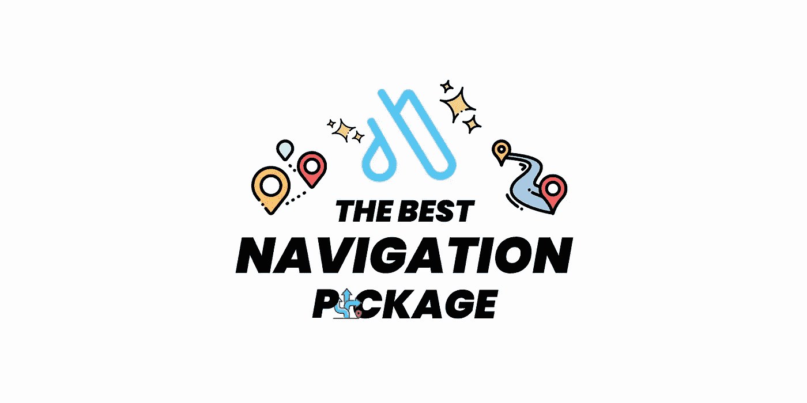
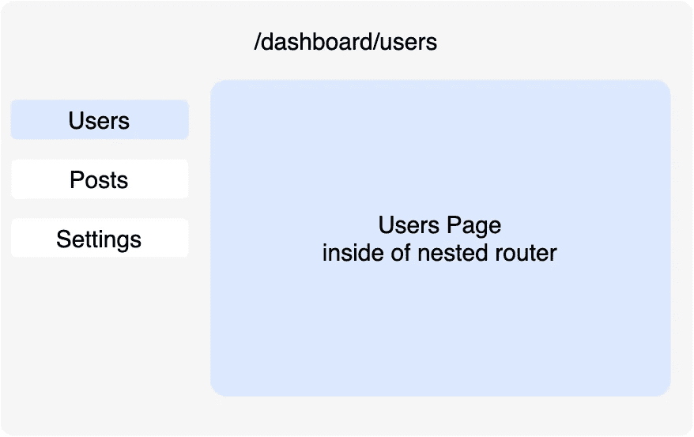

# 高级颤振导航包

> 原文：<https://itnext.io/the-best-flutter-navigation-package-c3c5ad201a50?source=collection_archive---------1----------------------->



## 在 Flutter with AutoRoute 中使用 Navigator v2.0 进行高级导航的简约指南

## 为什么选择自动路由？

领航员 2.0 太牛逼了！但总的来说，我们知道这真的很难理解！

在这种情况下，AutoRoute 有助于以声明的方式轻松使用 nav2！

AutoRoute 省去了我们为中介参数类编写大量样板代码、检查所需参数、提取参数和一堆其他东西的工作。

为什么不是别人而是 AutoRoute？因为它为我们提供了非常短的语法和稳定的高级特性！

## 特征

*   命名路线
*   路径参数和通配符匹配
*   嵌套路由和路由器
*   可定制的路线转换
*   深层链接
*   路线守卫
*   简易底部导航栏路由
*   声明路由
*   流动路线

开箱即用的更多内容……

现在让我们来看看如何使用它！

# 快速入门

## 步骤 1:创建导航设置

```
// @CupertinoAutoRouter
// @AdaptiveAutoRouter
// @CustomAutoRouter
@**MaterialAutoRouter**(
  //Name Shortener -Home**Page →** Home**Route** instead ofHome**PageRoute**
  replaceInRouteName: '**Page,Route**',
  routes: <AutoRoute>[
    AutoRoute(page: HomePage, initial: true),
    AutoRoute(page: Products),
    AutoRoute(page: ProductDetailsPage),
    RedirectRoute(path: '*', redirectTo: '/'),
  ],
)class $AppRouter {}
```

## 第二步

```
flutter packages pub run build_runner build 
```

## 第三步

创建一个全局实例(也可以使用像 [get_it](https://pub.dev/packages/get_it) 这样的服务定位器)

```
**final appRouter = AppRouter();**
```

## 第四步

```
class MyApp extends StatelessWidget {
  const MyApp({Key? key}) : super(key: key);@override
  Widget build(BuildContext context) {
    return MaterialApp**.router**(
      **routerDelegate: appRouter.delegate(),
      routeInformationParser: appRouter.defaultRouteParser(),**
    );
  }
}
```

## **第五步**

想怎么用就怎么用！

```
context.push(const ProductsRoute()); // with context
appRouter.push(const ProductsRoute()); // without context
```

# 让我们深入包中！！

在我们开始之前，我想说的是我不会涵盖每个包的基本特性！相反，我将只涵盖使 AutoRoute 独特而美丽的高级功能！

## **观察者(中间件)**

做一个看路线的大哥！

```
class **CustomObserver** implements **AutoRouterObserver** {
  @override
  void **didChangeTabRoute**(TabPageRoute route, TabPageRoute previousRoute) {} @override
  void **didInitTabRoute**(TabPageRoute route, TabPageRoute? previousRoute) {} @override
  void **didPop**(Route route, Route? previousRoute) {} @override
  void **didPush**(Route route, Route? previousRoute) {} @override
  void **didRemove**(Route route, Route? previousRoute) {} @override
  void **didReplace**({Route? newRoute, Route? oldRoute}) {} @override
  void **didStartUserGesture**(Route route, Route? previousRoute) {} @override
  void **didStopUserGesture**() {} @override
  NavigatorState? get **navigator** => throw UnimplementedError();
}
```

2.将您的观察员添加到代表中

```
MaterialApp.**router**(
  **routerDelegate**: appRouter.**delegate**(
    **navigatorObservers**: () => [
      **CustomObserver**(),
      **FirebaseAnalyticsObserver**(analytics: FirebaseAnalytics()),
    ],
  ),
);
```

## 路径参数(动态 URL)

第一步。定义路径

```
AutoRoute(path: '/books/:**bookId**', page: **BookDetailsPage**)
```

第二步。在构造函数中标注参数

```
class **BookDetailsPage** extends StatelessWidget {
    **BookDetailsPage**({**@pathParam** this.**bookId**});     final int **bookId**;
    ...
```

## 查询参数

查询参数可以用同样的方式访问！

```
context.route.**queryParams**// orclass **BookDetailsPage** extends StatelessWidget {            
  const **BookDetailsPage**({**@queryParam** this.**id**});        

  final int **id**;            
  ...
```

## 重寄

让我们看看重定向有多简单！

```
<AutoRoute> [
    **RedirectRoute**(path: '/', **redirectTo**: '/books'),
    AutoRoute(path: '/books', page: BooksPage),
]
```

## 通配符

你想用通配符吗？没问题！

```
AutoRoute(path: '/books/*****', page: BooksPage) RedirectRoute(path: '*****', redirectTo: '/')
```

## 深层链接

```
MaterialApp.**router**(
  **routerDelegate**: appRouter.**delegate**(
    **initialDeepLink**: **‘PATH’**
  ),
);
```

## 路由指南(中间件)

你可以很容易地为你的路线定制守卫！！

1.  创造你的守卫

```
class AuthGuard extends **AutoRouteGuard** {        
  @override        
  void onNavigation(resolver, router) {    
    if(unauthenticated) resolver.next(true);
    else router.push(LoginRoute());        
  }
}
```

2.将警卫分配到您要使用的路线

```
**AutoRoute**(page: ProfileScreen, **guards**: [**AuthGuard**]);
```

3.运行代码生成，并将生成的防护类添加到适当的类中

```
final _appRouter = **AppRouter**(**authGuard**: **AuthGuard()**);
```

## 自动阅读按钮/后退按钮

`AutoLeadingButton`是 AutoRoute 对默认 BackButton 的替换，用于处理嵌套或父栈弹出。

```
AppBar(    
  leading: **AutoLeadingButton**(),  
  ...  
)
```

## 嵌套导航

只需将路由添加到 children 参数中，就可以了！！

```
**AutoRoute**(            
  path: '/dashboard',            
  page: DashboardPage,            
  **children**: [            
    AutoRoute(path: 'users', page: UsersPage),            
    AutoRoute(path: 'posts', page: PostsPage),        
    AutoRoute(path: 'settings', page: SettingsPage),              
  ],            
)
```



```
class **DashboardPage** extends StatelessWidget {        
  @override        
  Widget build(BuildContext context) {        
    return **Row**(        
      children: [        
        **Column**(        
          children: [      
            TextButton(
              child: const Text('**Users**'),
              onPressed: () {
                appRouter.push(const UsersRoute());
              },
            ),
            TextButton(
              child: const Text('**Posts**'),
              onPressed: () {
                appRouter.push(const PostsRoute());
              },
            ),
            TextButton(
              child: const Text('**Settings**'),
              onPressed: () {
                appRouter.push(const SettingsRoute());
              },
            ),
          ],        
        ),        
        Expanded**( **       
          ***// nested routes will be rendered here* 
          child: AutoRouter(),** 
        **),**        
      ],        
    );        
  }        
}
```

# 标签导航

你厌倦了默认的长 TabBar 实现吗？

AutoRoute 也为我们提供了一个非常简洁的快捷方式！

顺便说一句，标签默认是惰性的，但是也可以被禁用！

```
class **DashboardPage** extends StatelessWidget {               
  @override        
  Widget build(context) {        
    return **AutoTabsScaffold**(        
       **routes: const [        
        UsersRoute(),        
        PostsRoute(),        
        SettingsRoute(),        
      ], **       
      **bottomNavigationBuilder: (_,tabsRouter) {** 
        return BottomNavigationBar(        
          currentIndex: **tabsRouter.activeIndex,** 
          onTap: **tabsRouter.setActiveIndex, **       
          items: [        
            BottomNavigationBarItem(label: 'Users',...),        
            BottomNavigationBarItem(label: 'Posts',...),        
            BottomNavigationBarItem(label: 'Settings',...),        
          ],        
        ),
      ),               
    }        
  );        
}
```

> 注意:你甚至可以实现 [PageView](https://pub.dev/packages/auto_route#using-pageview) 或 [TabBar](https://pub.dev/packages/auto_route#using-tabbar) ，只需添加命名构造函数即可！

```
AutoTabsRouter.**pageView**(...);
AutoTabsRouter.**tabBar**(...);
```

你想从任何地方接触到控制器吗？就这么简单！

```
**router.parent<StackRouter>();** *// returns Stack Routing controller* 
**router.parent<TabsRouter>();** *// returns Tabs Routing controller*
**router.root;** *// returns Stack Routing controller*
```

## 就这些吗？一点也不！还有呢！！如；

*   自定义过渡
*   自定义路线构建器
*   包装路线
*   RouteAwareStateMixins
*   甚至更多的声明式导航，以及其他…

如需更多信息，请查看文档！

## 感谢您的阅读！

我试图尽可能简单地解释。希望你喜欢。

如果你喜欢这篇文章，请点击👏按钮(你知道你可以升到 50 吗？)