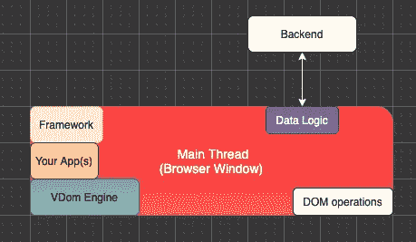
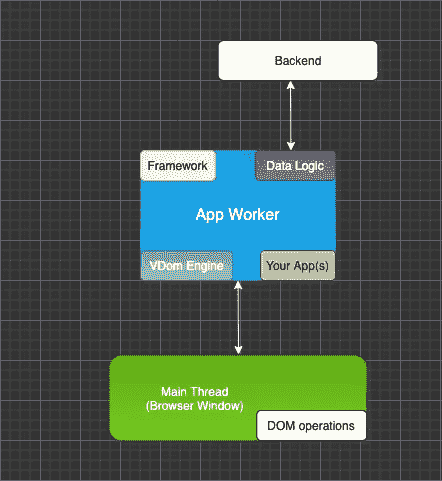
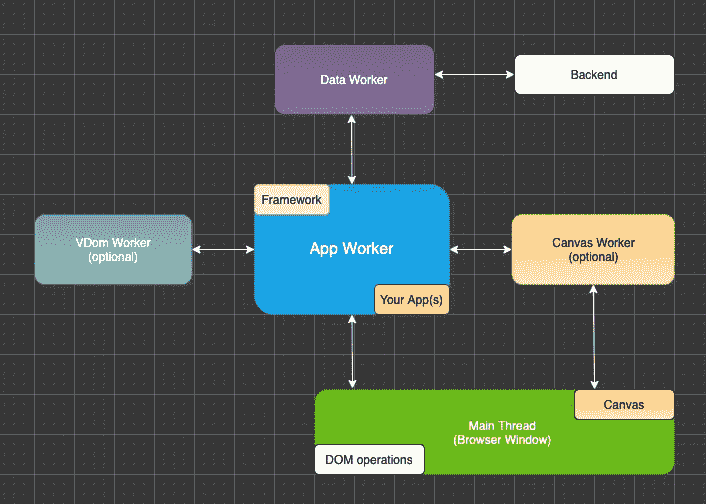

# 2022 年最佳前端发展策略

> 原文：<https://itnext.io/the-best-frontend-development-strategies-in-2022-cb02dd7aa48b?source=collection_archive---------0----------------------->

这篇文章是有挑战性的，两极分化的，发人深省的。它涵盖了许多你很可能不知道的新鲜内容和想法。

# 内容

1.  介绍
2.  电脑或智能手机上有多少个内核？
3.  一个浏览器用几个核心？
4.  Web Workers API
5.  “应用工作者是主要参与者”的范例
6.  工人可以访问 DOM 吗？
7.  工人可以访问 DOM 有例外吗？
8.  如何聪明的创建虚拟 DOM？
9.  UI 开发可以直接发生在浏览器内部吗？
10.  TypeScript 有前途吗？
11.  React 有什么问题？
12.  多窗口应用程序
13.  我们需要自己实施工人设置吗？
14.  最后的想法
15.  【更新】如何入门？

# 1.介绍

我将尽力创建一系列相互关联的逻辑论证，您可以根据这些论证了解前端开发应该如何工作。

我还会尽量保持这篇博文的简洁，这样“非开发者”也能大部分关注它。

# 2.电脑或智能手机上有多少个内核？

你们都见过这样的 CPU 图片:


例如，如果你使用的是苹果电脑，你可以点击左上角的苹果图标，然后点击“关于这台苹果电脑”，它会显示如下内容:

```
Processor 3,2 GHz 8-Core Intel Xeon W
```

一部 iPhone 有 6 个内核。

TL-BR:每台电脑或智能手机都有几个可用的内核。

这意味着您可以并行运行多个线程。

你会用一个引擎缸造一辆车吗？

如果你的答案是:“当然不是！那会慢很多！”，那么你应该仔细阅读这篇文章。

# 3.一个浏览器用几个核？

就其本身而言，一个浏览器的每个标签/窗口将只使用**一个**内核。

含义:您的 Angular 或 React 应用程序如下所示:



应用程序中运行的 JavaScript 任务越多，速度就越慢。最糟糕的情况是一个完全的 UI 冻结，你的**一个**核心是 100%,而所有其他核心完全空闲。

这是**根本不是**可扩展的。

*[旁注]如果你正在创建简单、小型且相当静态的网站或应用程序，这个设置就足够了。*

# 4.Web Workers API

[](https://developer.mozilla.org/en-US/docs/Web/API/Web_Workers_API) [## Web Workers API-Web API | MDN

### Web Workers 使得在独立于主执行线程的后台线程中运行脚本操作成为可能…

developer.mozilla.org](https://developer.mozilla.org/en-US/docs/Web/API/Web_Workers_API) 

> **Web Workers** 使得在独立于 Web 应用程序主执行线程的后台线程中运行脚本操作成为可能。这样做的好处是繁重的处理可以在一个单独的线程中执行，允许主线程(通常是 UI)运行而不会被阻塞/减慢。

[](https://en.wikipedia.org/wiki/Web_worker) [## 网络工作者-维基百科

### 编辑描述

en.wikipedia.org](https://en.wikipedia.org/wiki/Web_worker) 

> W3C 和 WHATWG 将 web workers 设想为长期运行的脚本，不会被响应点击或其他用户交互的脚本中断。让这样的工作人员不被用户活动打断应该允许网页在后台运行长时间任务的同时保持响应。
> 
> workers 最简单的用途是在不中断用户界面的情况下执行计算量很大的任务。

因此，通过使用 workers，我们实际上可以并行使用多个内核，结束这个可扩展性噩梦。

让下面的引用真正深入人心:

> workers 最简单的用途是在不中断用户界面的情况下执行计算量很大的任务。

这引出了一个问题:

“最贵的任务是什么？”

答案很简单:UI 框架或库本身，以及我们用它构建的应用程序。

这就引出了一个想法:让我们把所有能做的事情都从主线程中移走，这样这个线程就可以专注于它想要做的事情:操纵 DOM。

如果你的应用程序不再在 main 中运行，就不会有任何东西会减慢或阻塞你的 UI 或造成内存泄漏。

这一思想导致了以下概念:

# 5.应用程序工作人员是主要参与者范例

为了解决这个性能瓶颈，我们希望让主线程尽可能空闲，以便它们可以完全专注于渲染/动态操作 DOM:



现在可能发生的最糟糕的情况是，您的应用程序工作人员将会变慢，并且这个核心以 100%的速度运行。不过这不会影响你的 UI(渲染线程→ main)。

单页应用程序(spa)的最佳解决方案可能是这样的:



为了防止应用程序工作器处理太多的逻辑，我们可以选择使用虚拟 DOM 工作器，并计算状态转换之间的增量更新。对于有一个非常空闲的应用程序工作器的应用程序，您可以直接在应用程序工作器中运行虚拟 DOM 引擎。

我们也可以使用数据工作者。如果我们有一个远程数据存储，并希望在本地对数据进行排序/分组/过滤，这些计算可以在那里进行。

这篇博客文章介绍了如何在保持相同 API 的同时使工人的使用成为可选的:

[](/javascript-development-making-a-web-worker-optional-f23a13490b28) [## JavaScript 开发:让 Web Worker 成为可选的

### 如果你有很多 JavaScript 相关的逻辑运行在一个主线程或者一个 Web Worker 中，这是非常有意义的…

itnext.io](/javascript-development-making-a-web-worker-optional-f23a13490b28) 

# 6.工人可以访问 DOM 吗？

在[工作全局范围内](https://developer.mozilla.org/en-US/docs/Web/API/WorkerGlobalScope)、`window`和`window.document`未定义。

意思是:你不能直接访问真正的 DOM。

所以，我们基本上有两个选择。

选项 1 是在 worker 中重新创建整个 DOM API。在我看来，这是个坏主意。工人们没有意识到 DOM 是有原因的，并且有大量的逻辑经常改变。DOM OPs 变成了异步的，如果你按顺序触发了很多，就会导致大量的工人后消息。唯一的好处是你可以像以前一样继续写你的应用，这是值得怀疑的。稍后我将介绍如何做得更好。

实际上有一个项目就是这样做的:

[](https://github.com/ampproject/worker-dom) [## GitHub - ampproject/worker-dom:同样的 DOM API 和框架，但是在 Web Worker 中。

### 相同的 DOM API 和框架，但是在 Web Worker 中。- GitHub - ampproject/worker-dom:相同的 DOM API 和…

github.com](https://github.com/ampproject/worker-dom) 

更聪明的方法是选项 2:坚持工人不应该知道真正的 DOM 的概念。

这使得使用虚拟 DOM 成为绝对必要的。

在社交媒体上阅读，我看到类似“vdom 不好！”相当频繁。

这根本不是真的。这很大程度上取决于它是如何实现的。

Angular 和 React 中的主要障碍是基于 xml 或 JSX 的模板。这些人需要转换成我们可以使用的数据结构。

JavaScript 既不快速也不适合解析字符串。

解析模板非常昂贵，以至于服务器端呈现(SSR)再次流行起来。20 年前我去过 T2，创建了一个基于 PHP 的 CMS，它可以生成 html 输出文件。

你可能会说，如今有了可以处理更多客户端连接的云，但是[富/胖/胖客户端](https://en.wikipedia.org/wiki/Rich_client)的概念仍然完全有意义。

# 7.工人可以访问 DOM 有例外吗？

实际上有一个:

[](https://developer.mozilla.org/en-US/docs/Web/API/OffscreenCanvas) [## 屏幕外画布-Web API | MDN

### OffscreenCanvas 接口提供了一个可以在屏幕外呈现的画布。它在窗口和中均可用…

developer.mozilla.org](https://developer.mozilla.org/en-US/docs/Web/API/OffscreenCanvas) 

工人可以获得画布 DOM 节点的所有权。

这在 Chromium 中已经很好地工作了，Safari (Webkit)和 Firefox 正在积极地实现它。可能还需要 6 个月，所以这是 2022 年的话题。

您可能注意到了最终工人设置
→画布工人中的黄色方框。如果你想深入了解这一点:

[](/rendering-3d-offscreen-getting-max-performance-using-canvas-workers-88c207cbcdc2) [## 在屏幕外渲染 3d:使用 canvas workers 获得最佳性能

### OffscreenCanvas Web API 使我们能够将画布 DOM 元素的所有权转移到 workers 中。

itnext.io](/rendering-3d-offscreen-getting-max-performance-using-canvas-workers-88c207cbcdc2) 

# 8.如何聪明的创建虚拟 DOM？

虽然 JavaScript 不擅长解析字符串，但它擅长处理嵌套的对象/数组结构。这种格式有一个您最熟悉的名字: [JSON](https://www.json.org/json-en.html) 。

如果我们坚持使用基于 JSON 的 vdom 语法，就不需要在用户界面中一遍又一遍地进行昂贵的模板解析，甚至不需要将这一部分移到构建步骤中。

这肯定是在某种程度上类似于直接使用 JSX 输出。

如果做得好，虚拟 DOM 中没有变量、if/else 语句、绑定、方法、循环或任何类型的逻辑。你永远不会看到有 1000+行代码的模板(看 Angular)。

使用编程方法，您将在它应该在的地方使用逻辑:JavaScript 内部。例如，在创建列表时，您可以首先创建一个框架 vdom，一旦加载了数据存储，就可以遍历记录并动态创建新的虚拟 dom 节点。

这个概念允许我们在运行时从根本上改变组件的 vdom。是的，在安装组件之前和之后更改组件的 vdom 的工作方式完全相同。

实现无限滚动或其他高级功能变得很容易。

您可以在这里找到更多信息:

[](https://medium.com/dataseries/your-benefits-of-working-with-json-based-virtual-dom-7318a983da9e) [## 使用基于 JSON 的虚拟 DOM 的好处

### 许多以前的同事和朋友找到我，问我:“你是如何做到如此高效和快速的……

medium.com](https://medium.com/dataseries/your-benefits-of-working-with-json-based-virtual-dom-7318a983da9e) [](/new-formatting-concept-for-json-based-virtual-dom-ee52acc5e04a) [## 基于 JSON 的虚拟 DOM 的新格式化概念

### 当我在 2001 年(jQuery 之前→ 2006 年)第一次钻研 Javascript 时，有这样一个概念:

itnext.io](/new-formatting-concept-for-json-based-virtual-dom-ee52acc5e04a) 

虽然编程方法对低级 vdom 操作有意义，但我们肯定更喜欢使用声明性方法来创建我们的应用。

为了实现这两个目标，我们唯一需要做的就是在 vdom 之上添加一个声明性的抽象层:一个组件树。

意思是:在创建组件类时，您将只使用 vdom。对于创建应用程序，你可以坚持使用组件树。

# 9.UI 开发可以直接发生在浏览器内部吗？

当 React 在 5 到 8 年前开始流行时，浏览器在支持最新 ECMAScript 特性方面的情况很糟糕。

例如，不支持类(ES6)或 JS 模块。

在这一点上，将 UI 开发转移到节点是完全有意义的。

意思是:你可以使用最新的语言特性，并以一个构建步骤为代价，将你的代码编译/转换成浏览器能够理解的 Javascript。

浏览器厂商在追赶方面做得很好。今天，许多闪亮的新功能都可以直接使用，大多数第三阶段的提议都可以立即实现。

在 worker 范围内，JS 模块在 Chromium 内工作良好。Webkit (Safari)也完成了实现，但是仍然局限于 Safari 技术预览版。Mozilla(火狐)正在积极推动。

我们完全可以假设 2022 年全面支持就绪。

构建步骤是昂贵的，并且对于 UI 库或框架的开发模式应该不再需要。

优势显而易见:

1.  JavaScript 是浏览器引擎唯一理解的编程语言。
2.  用浏览器无法理解的方式写 JS 感觉就是不对。
3.  通过将 UI 开发带回到浏览器中，我们可以调试我们的真实代码，而不需要任何构建/编译或者使用源代码图。
4.  我们不需要热模块更换。

尤其是创建和调试代码将再次变得有趣，因为我们可以确保没有外部因素导致错误。

创建`dist/production`输出仍然需要像 [webpack](https://github.com/webpack/webpack) 这样的工具。然而，它们将是构建工具，而不是运行时环境。

从节点到节点的转换将进一步推动这一点。普通人迟早会灭绝。一旦 deno 有了一个包管理器，越来越多的包将使用一种可以在浏览器中运行的语法(例如，不使用裸模块说明符→使用无效路径和没有文件扩展名的导入)。

# 10.TypeScript 有前途吗？

这可能是本文中最有争议的部分。JS 社区分成了两半:一些人喜欢使用 TS，而另一些人拒绝接触它。期待讨论。

我的看法:

现在，当在 node 中开发 ui 并且有一个必需的构建/编译步骤时，使用 TS 就可以了。

一旦 UI 开发回到浏览器中，这将会彻底改变。

你会仅仅为了使用 TS 而建立一个完整的构建步骤吗？

在这一点上，它变得太昂贵了。

事实是:TS 是**而不是**一个网络标准。目前还没有在浏览器中实现它的计划。

历史已经多次明确地告诉我们，不基于 web 标准的基于 Web 的技术会发生什么:它们会在某个时候消失。Silverlight 女士就是一个完美的例子。

一般来说，类型检查是件好事。主要问题是 Angular 和 React 不使用基于 JSDoc 的注释，这使得 ide 在编写代码时会给你警告。

实际上，甚至有可能使用基于 JSDoc 的注释来“伪造”TS:

[](https://goulet.dev/posts/how-to-write-ts-interfaces-in-jsdoc/) [## 如何在 JSDoc 注释中编写 TypeScript 接口

### 我喜欢不用任何构建步骤就能编写 web 应用程序，非常简单。js 文件。但是我仍然喜欢类型检查…

goulet.dev](https://goulet.dev/posts/how-to-write-ts-interfaces-in-jsdoc/) 

这绝对是一种选择，也是我们可以讨论的事情。

如果您真的想在编程语言中直接进行类型检查，并且不关心构建步骤，那么 [Dart2](https://dart.dev/) 不是更好的选择吗？

Dart2 完全支持 workers，所以我们也可以在那里运行 workers 设置。手机的优势包括 AOT 汇编。

# 11.React 有什么问题？

公平地说:在 React 之前有 JQuery。当 React 变得流行时，这是一个很大的改进，React 是第一个让虚拟 DOM 流行起来的库。

那么，2022 年我们为什么要**而不是**使用 React 呢？

1.  React 在主线程内部运行。
2.  React 代码库基于 CommonJS →如果没有构建步骤，它就不能在浏览器中运行。
3.  没有 JSDoc 注释。
4.  解析 JSX 模板非常昂贵。甚至有像[svelite](https://github.com/sveltejs/svelte)这样的编译器将它移到服务器端。
5.  React 不公开核心。所有东西都扩展组件，这毫无意义。
6.  国家管理毫无理由地太难了。
7.  `render()`的方法肯定是有问题的。

让我更深入地解释一下这个:防止状态变化触发`render`肯定很复杂。如果一个 React 组件包含子组件(在`render()`中的定制标签)，新的实例将会被创建，以防你不小心使用`keys`。

重新创建组件实例使函数式编程变得流行，因为创建类实例的频率超过必要的频率是不高效的，并且您自己的组件实现中的内存泄漏会造成伤害。

如果你有很多影响物品位置的道具，你需要在你的 JSX 中加入一些逻辑。

React 只是一个库，不是框架。意思是:组件几乎就是所有的东西。没有逻辑层次链，如:

```
core.Base -> component.Base -> button.Base -> tab.header.Button
```

一旦`render()`的疯狂被解决，你就可以为你想创建的任何东西挑选最合适的基类。例如，容器具有 vdom 对象，该对象包含对其子项目的 vdom 对象的引用。然后，我们可以更改子组件的 vdom，而无需重新创建基于 JS 的实例。

在这一点上，状态管理变得微不足道，我们甚至不需要钩子。尤其是在确保最多 1 次调用 vdom 引擎的同时更改许多配置是非常关键的。

# 12.多窗口应用程序

将 workers 设置切换为使用 SharedWorkers 可以进一步增强这个概念:


这使我们能够跨不同的浏览器窗口移动整个组件树，同时保持它们的 JS 实例不变。

无需后端的多窗口状态管理。

跨窗口拖放是可能的。

博客里有几篇文章介绍了细节。

# 13.我们需要自己实施工人设置吗？

靠你自己实现所有提到的想法可能需要几年时间。

你很幸运，我已经帮你做了。生态系统内超过 12，000 次提交，完全由麻省理工学院许可:

[](https://github.com/neomjs/neo) [## GitHub - neomjs/neo:应用工人驱动的前端框架

### neo.mjs 使您能够使用一个以上的 CPU 创建可扩展的高性能应用程序。不需要照顾一个…

github.com](https://github.com/neomjs/neo) 

这包括一个远程方法访问 API，它使您能够通过 promises(消息传递之上的抽象层)直接调用不同 workers 或 main 中的方法。

大量的组件已经就位，还有控制器、视图模型、应用程序和其他实用程序类。

你不需要任何第三方库来支持像 MVVM，Observable 和许多其他的架构设计模式。

特别是状态管理非常容易(提示:一个类配置系统)。

许多演示应用和例子正等着你去探索，40+篇博文:[https://neomjs.github.io/pages/](https://neomjs.github.io/pages/)

CLI 是高级的:您可以用一行代码创建一个新的应用程序(工作区):`npx neo-app`。我们甚至获得了跨应用程序的分割块，因此在一个页面上放置多个应用程序几乎没有开销。

# 14.最后的想法

你实际上不必等到 2022 年，你现在就可以使用这些想法让你的前端开发达到下一个水平。一些公司和开发人员已经在这么做了，并且正在利用他们的领先优势将新技术转化为商业优势:

[](/neo-mjs-nominated-for-the-most-exciting-use-of-technology-cd5983debc7b) [## neo.mjs 获得“最令人兴奋的技术应用”提名

### JavaScript 开源奖励计划 2021 内幕。

itnext.io](/neo-mjs-nominated-for-the-most-exciting-use-of-technology-cd5983debc7b) 

大多数开发者仍然不知道 [neo.mjs](https://github.com/neomjs/neo) 项目的存在，这是一个遗憾。

**我很乐意看到有人证明我在这些概念上是错的！**

为此，您需要创建第一个基于 neo 的概念验证应用程序。

在这种情况下，我很乐意审查您的代码。

对于运行时的动态 DOM 操作，neo 是最快的选择。尤其是对于大型复杂的应用程序。

欢迎您加入 project Slack 频道:

[](https://join.slack.com/t/neomjs/shared_invite/zt-6c50ueeu-3E1~M4T9xkNnb~M_prEEOA) [## 在 Slack 上加入 neo.mjs

### 我们知道切换浏览器很麻烦，但是我们希望你的 Slack 体验是快速、安全和最好的…

join.slack.com](https://join.slack.com/t/neomjs/shared_invite/zt-6c50ueeu-3E1~M4T9xkNnb~M_prEEOA) 

问候并快乐编码，
托拜厄斯

附注:今年九月将会有一些大的改变，这也对我的个人状况有好的影响。

# 15.【更新】如何入门？

我刚刚创建了一个关于如何使用这项技术构建应用程序的教程:

[](https://tobiasuhlig.medium.com/define-a-web-4-0-app-to-be-multi-threaded-9c495c0d0ef9) [## 将 web 4.0 应用定义为多线程

### 通过学习创造一个视觉上令人惊叹和闪电般快速的下一代，将你的技能提升到一个全新的水平…

tobiasuhlig.medium.com](https://tobiasuhlig.medium.com/define-a-web-4-0-app-to-be-multi-threaded-9c495c0d0ef9) 

# 预览图像

想法是:“行动”对“反应”，无论如何 angular 不在讨论范围之内。

