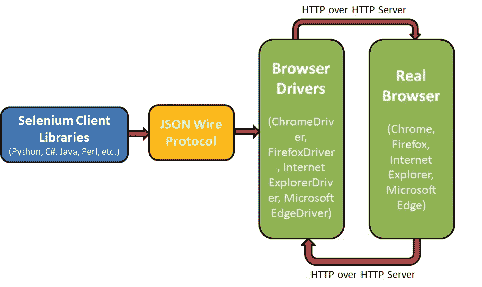
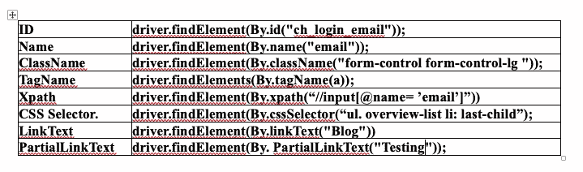

# 使用 Selenium WebDriver 测试自动化的最佳实践。

> 原文：<https://itnext.io/the-best-practices-test-automation-with-selenium-webdriver-9c877e1296fb?source=collection_archive---------0----------------------->

照片由多梅尼科·洛亚拍摄

**Selenium WebDriver** 从一开始就非常受欢迎。

elenium 是一个用于 web 应用自动化的开源框架。除此之外，它还可以处理各种管理任务，如监控网站。

Selenium 自动化测试是当今技术行业最流行的开源自动化测试工具。selenium testing 带来了巨大的好处，它为端到端测试提供了健壮的、基于浏览器的自动化。

**Selenium Web Driver**—Web Driver 直接在浏览器上工作，使用浏览器的内置特性来触发测试人员编写的自动化测试。

因此，首先让我们看看 **Selenium WebDriver** API 如何使用浏览器驱动程序与实际浏览器进行交互，并理解组成 Selenium WebDriver 架构的主要模块。嗯，Selenium WebDriver 由四个主要部分组成:

Selenium 客户端库

JSON 有线协议

浏览器驱动程序

浏览器。

在使用 Selenium 框架多年之后，我意识到“一刀切”的方法并不适用于 Selenium 测试自动化。

本文讨论 Selenium 测试自动化的最佳实践，这可能有助于您开发设计良好且可伸缩的测试套件。

1.  **设定命名约定。**为创建的每种类型的文件建立标准命名约定有助于简化开发和 Selenium 测试过程。例如:当在一个团队中工作时，有些情况下你的团队成员可能需要增强你所编写的测试。如果您在几个月后重新访问相同的测试，您可能无法理解测试的目的，直到您完成了完整的实现。如果一些测试在执行阶段失败了，通过快速查看测试名称，应该很容易找出哪些功能被破坏了。这些问题可以很容易地通过以一种自我解释的方式给出命名测试用例来解决，这样您和您的团队成员都不会花费不必要的时间来浏览实现。
2.  避免屏蔽睡眠电话。特别是，这种睡眠模式是显式等待的一个例子。所以这实际上不是 Selenium WebDriver 的一个特性，但它是大多数编程语言的一个常见特性。
    **线程。Sleep()** 做你认为它会做的事情，它会让线程休眠。所以当你的程序运行时，在大多数情况下，程序会被自动检查，它们运行在一个线程上。
    所以当我们调用线程时。我们指示我们的程序在一段时间内什么也不做，只是睡觉。测试中的应用程序要做什么并不重要，我们不在乎，我们的检查正在打盹。Selenium 提供了隐式等待和显式等待，它们处理延迟的效率比 sleep 更高。隐式等待通知浏览器为页面上出现的所有 web 元素等待指定的持续时间。如果元素可用的速度比隐式延迟时间更快，则执行移到下一行代码执行。更多信息请阅读[“如何在 Selenium 中使用隐式和显式等待”。](/how-to-using-implicit-and-explicit-waits-in-selenium-d1ba53de5e15)
3.  选择最适合的网页定位器。Selenium 测试自动化面临的挑战之一是，如果测试代码中使用的定位器相关的实现发生了变化，自动化测试就必须进行修改。ID、名称、链接文本、XPath、CSS 选择器、DOM 定位器等。

有这么多的 web 定位器，有必要选择正确的一个，以尽量减少由于用户界面的变化而对测试造成的影响。ID、类和名称不仅最容易使用，而且比其他 web 定位器更容易使用。更多信息请阅读[“Selenium web driver 自动化脚本的正确定位器概念”](/the-concept-of-the-right-locator-for-selenium-webdriver-automated-scripts-5b8c6bf528e5)

4.**实施记录和报告。**如果一个广泛的测试套件中的一个特定测试失败了，定位失败的测试用例会变得很有挑战性。在这种情况下，日志记录可能是一个巨大的救星，因为在测试代码中适当的位置的控制台日志有助于更好地理解代码，并有助于解决问题。

一些流行的日志级别(在流行的编程语言中可用)是调试、信息、警告、错误和关键。在测试实现中添加不必要的日志会导致测试执行的延迟。因此，建议在有助于跟踪失败原因的场景中添加带有级别错误(和/或严重)的日志。有关更多信息，请阅读"[实施日志记录和报告最佳实践。](/implement-logging-and-reporting-best-practices-2cc4b58de9d3)

5.**使用设计模式和原则。**在设计和开发自动化中有很多问题，面对这些问题，人们制定了模式。最初，经典模式是很久以前由四个人制定的，他们出版了《设计模式》一书。这四个人也叫四人帮。

这本书在一个面向对象的世界中系统地阐述了他们当时遇到的所有模式。有一个问题——有一个解决方案，在很长一段时间里，这种设计模式的概念一直在成长和发展，补充着新的模式。**工厂和装饰工。**

**同样，你可能会读到“** [自动化测试中的所有设计模式”。](https://antony-s-smirnov.medium.com/all-about-design-patterns-in-automation-testing-7276ad051db8)

6.**集中式文件夹结构。**在 Selenium 团队的中央存储库中，使用已建立的命名约定组织和定义文件夹结构，为开发人员和 Selenium 测试人员建立坚实的基础。浪费在错误的文件名和代码问题上的时间有更大的负面影响。例如:当处理使用 Selenium 框架的测试时，关注测试代码的可维护性是非常重要的。标准项目可以由 Src 和测试文件夹组成。Src 文件夹可以包含子目录，这些子目录包含页面对象、助手函数以及包含测试场景中使用的 web 定位器信息的文件。测试文件夹可以包含实际的测试实现。

7.**数据驱动测试。**使用 Selenium 测试，您可以使用数据驱动框架、关键字驱动框架或者两者的混合。数据驱动框架在如何将数据集从实际测试代码中分离出来方面更有效。输入测试数据取自外部来源(Excel、CSV 等。)网站(或 web 应用程序)应针对不同的浏览器、设备和操作系统组合(即多个数据集)进行测试。在测试自动化脚本中对测试值进行硬编码不是一个可伸缩的解决方案，因为它会导致不必要的软件膨胀和测试代码的重复。

更好的解决方案是使用参数化来实现 Selenium 的数据驱动自动化测试。参数化有助于针对不同的输入组合(或数据集)执行测试用例。

例如:

*   使用 TestNG 进行参数化。
*   JUnit 参数化。
*   数据驱动测试。

更多信息请阅读[“如何在项目中使用数据提供者模式”。](https://antony-s-smirnov.medium.com/how-to-use-the-data-provider-pattern-in-the-project-ea12430d9275)

8.**在适当的场景中使用断言和验证。**

9.**避免代码重复**(或者包装硒调用)。

10.**利用 Selenium 中的并行测试。**这是为 JUnit 和 TestNG 写的例子。

**结论**。在本文中，我们研究了 Selenium 的一些最佳实践。当提出 Selenium 测试场景时，您应该始终记住 Selenium 是自动化测试的理想选择，所以不要将它用于其他类型的测试，因为它可能会产生有利的结果。

[https://test-engineer.site/](https://test-engineer.site/)

# 作者[安东·斯米尔诺夫](https://www.linkedin.com/in/vaskocuturilo/)