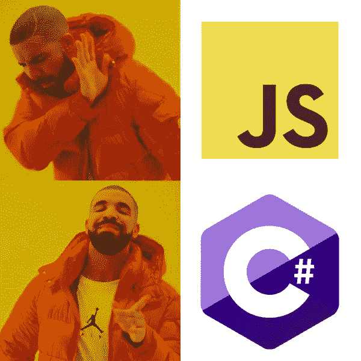
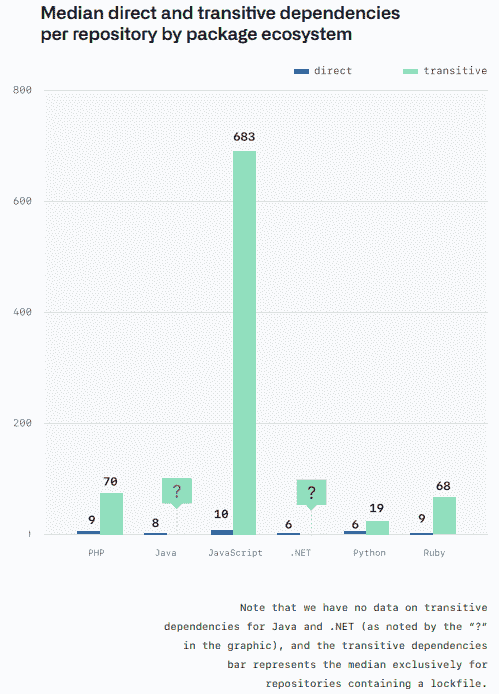
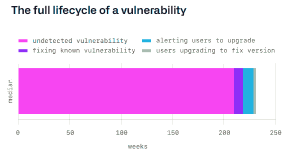
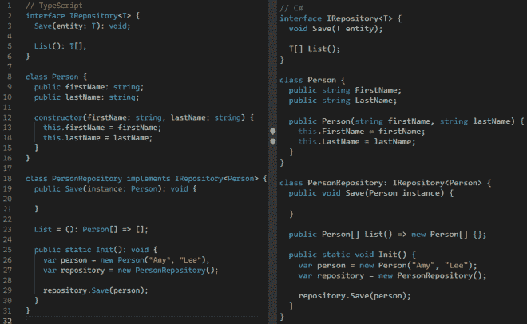

# C#和。网

> 原文：<https://itnext.io/the-case-for-c-and-net-72ee933da304?source=collection_archive---------0----------------------->

这很有趣，因为我已经离开了。NET 生态系统，我从第一次发布之前的 beta 版本就开始在服务器端工作(和一些桌面客户端/工具工作)。

在 ASP.NET 之前的时代，我是用服务器端 JScript 写 ASP 的。这是真的:使用 JScript 代替 VBScript 是可能的，尽管在那个年代很少见到，因为每个人都用 VBScript 编写 ASP。但对我来说，这感觉更自然，而且我从高中 90 年代末就开始写 JavaScript 了，所以为什么不在服务器上写呢？事实上，在我第一次接触 ASP.NET 网络表单后，[我讨厌它](https://charliedigital.com/2009/07/23/why-asp-net-webforms-sucks/)！

[事实证明，彭博在 2005 年的某个时候甚至开始将他们的后端代码从 C/C++迁移到 JavaScript](https://www.techatbloomberg.com/blog/10-insights-adopting-typescript-at-scale/) ，我认为这很酷。

如果你在 6 年前问我最喜欢的编程语言是什么，我会说是 JavaScript。

快进到现代，我几乎认不出服务器端的 JavaScript 开发。

要理解为什么，看一下 [GitHub 的 Octoverse 报告状态](https://octoverse.github.com/)是有启发性的。

## 依赖性问题

不像。NET，JavaScript 没有丰富的基础类库。它一直依赖社区通过编写开源项目和向 NPM 发布共享包来填补这一空白。而在。NET 生态系统，微软为许多许多场景提供了丰富的专业开发和管理的第一方库，JavaScript 没有这样的治理。

这种模式有其好处，因为它允许以更快的速度进行创新和创造。(事实上，有人可能会说，这迫使微软加快了步伐，对微软更加开放。网芯。)

但是缺乏治理的负面影响是有很多很多的缺陷。其中之一是依赖链的**爆炸**:

我们都知道管理的痛苦。数百个依赖项和通常数百兆字节的空间。在一个拥有强大治理的生态系统中，也许我们会看到这些图书馆中的一些被整合成一个管理有序、维护良好的核心图书馆集，这些图书馆污染更少、规模更小。

甚至有开发者“种植”NPM 软件包来填充他们的简历(这个库每周有 18 万次下载)！

这本身似乎是一个小麻烦，但这导致了我们的下一个问题…

## 安全问题

因为在你的代码深处有一层又一层的依赖关系，并且因为 JavaScript 的本质(例如，原型污染)，它创造了这些场景，在这些场景中，漏洞甚至恶意软件可以被引入到你的代码中！

*   [2018 的 ESLint 攻击](https://eslint.org/blog/2018/07/postmortem-for-malicious-package-publishes)。
*   [2020 年的洛达什袭击](https://github.com/advisories/GHSA-p6mc-m468-83gw)。
*   [最近的 ua-parser-js 劫持](https://github.com/faisalman/ua-parser-js/issues/536)(在这个 Reddit 帖子中有更多关于这个的[)这是继](https://www.reddit.com/r/programming/comments/qdlela/breaking_npm_package_uaparserjs_with_more_than_7m/)[CVE-2021–27292](https://nvd.nist.gov/vuln/detail/CVE-2021-27292#:~:text=ua-parser-js%20%3E%3D%200.7.14%2C%20fixed%20in%200.7.24%2C%20uses%20a,information%20to%20associate%20vector%20strings%20and%20CVSS%20scores.)之后的雪上加霜。

更令人惊讶的是，根据 GitHub 的说法，漏洞通常可以在 ***延长的*** 时间段内不被发现:

> 一个漏洞在被发现之前通常会被隐藏 218 周(四年多一点)。从那时起，社区通常需要 4.4 周的时间来确定和发布漏洞的修复程序，然后需要 10 周的时间来提醒安全更新的可用性。

呀。这是一个合理的问题，当您匆忙更新您的依赖项，然后最终不得不将整个代码库迁移到上游依赖项的更新、中断的版本时，它会降低生产率。

## 性能问题

雪上加霜的是，JavaScript 的性能并不是特别好。我发现的最好的测试用例是一组基准测试，它们在一系列运行时中比较了相同工作负载下的 AWS Lambda 性能。这些基准测试特别有趣，因为它们在相同的运行时环境中模拟相同的工作负载。

2019 年第一部由[大阮北](https://medium.com/u/7d6846ad348f?source=post_page-----72ee933da304--------------------------------):[https://medium . com/the-theam-journey/benchmarking-AWS-lambda-runtimes-in-2019-part-ii-50e 796 d3d 11 b](https://medium.com/the-theam-journey/benchmarking-aws-lambda-runtimes-in-2019-part-ii-50e796d3d11b)

第二部由[亚历山大·菲利奇金](https://medium.com/u/c56a66a35b74?source=post_page-----72ee933da304--------------------------------)于 2021 年:[https://filia-aleks . medium . com/AWS-lambda-battle-2021-performance-comparison-for-all-languages-c1b 441005 fd1](https://filia-aleks.medium.com/aws-lambda-battle-2021-performance-comparison-for-all-languages-c1b441005fd1)

虽然 Node.js 在冷启动方面有优势，但。NET 是这些基准测试中的前三名之一，通常比 Node.js 快 2 倍。

来自 Bui 的 2019 年基准:

创建:

列表:

获取:

更新:

删除:

[甚至来自 AWS API Gateway 的延迟对于 Node.js](https://miro.medium.com/max/700/1*1UQV7LRNBGgSOya3Z687ow.png) 来说更糟糕！

Filichkin 的 2021 年更新揭示了或多或少的相同之处:

菲利奇金的成绩是 ***甚至更糟糕的*** as。NET Core 已经进行了性能改进，在典型用例中，在相同的内存限制下，它的速度是 Node.js 中 JavaScript 的 3 倍。*现代。NET 在性能上与 Go 和 Rust 不相上下*。 [Raygun 的 2017 切换到。NET Core 从 Node.js 见证了*服务器吞吐量增长 2000%*](https://raygun.com/blog/dotnet-vs-nodejs/)。

因为无服务器工作负载是按调用次数和内存时间定价的，所以运行一个用 ***编写的无服务器工作负载，而不是用运行在 Node.js 上的*** JavaScript 编写的无服务器工作负载，成本会更低

***【2022 年 7 月更新】*** [最新一轮 21 TechEmpower 开源基准测试](https://www.techempower.com/benchmarks/#section=data-r21&hw=ph&test=composite)显示，NET 仍然是现实工作负载中速度最快、吞吐量最高的 web 服务器之一，与 C++和基于 Rust 的应用服务器不相上下:

2022 年 7 月第 21 轮结果。第七名

。NET 在#7 进入，而*节点在****【81】*****Express 在****【116】****；差远了。*单一的。NET web 应用服务器的吞吐量是基于节点的应用服务器的几倍。*

## *生产力问题*

*在我编写 JScript ASP 的早期，我不得不将大量堆栈加载到我的大脑中。那时几乎没有智能感知工具，所以你*不得不*通过约定和类结构编写真正好的 JavaScript，使代码易于管理。我*有*去写好的注释来交流代码不同部分的连通性。*

*最终，微软引入了 TypeScript 来解决这个问题，它在 JavaScript 上添加了一层类型声明以使其易于管理。*

*但是在我看来，这导致了一代工程师编写糟糕的 JavaScript，因为现在他们完全依赖工具来提供生产力，而不是使用工具来提高生产力，并使用简单的良好实践来组织代码、命名事物、封装逻辑等等。*

*Steve McConnell 的 *Code Complete* 广泛讨论了良好实践的重要性:*

> **一个程序包含的信息比大多数书包含的信息都要密集。虽然你可以在一两分钟内阅读并理解一本书的一页，但大多数程序员无法以接近这样的速度阅读并理解一个裸程序清单。一个程序应该比一本书提供更多的组织线索，而不是更少。**
> 
> **编程工作的一小部分就是写程序，让计算机能读懂；更大的部分是写它，以便其他人可以阅读它。**

*然而，我发现在没有经验的开发人员手中，TypeScript 增加了混乱(特别是像`Pick`这样不加选择地使用操作)。*

*现在到处用箭头函数的趋势绝对是要命的[而且不止我一个](https://davidwalsh.name/i-dont-hate-arrow-functions)。当开发人员认为`function`显然是一个肮脏的词时，它会使代码不可读。*

*当类型系统作为一种事后想法被添加时，它实际上会妨碍生产率。*

## *好吧，那么服务器端 JavaScript 很烂？为什么到处都是？*

*我认为这个问题的答案其实很简单:*

1.  *JavaScript 简单灵活；你可以在很多方面使用它。作为一门编程语言，那是我的初恋。*
2.  *对于新开发人员来说，学习一种语言并将其应用于前端和后端比学习两种语言用于前端和后端开发更容易。*
3.  *热重装就像裂纹。*

*对软件工程师需求的激增意味着许多从训练营出来的开发人员要学习前端的 JavaScript。由于他们已经将节点工具链用于前端，因此来自该领域的开发人员只需要再努力一点就可以成为“全栈”工程师。*当你只有一把锤子时，每个问题看起来都像钉子。用一种多用途语言培训新工程师比培训他们使用正确的工具更便宜，更省时。**

*与其教新开发人员复杂的、久经考验的概念，如封装、多态、抽象和继承，来管理复杂的软件项目，不如让我们专注于削减代码。*

## *所以为什么/不。网？*

*现在，作为一名高级工程师，我对 JavaScript 的看法已经发生了变化。我只想为我的应用程序设计一种低调、低调、低维护、高性能、高度安全的编程语言和运行时。*

**

*我希望团队富有成效，而不必浪费时间来处理日常的依赖漏洞和古怪的类型行为，这些行为是由于在不想被类型化的语言上分层类型系统而导致的。虽然一个松散的鹅型系统对于构建 ui 来说很棒，但是对于构建后端来说**就很糟糕了，因为在后端需要强有力的系统级交互契约。***

*对于前端，JavaScript 是不可避免的(就目前而言)。但是对于后端呢？不，谢谢你。**给我 C#** 。*

*之前。NET 核心的主要问题。NET 的一个缺点是，虽然它声称具有跨平台运行时兼容性，但它依赖于第三方实现，如早期的 mono。当然因为。NET 框架对 Win32 有底层的依赖性，它不是真正的可移植的。这在现代 Docker 时代有很大的问题，因为非 Windows 运行时被视为二等公民。*

*但是，作为。NET 已经过渡到。NET Core 和`dotnet`(微软真的需要在他们的品牌上努力)，我感觉潮流已经慢慢转向. NET。这一部分是因为. NET 的糟糕的品牌和糟糕的营销。这一部分是微软背负的包袱，有时会出现像最近的 `[dotnet watch](https://www.theverge.com/2021/10/22/22740701/microsoft-dotnet-hot-reload-removal-decision-open-source)`这样的失败。部分原因是微软并不酷。*

*但是的状态。NET 比以往任何时候都更好，微软在 C#上的创新奇怪地使它在语法和实践上都越来越像 JavaScript。鉴于[安德斯·海尔斯伯格](https://en.wikipedia.org/wiki/Anders_Hejlsberg)是 C#语言的首席架构师，也领导了 TypeScript 的开发，使用 TypeScript 的现代 JavaScript 编程与 C#有一些一致性并不是巧合。*

**

*我提出这一点只是因为将已经习惯了 TypeScript 的开发人员过渡到 C#似乎是很自然的。。NET 现在也真正成为构建服务器端应用程序的跨平台工具。[我最近的 CovidCureID 项目就是一个完美的例子](https://github.com/CharlieDigital/covidcureid):在 Windows 机器上用 C#编写，通过 GitHub 上的 Linux 运行程序构建和部署。*

*似乎即使是。NET 本身的发展和改进突飞猛进，它的遗产和限制之前。NET Core 似乎仍然阻碍着它被广泛采用。我最近甚至看到埃森哲的一份招聘启事，其中避开了“遗留”语言，如 Java 和。净”赞成[走](https://bluxte.net/musings/2018/04/10/go-good-bad-ugly/)。为什么傻大个。NET 用 Java？！？*

*我的希望是。NET 和 C#随着。网 6 轮拐角处。与。NET 6、C# 10 和[minimal API](https://www.hanselman.com/blog/exploring-a-minimal-web-api-with-aspnet-core-6)，这种语言感觉比以往任何时候都更现代，是从服务器上的 TypeScript/JavaScript 到. NET 的完美网关。*