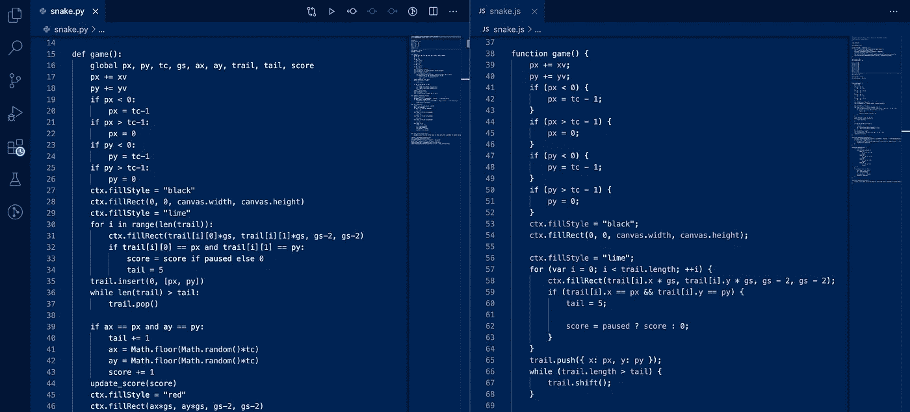

# 学习多种编程语言的案例

> 原文：<https://itnext.io/the-case-for-learning-multiple-programming-languages-2ed22d74c2b7?source=collection_archive---------1----------------------->

## #短裤

## 即使你在工作中没有全部使用它们

来自[的代码片段“厌倦了在 Web 上使用 Javascript？用浏览器 Python 代替"](https://medium.com/swlh/sick-of-javascript-just-use-browser-python-4b9679efe08b?sk=40e664d45bfea34d35189c32cd5d0a51)

像大多数程序员一样，在我的职业生涯、学习和个人项目中，我接触过各种编程语言。

然而，我基本上坚持了几个，因为这可以说是一个非常好的职业发展方向——一个后端是用 Go 编写的雇主对你可以用 10 种其他语言编写“hello world”风格的程序并不特别感兴趣(除了它可能表明的，例如，你的个性)。

最终，要用高性能代码解决困难的问题，需要非常熟悉他们正在使用的语言的来龙去脉。

因此，这通常是给刚起步的程序员的建议——专注于一门特定的语言，并真正精通它。对此我并不反对。

但是…

## 谷歌翻译还不够

作者对“谷歌翻译代码”的改编

最近在工作中，我接了一个基本上是翻译代码的项目。

我们维护[多个库](https://posthog.com/docs/integrate/overview#libraries)用于与我们的平台交互，我将实现一个我们在 Python 库中可用的特定特性，包括 Go、Node.js、Ruby 和 PHP 库。

它的核心非常简单，只需点击我们的 API 获取一些数据。

然而,“规范”(本质上只是当时的 Python 实现)要求轮询器定期触发对数据的请求，这些数据应该在计算某个调用的结果时被存储和使用。

这并不难，但很有趣。有趣的是，这四种语言都需要完全不同的方法。例如，特别是关于 poller，这里是在每种语言中用来构建它的主要工具:

*   **Go:** [Goroutines](https://golangr.com/goroutines/)
*   **node . js**:T0
*   **Ruby:** [定时器线程](https://www.rubydoc.info/gems/concurrent-ruby/Concurrent/TimerTask)
*   **PHP:** 无轮询器:(

需要说明的是，这两者在任何方面都不是等同的。goroutine 不是线程，而`setTimeout`(或者一般的异步 JavaScript 定时器)既不接近 go routine 也不接近线程。

因此，原本应该是简单的代码翻译任务——只需使用文档来执行语法更改——对于并发和并行模型、指针和引用、类型等概念来说，变成了良好的实践。

虽然我们大多数人都非常熟悉许多概念，但在实践中应用它们是一件不同的事情，结果会加强我们的理解。

我对 Node 非常熟悉，对 Go 也有一些小经验，所以并不是所有的东西对我来说都是新的，但是这里有一些你在从事这个项目时可能偶然发现的东西:

*   JavaScript 通过[事件循环](https://nodejs.org/en/docs/guides/event-loop-timers-and-nexttick/)以单线程方式处理异步操作的方法(以及这对定时器、承诺等意味着什么。)
*   Go 的[与 goroutines 的并发模型](https://blog.golang.org/waza-talk#:~:text=If%20there's%20one%20thing%20most,it%20is%20designed%20for%20concurrency.&text=In%20programming%2C%20concurrency%20is%20the,lots%20of%20things%20at%20once.)
*   PHP 对多线程极其有限的支持
*   不同的 Ruby 实现(例如 JRuby，CRuby) [如何以不同的方式处理多线程](https://github.com/ruby-concurrency/concurrent-ruby/blob/0cca52290709d114f2b75c75021ef8a73879a274/lib/concurrent-ruby/concurrent/array.rb#L22)
*   Go 和 Ruby 中并发/并行操作状态更新的不同方法(互斥体、通道)
*   不同的语言如何处理传递函数参数(通过共享调用、通过值传递、通过引用传递)及其含义(例如，在 Go 中传递指针和取消引用)
*   每种语言中哪些值是真的(以及这是如何影响的，例如为什么“未定义的”变量在 JS 和 PHP 中的行为不同)
*   这些语言支持(甚至要求)面向对象编程的程度

…还有更多。

> 如果你对最终构建了什么以及我在每种语言中是如何做到的感兴趣，请参考最后的[部分。](#406f)

最终，虽然人们总是可以依靠文档和堆栈溢出片段来无意识地处理新语言中的问题，但探索用一种语言解决问题的最佳方式迫使我们思考一种语言做出的设计决策及其对我们程序员的影响。

暴露于这些情况有助于我们更好地理解如何应对安全性、可伸缩性和性能等挑战，因为我们不仅意识到，而且**直观地熟悉**处理同一问题的不同范例和方法。

因此，当困难的问题出现时(它们将会出现)，如何解决它们的画面会立刻变得更加清晰，因为你已经有了使用各种可能会派上用场的工具、范例和概念的经验。

## 那么，是走宽还是走深？

克里斯蒂安·帕尔默拍摄的照片

那么，我应该放弃深入学习一门语言的目标，开始学习书中的每一门语言吗？

当然不是。

无论是从个人发展还是从职业角度来看，成为一名特定语言的“专家”仍然有巨大的好处。

然而，我个人建议不要严格限制自己，确保自己接触不同的编程语言。

毕竟，你当然可以在课堂上学到它，但是如果你只写 PHP，你可能很难深入理解线程，如果你只坚持 Ruby，你会在类型知识上有所欠缺。

相反，在 Go 中做所有的事情可能会阻止你学习到有更快的方法来获得:D 所做的事情的原型(…以及其他事情)。

最后，没有探索，你怎么知道你是否更喜欢写像 [Nim](https://betterprogramming.pub/a-python-substitute-i-tried-out-the-best-programming-language-youve-never-heard-of-9e29cd1893c0?source=friends_link&sk=61b12cfd6456f992013ba61e710efc72) 这样的东西而不是 Python 呢？

## 如果你真的感兴趣…

文章到此结束，但是如果你想知道到底是什么建造的，是如何完成的，这是给你的。

根据[这个松散的规范](https://posthog.com/handbook/engineering/feature-flags-spec)，该项目是为了在提到的库中建立对我们特性标志 API 的支持。

以下是对每种语言如何做到这一点的快速解释:

[**Go**](https://github.com/PostHog/posthog-go/pull/2)

goroutine 产生了一个无限循环，它不断地在三个通道之一上寻找消息的存在:

*   一个通道期待来自另一个运行 ticker 的 goroutine 的消息，ticker 以给定的时间间隔发送消息，并在每个 tick 重新提取数据
*   另一个通道用于强制刷新，无论跑马灯如何，都会立即触发数据请求。
*   最后一个通道用于中断循环，终止 goroutine 并关闭所有通道。

共享状态是使用互斥体更新的。

[**Node.js**](https://github.com/PostHog/posthog-node/pull/29)

当 feature flags 类被初始化时，一个无效的承诺使用`setTimeout`来触发数据的获取，从而启动一个 ticker。每个“滴答”确保没有额外的超时运行，并设置一个新的超时。

[**红宝石**](https://github.com/PostHog/posthog-ruby/pull/6)

一个线程由一个 ticker 产生，该 ticker 将周期性地触发数据的获取。数据存储在对象上，来自`concurrent-ruby`的`Concurrent:Array`和`Concurrent::AtomicBoolean`用于确保来自线程的安全状态更新。

[**PHP**](https://github.com/PostHog/posthog-php/pull/18)

PHP 实际上并没有得到一个轮询器，所以它只是在每次需要的时候获取必要的数据。:(