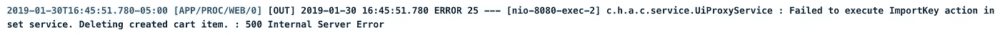
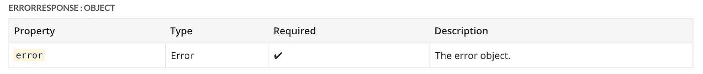
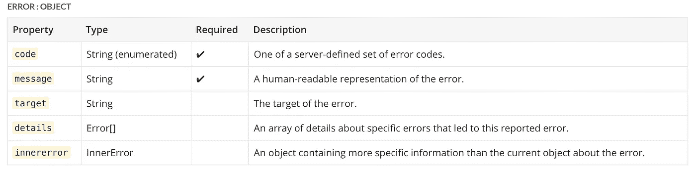
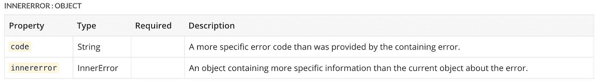

# Web 应用程序 API 中标准化错误处理的情况

> 原文：<https://itnext.io/the-case-for-standardized-error-handling-in-your-web-application-6428ff60cc31?source=collection_archive---------4----------------------->

# 因为坏的错误消息——或者更糟，用户看不见的错误对任何人都没有好处


是的，这是一个真正的错误信息。不，这不是我编的。

作为程序员，广告错误信息是我们都会犯的一种罪。在服务器端，在客户端，它们在 web 开发中基本上无处不在。

我写的。你来写。我的整个团队写的。我们都同意它们是不好的——错误消息没有告诉我们或我们的用户真正的问题是什么，只有通过深入挖掘代码库和跟踪应用程序日志，我们才能在大多数情况下找到真正的罪魁祸首。

这不是一个新的或不寻常的现象。它是标准的，它使每个人的生活比他们需要的痛苦无限多。但是每当我们谈论如何改进错误消息传递——更详细、更精确、更清楚地说明实际发生了什么错误，这些改进错误消息传递的努力就被任何有权力指导开发团队的人贬低，我们转向更直接、最终用户受益的特性。

恶性循环还在继续。用户在应用程序的客户端遇到一个错误，当错误无法通过关闭和重新打开系统来解决时(见下面的 meme ),联系开发团队，开发人员查看大量日志并尝试在本地重现错误(有时这是一个不可能的壮举),团队要么重现错误并找出导致错误的原因以及如何修复错误，要么他们无法重现错误并关闭 bug 而不进行修复，直到它在将来再次出现。


我无法抗拒使用这个迷因的机会——它如此准确，有时甚至令人恐惧。

你觉得这是一个最佳系统吗？我也没有。这就是我今天在这里给你写信的原因。

> 我正在为 API 的错误处理标准化做准备，这样我们就可以停止浪费这么多时间追踪 bug，回到我们都想做的编码上来——构建让人们生活更好的酷东西。

# 标准化误差:需求和基本规则



一个标准的、完全无用的 API 错误消息示例。

如果您没有阅读上面的错误消息，重要的部分是:`Failed to execute ImportKey action in set service*.* Deleting created cart item*.* : 500 Internal Server Error`

是的，这是来自我的团队的一个实际后端 web 应用程序的实际错误消息。不，这没有任何意义。我完全同意你的观点。

在 web 开发中，我们非常强调“快乐之路”。当用户使用我们的工具或应用程序时，我们希望并期望他们走的路——这是我们编码的路，我们优化的路，我们最关注的路。

“不愉快的路径”是指用户没有做正确的事情，没有点击正确的按钮，或者通常不知道如何以预期目的之外的方式使用系统。这是出错的地方，如果错误消息传递不好(如上)，我们作为用户和开发人员都很难找出到底哪里出错了。总的来说，不愉快的路径(以及它们产生的错误)很少考虑如何以有效的方式处理它们。

这需要改变。以下是我以更好的错误处理的名义提出的建议，所有这些都基于 [OData v4 JSON 规范](http://www.odata.org/documentation/)。

## 什么是 OData？


在我给出我的建议之前，让我先介绍一下 OData 的背景。

> OData 代表开放数据协议，它是一个开放的[协议](https://en.wikipedia.org/wiki/Protocol_(computing))，允许以简单和标准的方式创建和使用可查询和可互操作的[RESTful](https://en.wikipedia.org/wiki/RESTful)[API](https://en.wikipedia.org/wiki/Application_programming_interface)。[微软](https://en.wikipedia.org/wiki/Microsoft)于 2007 年发起 OData。—维基百科，OData

本质上，OData 定义了一组构建和使用 RESTful APIs(应用程序接口)的最佳实践。这些实践帮助开发人员在构建 RESTful APIs 时专注于业务逻辑，而不必担心定义请求和响应头、状态代码、HTTP 方法、URL 约定、媒体类型、有效负载格式、查询选项等内容的各种方法。

它提出了一些标准，让 web 开发不那么杂乱无章，更容易预测，而不管编程语言、开发方法和团队如何。

现在，我们知道了 OData 及其存在的合法性和原因，让我们来看看处理错误的规则。

## 要遵循的 8 条错误规则

下面是我的团队和更广泛的公司正在为我们的应用程序制定的标准——它们足够通用，可以广泛应用于一般的 API，但也足够具体，可以消除关于如何实现这些建议的问题。

**规则 1:代码一，可重用的错误处理程序**

*   对于不成功的情况，开发人员**应该**能够编写一段代码，跨不同的 REST API 方法一致地处理错误。
*   这允许构建简单可靠的基础设施，将异常作为独立于成功响应的流程来处理。
*   请记住，这个错误处理程序非常通用，不需要特定的 OData 构造。API**应该**使用这种格式，即使它们没有使用其他 OData 构造。

**规则 JSON 错误处理程序必须有一个** `**Error**` **对象**

*   错误响应**必须**是单个 JSON 对象。这个对象**必须**有一个名为`error`的名称/值对。值**必须是一个 JSON 对象。**



`error’`最基本的物体的例子。

**规则三:** `**error**` **必须包含** `**code**` **和** `**message**` **，并可能包含其他属性以获取更多信息**

*   这个对象**必须**包含名称为`code`和`message`的名称/值对，并且它**可以**包含名称为`target`、`details`和`innererror`的名称/值对。
*   `code`名称/值对的值是独立于语言的字符串。它的值是一个服务定义的错误代码，即**应该**可读。
*   与响应中指定的 HTTP 错误代码相比，此代码是更具体的错误指示器。
*   API 方法**应该**有相对较少的`code`可能值(大约 20 个),并且所有客户端**必须**能够处理所有这些值。
*   大多数服务需要更多更具体的错误代码，这并不是所有客户都感兴趣的。这些错误代码**应该在如下所述的`innererror`名称/值对中暴露**。
*   为`code`引入一个对现有客户端可见的新值是一个突破性的变化，需要增加版本。API 方法可以通过向`innererror`添加新的错误代码来避免中断更改。



包含多个属性的“错误”对象的示例。

**规则 4:**`**message**`**应该帮助人类调试错误**

*   `message`名称/值对**的值必须**是人类可读的错误表示。它旨在为开发人员提供帮助，不适合向最终用户公开。
*   想要为最终用户**公开合适消息的 API 方法必须**通过注释或自定义属性来实现。
*   API 方法**不应该**为最终用户本地化`message`,因为这样做**可能会**使可能记录该值的应用程序开发人员无法读取该值，并使该值在互联网上更难搜索。

**规则五:** `**target**` **是错误的属性名称**

*   `target`名称/值对的值是特定错误的目标(例如，出错的属性的名称)。

**规则 6:** `**details**` **是由**`**code**`**`**message**`组成的对象数组**

*   **`details`名称/值对**的值必须**是 JSON 对象的数组，其中**必须**包含`code`和`message`的名称/值对，并且**可以**包含如上所述的`target`的名称/值对。`details`数组中的对象通常表示在请求过程中发生的不同的相关错误。参见下面的例子。**

**`details`对象的示例:**

```
{   
  "error": {     
    "code": "BadArgument",     
    "message": "Multiple errors in ContactInfo data",     
    "target": "ContactInfo",     
    "details": [       
      {         
        "code": "NullValue",         
        "target": "PhoneNumber",         
        "message": "Phone number must not be null"       
      },       
      {         
        "code": "NullValue",         
        "target": "LastName",         
        "message": "Last name must not be null"       
      },       
      {         
        "code": "MalformedValue",         
        "target": "Address",         
        "message": "Address is not valid"       
       }     
     ]   
   } 
 }
```

**在本例中，请求存在多个问题，每个错误都在`details`中列出。**

****规则 7:** `**innererror**` **是具有服务定义内容的对象****

*   **`innererror`名称/值对**的值必须**是一个对象。**
*   **这个对象的内容是服务定义的。想要返回比根级代码**更多特定错误的 API 方法必须**通过包含`code`和嵌套`innererror`的名称/值对来实现。**
*   **每个嵌套的`innererror`对象比其父对象表现出更高的细节层次。**
*   **当评估错误时，客户端**必须**遍历所有嵌套的`innererrors`并选择它们理解的最深的一个。这个方案允许服务在层次结构中的任何地方引入新的错误代码，而不破坏向后兼容性，只要旧的错误代码仍然出现。**
*   **服务**可以**向不同的调用者返回不同级别的深度和细节。例如，在开发环境中，最深的`innererror` **可能**包含有助于调试服务的内部信息。**
*   **为了防范信息泄露的潜在安全问题，服务**应该**注意不要无意中暴露太多的细节。**
*   **错误对象**可能**还包括自定义的服务器定义的名称/值对，这些名称/值对**可能**特定于代码。带有自定义服务器定义属性**的错误类型应该在服务的元数据文档中声明**。参见下面的例子。**
*   **错误响应**可能**在其任何 JSON 对象中包含注释。**

****

**“innererror”对象的示例。**

**`innererror`对象的例子:**

```
{   
  "error": {     
    "code": "BadArgument",     
    "message": "Previous passwords may not be reused",     
    "target": "password",     
    "innererror": {       
      "code": "PasswordError",       
      "innererror": {         
        "code": "PasswordDoesNotMeetPolicy",         
        "minLength": "6",         
        "maxLength": "64",         
        "characterTypes":   ["lowerCase","upperCase","number","symbol"],         
        "minDistinctCharacterTypes": "2",         
        "innererror": {           
          "code": "PasswordReuseNotAllowed"         
        }       
      }     
    }   
  } 
}
```

**在上面的例子中，最基本的错误代码是`BadArgument`，但是对于感兴趣的客户来说，在`innererror`中有更具体的错误代码。**

**`PasswordReuseNotAllowed`代码可能是由服务在稍后的日期添加的，之前只返回了`PasswordDoesNotMeetPolicy`。**

**当添加新的错误代码时，现有客户端不会中断，但是新客户端**可能**会利用它。`PasswordDoesNotMeetPolicy`错误还包括额外的名称/值对，允许客户端确定服务器的配置，以编程方式验证用户的输入，或者在客户端自己的本地化消息传递中向用户呈现服务器的约束。**

****规则 8:重试失败代码****

*   **建议对于任何可能重试的暂时错误，服务**应该**包括一个`Retry-After` HTTP 头，指示客户端**在再次尝试操作之前**应该等待的最小秒数。**

**标准化 API 错误处理策略的规则到此结束。这并不过分复杂，但它推荐了一些好的指导方针，当遇到不愉快的事情时，可以试着去遵守。**

# **结论**

**实现错误消息并不是最有趣的事情，但是尝试调试一个令人痛苦的模糊(并且经常误导)的服务器消息就更不有趣了。标准化的错误处理是必须的——特别是如果你是大型开发团队的一员，或者为外部客户提供 API 服务。**

**像 OData 这样的组织已经帮助建立了围绕编写和使用 API 的最佳实践，这有助于开发人员专注于他们应用程序的业务逻辑。通过遵循这些最佳实践，我们已经建立了一套易于理解且可重复的错误处理规则，以简化处理不可避免的不愉快路径的整个过程。**

**过几周再来看看，我会写一些关于 Reactjs 或者其他与 web 开发相关的东西，所以请关注我，这样你就不会错过了。**

**感谢您的阅读，我希望这能帮助您更有效地处理标准化格式的错误，以便您能更好地捕捉和修复错误。非常感谢鼓掌和分享！**

**如果你喜欢读这篇文章，你可能也会喜欢我的其他一些博客:**

*   **[调试 Node.js 最简单的方法——用 VS 代码](/the-absolute-easiest-way-to-debug-node-js-with-vscode-2e02ef5b1bad)**
*   **[用最简单的方法保持开发人员之间的代码一致——用更漂亮的& ESLint](/keep-code-consistent-across-developers-the-easy-way-with-prettier-eslint-60bb7e91b76c)**
*   **[使用 Nodemailer 简化 React 应用程序中的密码重置电子邮件](/password-reset-emails-in-your-react-app-made-easy-with-nodemailer-bb27968310d7)**

****参考资料和更多资源:****

*   **OData V4 JSON 规范:[https://www.odata.org/documentation/](https://www.odata.org/documentation/)**
*   **开放数据协议:[https://en.wikipedia.org/wiki/Open_Data_Protocol](https://en.wikipedia.org/wiki/Open_Data_Protocol)**
*   **https://www.odata.org/**