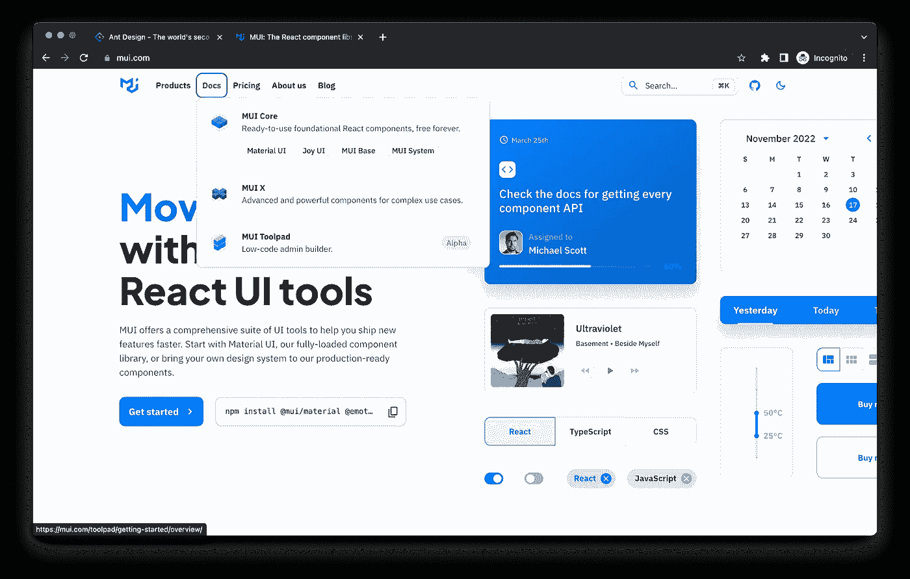
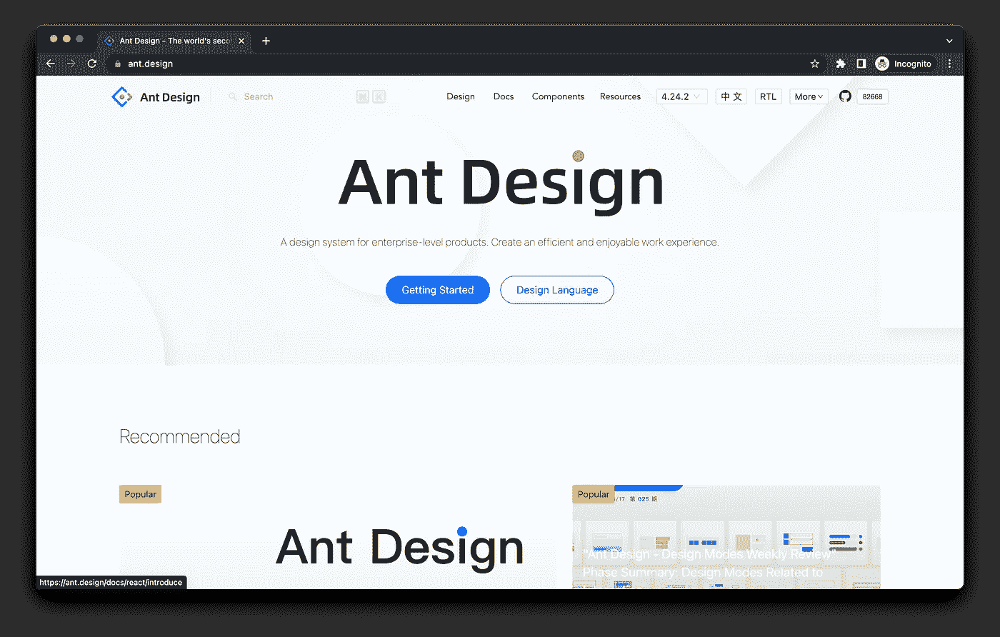
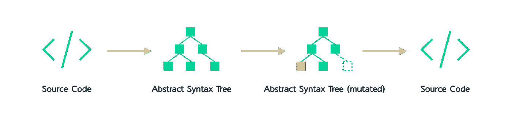
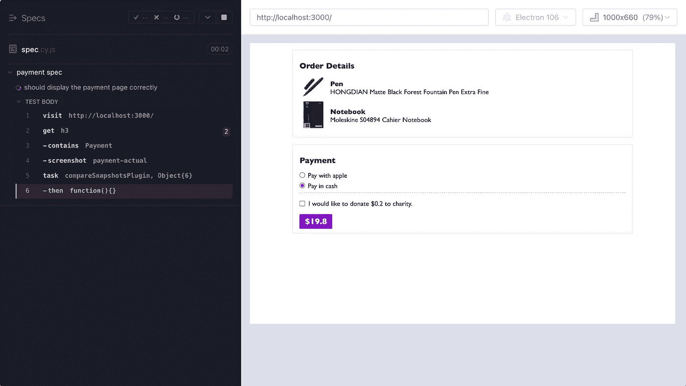
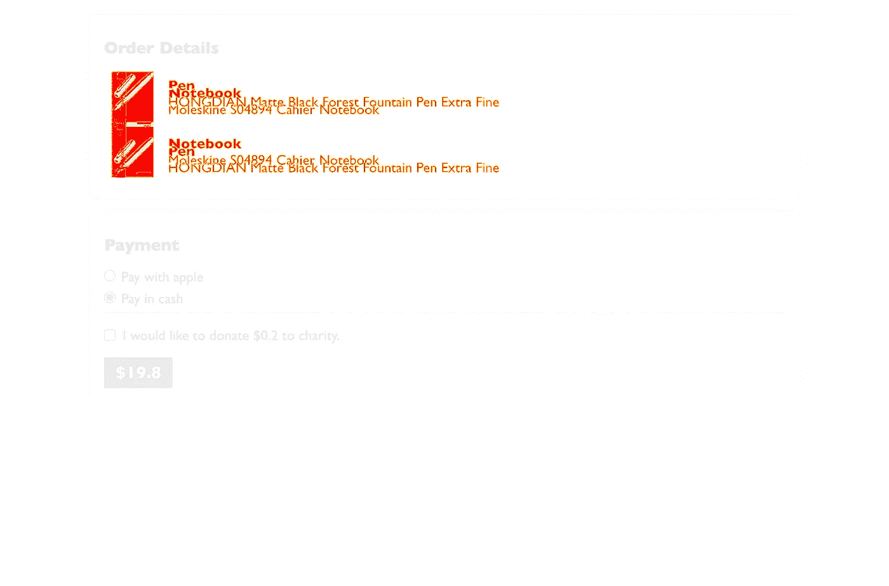
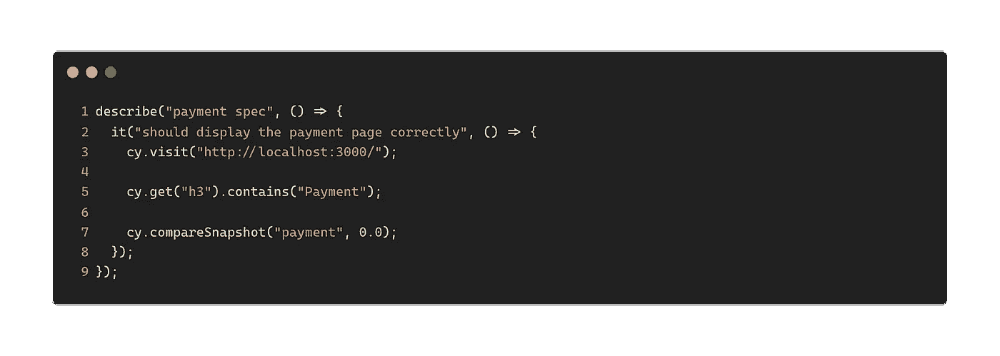
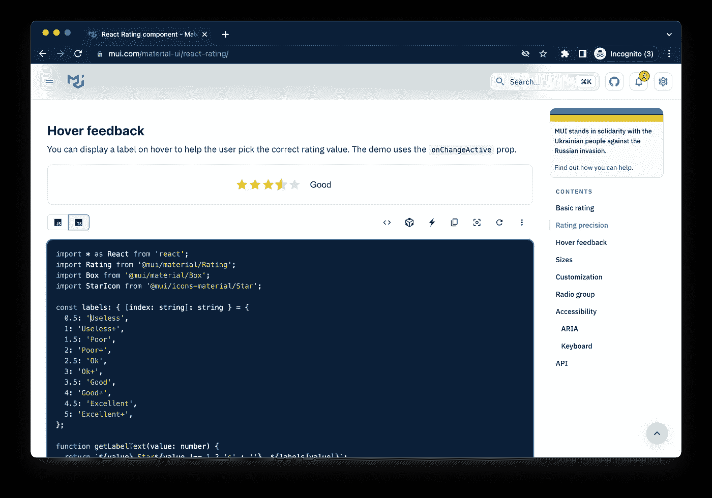
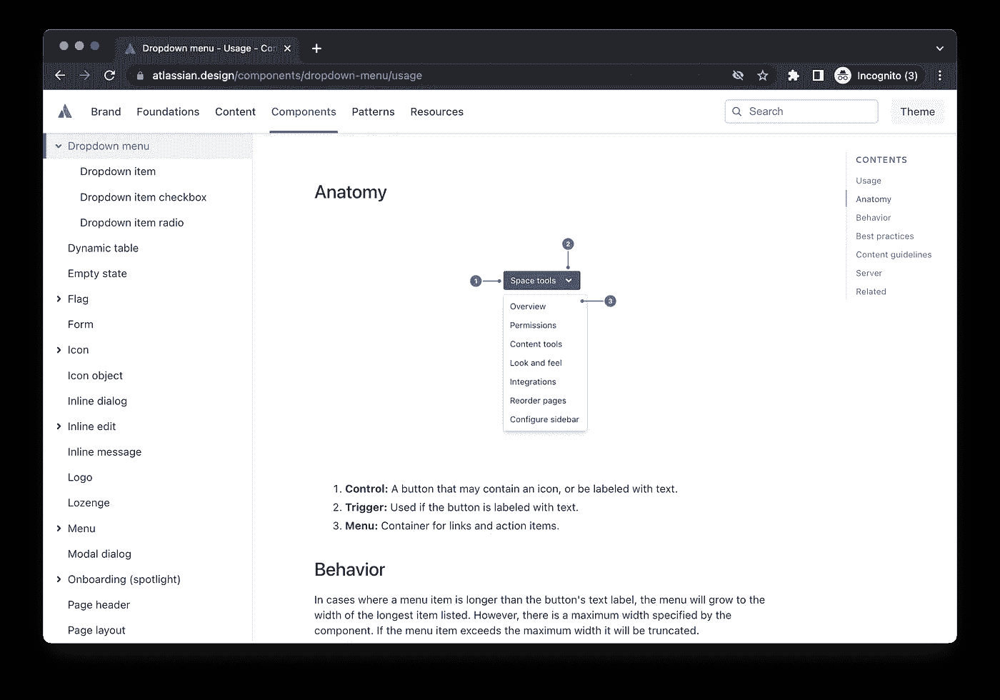

# 实施设计系统的挑战

> 原文：<https://itnext.io/the-challenges-of-implementing-a-design-system-f83565605573?source=collection_archive---------1----------------------->

由[米娅·贝克](https://unsplash.com/@miabaker?utm_source=medium&utm_medium=referral)在 [Unsplash](https://unsplash.com?utm_source=medium&utm_medium=referral) 上拍摄的照片

但是建立一个设计系统是一件具有挑战性的事情。有很多事情需要考虑，但也很容易被忽略。在这篇文章中，我将从开发者的角度总结实现设计系统的一些重要方面。

# 什么是设计系统？

设计系统有数百种定义，我认为[这一个](https://www.nngroup.com/articles/design-systems-101/)足够通用，并且拥有大多数基本要素:

> 设计系统是一套标准，通过减少冗余来管理大规模设计，同时在不同页面和渠道之间创建共享语言和视觉一致性。

因此，这不是一个关于如何大规模设计的单一标准，而是一套标准，它是一种可视化语言，对用户体验设计和实施都很重要。最后，一致性是这里的关键，你会希望所有的产品在用户体验方面有相同的模式。

# 设计系统试图解决的问题是什么？

假设您已经成功构建了一个在线应用程序，并且您的客户非常喜欢它。随着业务的增长，您希望向应用程序添加更多的功能，因此需要几个新页面。

除了新功能之外，你还需要考虑一些事情。对于新的 UI 元素(例如，您在任何其他页面上都没有的 accordion)，您将需要一些前期设计工作，然后开发人员可以开始实现它们。但是这里通常会有一些来回，比如新元素的`border-radius`有多长，动画的延迟有多长，以及`box-shadow`的传播半径如何？

此外，对于现有的元素，如在其他页面上使用的**按钮**，可能需要“一点点”处理才能在新页面上使用(因为它可能不完全适合使用)。

随着你的业务不断增长，这些活动将会重复和频繁地发生。在某种程度上，你可能需要构建其他类似的产品，但仍然希望保留视觉识别。而且你也不想一遍又一遍的做**上面的所有流程**。

请注意，我不只是在谈论视觉细节(它们肯定是至关重要的)，如海拔，颜色，排版，布局，图像，动画等。还有可访问性，你在不同页面上使用的语言和语气，以及在保持一致性的同时做出新的改变的努力。

这就是我们在这里谈论的**大规模设计**。

# 你可能面临的挑战

从你当前的代码库中提取代码并将它们分离到一个包中应该是构建设计系统的第一步。而这只是这个系统的冰山一角。还有许多其他细节你可能不知道，但可以使它失败或成功。

# 易接近

对于一个严肃的设计系统，可访问性不是可选的，而是必须的。你需要建立键盘导航，需要的时候需要使用`ARIA`属性，颜色对比度要满足[WCAG](https://www.w3.org/WAI/standards-guidelines/wcag/)的最低要求。

例如，在 [Material UI](https://mui.com/) 和 [Atlassian Design System](https://atlassian.design/) 中，你可以使用键盘做几乎每一个动作:导航到下一个链接、搜索一个文档、在暗模式和亮模式之间切换等。

材料 UI 设计系统

但不是所有的设计系统都是一样的。[蚂蚁设计](https://ant.design/)——中国最流行的“设计系统”，当你通过键盘导航时，它没有任何视觉指示器。你看不到链接周围的高亮环。

Ant 设计——没有太多的可访问性考虑

# 升级新版本

> 有了足够数量的 API 用户，你在合同中承诺什么并不重要:你系统的所有可观察到的行为都将依赖于某个人。
> 
> —海鲁姆·赖特

这里的关键是“可观察的行为”，这意味着即使它不在文档中，当人们偶然发现它可以这样使用时，他们(其中一些人)将依赖于该行为，这可能会在升级时造成困难。

一旦发布了一个包，一些产品团队开始使用它，您需要围绕版本烧录和迁移准备大量的后续任务:

*   当这是一个突破性的改变时，需要采取什么步骤
*   当升级出现问题时，您会怎么做？降级到旧版本或修补新版本
*   如果某些产品使用了落后的版本 3，并希望升级到最新版本，该怎么办？有多简单？

Codemod 拯救版本碰撞问题

通过使用像 jscodeshift(带 codemod 脚本)这样的工具，升级可以简化很多。但是，仍然会有一些你可能会错过的疑难病例。所以，也准备好接受一些临时的攻击吧。我有一整篇文章讲如何[使用 codemod 和 jscodeshift](https://www.notion.so/Design-System-faafd99415df435c92b0ae2e88410488) 自动升级一个破 API。

# 测试策略

测试对任何代码库来说有多重要是不用说的，测试金字塔理论适用于设计系统组件。除了单元测试和集成测试之外，单元测试更侧重于不涉及实际浏览器的孤立测试，集成测试将一些组件放在一起，看它们是否能在所有支持的浏览器(以及不同版本)中正常工作，您还需要**视觉回归测试**。

使用像 [browserstack](https://www.browserstack.com/) 这样的工具，你可以在不同版本中测试所有这些浏览器，并确保它们在所有环境下都能正常工作。

视觉回归测试逐个像素地检查组件在特定屏幕尺寸上的呈现方式。它们在常规的 web 应用程序中通常被认为过于昂贵，但是在设计系统环境中却是必须的。

下面是它在真实场景中运行的具体例子。我使用`cypress` + `cypress-visual-regression`来做检查。还有很多其他的选择。商业( [browserstack](https://www.browserstack.com/percy/visual-testing) )和开源框架都是可用的。

Cypress 在视觉比较步骤中失败

在实现中，我在 order detail 部分交换了两种产品，因此可视化回归检测到了差异:

橙色突出了基础和实际之间的差异

你可能还想调整`base`和`actual`截图之间的差异阈值，以防过于敏感。例如，有时像素框阴影大小可能是可以接受的。

请注意，您可以使用阈值来定义敏感度

# 文档

很容易忽略文档在设计系统中的重要性。如果你能让它成为一个**活文档**，比如在页面中嵌入一个 [codesanbox](https://codesandbox.io/) ，这样消费者(开发者)就可以摆弄代码了，那就太棒了。

您可以在位编辑构件并查看影响。

此外，一个好的文档应该包括产品何时应该选择哪些组件以使用户体验更自然的指导。在 Atlassian 设计系统中，组件的使用有几个明确定义的部分，如**解剖**、**行为**、**最佳实践和内容指南**等。

Atlassian 设计系统对每个组件都有一份出色的文档

# 照常营业

当你大到足以吸引内部和外部用户时，它就伴随着支持和随叫随到的职责。人们可能会以一种意想不到的方式使用组件(所以你需要更多的时间来调查)，并且你会希望确保消息作为一个团队总是一致的(这样消费者就不会感到困惑)。

让人们提供一个工作示例对你的研究非常有帮助，比如一个 codesandbox 或 codepen，用最少的代码就可以重现这个案例。在您修复了这个问题之后，您也可以更新您的组件文档中的示例部分，这样当人们偶然遇到同样的问题时，就可以从文档中得到他们的答案。

# 设计系统的所有权

在一个没有庞大开发团队的公司里，产品团队可以拥有设计系统，因为没有多少用户。但是，如果业务发展到一定规模。不仅开发新功能和维护代码的工作量巨大，而且设计系统的领域知识与产品不同，因此您需要有一个专门的设计系统团队。

产品团队可能会专注于如何获取数据并将其转换成可由`Order`或`UserProfile`组件使用的某种形式，而设计系统则更关注令牌、单个组件的性能，以及如何使它们更具可组合性等等。

# 摘要

设计系统是一个很好的方法，可以确保你的产品的用户体验保持一致，并在大规模设计时减轻一些痛苦。但是它不是免费的，它比你想象的要贵。提取一个通用的组件库是简单的第一步，之后有 80%的工作。

你需要在版本升级、文档和 BAU 方面做很多规划。你需要一个团队来支持它，因为这是一个不同于你正常商业模式的领域。

# 参考

*   [设计系统 101](https://www.nngroup.com/articles/design-systems-101/)
*   [关于设计系统你需要知道的一切](https://www.notion.so/Design-System-faafd99415df435c92b0ae2e88410488)
*   [有人说作文了吗](https://javascript.plainenglish.io/did-someone-say-composition-c7843d898b2)
*   [用 jscodeshift/codemods 自动重构](/automatic-refactoring-with-jscodeshift-codemods-45c219eaf992)

**如果你喜欢阅读，请** [**报名参加我的邮件列表**](https://icodeit.com.au/#subscribe) **。我每周通过** [**博客**](https://juntao-qiu.medium.com/)**[**书籍**](https://leanpub.com/u/juntao) **和** [**视频**](https://www.youtube.com/@icodeit.juntao) **分享干净代码和重构技术。****