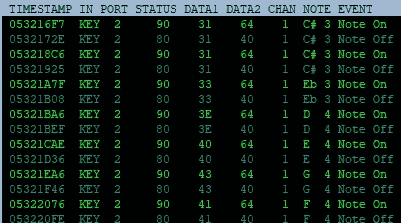
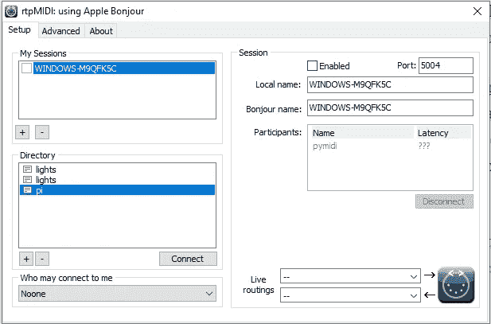
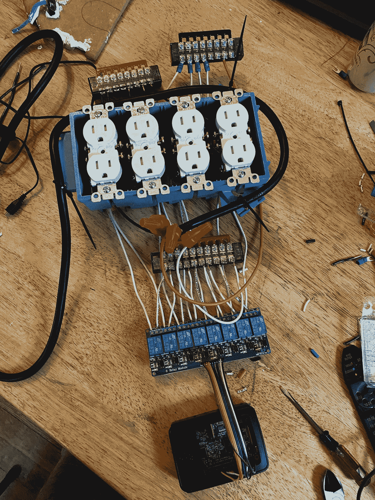
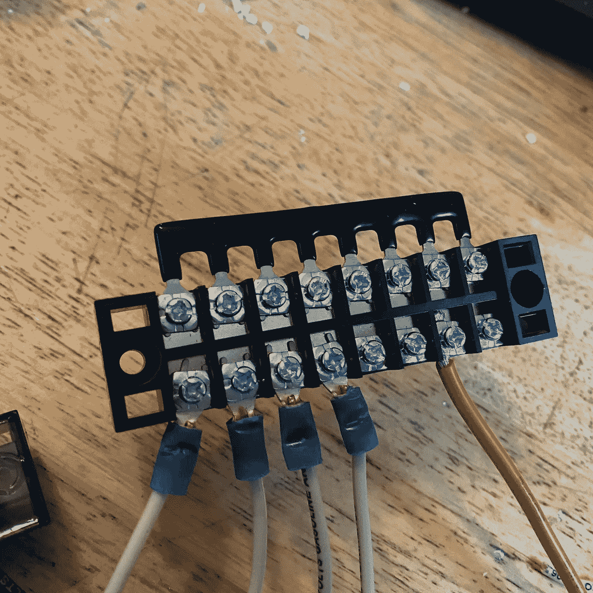

# 圣诞机器

> 原文：<https://itnext.io/the-christmas-machine-fca7184cbe50?source=collection_archive---------2----------------------->

## 一个 MIDI 驱动的交流灯光控制器建立在一个树莓派和几个有问题的布线决定

我妻子非常喜欢节日装饰品。她非常喜欢圣诞灯。随着音乐舞动的圣诞灯？合法的狗屁。大约 12 年前，她告诉我，她的梦想是有一天能让舞动的圣诞彩灯配上音乐。当时我们住在一个公寓里，没有真正的外部空间来装饰这些东西，但它确实让我思考了一下。我当时已经开始粗略地组合这种方法，但当时有很多障碍，真的挫伤了我完成它的热情，尤其是我讨厌从头开始布线交流组件，可能会烧毁一套甚至没有装饰空间的公寓。

虽然它的硬件方面确实让我因为害怕火灾而犹豫不决，但这在当时至少是一个相当解决的问题:使用继电器控制简单的交流电路是一个非常简单的命题:一边是低压，另一边是高压。如果你有什么东西可以点亮 GPIO 引脚，你可以打开/关闭交流开关。当谈到灯光表演时，真正的婊子是想出一种用户友好的方式来排序这个过程，而不是拔你的头发。我一直认为 MIDI 是最好的解决方案，即使它并不是 MIDI 的本意，但是多年来我的整个方法都在发展，直到我最终完成了这个东西。

# 迷迪

如果你不熟悉 MIDI，它代表“乐器数字接口”这是一个在兼容系统之间发送数据的非常简单的系统。例如，它可以让您将键盘(音乐键盘，而不是 PC 键盘)连接到合成器并控制它们。最简单的方式是通过串行连接发送编码信息，包括时间戳、音符信息和“音符开/关”数据。因此，如果你把手指放在键盘上的一个中 C 音符上，你的合成器会知道演奏中 C，当你把手指从那个音符上拿开时，你的合成器会知道停止演奏。

显示 MIDI-OX 中采集的实时 MIDI 数据的监视器

虽然 MIDI 在技术上是用于音乐而不是硬件控制的，但不难看出它拥有硬件控制所需的一切。通过将音符映射到您想要二进制(开/关)控制的设备，MIDI 为您提供了一个简单、低延迟的控制协议，可以快速调整以控制灯光。

现在，敏锐的读者可能会认为 DMX 更适合这一点，因为 DMX 是专门用于照明的类似标准。如果你已经注意到了，那你就没有错。使用 DMX 可能很容易做到这一点。我对 DMX 一无所知，但我对 MIDI 一窍不通，所以我们来了。更重要的是，我 12 年前的目标是能够用 WAV/MP3 音频按时间顺序排列灯光，使用 MIDI 似乎是用我已有的软件实现这一目标的最直观的方式。对于这个圣诞机器的构建，我一直使用一个名为 Reason 的音乐制作软件套件来给灯光排序，当我这样做时，它看起来像这样:

合理的轻排序

在这张图片中，你可以看到我是如何排列灯光的:每个“音符”对应于树莓 Pi 上的一个 GPIO 引脚。顶道有一个“铃儿响叮当”的 WAV 文件，我基本上只是及时绘制区块，以配合歌曲的变化。这有点乏味，但总比用 python 手工编写时间延迟要好。此外，这是一个我非常熟悉的界面，所以我可以喝几杯啤酒就能上手。

当我 12 年前最初设想使用 MIDI 时，我的计划是通过有线 MIDI 连接来实现，基本上是将 MIDI 输出从我的笔记本电脑(使用 USB 到 5 针 MIDI 接口)连接到类似 Arduino 的黑客串行连接。这是可以做到的，但是你需要更多的电缆。

# RTP-MIDI 拯救世界

就像我提到的，已经 12 年了。从那以后，很多事情都变了。我们最近买了一栋房子，它有很大的外部装饰面积。此外，如果我用劣质交流电线点火，那是我的问题。我决定重新审视这个项目。

在十多年后选择一个乏味的技术项目的一个好处是，随着时间的推移，许多瓶颈和约束会自行解决。当我第一次把这种方法放在一起时，我假设我需要运行一个硬连线的串行连接来处理 MIDI，完全知道 MIDI-over-network (RTP-MIDI)是一个更好的选择。那时候，通过网络接收 MIDI 并不划算，基本上需要一台专用电脑来接收信号。当我决定再次选择这个项目时，我想我应该四处看看是否有 Raspberry Pi 的 RTP-MIDI 实现。让我非常高兴的是，有这样一个人。pymidi 是一个特别为 Raspberry Pi 编写的非常简单的 python RTP-MIDI 服务器实现，正是我一直在寻找的。它打包了一个样本事件处理程序，通过一点粗略的 python 和用于引脚控制的 [gpiozero](https://gpiozero.readthedocs.io/en/stable/) ，我能够将传入的音符开/音符关消息映射到引脚开/引脚关控制。

在那里，我安装了 [rtpMIDI](https://www.tobias-erichsen.de/software/rtpmidi.html) ，这是一个虚拟的 MIDI 驱动程序，允许你以低延迟将任何 MIDI 输出从任何 Windows 软件 MIDI-out 传输到你网络上的任何东西。pymidi 位于 Raspberry Pi 上监听 midi 数据，rtpMIDI 位于 Windows 计算机上，将 MIDI 数据路由到 pymidi。这是一个很好的结合。

rtpMIDI —将灯光序列直接传输到您的树莓 Pi

注意:Mac 支持开箱即用的网络 MIDI，所以如果你是 Mac 用户就不需要安装 rtpMIDI。我也一直在试图寻找和测试一个 linux 兼容的解决方案，因为我希望能够得到一个端到端的免费解决方案。

# 五金器具

当我用交流电源工作时，我真的很紧张，因为我完全意识到我不是很聪明，也没有注意力持续时间。为此，我会建议你不要做我所做的任何事情，也不要假设我所做的任何事情是安全或合理的。在交流电源上出错会害死你，烧掉你的房子。妈的，即使你做的一切都是正确的，你仍然可以用交流电杀死自己。

我怀疑我所做的一切是代码，甚至是合法的。

但是既然你已经做到了这一步，我要指出我发现了这个非常详细的记录，我把它作为一个起点:

 [## 我们如何制作树莓 Pi 控制的 8 插座电源盒

### Raspberry PI 你有没有想过能够通过你的局域网或者互联网来控制交流电源插座？我们…

twosortoftechguys.wordpress.com](https://twosortoftechguys.wordpress.com/2018/08/13/how-we-made-a-raspberry-pi-controlled-8-outlet-power-box/) 

基本上，我从一个 Raspberry Pi 3b、几个 8 继电器板、一吨电线和一盒交流插座开始，并连接了硬件。

我构建的前半部分，八个通道。

我的构建与我所链接的文章中的构建之间的一个区别是，我对大多数接线使用了端子板，这减少了我必须使用的粗略接线螺母连接的数量，并且可以说使其更容易扩展。我从亚马逊购买了几套这样的模块和跳线，基本上用来创建一条接地总线、一条中性总线和一条“热”总线，使交流连接更容易管理，并分配到它们需要触及的各个触点:

 [## FIXITOK 6 套端子板，4/5/6 位置 600V 15A 双排螺丝端子板，带 400V…

### FIXITOK 6 套端子板，4/5/6 位置 600V 15A 双排螺丝端子板，带 400V 15A 预绝缘…

www.amazon.com](https://www.amazon.com/gp/product/B08D3J19FT/ref=ppx_yo_dt_b_asin_title_o03_s00?ie=UTF8&psc=1) 

我的中性总线截图——左侧的四个连接器连接到四个插座上的中性连接器。右边的红色线连接交流电源线的中性线。顶部的黑色跳线将它们连接在一起。

# 把所有的放在一起

所以基本上我在台式电脑上运行 Reason 和 rtpMIDI。我的 Raspberry Pi 通过 wifi 接收 MIDI 数据，并启动继电器来打开和关闭插座。我昨天让它单独控制八个插座，现在我正在完成扩展，它将增加到十六个插座。我使用端子板总线构建它的方式，从 8 个扩展到 16 个，基本上只是将三根交流电线连接到第二组插座/总线，然后将新继电器的低压 DC 连接到树莓 Pi 上的引脚。

这是一个接近完成的产品的简短视频，在我插入交流电之前，启动继电器测试低压部分:

这是另一个继电器在外面点火的短片，插座里有一些灯，用来测试交流开关。令我惊讶的是，它很有效:

在我完成扩展(希望如此)后，我将把它安装在木板上，并把它放在一个防风雨的桶里。

在接下来的几个晚上，我会在房子周围挂灯，并让灯与 WAV/MP3 音频同步。然后，我将通过调频发射机传输音频，并成为邻居的麻烦。

有什么问题尽管问！