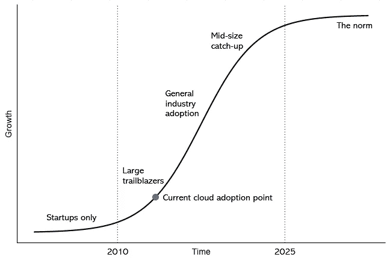

# 云技能短缺和认证的失业大军

> 原文：<https://itnext.io/the-cloud-skills-shortage-and-the-unemployed-army-of-the-certified-bd405784cef1?source=collection_archive---------0----------------------->

*为什么云技术领域的职位如此难找，而职位却一直空缺。*

在过去的一年里，我遇到了许多人，他们参加了许多可用的云认证，但却无法在这个领域找到工作。许多人有着令人印象深刻的背景的长长的简历，其他人已经从科学或数学转行，而一些人是试图进入 IT 最新领域的应届毕业生。我遇到的人没有一个明显不合格的。

如果你与招聘人员或人力资源部门交谈，你会听到 AWS 认证是任何技术简历上最热门的词汇。"没有足够的尸体放在座位上！"他们说。然后，如果你转过身去，对着一群刚刚获得失业证明的人说，“没人回复我们的求职申请！”合唱是这样的。你会想，这两个群体是生活在同一个宇宙吗？这是怎么回事？

通常，我们在科技领域缩短了 5 年周期，这导致了对新技能的需求。首先是互联网(“HTML！Perl！PHP！”)然后是手机应用(“安卓！目标 C！反应原生！扑！”)而现在云(“AWS 认证！DevOps！塞科普斯！”).接下来可能是物联网和机器学习。技术本身并不重要——公司只是想要一群战术工人不知疲倦地制造这种东西。

回到移动应用的热潮中，你可以找到一份经验很少的工作——真的，那是蛮荒的西部。但在这个周期中，公司不会向新获得认证或雄心勃勃的人抛出橄榄枝。这是一个非常不同的领域，*创造的新的云计算工作岗位的实际数量将会少得惊人，这是 IT 自动化和商品化的副产品。*

## S 曲线的暴政

每项新技术都有其 S 曲线，早期采用者往往会高估我们的进步程度。在云领域，采用率远没有许多人认为的那么高——根据行业用户与增长的图表，我估计是这样的:

现在，在云计算中，真正的工作是在大公司中提供的，这些公司要么是早期采用者，要么有在云中启动的新项目，而他们的基础设施的其余部分不是。在他们的直接轨道上的任何人也会看到角色出现在云中——主要是咨询公司和支持供应商。这些都是 2019 年最好的云工作存在的地方。

在这一点上，只有少数中型公司在云中有意义，尽管你会看到许多职位发布。其中一些公司意识到他们需要更新他们的 IT，但他们试图通过雇佣“数字化转型”角色来做到这一点，这几乎没有什么作用，但却阻碍了雇佣的旋转门，因为他们没有高管的认可和预算。他们还巩固了不支持这些新贵尝试的 IT，并且在任何重大事件发生之前，组织需要新的 IT 领导人员。

我知道这些宽泛的陈述有许多例外，但总体而言，我认为云采用曲线的位置是相当准确的，我们尚未看到对云人才的需求出现巨大爆炸。再过一段时间，当中型企业进入这一领域并且采用曲线成熟时，云技能将成为 IT 人员的主流要求。

但这并不是故事的全部，也没有解释为什么新培训的合格人员没有进入岗位，以及为什么企业人力资源部门声称没有人拥有所需的技能。还有一个更重要的因素。

## IT 人员的崩溃

当移动应用出现时，新技能对现有的 IT 环境没有影响。当然，UI/UX 行业蓬勃发展，开发领域也出现了一些动向，但如果你从事数据库、安全、服务器管理或其他各种工作，而不是在公司里保持运转，你就不会受到影响。

有了云，这完全不同，工作描述中使用的语言是正在发生的事情的线索。我们看到在听起来很酷的新流行语背后隐藏着大量的工作岗位。谁不想成为 10x 编码器或全栈开发人员？多年来分离的角色——数据库管理员、服务器管理员、质量工程师、软件开发人员——正在被挤到一起，因为员工人数正在减少。这些角色要求你做几个人的工作，但利用你对智力挑战的吸引力，让它听起来更有吸引力。

这一点现在很明显，因为自动化和云计算已经掏空了曾经受人尊敬的职业的核心。数据库管理是困难的，现在 RDS 几乎是多余的；服务器管理非常困难，而且大多随着虚拟化而消失。质量保证/QE 已经被 TDD、CI/CD 和自动化彻底摧毁，它们有效地将开发人员束缚在工作中。空缺的职位除了所有其他的技能之外，还包括了解所有这些技能的要求。

在采用云的大型公司中，通常他们会将现有的后端员工重新培训为云架构师或可扩展性工程师。这一点非常有效，因为后端人员拥有学习可伸缩性、冗余和可用性技术的完美技能组合。这也避免了裁员，他们的员工已经熟悉了系统和文化。

NoOps 运动给人的印象是，所有这些服务器管理员很快就要走上街头。但现实是，云将对这些群体非常有利，他们的角色变得越来越普遍，越来越接近前端。从根本上来说，将一名有经验的后端工程师带到前端要比反过来容易得多。随着无服务器的发展，这一点将变得非常明显，因为无服务器基本上是为基础设施工程师设计的。

这里的关键是，企业不会雇佣刚获得认证的 AWS 专家来接管他们已建立的运营团队的基础设施。他们想要有丰富经验的人，这是一个无风险的赌注，新员工可以完美地执行技术。这通常意味着疯狂的工作要求(我最近看到“10 年无服务器”是一个硬性要求)和现有的成功记录。

这些公司没有兴趣付钱给那些已经学习过、研究过或最近获得认证的人，除非这是多年真实世界成功的锦上添花。回想起来，这可能并不奇怪，但这确实意味着你必须质疑告诉有希望的人存在巨大机会的价值，除非他们有现有的基础设施经验。

## 云职业的机会在哪里？

对于没有这种背景的人来说，目前最好的 AWS 工作是销售、客户管理和非直接技术性的角色。在供应商生态系统中尤其如此，他们对后端的前生不太感兴趣。

如果你正在寻找业务转型，你的最佳选择是创业公司或咨询公司。两者都有自己的一系列问题，但它们是唯一允许你成为革命者的地方。这些角色在较大的老牌公司中并不存在，除了少数特权阶层，他们已经在中层管理阶层工作了很长时间。

如果你是一个编程巨星，那种早餐吸收新的语言和框架，并有能力将云技术融入你的腰带的开发人员，你已经在为 FAANG 工作，或者很快将会为 FAANG 工作。极少数不使用 stack 的工程师每天溢出 20 次，并能记住 Stack 和 heap 之间的区别，他们正在被大型科技公司在不可阻挡的招聘狂潮中嗅出来。这将是一个在正规公司很快灭绝的品种。

最后，还有单飞——核选项。一位受人尊敬的技术思想领袖最近在推特上说，“云开发人员有巨大的套利机会，可以去与需要削减开支的公司达成这些交易。”从表面上看，这似乎是正确的——云专家现在是技术领域的魔术师，他们似乎可以利用自动化来削减开支，从而致富。

但这就是咨询陷阱，它对那些聪明、合格、想要摆脱全职工作的窠臼、独立推动变革的人很有吸引力。这通常是因为很难找到有意愿的客户，我可以从个人经历和无数尝试过同样事情却失败了的科技人才那里告诉你这一点。

对于大多数 IT 人员来说，云的悖论将会严重影响我们未来的角色。你必须以比其他行业的同行更快的速度不断学习新技能，但你正在运行一部不断加速的下行扶梯。云吞噬整个生态系统的速度为有经验的人创造了机会，但最终将使那些转行或初级水平的人更难进入。