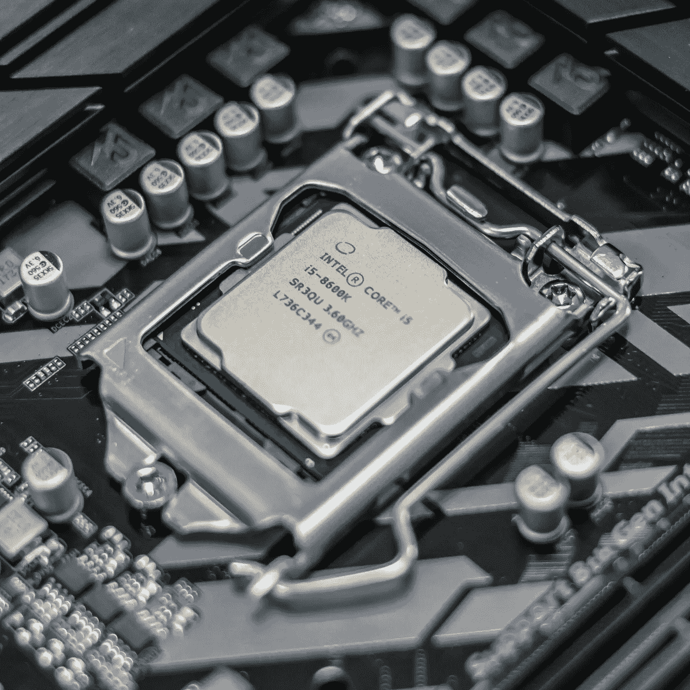
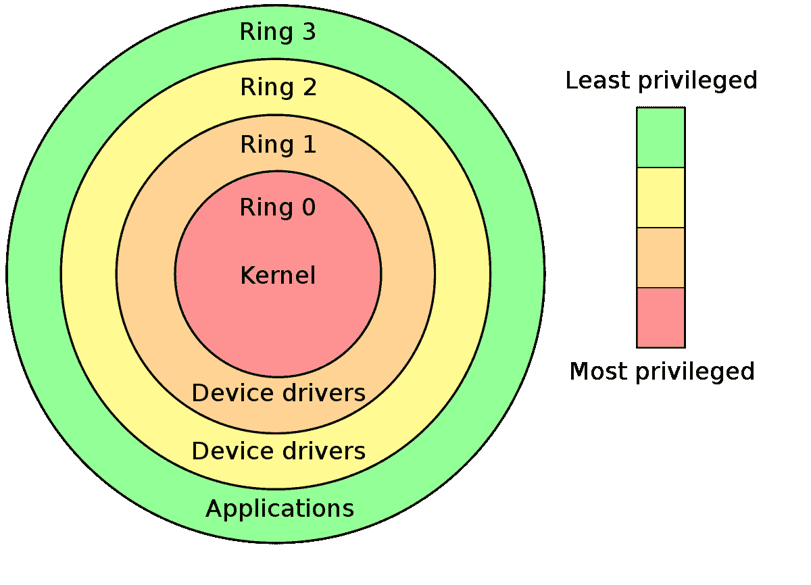

# 您电脑中的电脑——英特尔管理引擎

> 原文：<https://itnext.io/the-computer-in-your-computer-the-intel-management-engine-cd8d5aaf6c55?source=collection_archive---------2----------------------->

英特尔是世界上最大的半导体公司之一，也是 x86 架构的发明者。在过去的几年里，英特尔发明了几项信任技术。第一个是英特尔管理引擎，称为英特尔 ME。

# 英特尔管理引擎

英特尔管理引擎是主板上平台控制器中枢(PCH)中的一个自治部分，它可以控制一切:打开/关闭计算机并登录到计算机，无论是否安装了操作系统。英特尔 ME 固件驻留在每个主板上的内部闪存中。当 CPU 启动时，它将固件加载到 PCH 中。没有英特尔 ME，您的计算机或服务器系统将无法启动。有一些方法可以禁用或减少英特尔 me 的功能。

在环术语中，它生活在环-3 中。但是这些戒指是关于什么的？

# 戒指术语

Linux 内核特权级别通常用环来描述。这些保护环是保护用户的机制，正式命名为分级保护域。

x86 特权环摘自[维基百科](https://en.wikipedia.org/wiki/Protection_ring)

最重要的戒指是:

*   **环 3:** 环 3 是用户空间。它受限制最多，特权最少。
*   **Ring 0:** Ring 0 是操作系统内核。它拥有最多的特权(你可能会这样想)

在过去的几十年中，增加了一些功能，使得正常的环模型不再适用。因此引入了从-1 到-3 的环:

*   **Ring -1:** Ring -1 是管理程序。像 Xen 或 KVM 这样的管理程序比运行在由管理程序启动的容器中的操作系统有更多的访问权限——这是自然的。
*   **环-2:** 环-2 是系统管理模式(SMM)。SMM 是专有代码，用于处理系统范围的功能，如电源管理。
*   **Ring -3:** Ring -3 是管理引擎。这意味着它拥有比虚拟机管理程序或 SMM 更多的访问权限。但是*是什么*英特尔 ME 和*为什么*你需要它？

# 英特尔管理引擎—深度探讨

英特尔管理引擎是一款带外 32 位 ARC 微处理器。它被整合到南桥/PCH。它可以完全访问 CPU、DRAM、BIOS 闪存和主板上的所有其他外设。

> 英特尔 ME 不依赖于主机的电源状态

它与电源无关，这意味着它不依赖于主机的电源状态。在现代服务器系统中，高级管理技术(AMT)是英特尔 ME 的一部分，可让您远程控制您的服务器。这也意味着完整的网络堆栈也是英特尔 ME 的一部分。新版本还可以虚拟化可信平台模块(TPM)。英特尔 ME 的另一部分是 Bootguard。英特尔 Bootguard 验证在您的硬件上运行的固件。闪存芯片中的固件需要签名，英特尔 Bootguard 会验证该签名。如果无效，硬件将无法启动。基本上——它是一台驻留在你的南桥上的计算机。

如果你想知道它有什么功能，你可以在这里查看本文档。

问题是，英特尔 ME 有缺陷。它有很多缺陷。而且——你可以想象——它们很难修复。那么我们能做些什么呢？

有一个项目叫做 [me_cleaner](https://github.com/corna/me_cleaner) 。在威尔·史密斯和吉恩·海克曼主演的著名电影《国家的敌人》中，他们的对手为他们提供硬件。所以 me_cleaner 利用 me 中的错误和漏洞来禁用它的大部分功能。

在较新版本的英特尔 ME 中，它可以被固件禁用。固件可以设置一些隐藏位，禁用英特尔 me 的部分或全部功能。遗憾的是，大多数固件不支持这一功能。

英特尔管理引擎具有许多有用的功能，可供系统管理员使用。问题是，有用性和功能是否超过了漏洞和 bug 的风险？在我看来——不。很多问题可以通过使用开源固件来解决。如果你想了解更多关于开源固件的知识，你可以看看我的文章。

 [## 开源固件——我们为什么要支持它？

### 固件是平台上运行的最强大的软件。但是为什么所有的东西都是闭源的呢？支持…

medium.com](https://medium.com/swlh/open-source-firmware-why-should-we-support-it-bbd0ad75b651) 

**感谢阅读！**

# **资源:**

*   [https://files.bitkeks.eu/docs/intelme-report.pdf](https://files.bitkeks.eu/docs/intelme-report.pdf)
*   [https://github.com/corna/me_cleaner](https://github.com/corna/me_cleaner)
*   [https://medium . com/swlh/open-source-firmware-why-should-we-support-it-bbd 0 ad 75 b 651](https://medium.com/swlh/open-source-firmware-why-should-we-support-it-bbd0ad75b651)