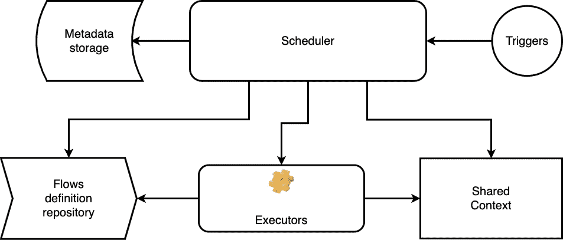

# 工作流引擎的概念

> 原文：<https://itnext.io/the-concept-of-workflow-engines-c14e8088283?source=collection_archive---------2----------------------->

# 介绍

从构建流程和 CI/CD 的自动化到在线/离线商店中的订单管理系统和预订出租车，工作流在许多情况下都会用到。你可能会发现很多从小型 github 项目到企业系统的解决方案。有各种各样的实现:可以集成到您的系统中的框架，一些单独的解决方案，在大型复杂系统中作为功能的一部分可用的工作流引擎等等。以下是工作流引擎的一个小列表:Jenkins、GitLab Pipelines、Cadence、Airflow、Conductor 等。

在这篇文章中，我想展示所有工作流引擎的基本概念。

# 什么是工作流、状态机和工作流引擎？

在研究这个概念之前，让我们先理解这些术语:工作流、状态机和工作流引擎。

维基百科告诉我们的工作流术语。

> 工作流由协调的可重复的活动模式组成，通过将资源系统地组织成转换材料、提供服务或处理信息的过程来实现。

我认为维基百科对工作流程的描述很清楚。我只想提一下，它描述了一般的工作流，没有提到任何技术或开发模式或数学模型。工作流的数学模型是一个状态机。我们来看看维基百科关于它的内容。

> *状态机是计算的数学模型。这是一个抽象的概念，机器可以有不同的状态，但在给定的时间内只满足其中一个状态。*

所以一旦有了工作流和它的数学模型，就需要实现数学模型的东西。工作流引擎是数学模型(状态机)的实现。再读一遍维基百科=)。

> *工作流引擎管理和监控工作流中活动的状态，如贷款申请单的处理和批准，并根据定义的流程(工作流)确定要转移到哪个新活动。*

基本上，任何应用程序都是一些工作流的实现，正如我之前所说，有很多地方使用工作流引擎的各种部分。让我们来看看工作流引擎的概念。

# 概念

工作流引擎由 6 个逻辑组件组成。

工作流引擎的组件图

## 调度程序

这是工作流引擎的主要部分，所有的奇迹都发生在这里。它调度运行，了解流定义，监控任务执行的结果。它可以由一些事件触发，如定时器、API 或手动触发。

## 元数据存储

它只是一个需要调度器来协调运行的数据存储。取决于实现，它可能在内存结构或数据库中。我将在下一篇关于数据概念的文章中更详细地描述它。

## 扳机

触发工作流的方式。在框架的情况下，它通常是一些函数的调用。如果是某种解决方案，那么可能是某种 API、时间表。基本上，工作流可能有不同的触发器实现。

## 实施者

负责运行原子任务并提供运行结果的组件。它可以是应用程序、容器或事件虚拟机中的单独线程。

## 流动储存库

存储定义的位置取决于实现，它可以是不同的位置，并提供额外的功能，而不仅仅是存储定义。流程是工作流的一种描述。我将在下一篇关于数据概念的文章中更详细地描述它。

## 共享上下文

一旦你的工作流变得有点复杂，你就需要立即将一些上下文从一个任务传递到另一个任务。这个组件对此负责。

# 结论:什么时候需要使用工作流引擎？

为了回答这个主题问题，我们来看两个例子。

第一个:“向客户端提供用户列表的 UI”，在这种情况下，API 需要向客户端提供结果，在客户端决定下一步做什么之后，可能只是分析结果或采取一些行动。因此，这一过程并不是完全自动化的，而是有一个让客户做出决定的空间。

另一个例子:“获得用户列表，找到今天过生日的人，并向他们发送消息‘生日快乐’”。在这种情况下，客户端只关心让我们称之为“要做的工作”，客户端不需要基于用户列表进行分析并做出决定，因为行为模式之前已经发现，现在客户端只需要执行它。

简单地说，当您需要实施一些全自动流程时，选择一个工作流引擎(例如:构建流程、CI/CD 流程、虚拟机供应、订单管理流程等)，当您想要为您的客户提供一些采取行动的能力时(例如:向我显示实体列表并提供一组对它们的操作，向我显示我在社交网络中的朋友列表，让我找到一些视频，然后播放它或对它进行评论等)，请尝试考虑另一种方法，因为工作流引擎作为任何统一的解决方案都不是零成本的。