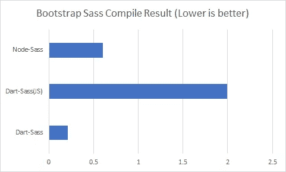

# Node-Sass 还是 Dart-Sass:CSS 预处理器的困境

> 原文：<https://itnext.io/the-css-preprocessor-dilemma-node-sass-or-dart-sass-32a0a096572?source=collection_archive---------0----------------------->

一年多前，我在 *StackOverflow* 上回答了一个关于[为 Vue CLI](https://stackoverflow.com/questions/56150402/vue-cli-css-pre-processor-option-dart-sass-vs-node-sass/56422541#56422541) 选择 Node 还是 Dart-Sass 的问题。它获得了很多支持票，我想也许值得更深入地探讨这个话题。

## 介绍

本文主要是关于 Sass 及其预处理器实现:Dart-sass 和 Node-Sass。

那么，什么是 CSS 预处理器呢？

> CSS 预处理器是一个程序，让你从预处理器的独特语法生成 CSS。有很多 CSS 预处理程序可供选择；但是，大多数 CSS 预处理程序都会添加一些纯 CSS 中没有的特性，比如 mixin、嵌套选择器、继承选择器等等。这些特性使得 CSS 结构可读性更强，更易于维护。
> 
> [MDN 网络文档](https://developer.mozilla.org/en-US/docs/Glossary/CSS_preprocessor)

S ass 是样式表语言；只是语法和定义的问题。 ***Dart-Sass*** 和***Node-Sass*【1】**是实现。根据 Sass 语言网站 Dart Sass 是 Sass 的主要实现。

> Dart Sass 是 Sass 的主要实现，这意味着它在任何其他实现之前获得新功能。它速度快，易于安装，并且可以编译成纯 JavaScript，这使得它很容易集成到现代 web 开发工作流中。

如果您阅读了上面的段落，您可能会决定使用 Dart-Sass 而不是 Node-Sass，这很容易，因为它看起来合法。现在考虑一些要点:

1.  主要实施✔
2.  ✔最新功能
3.  编译成纯 JavaScript？
4.  易于集成，因为被编译为 JS ✔

除了第三部分，一切看起来都很好。Dart-Sass 速度最快，但是它的 [NPM](https://www.npmjs.com/package/dart-sass) 包是 JS 编译版本，没有 dart-one 快。

Node-Sass 呢？Node-Sass 只是一个封装器，覆盖了**LibSass**(Sass 的 C 实现版本)。

让我们回顾一下我们现在所拥有的(至少在理论上):

*   Node-Sass:因为 LibSass 而变得更快
*   Dart-Sass (JS 编译版):没有 Node-Sass 快
*   Dart-Sass (Dart 版本在 Dart VM 中运行):最快

我们谈论的一切都是理论，让我们做一些基准测试。我使用 **Bootstrap 4** Sass 源代码作为我们的测试主题:

## 1-使用 DartSass 进行测试(在 DartVM 上)

用 brew 在 Ubuntu 上安装:`brew install sass/sass/sass`

```
time sass bs4/bootstrap.scss dist/bs4.css
```

耗时:0.21 秒

## 2-使用 Dart Sass 进行测试(纯 JS 版本)

安装 dart-sass 软件包:`npm install --save-dev sass`

```
.\node_modules\.bin\sass .\bs4\bootstrap.scss dist/bs4-js.css
```

耗时:1.992 秒

## 3-使用节点 Sass 进行测试

安装 node-sass 包:`nppm install --save-dev node-sass`

```
.\node_modules\.bin\node-sass .\bs4\bootstrap.scss dist/bs4-ns.css
```

耗时:0.605 秒

## 概述

在我们的测试场景中，Dart-Sass(在 DartVM 上)是最快的，node-sass 也没那么差，Dart-Sass(纯 JS)在性能方面很糟糕。



Bootstrap Sass 编译不同 Sass 实现的结果

*   在这种特殊情况下，两秒钟没什么大不了的；但是考虑一下 Dart-Sass(JS)比 Dart-Sass(Dart VM)慢九倍，比 node-sass 慢三倍。
*   我有一个项目有+20 个主题，用 node-sass 用了 30 秒，但是我试着用 Dart-Sass(JS)，用了一个世纪！
*   虽然 Dart-Sass(Dart VM)是最快的，但安装或集成它有点棘手。

## 最后的想法？

最终，什么样的实现最适合您的项目始终是您的决定，但是要考虑:

1.  对于较小或典型的 Sass 项目，Dart-Sass(JS)是完美的，它很容易安装，不需要任何外部绑定依赖，如 node-sass。
2.  如果您的 sass 文件需要时间来编译，并且如果 Node-Sass 支持您使用的所有特性，那么就使用 Node-Sass 吧！
3.  如果在您的机器上安装 Dart-Sass(Dart VM)不成问题，Dart-Sass 是最佳选择。
4.  还要考虑 Node-Sass 是[弃用的](https://sass-lang.com/blog/libsass-is-deprecated)，它们不会添加新特性。

## 注意事项:

[1]: Node-sass 是一个库，提供 Node.js 到 **Libsass** 的绑定，后者是流行的样式表预处理程序 Sass 的 C 版本。