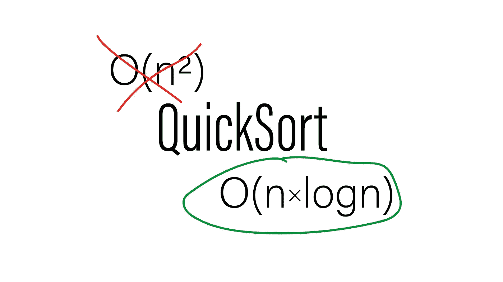

# 总是 O(n*logn)快速排序的奇怪例子

> 原文：<https://itnext.io/the-curious-case-of-the-always-o-n-logn-quicksort-603b56230e6?source=collection_archive---------2----------------------->

如果我告诉你 QuickSort 是 O(n*logn ),你可能会抗议并反驳你的观点。如果是这样的话，你可能会发现这篇文章令人大开眼界。



事实上，我曾无数次地讨论过以下问题:

> **人甲:**快速排序是个糟糕的算法。
> **我:**为什么？
> **人甲:**嗯拿一个来说，这是 O(n*n)最坏的情况。我:只有当我们随机选择支点时才成立。
> **人甲:**你在说什么？无论你如何选择支点，它总是 O(n*n)最坏的情况。

所以，是的，如果我们随机/任意地选择支点，QuickSort 可以转化为 SelectSort，使它为 O(n*n)。然而，我们可以选择我们的枢纽来消除这种最坏的情况，使快速排序在最坏的 O(n*logn)下进行。

本文将首先介绍经典的 QuickSort，它选择中间的元素作为支点，并演示一个 C++实现。然后，我们将讨论 always O(n*logn)快速排序。

# O(n*n)快速排序

快速排序是一种递归分区算法。分区算法将移动序列中的元素，从满足谓词的元素开始，然后是不满足谓词的元素。

```
# Before partition
1 2 3 4 5 6 7 8 9
# After partition with is_even
2 4 6 8 1 3 5 7 9
```

对于快速排序，我们需要一个三向划分，它将序列划分为小于所选枢轴、等于枢轴、最后大于所选枢轴的元素。

```
# Before partition with pivot 5
9 9 5 5 5 3 2 1
# After partition with pivot 5
3 2 1 5 5 5 9 9
```

在 C++中，我们有一个标准的双向分区:`std::partition`算法。但是让我们快速看一下如何自己实现它:

这是分区算法的一般版本。我们先来看一下实现。该算法采用两个迭代器(C++语义是`[first,last)`)。我们首先找到不满足谓词的最左边的元素(第 6 行)，如果没有，我们就已经完成了(第 7 行)。

然后我们检查剩余的每个元素(第 9–10 行)，如果元素满足谓词，我们必须将它移到所有不满足谓词的元素之前(第 12–13 行)。`std::iter_swap`将交换迭代器后面的元素。

看看这个实现，我们现在可以用公式表达这个算法需要的 C++20 概念。传入的迭代器必须满足`std::forward_iterator`(对于`++`和`!=`)和`std::indirectly_swapable`(对于`std::iter_swap`)。条件必须满足`std::predicate`概念(可调用，返回一个布尔值)。如果你想了解更多，我有一篇关于 C++20 概念的文章。

## 快速排序

构建基本的快速排序相对简单。然而，我们需要小心我们的支点:

这两个分区调用一起表示一个 3 路分区(第 10 行和第 11 行)。我们将 pivot 隐藏到子序列的末尾，然后将它移回到分区点`pp2`所指向的位置，该分区点指向比 pivot 大的第一个元素(第 7–8 行和第 13–14 行)。在划分并固定了轴心之后，我们递归(第 16–17 行)并检测一个空范围的终止条件(第 4–5 行)。

除了移动轴心，我们还可以复制一个值。这个版本更适合那些交换成本低但复制成本高的元素。

这个简单版本的 QuickSort 工作得很好，但是因为我们选择中枢作为中间元素`first + std::distance(first, last)/2`，如果我们总是命中最小或最大元素，它可能会退化为 O(n*n)。那么，让我们来谈谈我们需要做些什么来实现一个 always O(n*logn)快速排序。

# O(n*logn)快速排序

只要我们任意选择支点，在最坏的情况下，我们总是会以快速排序降级为选择排序而告终。我们需要一种选择在 O(n)中运行的主元的方法，并且总是设法选择一个好的主元。

所以让我们讨论一种方法，在最坏的情况下，它会给我们一个以 3:7 的比例分割序列的支点。

# 中位数

该算法遵循其名称。首先，我们将序列分成五个元素块，计算每个块的中位数，然后从这些中位数中选择中位数作为我们的中枢。

虽然这听起来很简单，但实现涉及到快速选择和相互递归，并且可能相当棘手，所以我们将一步一步来。

## 3:7 的比例

当我们选择中位数时，我们知道一半的五行组块的中位数低于我们的中位数，一半的五行组块的中位数高于我们的中位数。

对于具有较低中位数的组块，我们知道有两个元素比中位数本身低，所以我们知道这些组块中的每一个都至少有三个比中位数低的元素(组块的中位数和另外两个元素)。

如果我们计算一下，它是(一半的块)* 3 个元素= (1/2)*(n/5)*3 = n*(3/10)。因此，至少 30%的元素将低于中位数(类似的逻辑适用于更高的元素)。

## 实施

首先，我们需要一种方法来从一个五元素块中选择一个中值。

请注意，这里的复杂性无关紧要，因为我们总是从最多五个元素中选择。

接下来，我们的中位数实施:

我们首先需要迭代五个元素的块(第 11-13 行)，将相应的中间值移动到序列的开头(第 15-17 行)，然后调用`quick_select`从这些中间值中选取合适的中间值(第 21 行)。

QuickSelect 实现应该看起来很熟悉。事实上，这是一种非常片面的快速排序。分区之后，我们知道目标元素在哪里，所以我们只搜索那个分区。

注意，我们实际上调用了 QuickSelect 中的中位数(第 8 行)，然后调用 QuickSelect 返回实际的中位数。

所有这些加在一起，为快速选择提供了最坏情况下的 O(n)复杂度，为快速排序提供了最坏情况下的 O(n*logn)复杂度。

# 实际问题

所以，现在你可能想知道为什么我们不在所有地方都使用这种方法。嗯，中位数是一个很好的例子，说明了为什么大 O 符号不能讲述整个故事。

是的，这种方法消除了最坏情况下的复杂性。然而，在实践中，实现该算法所需的额外比较和移动的开销使其不切实际。因此，您将在您的库实现中找到 IntroSort (QuickSort + HeapSort)或其他混合方法。

与此同时，排序算法是一个活跃的研究领域，一些论文指出，带有智能枢纽选择的快速排序的变体可能是实用的。

# 链接和技术说明

包含所有代码的资源库位于:[https://github.com/HappyCerberus/article-quicksort](https://github.com/HappyCerberus/article-quicksort)。

关于中位数的更多信息，包括复杂性的证明，请查看维基百科文章。

# 感谢您的阅读

感谢您阅读这篇文章。你喜欢吗？

我也在 YouTube 上发布视频。你有问题吗？在推特[或 LinkedIn](https://twitter.com/SimonToth83) 上联系我。