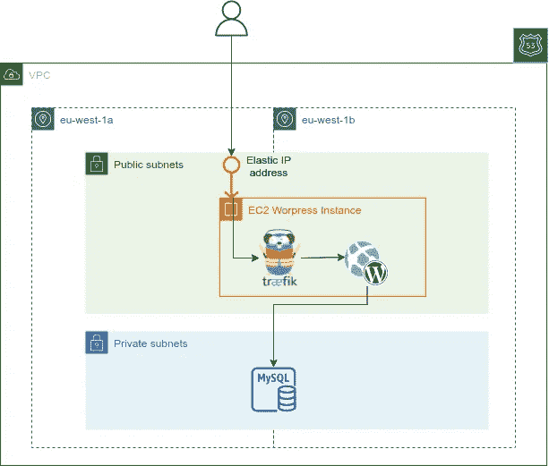

# 在亚马逊云上以每月 0.5 美元托管你的 Wordpress 网页的权威指南

> 原文：<https://itnext.io/the-definitive-guide-for-hosting-your-wordpress-webpage-for-0-5-month-on-the-amazon-cloud-54bafd628539?source=collection_archive---------1----------------------->

## 完整的 Terraform 模板，使用 AWS 免费层提供托管 Wordpress 网页的基础设施。

由 [Women Decode](https://medium.com/u/3a885b23263a?source=post_page-----54bafd628539--------------------------------) 撰写的文章[“在 AWS Free Tier 上创建 Wordpress 站点的 5 个步骤”](https://medium.com/@womendecode/5-steps-to-create-a-wordpress-site-on-aws-free-tier-5f825195b4a6)解释了如何使用 AWS Free Tier 手动设置 Wordpress 站点，受此启发，我很高兴与您分享我的完整 Terraform 模板。

在这篇文章中，你不仅会得到一个完全可重用的 Terraform 配置，还会学到一些关于 AWS 主题的有趣东西，比如弹性 IP 地址或 RDS 数据库的动态存储自动缩放，以及如何使用 docker-compose 在容器中运行 Wordpress。

就像我以前关于 [Terraform EKS 模板](/the-definitive-guide-for-setting-up-a-clean-and-working-aws-eks-kubernetes-infrastructure-for-2d4153d47e20)的文章一样，我将首先解释目标基础设施和存储库内容，然后是关于配置和使用的 AWS 服务的一些细节。为了让您尽快入门，本文最后给出了使用该模板的说明。

# 让我们开始吧。



运行 Wordpress 的 AWS 基础设施

[AWS 免费层](https://aws.amazon.com/free/?nc1=h_ls&all-free-tier.sort-by=item.additionalFields.SortRank&all-free-tier.sort-order=asc&awsf.Free%20Tier%20Types=*all&awsf.Free%20Tier%20Categories=*all)允许您在注册您的 AWS 帐户后 12 个月内免费使用特定的**云资源。要部署 Wordpress，我们需要一个虚拟机和一个数据库。幸运的是，使用一个`t2.micro`或`t3.micro` EC2 实例第一年是完全免费的，还有一个`db.t2.micro` MySQL RDS 实例，有高达 20GB 的 SSD 存储。托管 Wordpress 页面的 EC2 实例应该是公开可用的。我们有多种选择来实现这一点——首选且更安全的方法是在公共子网中部署应用负载平衡器(ALB ),并将流量代理给位于私有子网中的 EC2 实例。然而，在这种情况下，**我们不希望在我们的账单上看到相当高的负载平衡器**的成本。因此，我们将带有 Wordpress 的 EC2 实例放在公共子网中，并将一个静态公共 IP 地址(“EIP —弹性 IP 地址”)附加到该实例上，只要它附加到一个实例上，这是免费的→不会引入额外的成本。为了**终止 TLS 连接**，我们部署了一个 [Traefik](https://traefik.io/) 反向代理，为 WordPress 实例提供流量。**

> 那么 50 美分/月从何而来？

我假设托管域，在这种情况下，网页应该可以通过 AWS Route53 服务的公共托管区域访问。DNS 解析必须通过您的域注册管理控制台中的 NS 记录委派给公共托管区域的 AWS DNS 服务器。然而，也可以只创建一个 DNS A 记录来解析 EC2 实例的公共静态 IP 地址，这甚至可以节省 50 美分——我只是更喜欢这样做，它使模板更好地可用和自动化。好吧，让我们来看看存储库。

通过调用所有子模块来声明整个基础设施的主配置文件是`main.tf`，它大量使用由 [Anton Babenko](https://medium.com/u/5312b1f1bba0?source=post_page-----54bafd628539--------------------------------) 管理的 AWS 社区模块:

## 建立工作关系网

这里没什么特别的。值得一提的是禁用 NAT 网关(`enable_nat_gateway = false`)，因为我们的私有子网中没有需要访问互联网的工作负载。此外，部署 NAT 网关会带来高成本。

## 域名服务器(Domain Name Server)

模块调用`modules/dns-a-record`在公共托管区域(`var.dns_zone`)中创建一个 A 记录，它解析为 Wordpress EC2 实例的弹性 IP 地址。

## Wordpress 数据库

创建一个 RDS MySQL 数据库是由`wp-db`模块完成的，它还保护创建的 RDS 实例(只有端口 3306 是开放的)。通过定义最大分配存储(`var.rds_max_allocated_storage`)，RDS 的动态存储自动缩放功能被激活。通过将此变量设置为值`20`和初始分配存储(`var.rds_allocated_storage`)到`5`，RDS 会自动将存储容量扩展到 20GB(这是空闲层存储容量的限制)，以防磁盘变满。

在上面的参数列表中，可以注意到缺少数据库密码的定义。这是因为我们不想将 DB-password 作为源代码保存在存储库中的某个文件中。而是通过 Terraform 数据源从文件`modules/wp-db/data.tf`中的 AWS 系统管理器参数存储中读取:

```
data "aws_ssm_parameter" "rds_password" {
  name = "/${var.environment}/database/password"
}
```

**确保在计划或应用地形配置之前创建参数。**

## Wordpress 主机

最后，模块`wp-host`提供 EC2 实例和弹性 IP 地址。值得注意的是 TLS-certificate ( `tls_server_crt`，`tls_server_key`)被传递给模块。这些参数是从`certs`目录下的文件中读取的。请确保将您的 TLS 服务器证书和相应的密钥复制到此目录。

剩下的最后一个问题是:Wordpress 现在是如何在 EC2 实例上运行的？这是通过“用户数据”脚本→ `modules/wp-host/userdata/userdata.wp.sh`完成的。

在这个`userdata`-脚本中，安装了运行带有 [docker-compose](https://docs.docker.com/compose/) 的容器化 Wordpress 所需的工具，并且完成了 Traefik 反向代理和 Wordpress 容器的所有配置。如果你有兴趣的话，可以更深入地了解它，或者随时联系我。

# 结论和开始

为了快速开始使用模板，需要完成以下步骤:

*   将 TLS 证书和密钥复制到`certs`目录中，并命名为`server.crt`和`server.key`
*   在 Route53 中创建一个公共托管区域，并相应地设置变量`dns_zone`
*   在 AWS 系统管理器参数存储中的路径`/${var.environment}/database/password`处创建数据库密码，因为它是通过 Terraform 数据源读取的，以设置 RDS 数据库密码
*   修改`envs/example.tfvars`中的变量:`aws_accountnumber`、`dns_zone`

使用`terraform apply -var-file envs/example.tfvars`应用 Terraform 配置后，Wordpress 界面在`https://${var.dns_zone}`和`https://${var.subdomain}.${var.dns_zone}`都可用。

请随意克隆、贡献或试用它。该存储库可从 [GitHub](https://github.com/yandok/terraform-aws-wordpress-template) 获得:

[](https://github.com/yandok/terraform-aws-wordpress-template) [## GitHub-yandok/terraform-AWS-Wordpress-template:Wordpress 的完整 terra form 模板…

### Wordpress 部署的完整 Terraform 模板-GitHub-yandok/terra form-AWS-Wordpress-template:complete…

github.com](https://github.com/yandok/terraform-aws-wordpress-template)