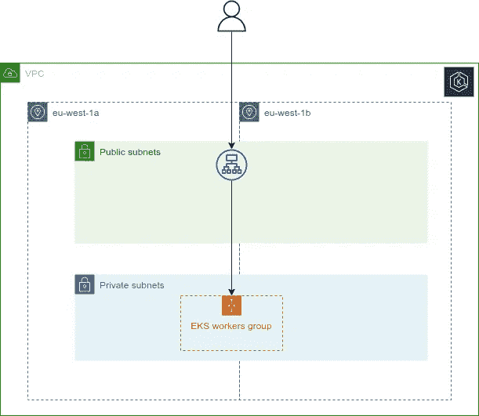

# 建立一个干净和工作的 AWS EKS Kubernetes 基础设施的权威指南

> 原文：<https://itnext.io/the-definitive-guide-for-setting-up-a-clean-and-working-aws-eks-kubernetes-infrastructure-for-2d4153d47e20?source=collection_archive---------2----------------------->

## 完整的模块化 Terraform 模板，带有深入的解释

当外面天气变冷时，花时间构建一个干净的端到端 Terraform 模板来构建 AWS 云基础设施是多么好的时机啊，该模板带有一个公开可用的演示应用程序，运行在 AWS EKS 提供的 Kubernetes 集群上。

# 首先，我们想要建造什么？

目标基础设施

我们希望建立一个完整的基础设施，其中一个演示应用程序(在本例中为 [Kubernetes dashboard](https://github.com/kubernetes/dashboard#kubernetes-dashboard) )正在 EKS 集群上运行，并且是公开可用的。

为此，我们需要:

*   **VPC**跨越两个可用性区域，每个区域都有可用的公共和私有子网。
*   一个**公共负载均衡器**，它被提供来自用户的流量，并将该流量转发给 EKS 工作节点。
*   一个 **DNS 记录**，它将一个子域解析为公共负载平衡器的 DNS 名称。
*   一个由 EKS 提供的 **Kubernetes 集群，一个处理集群入口流量的**入口控制器**，以及一个安装 Kubernetes 仪表板工作负载的**初始化****

让我们看看我们的存储库结构:

模板存储库结构

模板存储库结构描述

只有一个`tf` —通过调用设置 VPC、DNS、负载平衡和 EKS 所需的所有子模块，包含整个基础设施的配置的文件。那就是`main.tf`。

# **网络——VPC**

为了设置 VPC，该模板基于公共 Terraform 注册中心的[社区模块](https://registry.terraform.io/modules/terraform-aws-modules/vpc/aws/latest)。我们正在使用`main.tf`中的模块，比如:

我们希望驻留在私有子网中的 Kubernetes 工作负载能够与互联网进行通信(`enable_nat_gateway=true`)，但我们不需要为每个可用性区域提供 NAT 网关(`single_nat_gateway=true`)。此外，我们希望在我们的 VPC 内启用 DNS 主机名(`enable_dns_hostnames=true`、`enable_dns_support=true`)。

# 域名服务器(Domain Name Server)

为了达到在 EKS 工作节点上运行的工作负载，我们必须提供一个 DNS 记录，将公共托管区域的子域解析为公共负载平衡器的 DNS 名称。为了实现这一点，我们可以简单地调用`modules/terraform-aws-dns-aliasrecord`下的 Terraform 模块，它将为我们创建一个 DNS 别名记录:

值得一提的是，在所使用的 AWS 帐户中必须已经有一个公共托管区域，它是在`dns_zone`变量中设置的。模块`dns_record`的输入变量是`list(object)`类型的，包含应该为哪个子域创建 DNS 记录(`subdomain`)以及 DNS 记录应该解析到哪里的信息，在我们的例子中是公共负载平衡器(`dns_name`，`zone_id`)。

# 负载平衡

负载平衡器的模块包含设置公共应用程序负载平衡器(ALB)和两个侦听器的所有资源，一个用于 HTTP，一个用于 HTTPS 流量。HTTP 侦听器将流量重定向到 HTTPS 侦听器，该侦听器终止 SSL，并使用在子域(`certificate_arn`)的 DNS 模块中由 AWS ACM 生成的 TLS 证书。此外，我们声明负载均衡器应该连接到哪个 VPC(`vpc_id`)，应该在哪个公共子网中可用(`public_subnets`)以及属于哪个项目(`project`)。

# Kubernetes 集群设置和初始化

Kubernetes 集群的供应被抽象为驻留在`modules/terraform-aws-eks`中的模块，该模块本身利用了 [EKS 社区模块](https://registry.terraform.io/modules/terraform-aws-modules/eks/aws/latest)。**指定 Kubernetes 版本**由输入变量`eks_version`完成，输入变量定义了 EKS 为您提供的控制平面版本，变量`ami_id`必须与 Kubernetes 版本匹配。您可以在 amazon 管理控制台的 EC2/Compute 下搜索带有匹配的预装 Kubernetes 版本的 Amazon 机器映像。AMI 是特定于地区的，所以请确保选择适合您所在地区的 AMI(模板使用`eu-west-1`)。

为了**允许从公共 ALB** 进入工作节点的流量，我们在输入变量`ingress_from_security_group_id`中传递 LB 模块的`security_group_id`。我们还必须**向 LB 模块中创建的 ALB** 的 HTTPS 监听器注册一个 LB 监听器规则。在这个模板中，这是 EKS 模块的责任，它需要`https_listener_arn`、`lb_listener_host_rule`来定义流量应该被转发的主机报头和规则优先级(`lb_listener_rule_priority`)。规则按优先级顺序进行评估，从最低值到最高值。

该模块为工作节点创建一个**自动缩放组，该组使用一个[启动模板](https://github.com/terraform-aws-modules/terraform-aws-eks/blob/master/docs/spot-instances.md#using-launch-templates-with-both-spot-and-on-demand)，该模板同时具有按需实例和现场实例。自动缩放组的配置由输入变量完成:**

*   `eks_general_workers_override_instance_types`:混合实例策略的覆盖实例类型列表
*   `eks_general_workers_asg_min_size`:自动缩放组中的最小工人能力
*   `eks_general_workers_asg_desired_capacity`:自动缩放组中期望的工人能力
*   `eks_general_workers_on_demand_base_capacity`:按需实例必须满足的所需能力的绝对最小量
*   `eks_general_workers_on_demand_percentage_above_base_capacity`:按需实例和 Spot 实例之间超出基本按需容量的百分比分割(当 ASG 向外扩展时)
*   `eks_general_workers_asg_max_size`:自动缩放组中的最大工作人员容量。
*   `eks_general_workers_spot_instance_pools`:每个可用性区域分配容量的点池数量。

通过使用混合实例启动模板，很容易为`dev`或`test`环境建立仅由现场实例组成的**工作节点。在内部，该模块使用`lowest-price`作为 spot 分配策略，因此当请求 spot 实例时，将提供`eks_general_workers_override_instance_types`中定义的 spot 池中最便宜的可用实例。**

最后，变量`install_nginx_ingress`和`install_kubernetes-dashboard`指示模块在 EKS 控制平面被提供并且工作节点已经加入集群并且启动和运行之后安装 nginx-ingress 控制器和 kubernetes 仪表板。

# 使用模板

最后，我想指出完整的模板可以在 [Github](https://github.com/yandok/terraform-aws-eks-template) 上获得。请随意为自己克隆它，并尝试它。

使用 [Terraform Docs](https://github.com/terraform-docs/terraform-docs) 生成 Terraform 模块的文档——各个模块目录中的`README.md`文件显示有关所用提供者、模块的信息以及所有输入变量和输出的描述。

要开始使用你的 AWS 帐户，你只需要在 Route53 服务中手动创建一个公共托管区域，并在`envs/dev.tfvars`中设置`dns_zone`-变量。其次，当然还要设置`aws_accountnumber` —变量。最后创建一个 S3 桶来存储地形状态，并在文件`backend.tf`中设置桶名。仅此而已。应用 Terraform 配置后，这可能需要 20-25 分钟(EKS 创建非常慢)，您应该能够在`https://<subdomain>.<dns_zone>`到达 Kubernetes 仪表板

玩得开心——回头见。

 [## GitHub-yandok/terraform-AWS-eks-模板

### 这是一个演示库，用于引导一个简单的云基础设施，并提供一个公共的演示应用程序…

github.com](https://github.com/yandok/terraform-aws-eks-template)