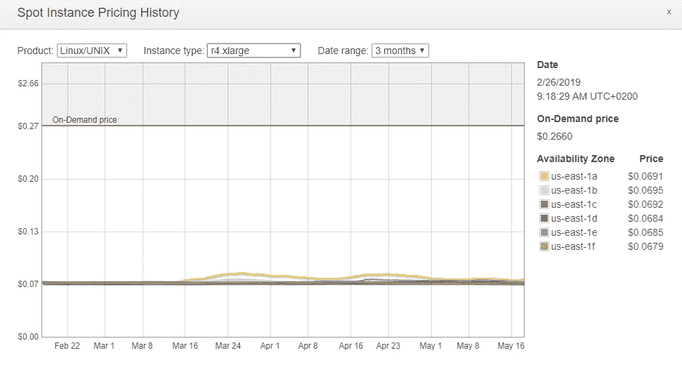
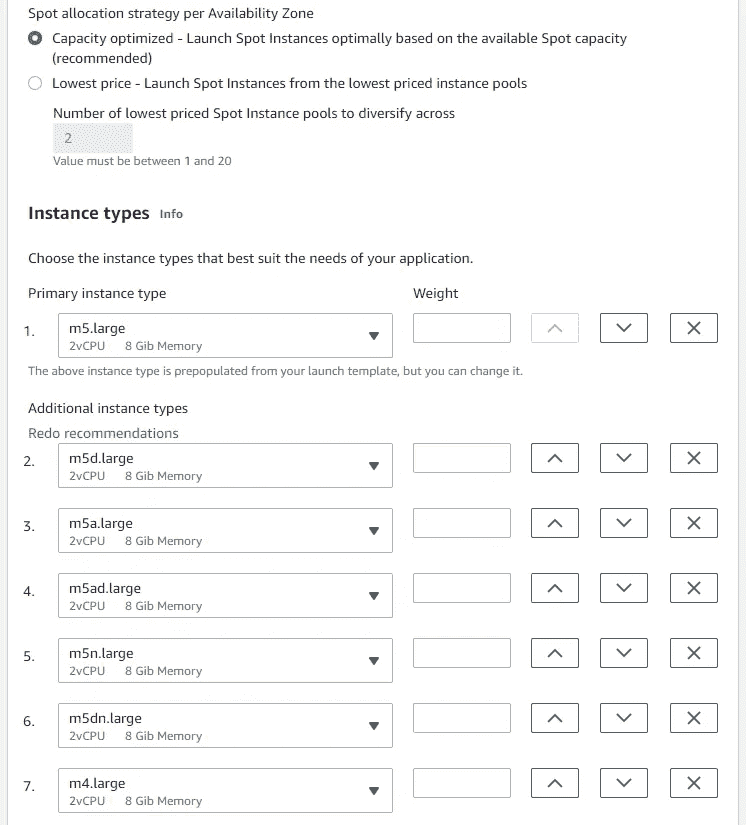
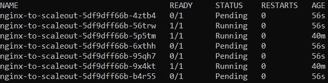
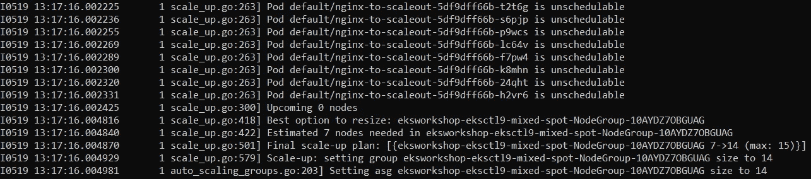
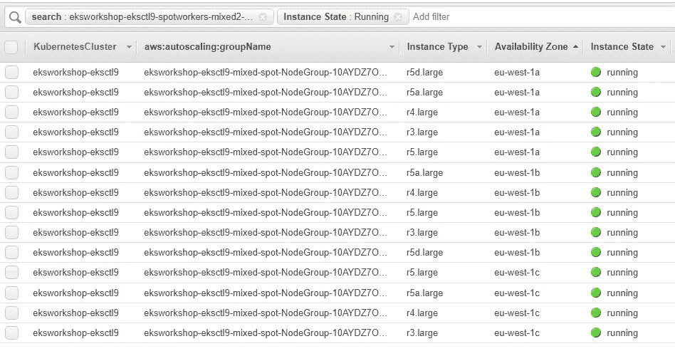
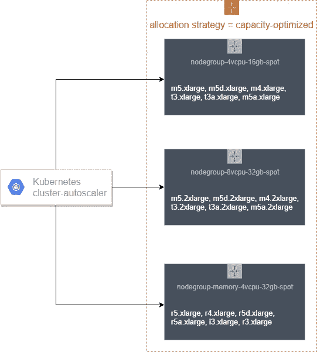

# 作为 Kubernetes 工作节点运行 EC2 Spot 实例的权威指南

> 原文：<https://itnext.io/the-definitive-guide-to-running-ec2-spot-instances-as-kubernetes-worker-nodes-68ef2095e767?source=collection_archive---------0----------------------->

[Edit 2020 December 2020]虽然这篇博客文章仍然值得一读，其中有关于 Kubernetes、自动伸缩和 Spot 实例的有趣背景和历史，但我强烈建议您研究一下在 EKS 管理的节点组中运行 Spot 实例——这是在 re:Invent 2020 期间推出的一项功能。你可以在 AWS 容器博客上阅读我的发布博文:

 [## Amazon EKS 现在支持在托管节点组中提供和管理 EC2 Spot 实例

### 本文由首席解决方案架构师 Ran Sheinberg 和高级产品经理 Deepthi Chelupati 撰写…

aws.amazon.com](https://aws.amazon.com/blogs/containers/amazon-eks-now-supports-provisioning-and-managing-ec2-spot-instances-in-managed-node-groups/) 

在这篇文章中，我将向您展示如何在 EC2 Spot 实例上运行 Kubernetes (EKS 或其他)worker 节点，并节省高达 90%的 EC2 随需应变价格，而不会影响应用程序的性能或可用性。要在 Spot 实例上运行健壮且有弹性的集群，您需要采取一些步骤，这篇文章是指导您完成这些步骤的权威(并且不断发展——就像 Kubernetes 一样)指南。我将描述您需要在集群中实现的不同最佳实践，以及实现这些最佳实践的工具和配置。读完这篇文章后，您将拥有开始使用 Spot 实例作为 Kubernetes 工作节点所需的所有信息。在我们开始之前，我叫 Ran Sheinberg，是 AWS 的一名解决方案架构师。我专门研究 Spot 实例，并与数百名 AWS 客户讨论过如何在他们的特定工作负载中实施 Spot 实例，与他们一起规划 POC，并帮助他们排查和解决生产工作负载中的问题。许多对话都围绕着基于 Kubernetes 的工作负载以及如何在现场运行它们。我在 GitHub/Slack 上就 Kubernetes 和 Spot 的主题与之交流的每个客户、AWS 同事或人员都在不知不觉中对本指南做出了或大或小的贡献。

# 现场实例——在几个段落中从零到英雄

如果你是现货实例的新手，或者如果你没有赶上 2017 年 11 月推出的定价模式([无投标，无价格飙升](https://aws.amazon.com/blogs/compute/new-amazon-ec2-spot-pricing/))的重大变化，你一定要阅读这一部分。如果你不熟悉 EC2 自动缩放组如何允许[从 2018 年 11 月开始混合购买选项和实例类型](https://aws.amazon.com/blogs/aws/new-ec2-auto-scaling-groups-with-multiple-instance-types-purchase-options/)，也是如此。

Spot 实例是备用的 EC2 计算能力，与按需价格相比，您可以使用高达 90%的折扣。与具有静态价格(除非 AWS 降低其价格)的按需和保留实例购买选项相反，Spot 实例的价格可能会根据每个容量池(可用性区域中实例类型的组合)中的长期供应和需求，在非常小的间隔内一天只波动几次。

过去 3 个月的现货价格历史显示，美国东部(N. Virginia)的 r4.xlarge 在各供货区之间的价格差异非常小(小于约 0.002 美元)，并且现货价格实际上仅在过去 3 个月的某些供货区发生了变化

你应该从这部分学到的一个绝对重要的最佳实践是灵活性和多样化。如果您正在运行无状态、容错、分布式工作负载(例如:ELB 背后的 web/应用服务器集群、消耗队列中的作业的批处理，或者容器实例/工作节点),并在特定的实例类型上按需使用(使用 RI、节约计划，或者不使用任何一种),因为您已经验证了该实例或者刚刚开始成功地使用它，当您开始在应用程序中采用 Spot 时，您需要将使用分散到尽可能多的容量池(AZs 中的实例类型)。原因很简单:通过使用多个容量池，您可以:(a)增加获得现货容量的机会，而不是试图从特定 AZ 中的单个实例类型获得现货容量，如果容量池中没有备用容量，就会失败。(b)如果 EC2 需要恢复容量以供按需使用，通常不会同时中断所有容量池，因此只有一小部分工作负载会被中断，仅由自动扩展组(或 Spot Fleet，我们稍后会谈到)补充，从而避免对您的可用性造成任何影响，或者需要按需运行并支付更多费用。

例如:如果我今天在 c5.large 上运行我的应用程序，我可能也可以在 m5.large 上运行它——在大多数情况下，如果操作系统只是看到更多的内存和稍慢的 CPU 时钟速度，应用程序就可以正常工作(除非我们谈论的是 CPU 敏感的工作负载或使用特定指令集的工作负载，如 AVX-512)。类似地，您可以使用具有更多内存的 r5.large，回到上一代，也可以使用 c4.large / m4.large / r4.large。这个概念在 Kubernetes 调度程序中工作得很好，但在开始讨论 Kuberentes 中的自动缩放时需要一些调整——这个主题我们将在本文的后面深入探讨。

还要看一下 EC2 自动扩展组支持的分配策略。为了遵循多样化最佳实践并将您的节点/单元分布在尽可能多的容量池中，客户通常使用的是最低价格分配策略，其数量等于或等于您选择的实例类型的 n-1 个数量。然而，**建议采用 2019 年 8 月推出的容量优化分配策略**。这种分配策略将选择最不可能被中断的点实例，因为它以最深的容量池为目标。点击此处，了解有关容量优化分配策略[发布的更多信息。](https://aws.amazon.com/blogs/compute/introducing-the-capacity-optimized-allocation-strategy-for-amazon-ec2-spot-instances/)

那么 AWS 如何使遵循这些实例类型灵活性最佳实践变得容易呢？输入 EC2 自动缩放组。

# EC2 自动缩放组

如果您对您的 Kubernetes 集群的 ASGs vs Spot Fleet 或 EC2 Fleet 感到困惑，不要这样。这些工具或 API 有相似的特征，但是我会让它变得非常简单。如今，机群更适合有始有终的大规模作业，例如，我需要 3000 个 vCPUs 来处理我在 S3 上的视频或图像，或者运行夜间 Hadoop/Spark 作业，或者任何其他类型的批处理计算作业。虽然 Spot Fleet 确实具有与 ASG 非常相似的自动扩展能力，但 ASG 更适合于作为服务的一部分连续运行且不需要到达终点的工作负载。对于这些类型的工作负载，ASG 的一些好处包括:生命周期挂钩(当有“扩展”活动时，它将允许您轻松地清空您的容器实例，我们将在稍后的帖子中谈到这一点)，保护实例免于扩展，将实例附加到 ASG 或从其分离，终止 ELB ASG health check 集成的特定实例，平衡每个可用性区域中的实例数量。此外，对于我们手头的主题来说最重要的是:社区驱动的工具与 EC2 ASGs 集成在一起——例如 eksctl、Kubernetes cluster-autoscaler、Kops 等。

下面是一个从 AWS 管理控制台创建 EC2 自动伸缩组的示例。注意，在使用 eksctl 或 kops 时，您实际上不必这样做，因为这些工具已经为您设置了 ASG。

在 AWS 控制台中创建新的 EC2 自动缩放组。我选择了 7 种具有相似 vCPU 和内存规格的实例类型，并将在 3 个可用性区域中运行该集群，总共有 24 个容量池，这样就增加了我获得所需的现场容量的机会，同时也增加了在 EC2 需要恢复容量时一些池中断的情况下保持所需容量的机会。现货分配策略是容量优化的。

最后:我如何知道哪些实例最适合我的 Spot 使用？使用 [Spot Instance Advisor](https://aws.amazon.com/ec2/spot/instance-advisor/) 工具检查您选择的区域中每个实例类型的历史中断率(最近 30 天)。我们的 Kubernetes 集群将被设置为通过捕捉现场 2 分钟中断警告和清空将要终止的工作节点来对现场中断进行完全容错，但关注中断率较低的实例类型仍然是一个好主意。

围绕多 AZ 自动缩放组的两个注意事项:

*   如果您将持久卷与 EBS 一起使用，那么您将需要在单个可用性分区中为该应用程序运行节点组/自动扩展组，因为 EBS 卷是分区的，您不希望您的 pod 被安排在 EBS 卷不存在的错误 AZ 上。如果您的用例允许使用跨多个 az 的 Amazon 弹性文件系统(EFS ),那么您可以忽略这个限制，在多个 az 中运行针对 EFS 挂载的 pods，如果您使用 Amazon FSx for Lustre，情况也是如此。
*   自动缩放组努力在它运行的所有 AZs 中保持相同数量的实例。当 ASG 试图减少 AZ 中的实例数量时，这可能会导致工作节点终止。如果您运行一个工具来自动排出 ASG 扩展活动中的实例(我们将在本文后面谈到)，那么您不应该担心这个问题。否则，您可以通过[暂停 AZRebalance 进程](https://docs.aws.amazon.com/autoscaling/ec2/userguide/as-suspend-resume-processes.html#as-suspend-resume-aws-cli)来简单地禁用该功能，但是您可能会面临这样的风险，即您的容量会在 AZs 之间变得不平衡。请注意，cluster-autoscaler 本身会选择要终止的实例，因此这个 ASG 扩展问题与 cluster-autoscaler 的操作无关，而只与 AZRebalance 进程有关。

关于混合 ASG 的最后两个词:启动模板。如果要运行具有多个采购选项和例程类型的 ASG，这些是必需的。从概念上讲，它们与启动配置相同，因为它们允许您配置 AMI、存储、网络、用户数据和其他设置等内容，并使用模板启动实例、ASG、Spot Fleet 或在 AWS 批处理中使用，将来还可能启动更多服务。启动模板也更高级，因为它们支持版本控制，但是我们不会深入研究 LTs。[如果你想了解更多，请阅读文档](https://docs.aws.amazon.com/autoscaling/ec2/userguide/LaunchTemplates.html)。

如果你想获得在 EC2 自动伸缩组上运行无状态应用程序的实践经验(不一定是用 Kubernetes)，看看[https://www.ec2spotworkshops.com](https://www.ec2spotworkshops.com)

我强烈推荐 Spot/Kubernetes deep dive workshop，它将帮助您实现本文中描述的最佳实践，并在此过程中获得更多的学习点[https://EC 2 Spot workshop . com/using _ ec2 _ Spot _ instances _ with _ eks . html](https://ec2spotworkshops.com/using_ec2_spot_instances_with_eks.html)

# 让我们开始:向 Kubernetes 集群添加 Spot 实例

在 AWS 中，节点组被广泛接受为 EC2 ASG——这是 eks CTL(EKS 的官方 CLI 工具)和 kops 供应实例的方式，这是 EKS 文档建议使用 CFn 向您的 EKS 集群添加实例的方式，cluster-autoscaler 也与它集成——因此，这一点，加上我在上一节中描述的 ASG 优势，使 ASG 成为运行和管理我们的工作节点的完美选择。

EKS(通过 eksctl)和 Kops 是在 AWS 上启动和管理 Kubernetes 集群的常见且简单的方法。因此在这一节中，我将描述如何为这两个选项添加 Spot 实例作为 worker 节点。

## 使用 eksctl 向 EKS 集群添加 Spot 实例

作为 https://ec2spotworkshops.com 站点的一部分，AWS 有一个分步指南，这也适用于非 EKS 集群，但我在本节后面还会谈到 kops 选项。您可以在 Spot 模块下找到说明:[https://EC 2 Spot workshop . com/using _ ec2 _ Spot _ instances _ with _ eks/Spot workers . html](https://ec2spotworkshops.com/using_ec2_spot_instances_with_eks/spotworkers.html)
您可以通读模块了解完整的详细信息。

如果您只是对使用 EKS 集群的 Spot 实例设置混合 ASG 感兴趣，那么您可以简单地使用 eksctl 和一个包含混合 ASG 所需参数的配置文件。

`eksctl create nodegroup -f eksctl-mixed.yaml` 和我的配置文件，该文件类似于[EKS/现场车间](https://ec2spotworkshops.com/using_ec2_spot_instances_with_eks/spotworkers/workers_eksctl.html)中的示例:

> *API version:eksctl.io/v1alpha5
> kind:cluster config
> metadata:
> name:<您现有的集群名称>
> region: < AWS 您启动 EKS 集群的区域>
> node groups:
> —name:spot-node-group-2v CPU-8gb
> minSize:3
> maxSize:5
> desired capacity:3
> instance distribution:
> instance types:[" M5 . " m4.large "、" m5a.large "、" m5ad.large "、" m5n.large "、" m5dn . large "]
> on demand base capacity:0
> on demand percentageaboverbase capacity:0
> spot allocationstrategy:" capacity-optimized "
> labels:
> life cycle:ec2 spot
> iam:
> withdonpolicies:
> auto scaler:true
> —name:spot-node-group-4v CPU-16gb【T2*

我们在这里做的是添加**两个 Spot 节点组(ASG)，运行 100% Spot，其中 7 个实例类型具有相同的 vCPU:内存计数**，因为这对于使用假定同构节点组的 cluster-autoscaler 非常重要。此外，Spot 分配策略是“容量优化的”，因此每次 ASG 扩展时，都会从具有最多备用容量的 Spot 容量池中选择一个实例。为了进一步丰富我的用法，我可以添加更多其他大小的节点组，例如所有的*.2xl 实例类型。[EKS/现场车间模块](https://ec2spotworkshops.com/using_ec2_spot_instances_with_eks/spotworkers/workers_eksctl.html)有更详细的例子。

几分钟后，eksctl 将根据您的配置文件打开一个新的混合 ASG，您将在您的 EKS 集群中运行新的 Spot 实例。

## 使用 Kops 向 Kubernetes 集群添加 Spot 实例

Kops 还支持开箱即用地添加混合的 ASG。所以一旦我运行了我的 kops 集群，我就运行`kops edit ig --name=<cluster-name> nodes`并在 MixedInstancePolicy 下添加我的 Spot 实例类型，就像描述的 [GitHub 自述文件](https://github.com/kubernetes/kops/blob/master/docs/instance_groups.md#creating-a-instance-group-of-mixed-instances-types-aws-only)一样，然后运行`kops update`来应用它。

> mixedinstanseconpolicy:
> 实例:
> —M5 . large
> —M4 . large
> —m5a . large
> —m5d . large
> —m5ad . large
> —m5n . large
> —m5dn . large
> —T3 . large
> on demand above base:0
> spot allocationstrategy:容量优化

这种配置意味着我的 ASG 中将有 0 个按需实例(ondemandabowebase:0)，ASG 将从我在集群中每个已配置的可用性区域中指定的类型(spotInstancePools: 4)中选择四个最便宜的实例类型。我在这里设置 4 是为了在我的 ASG 中获得最大的多样性，因为这是我指定的实例类型的数量。

# 自动缩放 Spot worker 节点

[为了在 Kubernetes 集群中自动伸缩您的应用程序以响应可变负载，您可能会使用 Horizontal Pod Autoscaler，但是我在这里不打算触及这个主题，因为它已经有了很好的证明。相反，这篇文章的重点只是在 Spot 实例上运行时扩展底层硬件(工作节点)。]

## 输入 Kuberentes 集群-自动缩放

Cluster-autoscaler 是一个开源工具，发布在核心 Kubernetes 代码之外。您可以像任何部署一样在集群中安装和运行它，并将其指向您的 ASG。当它看到由于群集中缺少可用资源(CPU/Mem)而处于“挂起”状态的单元时，它会向 ASG 发送一个 API 命令，根据它计算的安装挂起单元所需的实例数来增加组的所需容量。当集群中有空闲的工作节点时，它会减小 ASG 的大小。

如果你在阅读这篇文章之前已经研究过如何使用 Spot 和 cluster-autoscaler (CA 从这里开始)，那么你应该知道事情变得复杂了。官方上，CA 只支持同构节点组——在我们的上下文中，这意味着它需要指向只运行相同实例类型的 ASG(这就是 ASG 从 2010 年由 AWS 推出到 2018 年底推出新型混合 ASG 的工作方式)。这是官方文档所说的，并且在 CA 的 GitHub repo 中讨论的用户/贡献者也强烈认为不应该将 CA 与具有多个实例类型的 ASG 一起使用。

CA 不支持异构节点组的原因是它的决策算法(又名模拟)。它假设组中的所有节点都具有相同的硬件规格(CPU/Mem)，因此当它需要做出扩展决策时，它确切知道将向集群添加或从中删除多少 CPU/Mem。

那么解决办法是什么呢？您猜对了(或者刚刚阅读了关于创建混合 ASG 节点组的前一节)——只需使用不同 EC2 实例族和代中大小相似的实例类型。这将允许您遵循多样化的现场最佳实践，以实现和保持您想要的规模，并且不会对 CA 与 ASG 的合作方式产生任何影响。

## 使用混合 ASG 的集群自动缩放器

我按照 ec2spotworkshops.com 上的[自动缩放模块在我的 EKS 集群上设置 CA，并将其指向我在上一步中创建的具有多个 Spot 实例类型的混合 ASG。我在 nodes 参数中配置了我的混合 ASG 名称，还更改了 image 参数以使用最新版本(1.14.6 适用于 EKS 1.14)。](https://ec2spotworkshops.com/using_ec2_spot_instances_with_eks/scaling.html)

> 规格:
> 集装箱:
> —指令:
> —。/cluster-auto scaler
> ———v = 4
> ———stderrthreshold = info
> ———cloud-provider = AWS
> ———skip-nodes-with-local-storage = false
> ———nodes = 2:15:eks workshop-eks CTL 9-mixed-spot-NodeGroup-10 aydz 7 obguag
> —name:AWS _ REGION
> value:eu-west-1
> 图片:k8s.gcr.io/cluster-autoscaler:v1.14.6

然后我将我的部署扩展到 20 个副本:
*kubectl scale—replicas = 20 个部署/nginx-to-scaleout*

这导致群集中的一些单元由于群集中缺少 CPU 资源而保持挂起状态:

并遵循了 cluster-autoscaler 日志:
*kubectl logs-f deployment/cluster-auto scaler-n kube-system*

cluster-autoscaler 识别集群中存在不可调度的 pod，并将混合 ASG 的大小从 7 个实例增加到 14 个实例，以便调度 pod。

EC2 实例控制台中 CA 缩放活动的结果:

按自动缩放组名称过滤的 EC2 实例控制台

我的扩展部署现在在跨三个可用性区域的一组多样化实例类型的 Spot 实例上运行，增加了我获得所需容量并在 Spot 中断时保持所需容量的机会。

这是一个演示针对多个 ASG 配置 cluster-autoscaler 的快速图示，其中每个 ASG 都有类似大小的实例类型。因为我使用的是容量优化分配策略，所以每次我横向扩展 ASG 时，它都会选择最不可能被中断的实例类型，从而有效地提高我的集群的稳定性和弹性。

## 集群自动扩展—底线

具有多个相似实例类型的混合 ASG 适用于 1.14 版的 cluster-autoscaler。现在，您有了一个基于混合 ASG 的节点组或多个节点组，如果您想安装并运行 CA，您可以遵循 ec2spotworkshops.com 的[自动缩放模块，只需将 CA 指向您使用 eksctl、CFn 模板或 kops 创建的混合 ASG 或多个 ASG。](https://ec2spotworkshops.com/using_ec2_spot_instances_with_eks/scaling.html)

# 在集群上运行的其他工具

现在，集群中的 Spot 实例在混合 ASG 中运行，该混合由 cluster-autoscaler 自动缩放。

为了拥有一个健壮且有弹性的集群，还推荐运行一些工具:

1.  AWS 节点终止处理程序是一个可操作的 [DaemonSet](https://kubernetes.io/docs/concepts/workloads/controllers/daemonset/) 构建为使用 AWS [EC2 Spot 实例](https://aws.amazon.com/ec2/spot/)在任何 Kubernetes 集群上运行。当用户启动终止处理程序时，该处理程序监视 AWS [实例元数据服务](https://docs.aws.amazon.com/AWSEC2/latest/UserGuide/ec2-instance-metadata.html)在客户帐户内的[点实例中断](https://docs.aws.amazon.com/AWSEC2/latest/UserGuide/spot-interruptions.html)。如果收到正在集群上运行的实例的终止通知，终止处理程序将开始对该节点进行多步隔离和排空处理。
    [https://github.com/aws/aws-node-termination-handler](https://github.com/aws/aws-node-termination-handler)
2.  亚马逊 EKS 节点引流器提供了一种方法，当 ASG 启动“扩大”事件时，即如果您没有暂停 ASG 的 AZrebalance 进程(这在本文前面有所介绍)，可以优雅地终止 EKS 集群的节点。请注意，当缩小节点时，cluster-autoscaler [会自己清空](https://github.com/kubernetes/autoscaler/blob/master/cluster-autoscaler/FAQ.md#how-does-scale-down-work)。
    代码提供了一个 AWS Lambda 函数，该函数集成为 Amazon EC2 自动扩展组生命周期挂钩。当被调用时，Lambda 函数调用 Kubernetes API 来封锁，并从被终止的节点中驱逐所有 pod。一旦放置在 EC2 实例上的所有单元被驱逐，自动缩放组将继续终止 EC2 实例。
    [https://github.com/aws-samples/amazon-eks-node-drainer](https://github.com/aws-samples/amazon-eks-node-drainer)
    注意:这个工具是为 EKS 设计的，但也可以适应 Kops。请留下你的回复，如果你有一个预制的 Kops 工具来实现这个目的，或者对实现这个有任何疑问。
3.  Kubernetes Descheduler 将通过不断执行评估来提高集群的效率，并停止 pods，以便在未充分利用的节点上对它们进行重新调度。这是必要的，因为 Kubernetes 调度程序只在需要调度 pod 时做出一次性决定，但是集群是动态的，而 Descheduler 将有助于保持工作节点的类似利用率。如果您打算基于资源预留自动缩放集群，这是一个必要的工具，但也可以在使用 cluster-autoscaler 时使用。
    [https://github.com/kubernetes-incubator/descheduler](https://github.com/kubernetes-incubator/descheduler)
4.  如果您打算使用 Cluster-autoscaler，并希望在您的集群中保留一些扩展空间(过度配置)以允许更快的横向扩展，并允许中断的 Spot 实例中的 pods 在其他工作节点上快速重新调度，官方建议从 [CA 常见问题](https://github.com/kubernetes/autoscaler/blob/master/cluster-autoscaler/FAQ.md#how-can-i-configure-overprovisioning-with-cluster-autoscaler)中获得扩展空间:
    " *可以使用分配了非常低优先级的部署运行暂停 pods(请参见* [*优先级抢占*](https://kubernetes.io/docs/concepts/configuration/pod-priority-preemption/) *)来配置过度配置，该部署运行暂停 pods 保留可由其他节点使用的资源如果没有足够的资源，暂停单元将被抢占，新单元将取代它们的位置。下一个暂停单元变得不可调度，并迫使 CA 扩大集群。”* 集群过度配置工具可以帮助您实现这种方法:
    [https://github . com/helm/charts/tree/master/stable/cluster-over provisioner](https://github.com/helm/charts/tree/master/stable/cluster-overprovisioner)

# 购买而不是构建

AWS 客户正在使用 EC2 自动扩展组运行具有 Spot 实例的大规模关键任务 Kubernetes 集群，但是在 Spot 实例上运行弹性 Kubernetes 集群所需的一些步骤可能不适合所有用户。如果你想使用付费的交钥匙解决方案，我强烈推荐 [Spotinst Ocean](https://spotinst.com/products/ocean/) 。Spotinst 是 AWS 的高级技术合作伙伴，自 2015 年以来一直专注于通过 Spot 实例对 AWS 客户的工作负载进行成本优化，并在通过其海洋服务对 Kubernetes 工作负载进行成本优化方面取得了巨大进展。该服务将基本上为您管理本文中讨论的一切，包括根据 pod 规格以及价格和可用性智能选择 Spot 实例，在集群中保持自动和精确的扩展空间，同时运行异构节点组，以满足跨多个容量池进行多样化的 Spot 最佳实践。它还具有其他有用的功能，如允许您为您的群集确定所需实例类型的优先级、pod 合适的规模调整建议工具，并且它还将提供您正在运行的部署的成本，用于显示/按存储容量使用计费。首先，你可以去 eksworkshop.com 的海洋舱

# 总结和要点

我希望这篇文章对您有所帮助，它将帮助您在 Kubernetes 集群中采用 Spot 实例，从而节省大量成本。如果您有任何反馈、意见、问题或其他您希望在这篇文章或未来的文章中看到的内容，请随时回复或在 LinkedIn 上[联系我。](https://www.linkedin.com/in/ransheinberg/)