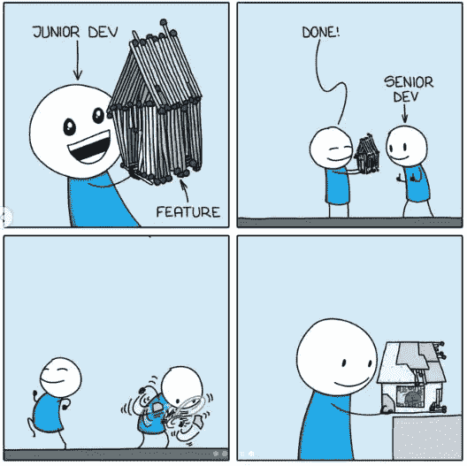

# 聪明的开发人员和明智的开发人员之间的区别

> 原文：<https://itnext.io/the-difference-between-the-clever-developer-the-wise-developer-a0edd9d8a692?source=collection_archive---------0----------------------->

## 回避问题比解决问题更快

[开发人员](https://res.cloudinary.com/practicaldev/image/fetch/s--ELoa1QFI--/c_limit%2Cf_auto%2Cfl_progressive%2Cq_auto%2Cw_880/https://dev-to-uploads.s3.amazonaws.com/uploads/articles/zb51bwjjvwbzf1tji6ft.png)

> “没有比自以为聪明的人更愚蠢的了；没有人比怀疑自己是傻瓜的人更聪明了。”玛格丽特·德瓦卢瓦

大多数开发人员擅长编写代码，在许多情况下，这种聪明既是优势也是劣势。

常识、街头智慧和经验可以帮助开发者避免问题，而不是解决问题。知道什么时候需要代码，什么时候拒绝需求。

知道什么时候该保持沉默，什么时候该战斗，什么时候该逃跑和躲藏让聪明的(高级)开发者比聪明的(初级)开发者更有优势。

# **聪明和睿智有什么区别？**

开发人员只花[50%的时间写代码](https://blog.devgenius.io/how-long-do-developers-spend-writing-code-dc64b2a11511)

*   初级开发人员接受简单的需求并创建复杂的代码
*   高级开发人员接受复杂的需求并创建简单的代码

总的来说，高级开发人员是明智的，初级开发人员是聪明的，但还没有犯下明智的错误。初级开发人员和高级开发人员的区别在于经验、知识和技能。

体验就是区别。一旦开发人员犯了错误，他们(希望)通过在将来不犯同样的错误来避免它。这给了他们犯新错误的机会，随着时间的推移，开发人员知道如何避免更多的错误。

软件开发中的错误很难预见，因为其后果和痛苦远在未来。简单的错误会给出快速的反馈，你会很快发现并修复它。

更棘手的错误类似于硬编码一个值，并且最初似乎没有任何负面影响。后来，你需要做一个完全的释放来改变价值，你可以为这个决定付出很多次。

# **避免问题，不要解决问题**

> 聪明人解决问题。聪明的人会避开它——阿尔伯特·爱因斯坦

所有的开发者都想写代码。这是他们擅长的，也是他们喜欢做的。高级开发人员学习的技能是什么时候写代码，什么时候澄清和识别什么时候根本不需要写代码。

初级开发人员就像一个拿着金锤的人，每个人的需求和问题都是编写代码的机会。

编写代码应该是最后的选择，因为每一行代码一旦被创建，就会成为开发团队的负担。一旦创建了代码，就必须对其进行维护，这增加了代码库的复杂性。

从短期来看，代码是一个很好的解决方案，但从长期来看，它需要更长的时间，增加了复杂性，并增加了维护开销。

少写代码更有效，会减少失败的几率。高级开发人员知道，当您必须并且已经验证了需求时，您应该编写代码。

明智的开发人员通过只包含必须具备的需求而忽略好的需求来减少代码。

需求可以通过改变业务流程而不是写代码来实现。不要什么都自动化，有时候手动选择是最好的选择。

# **何时创建代码**

> 你得知道什么时候拿着，什么时候收起，什么时候走开，什么时候逃跑。肯尼·罗杰斯

明智的(高级)开发人员知道什么时候写代码，什么时候验证、检查和不创建代码。初级开发人员擅长编写代码，他们希望尽可能经常地使用这些技能。

这突出了输出的差异，但是初级(聪明的)开发人员和高级(明智的)开发人员之间有更大的差异，那就是知道什么时候写代码。

# **简约**

初级开发人员希望直接创建代码，通常在他们理解业务为什么需要代码以及它需要做什么之前。

高级开发人员寻找假设并验证需求。如果代码在做错误的事情，那么你写得再好也没用。

通过编写具有经验证的需求的代码，您可以更快地创建软件。有很多代码开销，例如更新的依赖代码、相关代码、文档、测试、构建、文档。有时候，开发人员通过放慢开始速度和创建正确的软件来加快速度。

# **在该听的时候说话**

> 第一个原则是你不能欺骗自己，你是最容易被欺骗的人。理查德·费曼

木匠测量两次，切割一次。开发者很少这么小心。

明智的(高级)开发人员明白他们是创建软件的专家，而用户是他们业务中的专家。创建软件是商业和技术专家之间的合作。

初级开发人员忘记并听取了一些需求，停止听取并着手创建一个技术解决方案。高级开发人员专注于业务目标和流程，因此他们可以理解软件的目的。只有当你理解了企业、团队和个人角色的目的，你才能创建软件来帮助他们。

当初级开发人员阅读了足够多的需求，理解了快乐之路并创建了快乐之路时，常见的错误就发生了。后来，当不愉快的路径和异常出现时，初级开发人员不得不不停地修改代码来修复一个又一个的 bug。

开始时似乎进展很快，慢慢地一个接一个地落后了。一个优秀的高级开发人员只需编写一次代码，它就可以在环境中滑动。

资深开发者知道什么时候提问，什么时候倾听，什么时候说话。

> 沉默是从生活中的许多苦难中学到的一课—塞内卡

# **做好你的工作**

软件开发需要一个团队来完成，这需要每个人都做好自己的工作。

乐于助人是一把双刃剑，它可以在短期内帮助他人，但从长远来看却伤害了自己。你做别人的工作越多，你做自己工作的时间就越少。

明智的开发人员会确保处理项目区域的人完成这项工作。

开发人员需要保护他们的时间，并把责任和决策推给处理这些事情的人。

初级开发人员会被卷入到别人的工作中，陷入困境，没有时间去做他们的工作。如果你做得足够多，并且持续工作更长的时间，你将会精疲力尽。

# **与现实接轨**

> “昨天我很聪明，所以我想改变世界。今天我很聪明，所以我在改变自己”——鲁米

事情会出错，问题会发生，计划会出错，设计会改变。你无法对抗现实。适应环境，随环境改变。

初级开发人员对抗现实，高级开发人员与之结盟。

你不能阻止问题、错误和争论，但是你可以为它们做好准备，确保它们不会以灾难告终。技术灾难不应让开发者措手不及

> 聪明人和智者的区别真的不值得担心