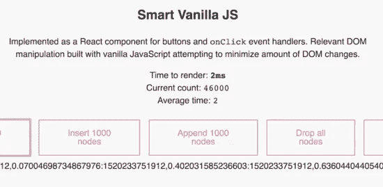

# DOM 是疯狂的快，哟

> 原文：<https://itnext.io/the-dom-is-crazy-fast-yo-fe3e724f741e?source=collection_archive---------5----------------------->

你觉得哪个框架最快？反应，预先行动，还是 Vue？继续，猜猜☺️

React 承诺提供[速度、简单性和可伸缩性](https://en.wikipedia.org/wiki/React_(JavaScript_library))。

Preact 说这是一个反应更快的选择。

Vue 说它平易近人，功能多样，性能卓越。

那么…你认为这些快速框架中哪一个最快？

> 注意:这是我的时事通讯的交叉帖子。我会在每封邮件发出两周后公布。[订阅](https://www.getdrip.com/forms/270040280/submissions/new)以便在您的收件箱中更早获得更多此类内容！💌

没错！没有框架的普通 JavaScript 轻而易举地击败了它们。

没想到会这样，是吧？

过去一两年发生了一些事情。我们过去都认为 DOM 很慢。你必须避免改变页面上的内容，你必须聪明地对待你所做的事情，不要更新。尽可能避免混日子。

聪明的人创造了影子穹顶和虚拟穹顶，以及他们需要的任何其他抽象概念。所有这些都是为了在渲染到页面之前在 JavaScript 中进行计算和树差分。

我甚至在我的工作室里说:不要担心做出改变。React 使用智能算法使其速度超快。

但是本周我一直在构建一个[交互式 DOM 操作基准](https://dom-benchmark.now.sh/)，而带有直接 DOM 访问的普通旧 JavaScript 赢得了胜利。差很多。

React 需要大约`12ms`的时间将 1000 个节点添加到一个`
`中，Vue 做同样的事情(在我的机器上)，普通 JavaScript 在…

… `2ms`。😳

即使经过 40，000 个节点后，它也保持不变。

其他人都在 20000 左右开始挣扎。那是因为基准有点不公平。smart vanilla 实现不检查任何节点中的更改，并且假设没有任何更改。React、Preact 和 Vue 比较笼统，必须确定是这种情况。

但是这里有一种最快的方法，可以使用普通的 ol' JavaScript 在一个`
`前添加或附加一堆节点。

显然，您不会希望在真实的项目中维护这样的代码。乏味得要命。

但是很高兴知道它的存在是为了当你需要挤出最后一毫秒来给你的朋友留下深刻印象。:)

我们可以在 Reactathon 谈论这些事情。我将根据我最近在一家财富 5 强公司讲授的研讨会，讲授一个关于 React 和 D3 的为期 1 天的研讨会。你不想错过这个😉

# 其他新闻…

3 篇博客文章。一些生活编码。主要是关于交互式 DOM 基准测试。

1.  [构建交互式 DOM 基准，初步结果](https://www.getdrip.com/4947882/broadcasts/617580675/email/preview)
2.  [无缝呈现 react 项目中的 Preact 组件](https://www.getdrip.com/4947882/broadcasts/617580675/email/preview)。这是一个有趣的破解方法。原来你可以动态设置 JSX 编译的方法。
3.  用 chroma-js 让你的东西漂亮起来一篇关于 Chroma.js 的简短但甜蜜的帖子，这是我新喜欢的颜色库。让一切变得如此美好。

哦，我试过了！所以我可以把它加到基准中。不是粉丝。👉[基准测试 Vue](https://swizec.com/blog/benchmarking-vue/swizec/8240)

下一步是使基准具有协作性，并使用我的区块链-redux 项目在浏览器之间共享结果。那会很有趣的。我等不及了。

用它来证明我在 5 月份的 WeAreDevelopers 世界大会上所谈论的东西的概念。

# 几件很酷的事→

这是我本周发现的一些很酷的东西。

*   这个 [dom-to-image](https://github.com/tsayen/dom-to-image) 库获取一个 dom 节点并将其呈现为图像。不知道用它做什么，但它看起来很酷。
*   这个叫做 Alex 的 JavaScript 库会捕捉不体贴的书写并告诉你停止。默认情况下，互联网上的每个输入字段都应该有这个。想象一下，如果脸书或推特在你说不好的话时让你闭嘴。
*   丹·阿布拉莫夫关于 React 的未来的演讲，当然我还没有看过，因为我是一个拖延者。这是一个很棒的演讲，我读了所有关于它的推特，我对即将到来的事情超级兴奋。
*   迈克·林奇关于为什么他离开谷歌为自己工作的伟大文章。里面包含了很多关于工程职业的智慧。即使你不想走创业之路，你也应该记住:优化你为衡量标准所做的事情。其他都不重要。

黑客快乐。

点击回复，告诉我你这周学到的一些很酷的东西。

干杯，

~Swizec

*附言:如果你喜欢这个，一定要订阅***，在* [*twitter 上关注我*](http://twitter.com/swizec) *，给我买午餐，并与你的朋友分享😀**