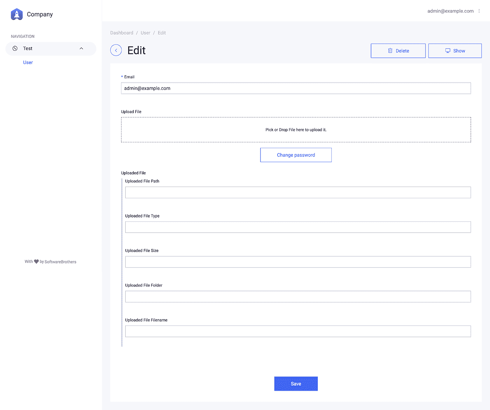
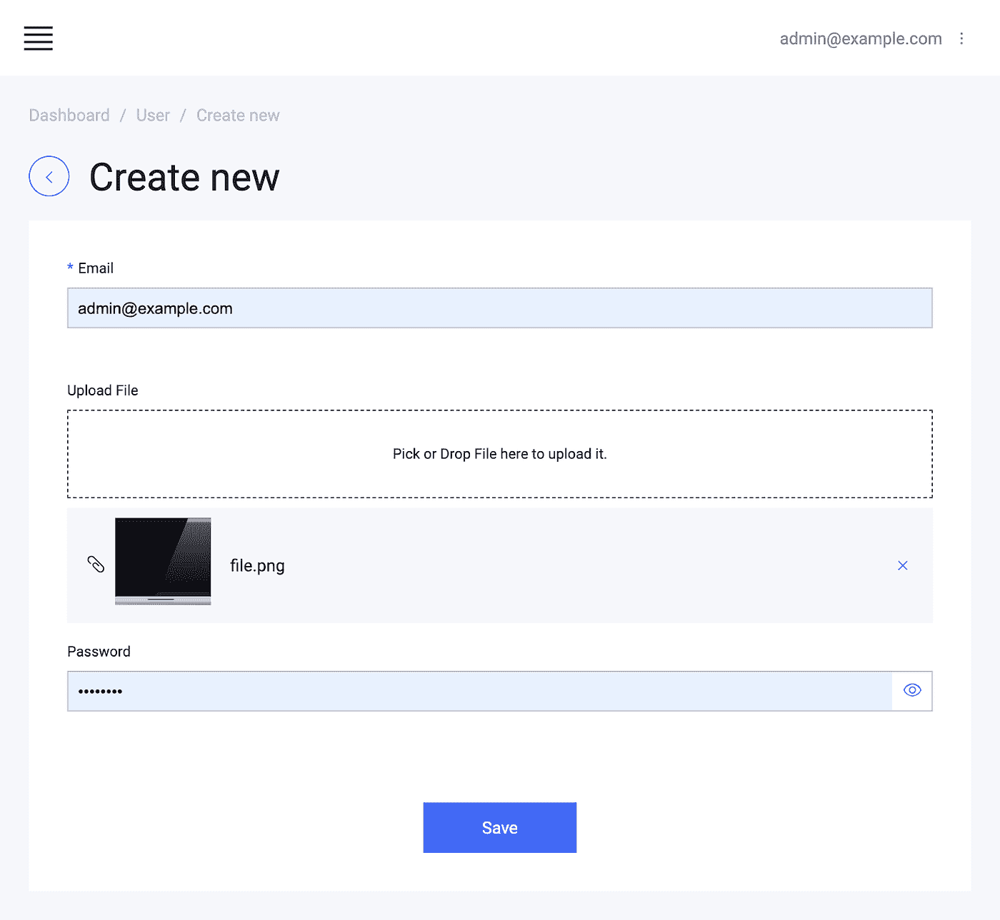

# 在 Node.js 中上传文件最简单快捷的方法

> 原文：<https://itnext.io/the-easiest-and-fastest-way-to-upload-files-in-node-js-4b49e0123190?source=collection_archive---------1----------------------->


上周我写了一篇关于[给 koa 框架](/koa-just-got-a-beautiful-auto-generated-admin-panel-f5f89d83e892?source=your_stories_page---------------------------)添加自动生成的管理面板的文章。我用了 [AdminBro](https://adminbro.com/) 并请你“主演” [GitHub repo](https://github.com/SoftwareBrothers) 来激励这个惊人项目背后的团队。

显然这很有效，因为昨天他们发布了一个期待已久的上传文件功能: [@admin-bro/upload](https://adminbro.com/module-@admin-bro_upload.html) 。

# 我们将建造什么？

上传文件总是代码中的一个难点，尤其是当你为普通人构建这个特性时，换句话说就是“那些 POST 端点还不够用的人”。这些奇怪的人当然必须有某种漂亮的用户界面，它必须有反应。

啊——显然，解决方案应该是可扩展的(存储与服务器分离),最好是基于云的。

所有这些都由 [AdminBro](https://adminbro.com/) 在`@admin-bro/upload`特性的帮助下处理。因此，在这个非常短的教程中，我将指导您如何为 Node.js 应用程序创建文件上传接口。

# 但是从简单的开始

我们将一步一步来。首先，让我们在本地上传文件，然后迁移到 [AWS S3](https://aws.amazon.com/s3) 。在上一篇文章中，我向您展示了如何用 Koa 构建一个全功能的管理面板——所以让我们以它为起点。这些是 [58 行代码](https://gist.github.com/tadeuszkora/3aff4bf07d279dc7d1c31af57ddf6466)。

# 初始化项目

*(如果您正在从事上一篇文章中的项目，您可以简单地跳过这一步)。*

首先初始化项目并安装所有需要的依赖项。

```
mkdir file-upload
cd file-upload
yarn inityarn add admin-bro @admin-bro/mongoose mongoose @admin-bro/koa koa @koa/router koa2-formidable @admin-bro/passwords argon2
```

好的——有许多依赖项，但请记住，这是一个全功能的管理面板，具有 CRUD、用户管理、登录和密码哈希(在 [58 行代码](https://gist.github.com/tadeuszkora/3aff4bf07d279dc7d1c31af57ddf6466)中)。

接下来，将代码粘贴到`index.js`:

并且确保你已经安装了 [MongoDB](https://www.mongodb.com/) ，因为我们使用[mongose](https://mongoosejs.com/)。

您可以启动该应用程序，了解它的工作原理:

```
node index.js
```

#或者如果您想在每次更改时重新加载:

```
yarn global add nodemon
nodemon index.js
```

运行应用程序后，您将看到登录屏幕。如果您正在使用上一篇文章中的数据库，这些是凭据:

> admin@example.com:密码。

如果您是从零开始，请在 run 函数的顶部添加以下内容:

并重新运行应用程序以创建第一个用户。

# 将文件上传到本地文件夹

这是我们开始的地方。为了在开始时使事情变得简单，让我们在本地上传文件。

安装@ admin-bro/上传功能:

```
yarn add @admin-bro/upload
```

接下来，您必须创建一个文件夹来存储上传的文件(目前)。将其命名为“上传”

```
mkdir uploads
```

现在我们准备添加这个特性。

首先用存储所有文件数据的字段扩展集合。因为我们使用 MongoDB，所以让我们将所有属性嵌套在一个模式下，并将它们一起传递给“uploadedFile”键下的用户对象:

我会马上解释所有的字段，但让我们先将它们映射到`@admin-bro/upload`功能:

现在有了解释:

*   让我们从**桶**开始——这是一个通用名称，描述存储文件的文件夹。在我们的例子中，我们告诉`@admin-bro/upload`将文件夹存储在“uploadedFile”模式的“folder”属性中。我们使用猫鼬点符号。映射**桶**可选，但是如果你不会存储，以后换了就有问题了。
*   需要映射**键**。它象征着文件在桶中的相对路径。在我们的例子中，它将是“uploadedFile.path”
*   接下来，我们有` **mimeType** `、` **size** 和`**filename**`——它们都是不言自明的。但是“mimeType”非常重要，因为如果你没有它，你就看不到预览。
*   最后，我们有了**文件**。这是 DropZone 将被附加的位置。它是一个虚拟字段，所以我们不需要将它作为属性保存在数据库中。

好了，现在让我们运行应用程序并尝试创建用户。这是你将会看到的:



我认为我们可以隐藏所有这些“存储”栏，使其更加用户友好。

让我们将`uploadFile: { isVisible: false }`添加到属性中。和我们之前用`encryptedPassword`做的一样。

这就是了。下面是一个包含已删除文件的屏幕截图:



但是先别上传——还有一件事。我们必须提供“上传”的所有文件，这样用户才能看到它们。我们可以通过以下方式做到这一点:

*   KOA-static:[https://github.com/koajs/static](https://github.com/koajs/static)
*   和古贺山一起:[https://github.com/koajs/mount](https://github.com/koajs/mount)

首先安装它们:

```
yarn add koa-static koa-mount
```

并在创建 Koa 实例时初始化它们。

```
const serve = require(‘koa-static’)
const mount = require(‘koa-mount’)
//…
const app = new Koa()
app.use(mount(‘/uploads’, serve(‘uploads’)))
```

说明:我们告诉 koa 提供`/uploads`路径下`uploads`文件夹中的所有文件——有意义吗？

现在你可以玩它了。随心所欲地创建、删除和更新上传的文件。

# 迁移到云

本地文件存储对于在本地主机上进行测试或工作来说是可以的，但是在真实的应用程序中，云存储要好得多。主要是因为它没有将您限制在一个服务器上，这意味着您可以生成任意多的 HTTP 服务器。此外，它还有一系列其他优势，如 CDN、速度、备份…

幸运的是，来自 AdminBro 的维护人员团队增加了 AWS。S3 支持给`@admin-bro/upload` 开箱。但是为了使用它，您需要有 AWS 凭证(区域和键)和 S3 存储桶名称。

我不想粘贴显示如何注册 AWS 并获得它们的步骤的截图，[因为已经有人这样做了](https://medium.com/@shamnad.p.s/how-to-create-an-s3-bucket-and-aws-access-key-id-and-secret-access-key-for-accessing-it-5653b6e54337)。

一旦你有了它们，你必须安全地储存它们。最好使用 [dotenv](https://www.npmjs.com/package/dotenv) 。

创建包含以下内容的`.env`文件:

```
AWS_ACCESS_KEY_ID=YOUR_YOUR_ACCESS_KEY
AWS_SECRET_ACCESS_KEY=YOUR_AWS_SECRET_ACCESS_KEY
AWS_BUCKET=YOUR_BUCKET_NAME
AWS_REGION=YOUR_REGION
```

当然，改变你的 _…。自动气象站的数据。

如果你想把你的应用程序代码推到 git 库，确保`.env`文件在`.gitignore`中，这样就没有人会访问它。

安装 [dotenv](https://www.npmjs.com/package/dotenv) 和 [aws-sdk](https://aws.amazon.com/sdk-for-node-js/) ，在`@admin-bro/upload`中使用 aws 适配器时需要安装

```
yarn add dotenv aws-sdk
```

并将其设置在应用程序的顶部。它会将所有变量移动到`process.env`。

```
// index.js, first line
1\. require(‘dotenv’).config()
2\. // rest of the code
```

现在更改 uploadFeature():

请注意额外的`expires`属性。它表示文件仅在 10 分钟内有效。您可以跳过这一步，但您必须确保您的存储桶是公共的。

这就是了。现在运行服务器，上传文件，看看它们是如何出现在 AWS 控制台中的。但是请记住，上传到本地的文件将不再有效。

您需要做的最后一件事是移除静态托管(`koa-mount`和`koa-serve`)，因为不再需要它了。

# 还有更多

我希望这个教程超级简单易懂，并且简短。但是关于`@admin-bro/uploads`还有更多值得一提的话题。首先，它允许你**验证上传的数据**:你可以限制允许的 **mime 类型**和**最大文件大小**。

接下来，如果你想上传文件到比如说谷歌，你可以通过任何你想要的供应商。这是一个临时的解决方案，因为我打赌它很快就会出现在核心中——但是，这仍然是可能的..

# 下一步是什么

我对 [AdminBro](https://adminbro.com/) 项目非常兴奋，我相信:

*   它的星星越多，
*   它就越受欢迎，
*   创建的特征越多，
*   更难的软件兄弟将努力使它更棒。

[所以你知道该怎么做:)](https://github.com/SoftwareBrothers/admin-bro)

下次我会涉及另一个 [AdminBro](https://adminbro.com/) 主题(也许他们会在本周发布一些新功能；).

整个应用程序的代码在这里[(现在有 97 行)](https://gist.github.com/tadeuszkora/ee83dbac032a5e628a235bf8c85bd845)。